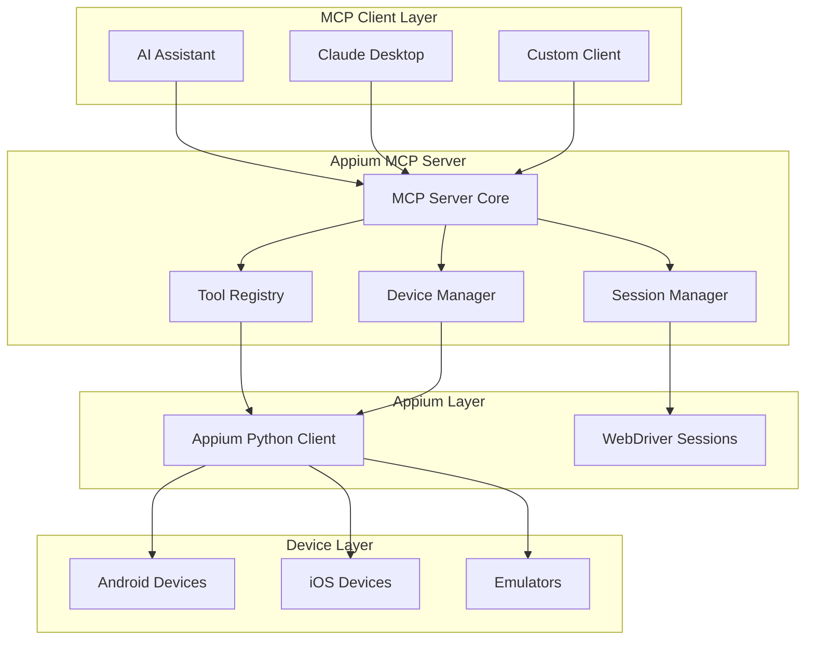

# Appium MCP Server

[](https://www.python.org/downloads/)
[](https://opensource.org/licenses/MIT)
[](https://github.com/psf/black)

Appium MCP Server 是一个基于 [Model Context Protocol (MCP)](https://modelcontextprotocol.io/) 的移动设备自动化测试服务器。它将 Appium 的强大功能通过 MCP 协议暴露给 AI 助手，实现智能化的移动应用测试。

## ✨ 特性

- 🤖 **AI 友好**: 通过 MCP 协议与 Claude、ChatGPT 等 AI 助手无缝集成
- 📱 **跨平台支持**: 同时支持 Android 和 iOS 设备及模拟器
- 🛠️ **丰富的工具集**: 提供 40+ 个自动化测试工具
- 🔄 **异步架构**: 高性能异步设计，支持并发操作
- 🎯 **易于使用**: 5分钟快速上手，详细的文档和示例
- 🔧 **高度可配置**: 灵活的配置选项适应不同使用场景

## 🚀 快速开始

### 安装

```bash
# 安装 Appium MCP Server
pip install appium-mcp-server

# 安装 Appium
npm install -g appium
appium driver install uiautomator2  # Android
appium driver install xcuitest      # iOS (仅 macOS)
```

### 基本使用

**前置条件检查**：
```bash
# 验证安装是否成功
appium-mcp-server --version  # 应该显示版本号
appium --version              # 应该显示 Appium 版本
```

1. **启动 Appium 服务器**
   ```bash
   appium --port 4723
   ```

2. **配置 Claude Desktop**
   ```json
   {
     "mcpServers": {
       "appium": {
         "command": "appium-mcp-server",
         "args": ["run"]
       }
     }
   }
   ```
   
   **注意**：配置后重启 Claude Desktop，MCP 服务器会自动启动，无需手动运行。

3. **重启 Claude Desktop**
   
   配置文件修改后，需要重启 Claude Desktop 使配置生效。

4. **开始对话**
   ```
   请帮我连接 Android 设备，启动设置应用并截图。
   ```

## 🎬 功能演示

### 📱 设备连接测试


*展示完整的设备管理流程：设备发现 → 设备连接 → 信息获取 → 会话管理 → 截图验证*

### 🎯 测试功能展示
- ✅ **设备发现**: 自动列出所有可用的Android和iOS设备
- ✅ **设备连接**: 成功连接到指定设备并创建会话
- ✅ **信息获取**: 获取设备详细信息和会话状态
- ✅ **截图功能**: 实时截取设备屏幕状态
- ✅ **AI交互**: 通过自然语言指令控制设备操作

## 🛠️ 功能概览

### 设备管理
- 设备发现和连接
- 设备信息获取
- 应用安装和卸载
- 设备状态监控

### UI 自动化
- 元素查找和操作
- 文本输入和清除
- 手势操作（点击、滑动、拖拽）
- 多点触控支持

### 系统操作
- 截图和录屏
- 按键操作
- 设备旋转
- 系统设置

### 文件操作
- 文件传输（推送/拉取）
- 目录管理
- 文件权限控制

## 📚 文档

- [📖 完整文档](docs/README.md)
- [🚀 快速开始](docs/quickstart.md)
- [⚙️ 安装指南](docs/installation.md)
- [🔧 配置指南](docs/configuration.md)
- [🛠️ 工具参考](docs/tools/README.md)
- [📝 使用示例](docs/examples/README.md)
- [🏗️ 架构设计](docs/architecture.md)
- [🛠️ 工具使用指南](docs/appium-mcp-tools-guide.md)

## 🎯 使用场景

### 自动化测试
```python
# Python 客户端示例
import asyncio
from mcp import ClientSession, StdioServerParameters
from mcp.client.stdio import stdio_client

async def test_login():
    server_params = StdioServerParameters(
        command="appium-mcp-server", args=[]
    )
    
    async with stdio_client(server_params) as (read, write):
        async with ClientSession(read, write) as session:
            await session.initialize()
            
            # 连接设备
            await session.call_tool("connect_device", {
                "device_id": "emulator-5554"
            })
            
            # 启动应用
            await session.call_tool("launch_app", {
                "device_id": "emulator-5554",
                "app_package": "com.example.app"
            })
            
            # 执行登录流程
            # ...
```

### AI 助手对话
```
用户: 请测试购物应用的结账流程

AI: 我来帮您测试购物应用的结账流程：

1. 首先连接设备并启动应用
2. 添加商品到购物车
3. 进入结账页面
4. 填写收货信息
5. 选择支付方式
6. 完成下单并验证

让我开始执行测试...
```

## 🏗️ 架构



## 🤝 贡献

我们欢迎社区贡献！请查看 [贡献指南](CONTRIBUTING.md) 了解如何参与项目开发。

### 开发环境设置

```bash
# 克隆项目
git clone https://github.com/1405942836/appium-mcp.git
cd appium-mcp

# 安装开发依赖
pip install -e ".[dev]"

# 安装 pre-commit hooks
pre-commit install

# 运行测试
pytest
```

## 📄 许可证

本项目基于 [MIT 许可证](LICENSE) 开源。

## 🆘 获取帮助

- 📖 查看 [文档](docs/README.md)
- 🐛 提交 [Issue](https://github.com/1405942836/appium-mcp/issues)
- 💬 参与 [讨论](https://github.com/1405942836/appium-mcp/discussions)
- 📧 联系维护者

## 🙏 致谢

- [Model Context Protocol](https://modelcontextprotocol.io/) - 提供了优秀的协议标准
- [Appium](https://appium.io/) - 强大的移动自动化测试框架
- [Anthropic](https://www.anthropic.com/) - MCP 协议的创建者

---

⭐ 如果这个项目对您有帮助，请给我们一个 Star！ 