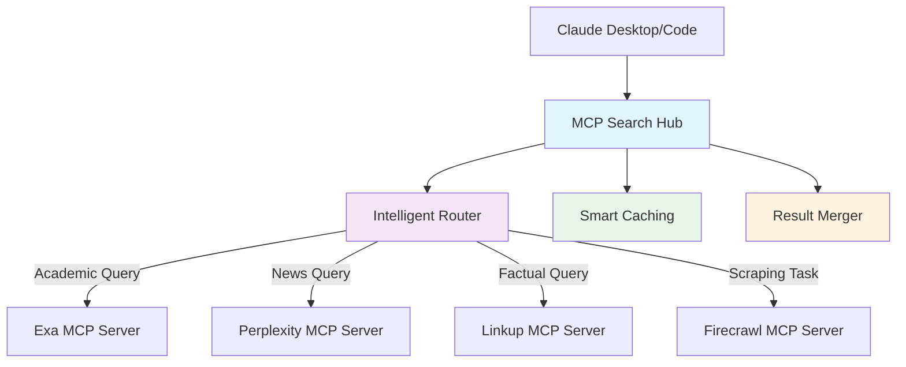
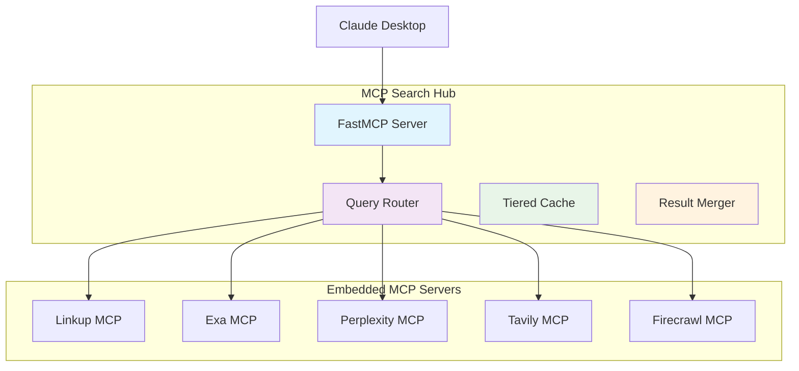

# MCP Search Hub

> 🔍 **Intelligent multi-provider search aggregation server built on FastMCP 2.0**

[](https://opensource.org/licenses/MIT)
[](https://www.python.org/downloads/)
[](https://github.com/fastmcp)

MCP Search Hub embeds official MCP servers from five leading search providers within a unified interface, intelligently routes queries to the most appropriate provider(s), and combines/ranks results for optimal relevance.

## ✨ Key Features

- **🏗️ Unified Interface**: Single MCP server for all search providers
- **🧠 Intelligent Routing**: Automatically selects optimal providers based on query characteristics
- **⚡ Official Provider Integration**: Embeds official MCP servers (Linkup, Exa, Perplexity, Tavily, Firecrawl)
- **💰 Cost Optimization**: 30-45% cost reduction through intelligent provider selection
- **🚀 Zero Maintenance**: Provider updates flow through automatically
- **📊 Smart Result Merging**: Deduplication and multi-factor ranking
- **⚡ Performance Optimized**: Multi-tier caching and parallel execution
- **🔧 Production Ready**: Error handling, rate limiting, monitoring

## 🚀 Quick Start

Get up and running in 5 minutes:

```bash
# 1. Clone and install
git clone https://github.com/BjornMelin/mcp-search-hub
cd mcp-search-hub
uv pip install -r requirements.txt

# 2. Interactive setup (recommended)
python scripts/setup_claude_desktop.py

# 3. Start searching!
# The script will guide you through API key setup and Claude Desktop integration
```

After setup, restart Claude Desktop and ask: *"What MCP tools do you have available?"*

**📖 [Complete Setup Guide](docs/users/getting-started.md)** | **⚡ [Quick Setup Script](scripts/setup_claude_desktop.py)**

## 🎯 Why MCP Search Hub?

### Provider Strengths

Each provider excels in different areas. MCP Search Hub automatically routes queries to leverage these strengths:

| Provider | Strengths | Best For | Accuracy |
|----------|-----------|----------|----------|
| **Linkup** | Factual information, current events | News, facts, real-time data | 91.0% |
| **Exa** | Semantic search, academic content | Research papers, technical docs | 90.0% |
| **Perplexity** | AI-powered analysis, current events | Complex queries, analysis | 86.0% |
| **Tavily** | RAG-optimized results | Retrieval applications | 73.0% |
| **Firecrawl** | Deep content extraction | Web scraping, full content | N/A |

*Accuracy scores from SimpleQA benchmark*

### Architecture Benefits



**Benefits:**
- **Single Integration**: One MCP server instead of five
- **Zero Configuration**: No need to manage multiple servers
- **Automatic Updates**: Provider improvements flow through automatically
- **Cost Efficient**: Intelligent routing reduces unnecessary API calls
- **Quality Results**: Multi-provider consensus improves accuracy

## 📚 Documentation

### For Users
- **[Getting Started](docs/users/getting-started.md)** - Complete setup guide and first steps
- **[Configuration](docs/operators/configuration.md)** - Detailed configuration reference
- **[API Reference](docs/developers/api-reference.md)** - Complete tool and endpoint documentation
- **[Troubleshooting](docs/troubleshooting/common-issues.md)** - Solutions to common problems

### For Developers
- **[Contributing](docs/developers/contributing.md)** - How to contribute to the project
- **[Development](docs/developers/development.md)** - Development workflows and practices
- **[Architecture](docs/architecture/overview.md)** - System design and components

### Advanced Topics
- **[Provider Integration](docs/architecture/provider-integration.md)** - How providers are embedded
- **[Caching Strategy](docs/architecture/caching.md)** - Multi-tier caching system
- **[Performance Tuning](docs/operators/production-setup.md)** - Optimization strategies

📖 **[Complete Documentation Index](docs/README.md)**

## 🔑 Quick Configuration

At minimum, you need API keys for the providers you want to use:

```bash
# Copy environment template
cp .env.template .env

# Add your API keys
LINKUP_API_KEY=your_linkup_key
EXA_API_KEY=your_exa_key
PERPLEXITY_API_KEY=your_perplexity_key
TAVILY_API_KEY=your_tavily_key
FIRECRAWL_API_KEY=your_firecrawl_key
```

### Getting API Keys

| Provider | Free Tier | Sign Up |
|----------|-----------|---------|
| **Linkup** | 100 requests/month | [linkup.so](https://linkup.so) |
| **Exa** | 1,000 requests/month | [exa.ai](https://exa.ai) |
| **Perplexity** | $5 credit | [perplexity.ai](https://perplexity.ai) |
| **Tavily** | 1,000 requests/month | [tavily.com](https://tavily.com) |
| **Firecrawl** | 500 requests/month | [firecrawl.dev](https://firecrawl.dev) |

⚙️ **[Complete Configuration Guide](docs/operators/configuration.md)**

## 🚀 Available Tools

MCP Search Hub provides all tools from embedded provider MCP servers:

### Core Search Tools
- **`search`** - Intelligent multi-provider search with automatic routing
- **`get_provider_info`** - Information about available providers

### Provider-Specific Tools (25+ tools available)
- **Firecrawl**: `firecrawl_scrape`, `firecrawl_search`, `firecrawl_crawl`, `firecrawl_extract`
- **Exa**: `web_search_exa`, `research_paper_search`, `company_research`, `linkedin_search`
- **Perplexity**: `perplexity_ask`, `perplexity_research`
- **Linkup**: `linkup_search_web`
- **Tavily**: `tavily_search`, `tavily_extract`

🛠️ **[Full Tool Documentation](docs/developers/api-reference.md)**

## 🏗️ Architecture

MCP Search Hub uses a modular architecture with embedded MCP servers:



🏗️ **[Architecture Documentation](docs/architecture/overview.md)**

## 🤝 Contributing

We welcome contributions! Here's how to get started:

1. **Fork** the repository
2. **Create** a feature branch
3. **Make** your changes with tests
4. **Submit** a pull request

🤝 **[Contributing Guide](docs/developers/contributing.md)** | 🛠️ **[Development Setup](docs/developers/development.md)**

## 📄 License

This project is licensed under the MIT License - see the [LICENSE](LICENSE) file for details.

## 🙏 Acknowledgements

- **[FastMCP](https://github.com/fastmcp)** - The framework powering this server
- **Provider Teams** - For their excellent APIs and official MCP servers

## 🔗 Links

- **[GitHub Repository](https://github.com/BjornMelin/mcp-search-hub)**
- **[Documentation](docs/README.md)**
- **[Issue Tracker](https://github.com/BjornMelin/mcp-search-hub/issues)**
- **[Releases](https://github.com/BjornMelin/mcp-search-hub/releases)**

---

**Ready to get started?** Follow our [Getting Started Guide](docs/users/getting-started.md) or run the interactive setup:

```bash
python scripts/setup_claude_desktop.py
```