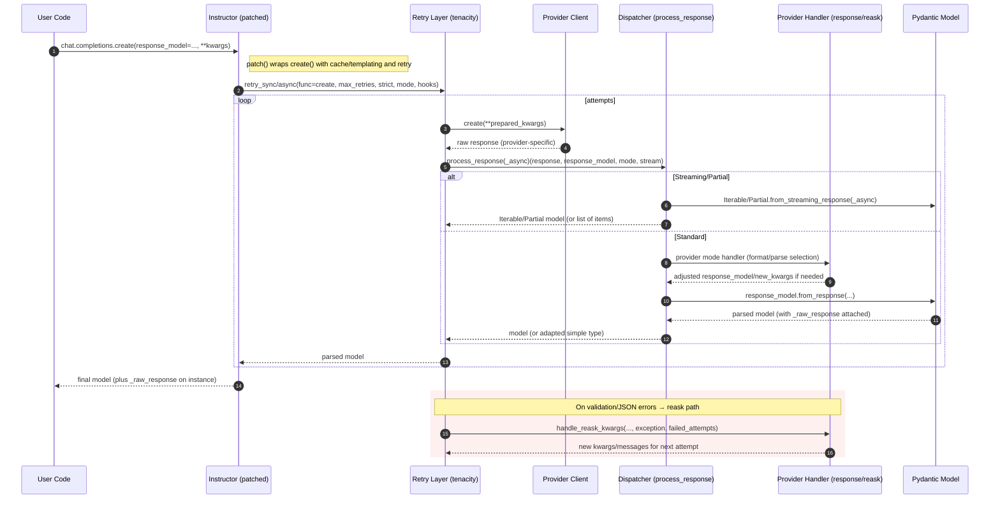

# Architecture Overview

This page explains the core execution flow and where to plug in or debug. It highlights the minimal sync/async code paths and how streaming, partial, and parallel modes integrate.

## High-Level Flow



Key responsibilities:
- patch(): wraps the provider `create` with cache lookup/save, templating, strict mode, hooks, and retry.
- Retry: executes provider call, emits hooks, updates usage, handles validation/JSON errors with reask, and re-attempts.
- Dispatcher: selects the correct parsing path by `Mode`, handles multimodal message conversion, and attaches `_raw_response` to the returned model.
- Provider Handlers: provider/mode-specific request shaping and reask preparation.

## Minimal Code Paths

### Synchronous
```python
import openai
import instructor
from pydantic import BaseModel

class User(BaseModel):
    name: str
    age: int

client = instructor.from_provider("openai/gpt-5-nano")

model = client.create(
    model="gpt-4o-mini",
    messages=[{"role": "user", "content": "{'name': 'Ada', 'age': 37}"}],
    response_model=User,            # triggers schema/tool wiring + parsing
    max_retries=3,                  # tenacity-backed validation retries
    strict=True,                    # strict JSON parsing if supported
)

# Access raw provider response if needed
raw = model._raw_response
```

### Asynchronous
```python
import asyncio
import openai
import instructor
from pydantic import BaseModel

class User(BaseModel):
    name: str
    age: int

async def main():
    aclient = instructor.from_provider("openai/gpt-5-nano", async_client=True)
    model = await aclient.create(
        model="gpt-4o-mini",
        messages=[{"role": "user", "content": "{\"name\": \"Ada\", \"age\": 37}"}],
        response_model=User,
        max_retries=3,
        strict=True,
    )
    print(model)

asyncio.run(main())
```

## Streaming, Partial, Parallel

### Streaming Iterable
- Use `create_iterable(response_model=Model, stream=True implicitly)` via `Instructor.create_iterable`.
- Returns a generator (sync) or async generator (async) of parsed items.
- Internally sets `stream=True`, and `IterableBase.from_streaming_response(_async)` assembles items.

```python
for item in client.create_iterable(messages=..., response_model=MyModel):
    print(item)
```

### Partial Objects
- Use `create_partial(response_model=Model)` to receive progressively filled partial models while streaming.
- Internally wraps the model as `Partial[Model]` and sets `stream=True`.

```python
for partial in client.create_partial(messages=..., response_model=MyModel):
    # partial contains fields as they arrive
    pass
```

### Parallel Tools
- Use `Mode.PARALLEL_TOOLS` and a parallel type hint (e.g., list of models) when you need multiple tool calls in one request.
- Streaming is not supported in parallel tools mode.

```python
from instructor.mode import Mode

result = client.create(
    model="gpt-4o",
    messages=[{"role": "user", "content": "Extract person and event info."}],
    response_model=[PersonInfo, EventInfo],
    mode=Mode.PARALLEL_TOOLS,
)
```

## Hooks and Retry

You can observe and instrument the flow with hooks. Typical events:
- `completion:kwargs`: just before provider call
- `completion:response`: after provider call
- `parse:error`: on validation/JSON errors
- `completion:last_attempt`: when a retry sequence is about to stop
- `completion:error`: non-validation completion errors

```python
from instructor.core.hooks import HookName

client.on(HookName.COMPLETION_KWARGS, lambda **kw: print("KWARGS", kw))
client.on(HookName.PARSE_ERROR, lambda e: print("PARSE", e))
```

## Where Multimodal Conversion Happens

- For modes that require it, messages are converted via `processing.multimodal.convert_messages`.
- Image/Audio/PDF autodetection can be enabled (by specific handlers/modes) and will convert strings/paths/URLs or data URIs into provider-ready payloads.

## Error Handling at a Glance

- Validation or JSON decode errors trigger the reask path.
- Reask handlers (`handle_reask_kwargs`) append/adjust messages with error feedback so the next attempt can correct itself.
- If all retries fail, `InstructorRetryException` is raised containing `failed_attempts`, the last completion, usage totals, and the create kwargs for reproduction.

## Extensibility Notes

- New providers add utils for response and reask handling and register modes used by the dispatcher.
- Most JSON/tool patterns are shared; prefer reusing existing handlers where possible.
- Keep provider-specific logic in provider utils; avoid expanding central dispatcher beyond routing and orchestration.

