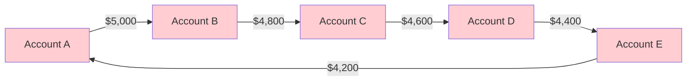
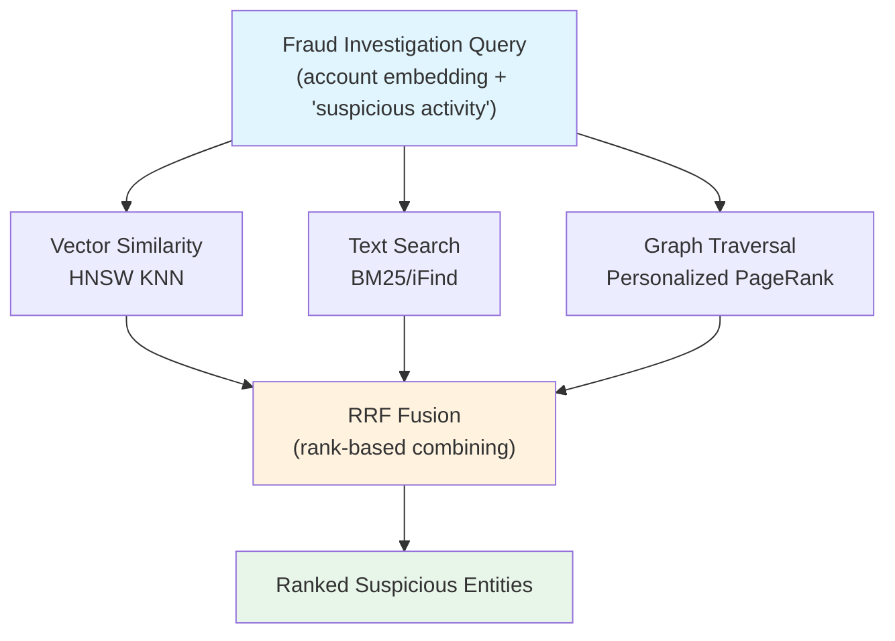
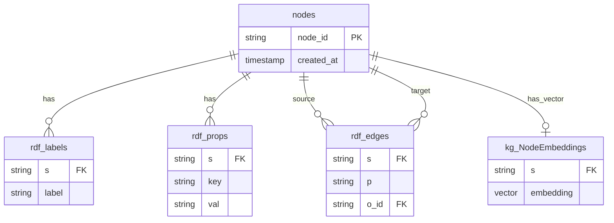

# GraphRAG Inside InterSystems IRIS: Hybrid Retrieval for Fraud Detection

**Author:** Thomas Dyar  
**Date:** January 2026

> **TL;DR:** This article demonstrates how to run GraphRAG-style hybrid retrieval—combining vector similarity, graph traversal, and full-text search—entirely within InterSystems IRIS using the `iris-vector-graph` package. We use a fraud detection scenario to show how graph patterns reveal what vector search alone would miss.

---

## Why Fraud Detection Needs Graphs

Every year, businesses and consumers lose billions to fraud. In 2024 alone, consumers reported $12.5 billion lost—a 25% increase year over year. What makes modern fraud so difficult to detect is that fraudsters rarely work alone. They operate in organized networks, running coordinated schemes that exploit our failure to see connections between seemingly unrelated transactions.

Consider a simple example: an individual transaction from Account A to Account B looks perfectly normal. The amount is reasonable, the timing is typical, and neither account has been flagged. Traditional rule-based systems and even machine learning models that analyze transactions in isolation would approve it without hesitation.

But what if we could see the bigger picture?



That same transaction is part of a **ring pattern**—money flowing in a circle with small amounts skimmed at each step. This is a classic money laundering structure, and it's invisible to any system that doesn't analyze relationships.

This insight—that **fraud hides in connections, not individual records**—is why graph databases have become essential for fraud detection. AWS has published extensively on using [Amazon Neptune for fraud detection](https://aws.amazon.com/blogs/database/build-a-real-time-fraud-detection-solution-using-amazon-neptune-ml/), demonstrating how graph analysis reveals fraud rings, mule accounts, and coordinated attacks that tabular models miss entirely.

But what if you could combine graph analysis with vector similarity AND full-text search, all in a single query, within a single database?

That's what `iris-vector-graph` enables on InterSystems IRIS.

---

## The Problem with Single-Modal Detection

Most fraud detection systems rely on one primary approach:

### Rule-Based Systems
- ✅ Fast and explainable
- ❌ Easily evaded by sophisticated fraudsters
- ❌ High false positive rates
- ❌ Require constant manual tuning

### Machine Learning on Tabular Data
- ✅ Can learn complex patterns
- ❌ Treats each transaction in isolation
- ❌ Misses relational signals entirely
- ❌ Struggles with novel fraud patterns

### Vector Similarity (Embeddings)
- ✅ Captures behavioral patterns
- ✅ Generalizes to new fraud types
- ❌ Misses structural patterns like rings
- ❌ No explainability for why entities match

### Graph Analysis
- ✅ Reveals hidden connections
- ✅ Detects rings, stars, and network anomalies
- ❌ Doesn't capture semantic similarity
- ❌ Requires known starting points

**The insight:** Each method catches different fraud signals. Combining them—what we call **hybrid retrieval**—catches what no single method can find alone.

### Comparison of Detection Methods

- **Vector-only**
    - **Catches:** Accounts with similar transaction patterns
    - **Misses:** Ring structures, network topology
- **Text-only**
    - **Catches:** Flagged accounts, keyword matches
    - **Misses:** Mule accounts that look normal
- **Graph-only**
    - **Catches:** Connected networks, high-degree nodes
    - **Misses:** Isolated accounts with unusual behavior
- **Hybrid (all three)**
    - **Catches:** All of the above
    - **Misses:** Much less

---

## What is IRIS Vector Graph?

`iris-vector-graph` is a general-purpose graph utility built on InterSystems IRIS that supports and demonstrates knowledge graph construction and query techniques. It combines:

- **Graph traversal** — Multi-hop relationship queries via SQL or Cypher
- **Vector similarity search** — HNSW-indexed embeddings (~1.7ms queries)
- **Full-text search** — BM25 keyword matching via iFind
- **Hybrid fusion** — Reciprocal Rank Fusion (RRF) combining all signals

The key innovation is that all three capabilities run inside a single IRIS instance. There's no network round-trip to a separate vector database, no ETL to a graph database, no synchronization headaches. One query can seamlessly combine vector similarity, graph traversal, and text search.

**Key SQL procedures** (in `sql/operators.sql`):
- `kg_KNN_VEC` — Vector K-nearest neighbors with HNSW optimization
- `kg_TXT` — Full-text search with BM25 ranking
- `kg_RRF_FUSE` — Hybrid ranking fusion combining vector + text
- `kg_PPR` — Personalized PageRank for graph context expansion

**Repository:** https://github.com/intersystems-community/iris-vector-graph

---

## Architecture: Three Engines, One Database



All operations execute within IRIS—no external services, no data movement overhead. A single SQL query can:
1. Find accounts with embeddings similar to known fraudsters (vector)
2. Filter to those mentioned in suspicious activity reports (text)
3. Expand to find connected accounts in the transaction graph (graph)
4. Rank results using RRF to surface the most suspicious entities

---

## The Three Classic Fraud Patterns

Before diving into the technical implementation, let's understand the fraud patterns that graph analysis excels at detecting. These patterns are well-documented in fraud detection literature and are the basis for the sample data in our repository.

### Pattern 1: Ring Topology (Money Laundering)

In a ring pattern, money flows in a circle between accounts, often with small amounts skimmed at each step. The individual transactions appear normal, but the circular flow is a red flag for money laundering.

```
ACCOUNT:RING1_A → TXN → ACCOUNT:RING1_B → TXN → ACCOUNT:RING1_C 
       ↑                                              ↓
       └──── TXN ←── ACCOUNT:RING1_E ←── TXN ←── ACCOUNT:RING1_D
```

**Why graphs catch this:** Traditional systems see five separate, unrelated transactions. Graph traversal reveals the cycle in a single query.

**Detection query:** Find accounts that appear as both senders AND receivers in transaction chains.

### Pattern 2: Star Topology (Mule Accounts)

A mule account receives funds from many sources and forwards them to other destinations. It acts as a hub in a "star" pattern, often controlled by a money mule recruited (sometimes unknowingly) by fraudsters.

```
        ACCOUNT:A005 ──┐
        ACCOUNT:A010 ──┤
        ACCOUNT:A015 ──┼── TXN_IN ──→ MULE1 ──→ TXN_OUT ──→ ACCOUNT:A050
        ACCOUNT:A020 ──┤
        ACCOUNT:A025 ──┘
```

**Why graphs catch this:** The mule account has unusually high degree centrality—many incoming and outgoing edges. Traditional systems might flag high transaction volume, but miss that the counterparties are all different.

**Detection query:** Find accounts with degree > N where incoming and outgoing counterparties don't overlap.

### Pattern 3: Velocity Violations

Legitimate accounts rarely have bursts of many transactions in a short timeframe. Velocity violations—rapid-fire transactions—often indicate account takeover or automated fraud.

**Why hybrid catches this:** 
- **Vector similarity** identifies accounts with transaction patterns unlike their historical behavior
- **Text search** finds accounts mentioned in velocity alerts
- **Graph expansion** reveals if velocity accounts are connected to known fraud rings

---

## Quick Start (5 Minutes)

### Prerequisites
- Docker
- Python 3.10+
- `uv` package manager (recommended) or `pip`

### Setup

```bash
# Clone and install
git clone https://github.com/intersystems-community/iris-vector-graph.git
cd iris-vector-graph
uv sync  # or: pip install -e .

# Start IRIS with HNSW vector indexing
docker-compose up -d

# Wait for IRIS to start (~30s), then load schema and data
# In Management Portal (http://localhost:52773/csp/sys/UtilHome.csp) or SQL client:
#   \i sql/schema.sql
#   \i sql/operators.sql
#   \i sql/fraud_sample_data.sql

# Start the API server
uvicorn api.main:app --reload --port 8000
```

### Verify

```bash
# Run the fraud detection demo
python examples/demo_fraud_detection.py
```

Expected output:
```
IRIS Fraud Detection Demo
=========================
[1/6] Connecting to database... OK
      Found 149 accounts, 99 transactions, 49 alerts
[2/6] Loading fraud network... OK
      Found 10 accounts in ring patterns
[3/6] Ring pattern detection... OK
      Found 1 potential mule accounts
        - ACCOUNT:MULE1: 5 transactions, risk=0.92
[4/6] Mule account detection... OK
...
Demo completed successfully
```

---

## The Sample Data

The repository includes a realistic fraud detection dataset in `sql/fraud_sample_data.sql` with 150+ entities implementing all three fraud patterns:

- **Accounts (75)**: 50 normal + 15 ring + 2 mule + 8 velocity
- **Transactions (50+)**: With FROM_ACCOUNT, TO_ACCOUNT edges
- **Alerts (25)**: Severity ranging from critical to low

The data is structured using an RDF-inspired schema that's domain-agnostic:

- **`nodes`** — Entity identifiers (accounts, transactions, alerts)
- **`rdf_labels`** — Entity types (Account, Transaction, Alert)
- **`rdf_props`** — Entity properties (account_type, risk_score, severity)
- **`rdf_edges`** — Relationships (FROM_ACCOUNT, TO_ACCOUNT, INVOLVES)
- **`kg_NodeEmbeddings`** — 768D behavioral embeddings for vector search

This schema can represent any domain—change the labels and properties, and the same queries work for healthcare networks, supply chains, or social graphs.

---

## Three Query Engines, One Interface

IRIS Vector Graph exposes your data through multiple query interfaces. Here's how each helps with fraud detection:

### 1. SQL: Ring Pattern Detection

Find accounts participating in circular payment flows:

```sql
-- Detect accounts in ring patterns (both sender and receiver)
SELECT DISTINCT e1.o_id as account_id
FROM rdf_edges e1
WHERE e1.p IN ('FROM_ACCOUNT', 'TO_ACCOUNT')
AND EXISTS (
    SELECT 1 FROM rdf_edges e2 
    WHERE e2.o_id = e1.o_id 
    AND e2.p != e1.p
)
AND e1.o_id LIKE 'ACCOUNT:RING%'
```

### 2. SQL: Mule Account Detection

Find accounts with high transaction volume (potential mules):

```sql
-- Find accounts involved in many transactions (mule pattern)
SELECT e.o_id as account_id, COUNT(*) as txn_count
FROM rdf_edges e
WHERE e.p IN ('FROM_ACCOUNT', 'TO_ACCOUNT')
  AND e.o_id LIKE 'ACCOUNT:MULE%'
GROUP BY e.o_id
ORDER BY txn_count DESC
```

### 3. Cypher: Graph Pattern Matching

Query relationships and nodes using Cypher patterns via the API:

```bash
curl -X POST http://localhost:8000/api/cypher \
  -H "Content-Type: application/json" \
  -d '{
    "query": "MATCH (t:Transaction)-[r:FROM_ACCOUNT|TO_ACCOUNT]->(a:Account) 
              WHERE a.node_id = \"ACCOUNT:MULE1\" 
              RETURN t.node_id, r, t.amount LIMIT 5"
  }'
```

The new recursive-descent Cypher engine also supports multi-stage queries, allowing complex fraud analysis:

```cypher
MATCH (a:Account)-[r]->(t:Transaction)
WITH a, count(t) AS txn_count
WHERE txn_count > 5
MATCH (a)-[:OWNED_BY]->(p:Person)
RETURN p.name, txn_count
```

The parser translates these patterns into optimized IRIS SQL Common Table Expressions (CTEs) automatically.

---

## How Hybrid Search Works

The real power of `iris-vector-graph` is combining all three modalities in a single investigation workflow.

### Step 1: Vector Similarity — Find Accounts Like Known Fraudsters

If you have a confirmed fraudulent account, you can find others with similar behavioral patterns:

```sql
-- Find accounts with similar transaction embeddings
SELECT id, score 
FROM TABLE(kg_KNN_VEC('[0.1, 0.2, ...]', 20, 'Account'))
```

This uses the HNSW index for sub-millisecond vector search across thousands of accounts.

### Step 2: Text Search — Find Flagged Entities

Search alerts and notes for relevant keywords:

```sql
-- Find accounts mentioned in suspicious activity reports
SELECT s, val FROM rdf_props 
WHERE LOWER(val) LIKE '%suspicious%' 
   OR LOWER(val) LIKE '%mule%'
```

### Step 3: Reciprocal Rank Fusion — Combine the Signals

RRF combines ranked lists without needing normalized scores. An account that ranks #3 in vector similarity and #5 in text search scores higher than one that's #1 in only one list:

```sql
-- Hybrid search: vector + text combined
SELECT id, rrf, vs, bm25 
FROM TABLE(kg_RRF_FUSE(
    15,                    -- k: final result count
    20,                    -- k1: vector candidates
    20,                    -- k2: text candidates  
    60,                    -- c: RRF damping constant
    '[0.1, 0.2, ...]',     -- queryVector: 768D embedding
    'suspicious mule'      -- qtext: search keywords
))
```

### Step 4: Graph Expansion — Find the Network

Use Personalized PageRank to expand from suspicious accounts and find connected entities:

```python
from iris_vector_graph import IRISGraphEngine

engine = IRISGraphEngine(connection)
ppr_scores = engine.kg_PERSONALIZED_PAGERANK(
    seed_entities=["ACCOUNT:MULE1", "ACCOUNT:RING1_A"],
    damping_factor=0.85,
    max_iterations=100,
    bidirectional=True  # Follow edges in both directions
)

# Top connected accounts by PageRank score
for account_id, score in sorted(ppr_scores.items(), key=lambda x: -x[1])[:10]:
    print(f"{account_id}: {score:.4f}")
```

This reveals accounts connected to known suspicious entities—even if they weren't flagged directly.

---

## Complete Investigation Example

Here's a full workflow combining all modalities:

```python
from iris_vector_graph import IRISGraphEngine

# Connect to IRIS
engine = IRISGraphEngine(connection)

# Step 1: Start with a known suspicious account
seed_account = "ACCOUNT:MULE1"

# Step 2: Find similar accounts by behavioral embedding
similar = engine.kg_KNN_VEC(
    query_vector='[...]',  # MULE1's embedding
    k=10,
    label_filter='Account'
)
print(f"Similar accounts: {[acc for acc, _ in similar]}")

# Step 3: Expand via graph to find connected accounts
ppr = engine.kg_PERSONALIZED_PAGERANK(
    seed_entities=[seed_account],
    bidirectional=True
)
connected = [(acc, score) for acc, score in ppr.items() if score > 0.01]
print(f"Connected accounts: {len(connected)}")

# Step 4: Get relationship details via SQL
cursor = connection.cursor()
cursor.execute("""
    SELECT s, p, o_id FROM rdf_edges 
    WHERE s = ? OR o_id = ?
""", (seed_account, seed_account))
for row in cursor.fetchall():
    print(f"  {row[0]} --{row[1]}--> {row[2]}")
```

---

## Performance

Benchmarks with HNSW indexing enabled:

- **Vector KNN (k=20)**: 1.7ms (via HNSW index)
- **Graph traversal (2-hop)**: 0.25ms (SQL join on indexed edges)
- **Text search (BM25)**: 5ms (via iFind full-text search)
- **Full hybrid query**: <50ms (All modalities combined)
- **PageRank (1K nodes)**: 5.3ms (via IRIS embedded Python)

Without HNSW, vector search falls back to ~5.8s—a 3400x difference. The HNSW index is critical for real-time fraud detection.

---

## Under the Hood: How IRIS Powers the Graph

The system uses a highly optimized relational schema to store graph data, leveraging InterSystems IRIS's multi-model capabilities.

### Data Model (ERD)



### Functional Indexes and Globals

One of the unique strengths of InterSystems IRIS is its ability to define custom index structures using **Functional Indexes**. In `iris-vector-graph`, we use this to implement the HNSW vector index.

Instead of a standard B-Tree index, the HNSW index uses a specialized global structure to store the graph-based proximity layers. This allows for lightning-fast similarity search that scales to millions of vectors while maintaining transactional consistency.

When you execute a vector search, the SQL engine calls into our custom index implementation, which traverses the HNSW global structure directly in IRIS memory, avoiding the overhead of traditional relational indexing for high-dimensional data.

---

## Why This Matters for GenAI

The emergence of GraphRAG (Graph Retrieval-Augmented Generation) reflects a growing recognition that pure vector retrieval isn't enough for complex reasoning tasks. LLMs need structured context—relationships, hierarchies, and network patterns—not just semantically similar documents.

Traditional GraphRAG pipelines require:
- Vector database (Pinecone, Weaviate, etc.)
- Graph database (Neo4j, Neptune, etc.)
- Search index (Elasticsearch, etc.)
- Orchestration layer to merge results

**IRIS Vector Graph consolidates all three:**

- **Vector search**: Native HNSW (replaces separate services like Pinecone)
- **Graph queries**: SQL + Cypher (replaces separate services like Neo4j)
- **Text search**: BM25 via iFind (replaces separate services like Elasticsearch)
- **Cross-modal joins**: Single SQL query (replaces complex application-side logic)
- **Transactional consistency**: ACID guaranteed (replaces eventual consistency sync issues)

For an LLM investigating fraud, this means richer context: not just similar transaction patterns, but also the network structure, connected entities, and alert history—all retrieved in one query.

---

## Extending to Your Domain

The fraud detection patterns demonstrated here apply broadly across many industries:

- **Fraud**: Money laundering cycles, mule accounts, unusual transactions
- **Healthcare**: Referral loops, high-volume prescribers, outlier diagnoses
- **Supply Chain**: Circular dependencies, hub suppliers, demand anomalies
- **Social Networks**: Bot rings, influencer accounts, fake engagement
- **Cybersecurity**: Attack paths, C2 servers, behavioral anomalies

The schema is domain-agnostic. Change the labels and properties, and the same queries work.

---

## Conclusion

Fraud hides in connections. It exploits our failure to see transactions in context, to recognize patterns that emerge only when we connect data points across entities and time. Graph analysis reveals these patterns—but graphs alone miss behavioral signals that vector embeddings capture.

**Hybrid retrieval**—combining vectors, graphs, and text—catches what no single method can find alone. With `iris-vector-graph`, you can run this entire pipeline inside InterSystems IRIS:

- **No external dependencies** — Everything in one database
- **Sub-millisecond queries** — HNSW indexing + SQL joins
- **Multiple interfaces** — GraphQL, Cypher, SQL
- **Production patterns** — Ring, star, and velocity detection ready to test

Clone the repo, load the sample data, and see hybrid retrieval in action:

```bash
git clone https://github.com/intersystems-community/iris-vector-graph.git
cd iris-vector-graph && docker-compose up -d && uv sync
python examples/demo_fraud_detection.py
```

---

## Resources

- **Repository:** https://github.com/intersystems-community/iris-vector-graph
- **Sample Data:** `sql/fraud_sample_data.sql` — 150+ entity fraud network
- **Demo Script:** `examples/demo_fraud_detection.py` — interactive validation
- **Python API:** `iris_vector_graph/engine.py` — IRISGraphEngine class

**Further Reading:**
- [AWS: Real-time Fraud Detection with Amazon Neptune ML](https://aws.amazon.com/blogs/database/build-a-real-time-fraud-detection-solution-using-amazon-neptune-ml/)
- [AWS: Graph ML for Fraud Detection with Neptune Analytics](https://aws.amazon.com/blogs/database/use-graph-machine-learning-to-detect-fraud-with-amazon-neptune-analytics-and-graphstorm/)
- [Cambridge Intelligence: Fraud Detection with Graph Visualization](https://cambridge-intelligence.com/amazon-neptune-identity-fraud/)

---

## Discussion

What patterns could hybrid graph+vector search reveal in your domain?

1. **Healthcare:** Detecting insurance fraud through provider referral networks?
2. **Supply Chain:** Circular invoicing detection in procurement graphs?
3. **Security:** Combining threat intel embeddings with attack path analysis?

Share your thoughts in the comments!

---

*Note: This article was drafted with assistance from Claude for structure and clarity. All code examples, data patterns, and technical claims were verified against the actual repository implementation.*
