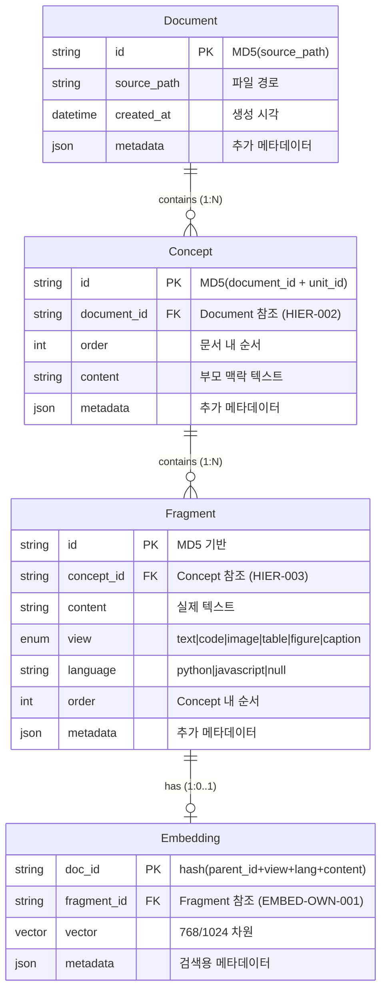
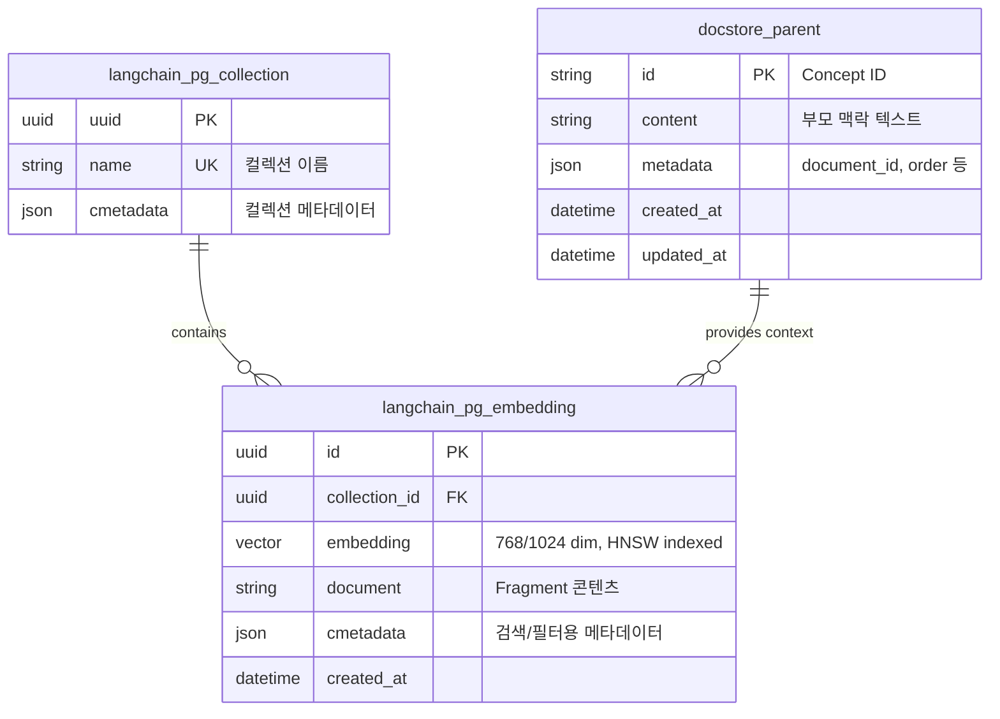
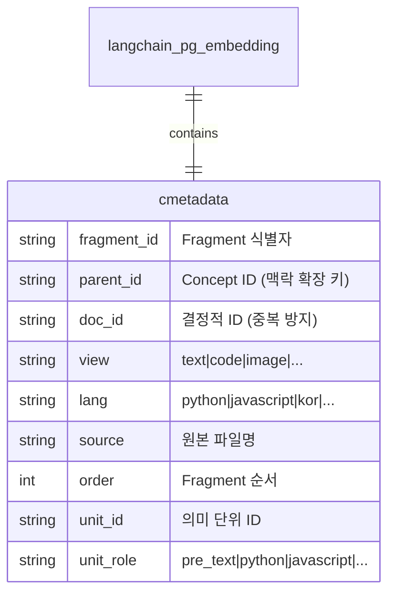
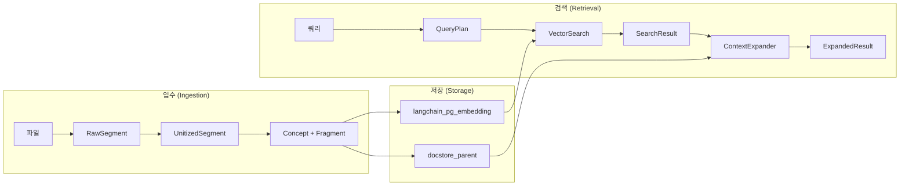
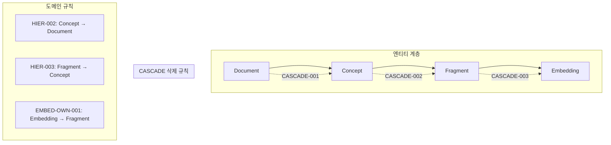
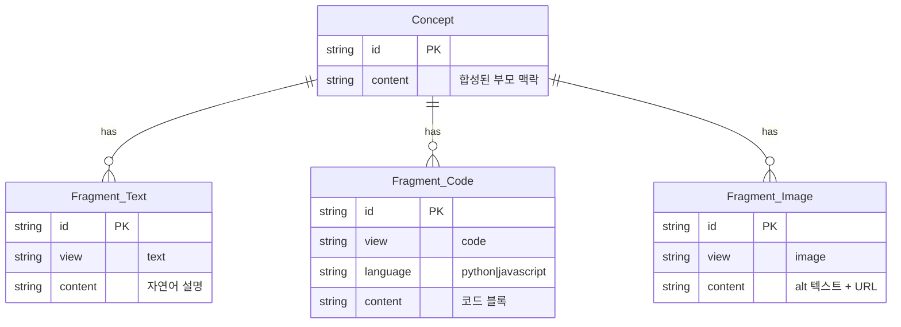
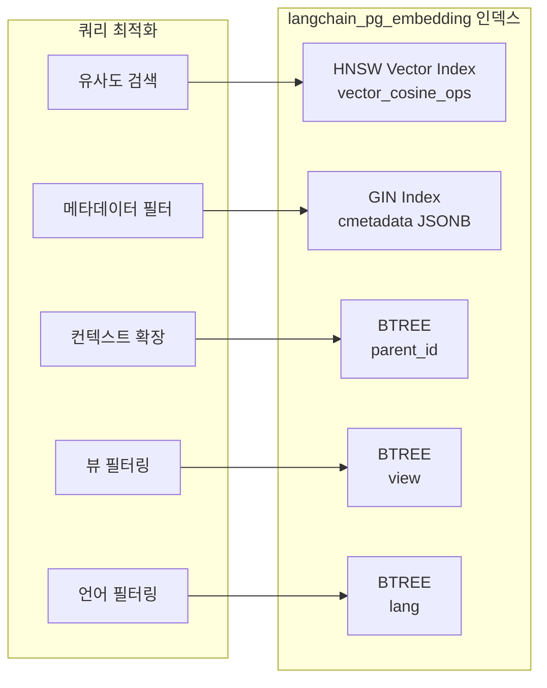

# OCR Vector DB - Entity Relationship Diagram

> 마지막 갱신: 2026-01-04

---

## 1. 도메인 엔티티 관계도 (Domain Model)

---

## 2. 데이터베이스 물리 스키마 (Physical Schema)

---

## 3. 메타데이터 구조 (cmetadata JSONB)

---

## 4. 검색 파이프라인 데이터 흐름

---

## 5. 계층 구조 및 CASCADE 삭제

---

## 6. Multi-View 관계

---

## 7. 인덱스 구조

---

## 8. 규칙 ID 매핑

| 엔티티 관계 | 규칙 ID | 설명 |
|------------|---------|------|
| Document ← Concept | HIER-002 | 모든 Concept은 정확히 하나의 Document에 귀속 |
| Concept ← Fragment | HIER-003 | 모든 Fragment는 유효한 concept_id 필수 |
| Fragment ← Embedding | EMBED-OWN-001 | 모든 Embedding은 정확히 하나의 Fragment에 귀속 |
| Fragment.view | FRAG-VIEW-001 | View는 속성이지 독립 엔티티가 아님 |
| Embedding.doc_id | EMBED-ID-002 | doc_id = hash(parent_id + view + lang + content) |
| Fragment.content | FRAG-LEN-001 | 10자 미만은 임베딩 불가 |

---

## 부록: Mermaid 렌더링 방법

이 문서의 다이어그램은 [Mermaid](https://mermaid.js.org/) 문법으로 작성되었습니다.

**렌더링 방법:**
- GitHub: 자동 렌더링 지원
- VS Code: [Markdown Preview Mermaid Support](https://marketplace.visualstudio.com/items?itemName=bierner.markdown-mermaid) 확장
- 온라인: [Mermaid Live Editor](https://mermaid.live/)
- Obsidian: 기본 지원
