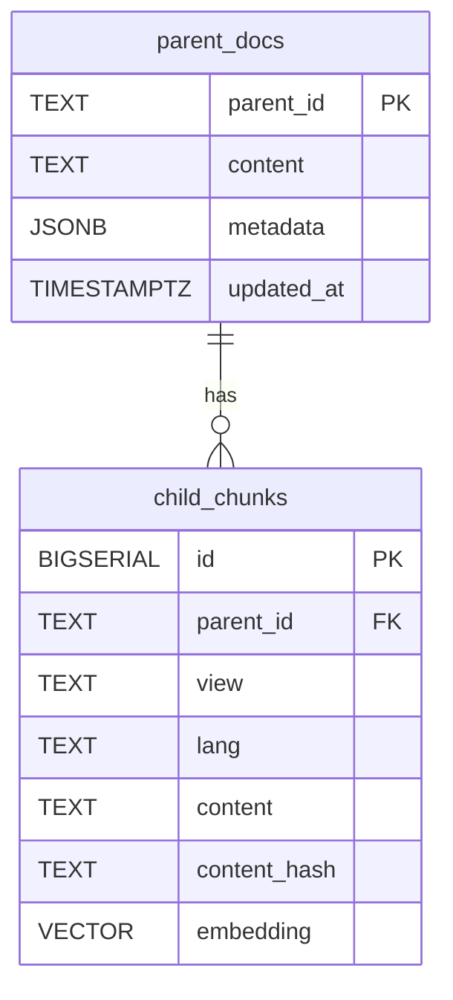

# OCR 임베딩 전략 상세 해설

본 문서는 `embedding.py`, `tools/extract_views_demo.py`, `tools/offline_smoke_test.py`를 기준으로, OCR 결과 텍스트를 임베딩하여 벡터 DB에 저장하는 전체 파이프라인을 상세히 설명합니다. RAG 구성을 염두에 두고, 텍스트/코드 멀티뷰 처리, 부모-자식 문서 모델, 인덱싱 및 스키마 옵션까지 포함합니다.

## 전체 파이프라인 개요

- 입력: OCR된 순수 텍스트(`.txt`) 및 PDF(텍스트 추출 → 필요 시 OCR 사이드카)
- 전처리: 리거처/따옴표/대시/공백 정규화(`normalize`)
- 문단 분할: 빈 줄 기준(`split_paragraph`)
- 코드 감지/언어 추정: 휴리스틱(`is_code_block`, `guess_code_lang`)
- 유닛화: 텍스트-파이썬-(브릿지 텍스트)-자바스크립트로 묶는 스트리밍 페어링(`unitize_txt_py_js_streaming`)
- 청킹: 텍스트와 코드를 다른 전략으로 분할(`RecursiveCharacterTextSplitter`, `split_code_safely`)
- 메타데이터: `unit_id`를 기준으로 `parent_id`, `view(text|code)`, `lang` 등 부여
- 부모 문서 생성: 자식 청크 요약으로 대표 콘텐츠 생성(`build_parent_entries`)
- 부모 그룹핑 옵션: 파일/페이지/섹션 기반(`assign_parent_by_page_section` + `PARENT_MODE`)
- 임베딩/저장: VoyageAI 임베딩 → LangChain `PGVector` upsert 또는 커스텀 스키마 동시 기록
- 인덱싱: HNSW/GIN/BTREE 등 보조 인덱스 생성(`ensure_indexes`)

## 현재 구현 현황(요약)

- 입력 처리
  - [x] `.txt` 파싱(`parse_ocr_file` → `parse_ocr_text`)
  - [x] `.pdf` 텍스트 추출(`extract_text_from_pdf`: `pdfminer.six` → `pdftotext` 폴백)
  - [x] 스캔 판별(`is_low_text_density`) 및 OCR 권고/자동 OCR(옵션, `ENABLE_AUTO_OCR=true` + `ocrmypdf`)
- 세그먼트/유닛화/청킹
  - [x] 코드 감지·언어 추정(파이썬/JS 휴리스틱)
  - [x] 유닛 페어링(텍스트→파이썬→브릿지→JS), `unit_role` 부여
  - [x] 텍스트/코드 별 청킹 전략 적용
- 멀티뷰/메타데이터
  - [x] `view=text|code`, `lang`, `unit_id/parent_id`, `order/kind`, `content_hash` 기반 ID
  - [x] 캡션 보강: `augment_with_captions`로 `view=figure|table, kind=caption` 추가
- 부모 문서/그룹핑
  - [x] `PARENT_MODE`(unit/page/section/page_section) + 페이지·섹션 정규식 기반 재귀속
  - [x] 부모 콘텐츠 합성(`build_parent_entries`) + 메타 집계
- 임베딩/저장/인덱싱
  - [x] VoyageAI 임베딩(`VOYAGE_MODEL`, `EMBEDDING_DIM` 검증)
  - [x] LangChain `PGVector` 업서트 + HNSW/GIN/BTREE 인덱스
  - [x] 커스텀 스키마(`child_chunks`, `parent_docs`) 생성 및 듀얼 라이트(옵션)
- 도구
  - [x] `tools/offline_smoke_test.py`: DB 없이 파이프라인 점검
  - [x] `tools/extract_views_demo.py`: MD 뷰 추출 데모
  - [x] `tools/ingest.py`: 혼합 입력용 래퍼 CLI(자동 OCR/그룹핑/커스텀 스키마/드라이런 지원)

## 전처리와 분할

### 정규화: `normalize(text)`

- 리거처·따옴표·대시를 표준 문자로 치환: `fi`→`fi`, `’`→`'`, `“/”`→`"`, `–/—`→`-`
- 비분리 공백(U+00A0) 제거, 줄 끝 공백 제거, 과다 개행 축소

### 문단 분할: `split_paragraph(text)`

- 2개 이상 연속 개행 기준으로 문단 리스트 생성

### 코드 감지/언어 추정

- `is_code_block(p)`: 펜스 코드(````), 세미콜론/중괄호/대표 키워드(파이썬·JS) 패턴으로 코드 여부 판정
- `guess_code_lang(p)`: 파이썬/자바스크립트 정규식 시그널을 세어 우세 언어를 추정

### OCR 파일 파싱: `parse_ocr_file(path)`

- 정규화 후 문단별로 `RawSegment(kind, content, language, order)` 생성
  - `kind`: `text` 또는 `code`, `language`: `python`/`javascript`/`None`

## 유닛화(Parent-Child 단위 구성)

### 목적

- 실제 문서(예: 기술서)에서 흔한 패턴을 하나의 “유닛(unit)”으로 묶습니다:
  - `[텍스트*] → python(code)+ → [브릿지 텍스트 0..N] → javascript(code)+ → [후속 텍스트*]`
- 유닛 단위로 `parent_id`를 동일하게 부여하여, Multi-Vector Retrieval에서 parent-child 방식으로 활용합니다.

### 구현: `unitize_txt_py_js_streaming`

- 텍스트는 버퍼에 쌓아두었다가 파이썬 코드가 시작되면 `pre_text`로 귀속
- 파이썬 연속 블록을 `python`, 이후 JS 연속 블록은 `javascript`로 추가
- 파이썬과 JS 사이 텍스트는 `bridge_text`로 제한적으로 허용(`bridge_text_max`)
- JS 이후 텍스트는 기본 제외(옵션으로 `post_text` 부착 가능)
- 파이썬 없이 JS 단독 등은 `other`로 배출
- 과도한 pre_text를 방지하기 위해 `max_pre_text_chars` 상한으로 오래된 텍스트는 `other`로 분리

반환은 `(unit_id|None, unit_role, RawSegment)`의 리스트이며, `unit_role ∈ {pre_text, python, javascript, post_text, other, bridge_text}`입니다.

## 청킹과 문서화

### 텍스트 청킹: `TEXT_SPLITTER`

- `RecursiveCharacterTextSplitter`를 사용하여 문맥 손상을 줄이며 분리
  - `chunk_size=1200`, `chunk_overlap=150`, 구분자: `\n##`, `\n###`, `\n\n`, `\n`, ` `, ``

### 코드 청킹: `split_code_safely(code, max_chars=1800, overlap_lines=5)`

- 긴 한 줄 문제를 방지하면서 줄 단위로 안전하게 분할, 약간의 줄 오버랩으로 맥락 보전

### `build_document_from_unitized(path, unitized)`

- 유닛 목록을 `langchain_core.documents.Document` 리스트로 변환
- 메타데이터 필드(예):
  - `source`: 파일명, `order`: 원문 순서, `kind`: `text|code`
  - `unit_id`, `parent_id(=unit_id)`, `unit_role`: `pre_text|python|javascript|...`
  - `view`: `text` 또는 `code`, `lang`: 코드 언어

## 부모 문서(Parent) 생성과 그룹핑

### 페이지/섹션 기반 부모 지정: `assign_parent_by_page_section`

- `PARENT_MODE ∈ {unit, page, section, page_section}`
- 페이지/섹션 정규식(`PAGE_REGEX`, `SECTION_REGEX`)으로 문서 순서대로 현재 페이지/섹션을 추적해 `parent_id` 재지정

### 부모 콘텐츠 합성: `build_parent_entries` / `synthesize_parent_content`

- 같은 `parent_id`를 갖는 자식 청크들을 모아 대표 텍스트를 생성
  - 헤더/캡션 후보(정규식)와 텍스트의 선도 문장을 조합, 최대 약 2000자
- 부모 메타데이터 집계: `views(text|code)`, `page`, `order`, `source_set` 등
- Multi-Vector Retriever에서 부모 문서는 상위 뷰, 자식 문서는 세부 뷰로 활용 가능

## 임베딩 및 저장 전략

### 임베딩 모델

- `VoyageAIEmbeddings(model=VOYAGE_MODEL, 기본 voyage-3)`
- `validate_embedding_dimension`: 모델이 생성한 차원 수가 `EMBEDDING_DIM`과 일치하는지 샘플로 확인

### 기본 저장: LangChain `PGVector`

- `PGVector(connection=PG_CONN, embeddings=..., collection_name=COLLECTION, distance_strategy="COSINE", use_jsonb=True, embedding_length=EMBDDING_DIM)`
- `upsert_batch(store, docs, batch_size=64)`: `compute_doc_id_for`로 생성한 안정적 ID로 upsert
  - `compute_doc_id_for`: `(parent_id|unit_id, view, lang, content)`의 MD5를 `content_hash`로 보관하고 `doc:{hash}` ID 생성

### 커스텀 스키마(옵션): `CUSTOM_SCHEMA_WRITE=true`

- 스키마 준비: `ensure_custom_schema`
  - `child_chunks(id, parent_id, view, lang, content, content_hash, embedding vector(D))`
    - 유니크 키: `(parent_id, view, lang, content_hash)`로 중복 방지
    - `ivfflat (vector_cosine_ops)` 인덱스 기본 제공, `lists=100`
  - `parent_docs(parent_id, content, metadata, updated_at)` + GIN 인덱스
- 쓰기: `dual_write_custom_schema`
  - 트랜잭션으로 부모/자식 동시 기록, 자식 벡터는 `embed_documents` 호출 후 `[v1,...]::vector` 리터럴로 삽입
  - 중복은 유니크 인덱스로 자동 제거(`DO NOTHING`)

### 인덱스/확장 보장

- `ensure_extension_vector`: `CREATE EXTENSION IF NOT EXISTS vector;`
- `ensure_indexes`(LangChain 기본 테이블 `langchain_pg_embedding` 대상)
  - `HNSW (vector_cosine_ops)`, `JSONB GIN`(`cmetadata`), `BTREE`(parent_id, view, lang, unit_id, unit_role)
- DB 레벨 튜닝(옵션): `apply_db_level_tuning`
  - 환경변수로 `ivfflat.probes`, `hnsw.ef_search`, `hnsw.ef_construction` 설정값 주입

## 검색/리트리벌 관점의 디자인 포인트

- 멀티뷰 저장: 동일 `parent_id` 하에 `view=text`와 `view=code(lang=python|javascript)`를 함께 저장하여, 쿼리 의도에 따라 텍스트/코드 뷰를 선택적으로 활용 가능
- 코드 보전: 줄 단위 오버랩과 큰 청크 크기로 문맥 파손 최소화
- 텍스트 정제: OCR 특유의 리거처/공백 문제를 제거하여 임베딩 품질 향상
- 안정적 ID/dedupe: `content_hash` 기반으로 재실행 시 중복 삽입 방지

## 도구 스크립트 안내

### `tools/offline_smoke_test.py`

- 파이프라인 핵심(파싱→유닛→문서화→부모할당→부모생성)을 로컬에서 빠르게 점검
- DB 쓰기 없이 `segments`/`docs`/`parents` 개수 및 샘플 메타를 출력
- 사용 예: `python tools/offline_smoke_test.py test.txt`

### `tools/extract_views_demo.py`

- 마크다운 파일에서 문단/코드/이미지 뷰를 추출해 샘플 보고서 형태로 출력(임베딩 없음)
- 사용 예: `python tools/extract_views_demo.py README.md`

### `tools/ingest.py`

- 혼합 입력(PDF/TXT)을 받아 PDF 텍스트 추출→필요 시 OCR→유닛화→청킹→부모 생성→(옵션) DB 업서트까지 수행하는 래퍼 CLI
- 주요 옵션:
  - `--auto-ocr`: PDF 텍스트가 희소할 때 `ocrmypdf` 자동 실행(sidecar 생성)
  - `--parent-mode {unit,page,section,page_section}`: 부모 그룹핑 모드 오버라이드
  - `--custom-schema-write`/`--no-custom-schema-write`: 커스텀 스키마 동시 기록 토글
  - `--dry-run`: 파싱/통계만 출력, DB 미기록
  - `--skip-index`: 마지막 인덱스 생성 생략
- 사용 예:
  - `python tools/ingest.py --auto-ocr 001-46-52.pdf`
  - `python tools/ingest.py data/*.txt docs/*.pdf`

## 환경변수 요약

- `PG_CONN`: Postgres 연결 문자열(`postgresql+psycopg://...`)
- `COLLECTION_NAME`: LangChain PGVector 컬렉션명
- `VOYAGE_MODEL`: VoyageAI 모델명(기본 `voyage-3`)
- `EMBEDDING_DIM`: 임베딩 차원(기본 1024)
- `CUSTOM_SCHEMA_WRITE`: `true`면 커스텀 스키마에도 동시 기록
- `PARENT_MODE`: `unit|page|section|page_section`
- `PAGE_REGEX`, `SECTION_REGEX`: 페이지/섹션 감지 정규식
- (옵션) `IVFFLAT_PROBES`, `HNSW_EF_SEARCH`, `HNSW_EF_CONSTRUCTION`: DB 레벨 튜닝

## 실행 플로우 예시

1) 파일 임베딩 및 저장(.txt 글롭)

```bash
python embedding.py "data/*.txt"
```

2) 오프라인 점검(.txt 또는 PDF)

```bash
python tools/offline_smoke_test.py test.txt
# 또는
python tools/offline_smoke_test.py 001-46-52.pdf
```

3) 마크다운 뷰 추출 데모

```bash
python tools/extract_views_demo.py docs/sample.md
```

4) 권장: 혼합 입력 일괄 임베딩(자동 OCR 포함)

```bash
# PDF가 스캔본일 때 OCR 자동 실행(sidecar 생성) 후 임베딩까지
python tools/ingest.py --auto-ocr 001-46-52.pdf

# 혼합 글롭 입력을 한 번에 처리
python tools/ingest.py data/*.txt docs/*.pdf
```

## 구현 상의 주의사항

- JS 단독 등 비정형 패턴은 `other`로 배출되어 기본적으로 임베딩·저장 대상에서 비중이 낮음
- `attach_post_text=False`가 기본: JS 이후 텍스트는 다음 섹션 `pre_text` 후보가 되도록 버퍼링
- `EMBEDDING_DIM`과 모델 차원 수가 다를 수 있어 `validate_embedding_dimension`에서 경고 출력
- LangChain `PGVector` 버전 차이로 `ids=` 인자 미지원 시 예외를 잡아 fallback 처리

## 알려진 제약과 권장 다음 단계

- 이미지 자체의 픽셀 임베딩은 하지 않음(캡션 텍스트만 별도 뷰로 저장). 필요 시:
  - 도표/스캔 이미지에 대한 OCR+캡셔닝(예: `doctr`, `paddleocr`+제목 추출) 추가
  - 표 구조 추출(예: `pdfplumber`, `camelot`, `tabula`)과 별도 `view=table-struct` 저장
- PDF 레이아웃 보존 한계: 컬럼/각주/머리말 등이 섞일 수 있음 → `-layout` 옵션과 문단 휴리스틱 보강 필요
- 코드 언어 추정은 Py/JS에 최적화되어 있음 → 다른 언어(자바/Go 등) 키워드 추가 확장 권장
- `PG_CONN` 접두사 오타: `postgresql+psycopg://...` 사용 권장(일부 예제에서 `+pycopg` 오타 주의)
- 검색 단계: Multi-Vector Retriever 설정과 `view`/`lang` 필터 전략 설계가 필요(별도 구현 예정)

## 검색 가이드

아래 가이드는 구축된 데이터(부모/자식, 멀티뷰)를 활용해 검색(리트리벌)을 구현할 때의 권장 절차와 예시입니다.

### 핵심 원칙

- 뷰 필터링: 쿼리 의도에 따라 `view`를 제한
  - 일반 자연어 설명/질문 → `view=text`
  - 코드 중심 질의(예: `def`, `class`, `import`, `=>`) → `view=code` + `lang=python|javascript` 지정
  - 그림/표 설명/번호(예: "그림", "Figure", "표", "Table") → `view=figure|table`
- 부모 우선: 상위 랭크된 자식 청크는 동일 `parent_id`로 그룹핑하여 부모 기준으로 결과를 요약/반환하고, 필요 시 부모의 다른 자식(형제 청크)을 함께 제공
- 멀티뷰 혼합: 필요 시 뷰별 가중치로 결과를 혼합하거나, 1차 필터 후 부족하면 보조 뷰를 백업으로 사용

### 일반 절차(권장)

1) 쿼리 분류: 간단한 휴리스틱/모델로 `target_view`(`text|code|figure|table`)와 `lang`(가능 시) 추정
2) 1차 검색: `child_chunks`(커스텀) 또는 `langchain_pg_embedding`(기본)에서 `target_view`(+`lang`)로 필터 후 코사인 거리 ANN 검색
3) 랭크·그룹핑: `parent_id`로 그룹핑하여 상위 부모를 선정(예: 부모당 최고 점수 사용)
4) 확장: 선택된 부모의 형제 청크를 추가 로드(동일 `parent_id`, 필요 시 다른 `view` 포함)
5) 부모 요약 반환: `docstore_parent`(기본) 또는 `parent_docs`(커스텀)에서 부모 콘텐츠/메타를 함께 반환

### SQL 예시: 커스텀 스키마(child_chunks)

코사인 거리(`<=>`) 기반 ANN. 쿼리 벡터는 VoyageAI로 생성(1024차원 가정).

```sql
-- Python 코드 뷰에서 상위 10개 자식 청크
SELECT parent_id, view, lang, content,
       embedding <=> '[0.12, -0.03, ...]'::vector AS dist
FROM child_chunks
WHERE view = 'code' AND lang = 'python'
ORDER BY embedding <=> '[0.12, -0.03, ...]'::vector
LIMIT 10;
```

부모 그룹 최상위 선별(서브쿼리/CTE 이용) 후 부모 본문 합치기:

```sql
WITH q AS (
  SELECT parent_id,
         MIN(embedding <=> '[...]'::vector) AS best_dist
  FROM child_chunks
  WHERE view IN ('text','code')
  GROUP BY parent_id
  ORDER BY best_dist ASC
  LIMIT 10
)
SELECT p.parent_id, p.content, p.metadata, q.best_dist
FROM parent_docs p
JOIN q ON q.parent_id = p.parent_id
ORDER BY q.best_dist ASC;
```

선정된 부모의 형제 청크 조회(멀티뷰 컨텍스트 구성):

```sql
SELECT view, lang, content
FROM child_chunks
WHERE parent_id = $1
ORDER BY view, lang
LIMIT 50;
```

### SQL 예시: 기본 테이블(langchain_pg_embedding)

메타는 `cmetadata` JSONB에 저장되며, 코사인 거리용 HNSW 인덱스가 존재합니다.

```sql
-- 코드(Py)만 필터링하여 상위 10건
SELECT id, (embedding <=> '[...]'::vector) AS dist,
       cmetadata->>'parent_id' AS parent_id,
       cmetadata->>'view' AS view,
       cmetadata->>'lang' AS lang,
       document
FROM langchain_pg_embedding
WHERE cmetadata->>'view' = 'code' AND cmetadata->>'lang' = 'python'
ORDER BY embedding <=> '[...]'::vector
LIMIT 10;
```

부모 그룹링은 위와 유사하게 `parent_id` 기준으로 애플리케이션 레벨에서 묶어 처리(또는 SQL로 그룹 최상위 선별)하면 됩니다.

### 파이썬 예시: 쿼리 벡터 생성 + SQL 호출(커스텀 스키마)

```python
from voyageai import Client
import psycopg
import os, json

query = "파이썬에서 리스트 컴프리헨션 예제"
client = Client(api_key=os.environ['VOYAGE_API_KEY'])
vec = client.embed([query], model=os.getenv('VOYAGE_MODEL','voyage-3'))['data'][0]['embedding']

with psycopg.connect(os.environ['PG_CONN'].replace('+psycopg','')) as conn:
    with conn.cursor() as cur:
        cur.execute(
          """
          SELECT parent_id, view, lang, content,
                 embedding <=> %s::vector AS dist
          FROM child_chunks
          WHERE view IN ('text','code')
          ORDER BY embedding <=> %s::vector
          LIMIT 10
          """,
          (json.dumps(vec), json.dumps(vec))
        )
        rows = cur.fetchall()
```

### 뷰 혼합 전략(예시)

- 1차 결과는 `view=text` 7개, `view=code` 3개 비율로 구성(자연어 질의 기준)
- 코드 의심 질의일 경우 반대로 `code`에 가중치(예: `code` 7, `text` 3)
- `figure|table`는 보조 채널로 별도 상위 3개를 유지해 캡션 중심 검색 결과를 함께 노출

### 성능 팁

- HNSW/IVFFLAT 파라미터 조정: `IVFFLAT_PROBES`, `HNSW_EF_SEARCH` 환경변수로 탐색 품질-속도 절충
- 메타 필터 활용: `view`, `lang`, `parent_id` 인덱스가 준비되어 있어 빠른 전처리 필터링 가능
- 부모 기준 디듀프: 부모별 상위 1~2개 자식만 남겨 중복 콘텐츠 과다 노출 방지
- 결과 확장: 부모 선택 후 형제 청크를 제한 수(예: 20~50개)로 추가 로드해 컨텍스트 강화

---

본 전략은 텍스트와 코드를 분리된 뷰로 보존하면서도 동일 `parent_id`아래 결속시키는 방식으로, 코드 중심 기술문서의 문맥을 유지한 채 검색 정밀도를 높이는 것을 목표로 합니다.

## PDF 입력 처리와 OCR

- PDF 입력 지원: `embedding.py`는 `.pdf`를 감지하면 텍스트 추출을 시도합니다.
  - 1순위 `pdfminer.six`(파이썬), 2순위 `pdftotext`(CLI).
  - 텍스트가 희소하면(글자수/밀도 기준) OCR이 필요하다고 경고합니다.
- 자동 OCR(옵션): 환경변수 `ENABLE_AUTO_OCR=true`이고 `ocrmypdf`가 설치되어 있으면 자동으로 `--sidecar <same>.txt --skip-text`로 사이드카 텍스트를 생성해 사용합니다.
- 수동 OCR 예시:
  - `ocrmypdf --sidecar 001-46-52.txt --skip-text 001-46-52.pdf 001-46-52.ocr.pdf`
  - 이후 `python tools/offline_smoke_test.py 001-46-52.txt` → `python embedding.py 001-46-52.txt`

### 그림/표 캡션 보강

- PDF에서 이미지 자체 위치를 벡터화하진 않지만, 캡션 라인(예: `Figure 3: ...`, `표 2. ...`, `그림 1.` 등)을 탐지해 별도의 뷰로 저장합니다.
- `augment_with_captions`: 텍스트 청크를 스캔해 캡션을 `view=figure|table, kind=caption`으로 추가하며, 필요 시 다음 한 줄을 짧게 덧붙여 맥락을 보강합니다.

## 다이어그램

### 파이프라인 개요(Flow)

```mermaid
flowchart TD
    A[OCR 텍스트 파일] --> B[normalize]
    B --> C[split_paragraph]
    C --> D[is_code_block / guess_code_lang]
    D --> E[unitize_txt_py_js_streaming\n(Text→Python→Bridge→JS)]
    E --> F[build_document_from_unitized\n(view=text|code, lang)]
    F --> G{PARENT_MODE}
    G -->|unit/page/section| H[assign_parent_by_page_section]
    H --> I[build_parent_entries\n(대표 텍스트 합성)]
    F --> J[임베딩: VoyageAI]
    J --> K[저장: LangChain PGVector]
    I --> L[부모 저장: docstore_parent]
    K --> M[ensure_indexes\n(HNSW/GIN/BTREE)]
    subgraph 옵션: 커스텀 스키마
      J --> N[dual_write_custom_schema]
      I --> N
      N --> O[parent_docs]
      N --> P[child_chunks (vector)]
    end
```

### 부모-자식 뷰 모델(Concept)

```mermaid
graph LR
  P[Parent (parent_id)] --- C1((Child Chunk))
  P --- C2((Child Chunk))
  P --- C3((Child Chunk))

  C1 -->|view=text| V1[텍스트 청크]
  C2 -->|view=code, lang=python| V2[코드 청크(Py)]
  C3 -->|view=code, lang=javascript| V3[코드 청크(JS)]

  classDef parent fill:#e3f2fd,stroke:#1e88e5,color:#0d47a1;
  classDef child fill:#e8f5e9,stroke:#43a047,color:#1b5e20;
  classDef view fill:#fff3e0,stroke:#fb8c00,color:#e65100;
  class P parent; class C1,C2,C3 child; class V1,V2,V3 view;
```

### ER 개요(커스텀 스키마)


