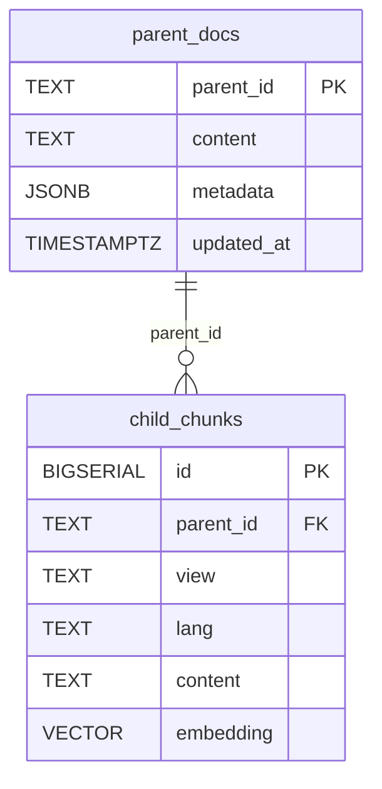

# Postgres + pgvector 단일 스키마(부모/자식)

본 문서는 부모 문서(대표 본문)와 자식 청크(임베딩 대상)를 하나의 Postgres(+pgvector)에서 운용하기 위한 최소 스키마와 인덱스, ER 다이어그램, 인제스트 요약을 정리합니다.

## 0) 확장 설치

```sql
CREATE EXTENSION IF NOT EXISTS vector;
-- 선택: 텍스트 유사도/보조 검색이 필요하면
CREATE EXTENSION IF NOT EXISTS pg_trgm;
```

## 1) 자식 청크 임베딩 저장: 텍스트/코드/OCR 캡션

임베딩 벡터 차원은 사용하는 모델에 맞춰 조정하세요(예: 1024, 1536 등).

```sql
CREATE TABLE IF NOT EXISTS child_chunks (
  id         BIGSERIAL PRIMARY KEY,
  parent_id  TEXT NOT NULL,
  view       TEXT,          -- 'text' | 'code' | 'ocr'
  lang       TEXT,          -- 'python' | 'javascript' | 'java' | NULL
  content    TEXT NOT NULL, -- 원문 청크(임베딩 대상)
  embedding  vector(1536) NOT NULL
);

-- 메타 필터용 BTREE 인덱스
CREATE INDEX IF NOT EXISTS child_chunks_parent_idx ON child_chunks (parent_id);
CREATE INDEX IF NOT EXISTS child_chunks_view_lang_idx ON child_chunks (view, lang);

-- 벡터 인덱스(코사인). pgvector 버전에 따라 ivfflat 또는 hnsw 선택
-- ivfflat 예시: lists 값은 데이터량에 맞춰 튜닝
CREATE INDEX IF NOT EXISTS child_chunks_vec_idx
  ON child_chunks USING ivfflat (embedding vector_cosine_ops)
  WITH (lists = 100);

-- hnsw 사용 시(지원 버전일 때):
-- CREATE INDEX IF NOT EXISTS child_chunks_hnsw_idx
--   ON child_chunks USING hnsw (embedding vector_cosine_ops);
```

## 2) 부모 문서(대표 요약 본문: 1~2KB 권장)

```sql
CREATE TABLE IF NOT EXISTS parent_docs (
  parent_id  TEXT PRIMARY KEY,
  content    TEXT   NOT NULL,  -- 요약/대표 본문(미리보기/프롬프트 투입용)
  metadata   JSONB,
  updated_at TIMESTAMPTZ DEFAULT now()
);

CREATE INDEX IF NOT EXISTS parent_docs_meta_idx ON parent_docs USING GIN (metadata);

-- 선택: updated_at 자동 갱신 트리거
CREATE OR REPLACE FUNCTION set_updated_at()
RETURNS trigger AS $$
BEGIN
  NEW.updated_at = now();
  RETURN NEW;
END; $$ LANGUAGE plpgsql;

DROP TRIGGER IF EXISTS trg_parent_docs_updated ON parent_docs;
CREATE TRIGGER trg_parent_docs_updated
BEFORE UPDATE ON parent_docs
FOR EACH ROW EXECUTE PROCEDURE set_updated_at();
```

## ER 다이어그램(개념)



## 인제스트 파이프라인 요약

- 유닛화: OCR/텍스트 문단 분리 → 코드 블록 감지/언어 추정 → Python 중심 유닛 단위로 묶기(pre_text/bridge/code 등)
- 자식 청크 생성: 텍스트는 재귀 분할, 코드는 행 기준 안전 분할로 청크 생성(content, view, lang, parent_id)
- 임베딩 계산: 모델 차원에 맞춰 `embedding vector(N)`에 저장
- 부모 본문 합성: 유닛별(pre_text 우선, 없으면 text 일부) 대표 본문을 1~2KB로 생성
- 업서트: `child_chunks`(자식) 삽입 후, `parent_docs`(부모) `INSERT ... ON CONFLICT`로 업서트
- 트랜잭션: 부모/자식을 한 트랜잭션으로 처리해 재색인/롤백 상황에서 일관성 보장

## 조회(예시)

- 벡터 유사도(코사인, ivfflat)
```sql
-- ivfflat 파라미터(필요 시):
-- SET ivfflat.probes = 10;
WITH q AS (
  SELECT CAST($1 AS vector) AS qvec  -- 바인딩: 질의 임베딩 벡터
)
SELECT c.*
FROM child_chunks c, q
WHERE (c.view = 'code' AND (c.lang IS NULL OR c.lang = 'python'))
ORDER BY c.embedding <=> q.qvec
LIMIT 10;
```

- 부모 본문 조인
```sql
WITH q AS (
  SELECT CAST($1 AS vector) AS qvec
), hits AS (
  SELECT parent_id
  FROM child_chunks, q
  ORDER BY embedding <=> q.qvec
  LIMIT 50
)
SELECT p.parent_id, p.content, p.metadata
FROM parent_docs p
JOIN (SELECT DISTINCT parent_id FROM hits) h USING (parent_id)
LIMIT 10;
```

## 메모

- 토큰/속도 밸런스: 부모 본문을 1~2KB로 유지해 RAG 컨텍스트 비용을 절감하면서, 필요 시 자식 청크를 추가로 조회해 세부 근거를 덧붙입니다.
- 확장: PoC 단계 이후 읽기 캐시(예: Redis)를 얹어 부모 본문 조회 지연을 줄이는 단계적 확장이 가능합니다.
- 차원: `vector(N)`의 N은 사용하는 임베딩 모델의 차원(예: 1024, 1536)에 맞춰 동일하게 유지하세요.

