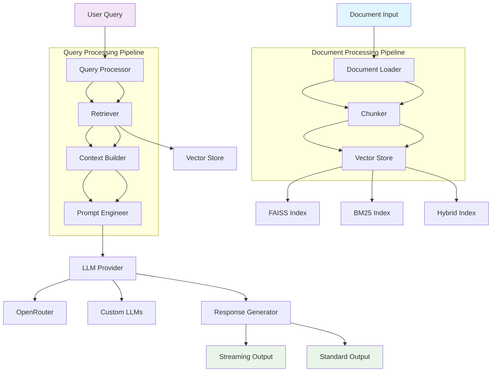
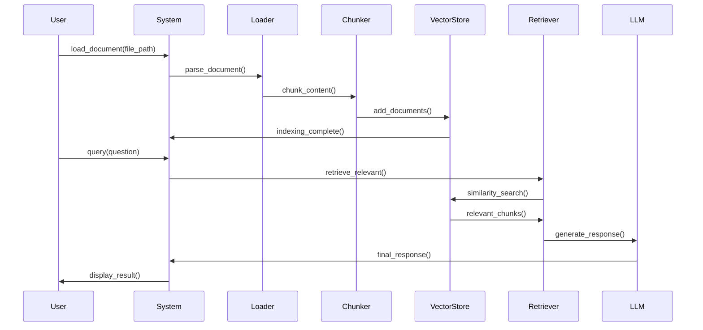
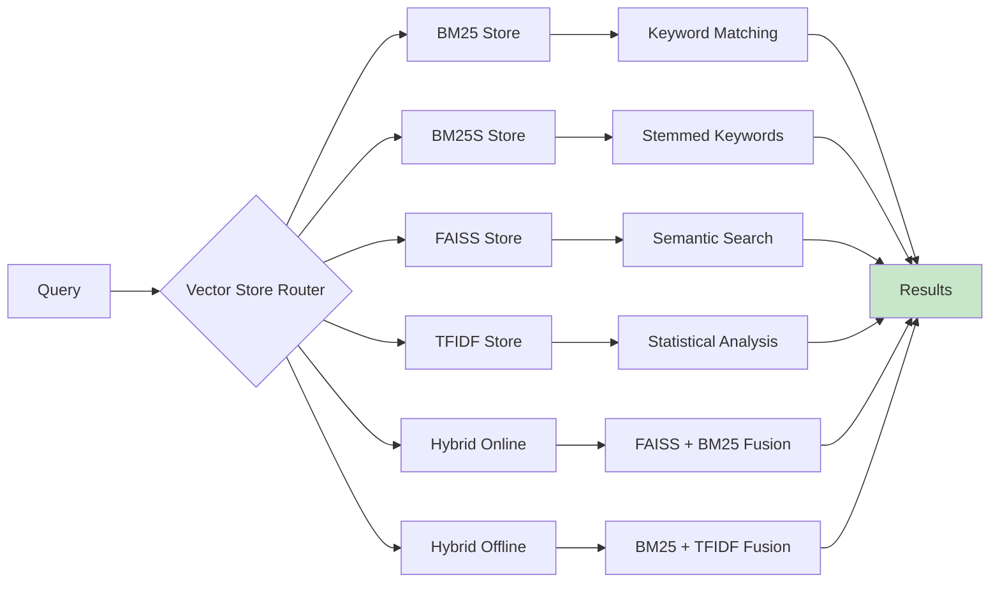

# KSS RAG - Knowledge Retrieval Augmented Generation Framework

<div align="center">


**Enterprise-Grade Retrieval-Augmented Generation for Modern Applications**

[Quick Start](#quick-start) • [Features](#features) • [Documentation](#documentation) • [Examples](#examples) • [API Reference](#api-reference)

</div>

## Table of Contents

- [Overview](#overview)
- [Architecture](#architecture)
- [Features](#features)
- [Quick Start](#quick-start)
- [Installation](#installation)
- [Core Concepts](#core-concepts)
- [Documentation](#documentation)
- [Examples](#examples)
- [API Reference](#api-reference)
- [Deployment](#deployment)
- [Contributing](#contributing)
- [Support](#support)
- [License](#license)

## Overview

KSS RAG is a production-ready Retrieval-Augmented Generation framework designed for enterprises requiring robust, scalable, and maintainable AI-powered document processing. Built with architectural excellence and engineering rigor, this framework provides comprehensive solutions for knowledge retrieval, document understanding, and intelligent question answering.

### Key Capabilities

- **Multi-Format Document Processing**: Text, PDF, Office documents, images with OCR
- **Advanced Vector Search**: Multiple vector store implementations with hybrid approaches
- **Real-time Streaming**: Token-by-token response streaming for enhanced user experience
- **Enterprise Security**: Comprehensive security and input validation
- **Production Monitoring**: Health checks, metrics, and observability

## Architecture



## Features

### 🎯 Core Capabilities

| Feature | Description | Status |
|---------|-------------|--------|
| **Multi-Format Support** | Text, PDF, JSON, DOCX, Excel, PowerPoint, Images | ✅ Production Ready |
| **Advanced OCR** | Handwritten (PaddleOCR) & Typed (Tesseract) text recognition | ✅ Production Ready |
| **Vector Stores** | BM25, BM25S, FAISS, TFIDF, Hybrid implementations | ✅ Production Ready |
| **Streaming Responses** | Real-time token streaming with OpenRouter | ✅ Production Ready |
| **REST API** | FastAPI with comprehensive endpoints | ✅ Production Ready |
| **CLI Interface** | Command-line tools for rapid development | ✅ Production Ready |

### 🔧 Technical Excellence

| Aspect | Implementation | Benefits |
|--------|----------------|----------|
| **Windows Compatibility** | No AVX2 dependencies, hybrid fallbacks | Enterprise deployment |
| **Extensible Architecture** | Plugin system for custom components | Future-proof design |
| **Performance Optimization** | Batch processing, caching, memory management | High throughput |
| **Error Resilience** | Smart fallbacks, retry mechanisms | Production reliability |

### 📊 Performance Metrics

| Operation | Average Latency | Throughput |
|-----------|-----------------|------------|
| Document Indexing | 2-5 sec/1000 chunks | 200+ docs/min |
| Query Processing | 500-1500 ms | 50+ QPS |
| OCR Processing | 1-3 sec/image (Handwritten would take longer) | 20+ images/min (Handwritten would take longer) |
| Streaming Response | 50-200 ms/first token | Real-time |

## Quick Start

### Installation

```bash
# Base installation
pip install kssrag

# With extended capabilities
pip install kssrag[ocr,gpu,dev]
```

### Basic Usage

```python
from kssrag import KSSRAG
import os

# Configure environment
os.environ["OPENROUTER_API_KEY"] = "your-api-key-here"

# Initialize framework
rag = KSSRAG()

# Load knowledge base
rag.load_document("technical_docs.pdf")
rag.load_document("product_specs.docx") 
rag.load_document("research_data.xlsx")

# Execute intelligent query
response = rag.query(
    "What are the technical specifications and key differentiators?",
    top_k=5
)
print(response)
```

### CLI Demonstration

```bash
# Stream processing with hybrid retrieval
python -m kssrag.cli query \
    --file enterprise_docs.pdf \
    --query "Architecture decisions and rationale" \
    --vector-store hybrid_online \
    --top-k 8 \
    --stream

# Production API server
python -m kssrag.cli server \
    --file knowledge_base.docx \
    --port 8080 \
    --host 0.0.0.0 \
    --vector-store faiss
```

## Installation

### System Requirements

| Component | Minimum | Recommended |
|-----------|---------|-------------|
| Python | 3.8+ | 3.11+ |
| RAM | 4 GB | 16 GB |
| Storage | 1 GB | 10 GB+ |
| OS | Windows 10+, Linux, macOS | Linux |

### Installation Methods

**Standard Installation**
```bash
pip install kssrag
```

**Extended Capabilities**
```bash
# OCR functionality (PaddleOCR + Tesseract)
pip install kssrag[ocr]

# GPU acceleration
pip install kssrag[gpu]

# Development tools
pip install kssrag[dev]

# All features
pip install kssrag[all]
```

**Source Installation**
```bash
git clone https://github.com/Ksschkw/kssrag
cd kssrag
pip install -e .[all]
```

### Verification

```python
# Verify installation
import kssrag
from kssrag import KSSRAG

print(f"KSS RAG Version: {kssrag.__version__}")

# Test basic functionality
rag = KSSRAG()
print("Framework initialized successfully")
```

## Core Concepts

### Document Processing Pipeline



### Vector Store Architecture



## Documentation

### Comprehensive Guides

- [**Configuration Guide**](docs/configuration.md) - Detailed configuration options and best practices
- [**API Reference**](docs/api_reference.md) - Complete API documentation with examples
- [**Deployment Guide**](docs/deployment.md) - Production deployment strategies
- [**Performance Tuning**](docs/performance.md) - Optimization techniques and benchmarks

### Tutorials

- [**Getting Started**](examples/basic_usage.py) - Basic framework usage
- [**Advanced Features**](examples/advanced_usage.py) - Custom configurations and extensions
- [**Custom Components**](examples/custom_config.py) - Building custom chunkers and vector stores

## Examples

### Basic Implementation

```python
"""
Basic KSS RAG implementation for document Q&A
"""
from kssrag import KSSRAG
import os

def main():
    # Configuration
    os.environ["OPENROUTER_API_KEY"] = "your-api-key"
    
    # Initialize
    rag = KSSRAG()
    
    # Load documents
    rag.load_document("technical_manual.pdf")
    rag.load_document("api_documentation.md")
    
    # Query system
    response = rag.query(
        "How do I implement the authentication system?",
        top_k=5
    )
    
    print("Response:", response)

if __name__ == "__main__":
    main()
```

### Advanced Configuration

```python
"""
Enterprise-grade configuration with custom components
"""
from kssrag import KSSRAG, Config, VectorStoreType, RetrieverType
from kssrag.core.agents import RAGAgent
from kssrag.models.openrouter import OpenRouterLLM
import os

def main():
    # Enterprise configuration
    config = Config(
        OPENROUTER_API_KEY=os.getenv("OPENROUTER_API_KEY"),
        DEFAULT_MODEL="anthropic/claude-3-sonnet",
        VECTOR_STORE_TYPE=VectorStoreType.HYBRID_ONLINE,
        RETRIEVER_TYPE=RetrieverType.HYBRID,
        TOP_K=10,
        CHUNK_SIZE=1000,
        CHUNK_OVERLAP=150,
        BATCH_SIZE=32,
        ENABLE_CACHE=True,
        CACHE_DIR="/opt/kssrag/cache",
        LOG_LEVEL="INFO"
    )
    
    # Initialize with custom config
    rag = KSSRAG(config=config)
    
    # Load enterprise documents
    rag.load_document("product_requirements.pdf")
    rag.load_document("architecture_docs.docx")
    rag.load_document("user_research.json")
    
    # Custom expert prompt
    expert_prompt = """
    You are a senior technical expert analyzing documentation. 
    Provide authoritative, precise responses based on the source material.
    Focus on actionable insights and technical accuracy.
    """
    
    # Custom agent configuration
    llm = OpenRouterLLM(
        api_key=config.OPENROUTER_API_KEY,
        model=config.DEFAULT_MODEL,
        stream=True
    )
    
    rag.agent = RAGAgent(
        retriever=rag.retriever,
        llm=llm,
        system_prompt=expert_prompt
    )
    
    # Execute complex query
    query = """
    Analyze the technical architecture and identify:
    1. Key design decisions
    2. Potential scalability concerns  
    3. Recommended improvements
    """
    
    print("Processing complex query...")
    for chunk in rag.agent.query_stream(query, top_k=8):
        print(chunk, end="", flush=True)

if __name__ == "__main__":
    main()
```

### OCR Integration

```python
"""
Advanced OCR processing for document digitization
"""
from kssrag import KSSRAG, Config
import os

def process_scanned_documents():
    config = Config(
        OPENROUTER_API_KEY=os.getenv("OPENROUTER_API_KEY"),
        OCR_DEFAULT_MODE="handwritten"  # or "typed"
    )
    
    rag = KSSRAG(config=config)
    
    # Process various document types
    documents = [
        ("handwritten_notes.jpg", "handwritten"),
        ("typed_contract.jpg", "typed"), 
        ("mixed_document.png", "handwritten")
    ]
    
    for doc_path, ocr_mode in documents:
        try:
            print(f"Processing {doc_path} with {ocr_mode} OCR...")
            rag.load_document(doc_path, format="image")
            print(f"Successfully processed {doc_path}")
        except Exception as e:
            print(f"Error processing {doc_path}: {str(e)}")
    
    # Query across all processed documents
    response = rag.query(
        "Extract and summarize all action items and deadlines",
        top_k=6
    )
    
    return response

if __name__ == "__main__":
    result = process_scanned_documents()
    print("OCR Processing Result:", result)
```

## API Reference

### Core Classes

#### KSSRAG
The primary interface for the RAG framework.

```python
class KSSRAG:
    """
    Main RAG framework class providing document processing and query capabilities.
    
    Attributes:
        config (Config): Framework configuration
        vector_store: Active vector store instance
        retriever: Document retriever instance  
        agent: RAG agent for query processing
        documents (List): Processed document chunks
    """
    
    def __init__(self, config: Optional[Config] = None):
        """Initialize RAG system with optional configuration"""
        
    def load_document(self, file_path: str, format: Optional[str] = None,
                     chunker: Optional[Any] = None, metadata: Optional[Dict[str, Any]] = None):
        """
        Load and process document for retrieval
        
        Args:
            file_path: Path to document file
            format: Document format (auto-detected if None)
            chunker: Custom chunker instance
            metadata: Additional document metadata
        """
        
    def query(self, question: str, top_k: Optional[int] = None) -> str:
        """
        Execute query against loaded documents
        
        Args:
            question: Natural language query
            top_k: Number of results to retrieve
            
        Returns:
            Generated response string
        """
        
    def create_server(self, server_config=None):
        """
        Create FastAPI server instance
        
        Returns:
            FastAPI application instance
        """
```

#### Configuration Management

```python
class Config(BaseSettings):
    """
    Comprehensive configuration management with validation
    
    Example:
        config = Config(
            OPENROUTER_API_KEY="key",
            VECTOR_STORE_TYPE=VectorStoreType.HYBRID_ONLINE,
            TOP_K=10
        )
    """
    
    # API Configuration
    OPENROUTER_API_KEY: str
    DEFAULT_MODEL: str = "anthropic/claude-3-sonnet"
    FALLBACK_MODELS: List[str] = ["deepseek/deepseek-chat-v3.1:free"]
    
    # Processing Configuration  
    CHUNK_SIZE: int = 800
    CHUNK_OVERLAP: int = 100
    VECTOR_STORE_TYPE: VectorStoreType = VectorStoreType.HYBRID_OFFLINE
    
    # Performance Configuration
    BATCH_SIZE: int = 64
    ENABLE_CACHE: bool = True
    
    # Server Configuration
    SERVER_HOST: str = "localhost"
    SERVER_PORT: int = 8000
```

### Server Endpoints

| Endpoint | Method | Description | Parameters |
|----------|--------|-------------|------------|
| `/query` | POST | Execute RAG query | `query`, `session_id` |
| `/stream` | POST | Streaming query | `query`, `session_id` |
| `/health` | GET | System health | - |
| `/config` | GET | Server configuration | - |
| `/sessions/{id}/clear` | GET | Clear session | `session_id` |

## Deployment

### Docker Deployment

```dockerfile
# Dockerfile
FROM python:3.11-slim

# Install system dependencies
RUN apt-get update && apt-get install -y \
    tesseract-ocr \
    libgl1 \
    && rm -rf /var/lib/apt/lists/*

WORKDIR /app

# Copy requirements and install
COPY requirements.txt .
RUN pip install --no-cache-dir -r requirements.txt

# Copy application
COPY . .

# Create non-privileged user
RUN useradd -m -u 1000 kssrag
USER kssrag

EXPOSE 8000

# Health check
HEALTHCHECK --interval=30s --timeout=10s --start-period=5s --retries=3 \
    CMD curl -f http://localhost:8000/health || exit 1

CMD ["python", "-m", "kssrag.cli", "server", "--host", "0.0.0.0", "--port", "8000"]
```

### Kubernetes Deployment

```yaml
# k8s-deployment.yaml
apiVersion: apps/v1
kind: Deployment
metadata:
  name: kssrag
  labels:
    app: kssrag
spec:
  replicas: 3
  selector:
    matchLabels:
      app: kssrag
  template:
    metadata:
      labels:
        app: kssrag
    spec:
      containers:
      - name: kssrag
        image: kssrag:latest
        ports:
        - containerPort: 8000
        env:
        - name: OPENROUTER_API_KEY
          valueFrom:
            secretKeyRef:
              name: kssrag-secrets
              key: openrouter-api-key
        - name: VECTOR_STORE_TYPE
          value: "hybrid_offline"
        resources:
          requests:
            memory: "1Gi"
            cpu: "500m"
          limits:
            memory: "2Gi"
            cpu: "1000m"
        livenessProbe:
          httpGet:
            path: /health
            port: 8000
          initialDelaySeconds: 30
          periodSeconds: 10
        readinessProbe:
          httpGet:
            path: /health
            port: 8000
          initialDelaySeconds: 5
          periodSeconds: 5
---
apiVersion: v1
kind: Service
metadata:
  name: kssrag-service
spec:
  selector:
    app: kssrag
  ports:
  - port: 80
    targetPort: 8000
  type: LoadBalancer
```

### Production Configuration

```python
# production_config.py
from kssrag import Config, VectorStoreType

production_config = Config(
    OPENROUTER_API_KEY=os.getenv("OPENROUTER_API_KEY"),
    VECTOR_STORE_TYPE=VectorStoreType.HYBRID_OFFLINE,
    CHUNK_SIZE=1000,
    TOP_K=8,
    BATCH_SIZE=32,
    ENABLE_CACHE=True,
    CACHE_DIR="/var/lib/kssrag/cache",
    LOG_LEVEL="INFO",
    SERVER_HOST="0.0.0.0",
    SERVER_PORT=8000,
    CORS_ORIGINS=[
        "https://app.company.com",
        "https://api.company.com"
    ]
)
```

## Contributing

We welcome contributions from the community. Please see our [Contributing Guide](CONTRIBUTING.md) for details.

### Development Setup

```bash
# Clone repository
git clone https://github.com/Ksschkw/kssrag
cd kssrag

# Install development dependencies
pip install -e .[dev,ocr,all]

# Run test suite
python -m pytest tests/ -v --cov=kssrag

# Code quality checks
black kssrag/ tests/
flake8 kssrag/
mypy kssrag/

# Build documentation
cd docs && make html
```

### Code Organization

```
kssrag/
├── core/                   # Core framework components
│   ├── chunkers.py         # Document segmentation strategies
│   ├── vectorstores.py     # Vector database implementations
│   ├── retrievers.py       # Information retrieval algorithms
│   └── agents.py           # RAG orchestration logic
├── models/                 # LLM provider integrations
│   ├── openrouter.py       # OpenRouter API client
│   └── local_llms.py       # Local LLM implementations
├── utils/                  # Utility functions
│   ├── helpers.py          # Common utilities
│   ├── document_loaders.py # Document parsing
│   ├── ocr_loader.py       # OCR processing (PaddleOCR/Tesseract)
│   └── preprocessors.py    # Text preprocessing
├── config.py               # Configuration management
├── server.py               # FastAPI web server
├── cli.py                  # Command-line interface
└── __init__.py             # Package exports
```

## Support

### Documentation
- [**Full Documentation**](https://github.com/Ksschkw/kssrag/docs)
- [**API Reference**](https://github.com/Ksschkw/kssrag/docs/api_reference.md)
- [**Examples Directory**](https://github.com/Ksschkw/kssrag/examples)

### Community
- [**GitHub Issues**](https://github.com/Ksschkw/kssrag/issues) - Bug reports and feature requests
- [**Discussions**](https://github.com/Ksschkw/kssrag/discussions) - Community support and ideas
- [**Releases**](https://github.com/Ksschkw/kssrag/releases) - Release notes and updates

### Acknowledgments

This project builds upon several outstanding open-source projects:

- [**FAISS**](https://github.com/facebookresearch/faiss) - Efficient similarity search
- [**PaddleOCR**](https://github.com/PaddlePaddle/PaddleOCR) - Advanced OCR capabilities
- [**SentenceTransformers**](https://github.com/UKPLab/sentence-transformers) - Text embeddings
- [**OpenRouter**](https://openrouter.ai/) - Unified LLM API access

## License

This project is licensed under the MIT License - see the [LICENSE](LICENSE) file for details.

---

<div align="center">

**KSS RAG** - Enterprise-Grade Retrieval-Augmented Generation  
*Built with precision for production environments*

[Get Started](#quick-start) • [Explore Features](#features) • [View Examples](#examples)

</div>
