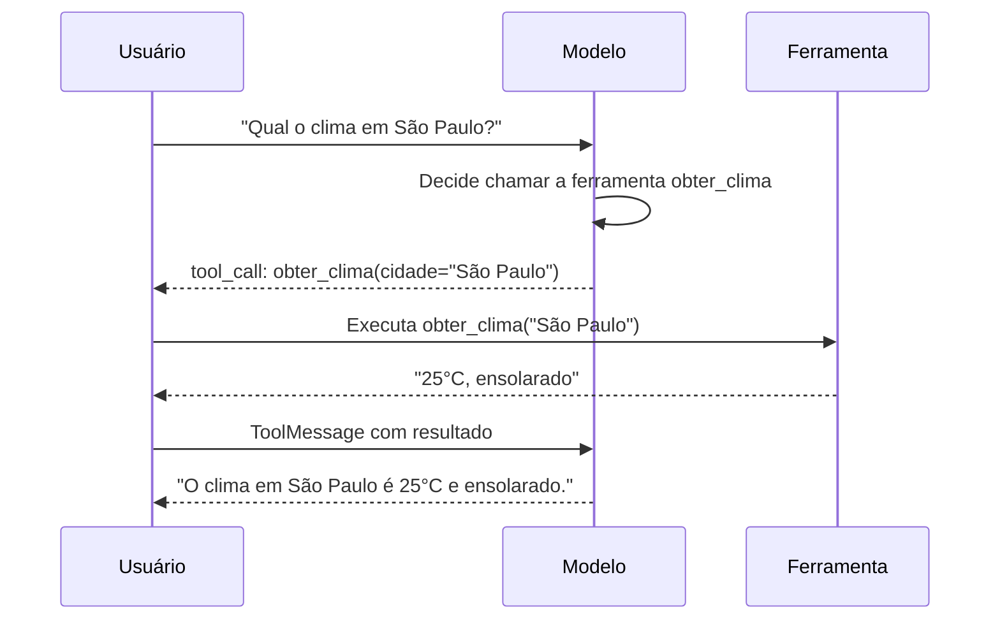

# Chamada de Ferramentas (Function Calling)

A chamada de ferramentas permite que o modelo solicite a execução de funções que você define. Isso é essencial para construir agentes e aplicações que interagem com sistemas externos.

## Visão Geral



## Definindo Ferramentas

### Usando Modelos Pydantic (Recomendado)

```python
from pydantic import BaseModel, Field
from langchain_maritaca import ChatMaritaca

class ObterClima(BaseModel):
    """Obtém o clima atual para uma localização."""

    cidade: str = Field(description="Nome da cidade, ex: 'São Paulo'")
    unidade: str = Field(
        default="celsius",
        description="Unidade de temperatura: 'celsius' ou 'fahrenheit'"
    )

modelo = ChatMaritaca()
modelo_com_ferramentas = modelo.bind_tools([ObterClima])
```

!!! tip "Docstrings São Importantes"
    A docstring da classe se torna a descrição da ferramenta. Escreva descrições claras e úteis!

### Usando Funções Python

```python
def obter_clima(cidade: str, unidade: str = "celsius") -> str:
    """Obtém o clima atual para uma localização.

    Args:
        cidade: Nome da cidade, ex: 'São Paulo'
        unidade: Unidade de temperatura: 'celsius' ou 'fahrenheit'
    """
    # Implementação aqui
    pass

modelo_com_ferramentas = modelo.bind_tools([obter_clima])
```

### Usando Schema Dict (Formato OpenAI)

```python
schema_ferramenta = {
    "type": "function",
    "function": {
        "name": "obter_clima",
        "description": "Obtém o clima atual para uma localização",
        "parameters": {
            "type": "object",
            "properties": {
                "cidade": {
                    "type": "string",
                    "description": "Nome da cidade"
                }
            },
            "required": ["cidade"]
        }
    }
}

modelo_com_ferramentas = modelo.bind_tools([schema_ferramenta])
```

## Escolha da Ferramenta (Tool Choice)

Controle como o modelo usa as ferramentas:

### Auto (Padrão)

O modelo decide se deve chamar uma ferramenta:

```python
modelo_com_ferramentas = modelo.bind_tools([ObterClima])
# ou explicitamente:
modelo_com_ferramentas = modelo.bind_tools([ObterClima], tool_choice="auto")
```

### Required (Obrigatório)

Força o modelo a chamar uma ferramenta:

```python
modelo_com_ferramentas = modelo.bind_tools([ObterClima], tool_choice="required")
```

### Ferramenta Específica

Força uma ferramenta específica a ser chamada:

```python
modelo_com_ferramentas = modelo.bind_tools(
    [ObterClima, ObterNoticias],
    tool_choice={"type": "function", "function": {"name": "ObterClima"}}
)
```

## Tratando Chamadas de Ferramentas

### Exemplo Básico

```python
from langchain_core.messages import HumanMessage, ToolMessage

# 1. Obtém resposta com chamada de ferramenta
resposta = modelo_com_ferramentas.invoke([
    HumanMessage(content="Qual o clima em Belo Horizonte?")
])

# 2. Verifica chamadas de ferramentas
if resposta.tool_calls:
    for tool_call in resposta.tool_calls:
        print(f"Ferramenta: {tool_call['name']}")
        print(f"Argumentos: {tool_call['args']}")
        print(f"ID: {tool_call['id']}")
```

Saída:
```
Ferramenta: ObterClima
Argumentos: {'cidade': 'Belo Horizonte'}
ID: call_abc123
```

### Loop Completo de Conversa

```python
from langchain_core.messages import HumanMessage, AIMessage, ToolMessage
from langchain_maritaca import ChatMaritaca
from pydantic import BaseModel, Field

# Define a ferramenta
class Calculadora(BaseModel):
    """Realiza cálculos aritméticos."""
    expressao: str = Field(description="Expressão matemática, ex: '2 + 2'")

# Configura o modelo
modelo = ChatMaritaca()
modelo_com_ferramentas = modelo.bind_tools([Calculadora], tool_choice="required")

# Inicia conversa
mensagens = [HumanMessage(content="Quanto é 15 vezes 7?")]

# Obtém chamada de ferramenta
resposta = modelo_com_ferramentas.invoke(mensagens)
mensagens.append(resposta)

# Executa a ferramenta (sua implementação)
if resposta.tool_calls:
    tool_call = resposta.tool_calls[0]
    resultado = eval(tool_call["args"]["expressao"])  # Em produção, use eval seguro!

    # Adiciona resultado da ferramenta
    mensagens.append(ToolMessage(
        content=str(resultado),
        tool_call_id=tool_call["id"]
    ))

# Obtém resposta final
resposta_final = modelo.invoke(mensagens)
print(resposta_final.content)
# Saída: 15 vezes 7 é igual a 105.
```

## Múltiplas Ferramentas

```python
class ObterClima(BaseModel):
    """Obtém o clima para uma localização."""
    cidade: str

class PesquisarWeb(BaseModel):
    """Pesquisa na web por informações."""
    consulta: str

class EnviarEmail(BaseModel):
    """Envia um email."""
    para: str
    assunto: str
    corpo: str

modelo_com_ferramentas = modelo.bind_tools([ObterClima, PesquisarWeb, EnviarEmail])
```

## Chamadas de Ferramentas em Paralelo

O modelo pode solicitar múltiplas chamadas de ferramentas em uma única resposta:

```python
resposta = modelo_com_ferramentas.invoke([
    HumanMessage(content="Compare o clima em São Paulo e Rio de Janeiro")
])

for tool_call in resposta.tool_calls:
    print(f"- {tool_call['name']}: {tool_call['args']}")

# Saída:
# - ObterClima: {'cidade': 'São Paulo'}
# - ObterClima: {'cidade': 'Rio de Janeiro'}
```

## Estrutura da Chamada de Ferramenta

O atributo `tool_calls` contém uma lista de dicionários:

```python
{
    "name": str,      # Nome da ferramenta/função
    "args": dict,     # Argumentos como dicionário
    "id": str,        # ID único da chamada (use no ToolMessage)
}
```

## Boas Práticas

### 1. Descrições Claras

```python
# Bom
class ObterCotacaoAcao(BaseModel):
    """Obtém o preço atual de uma ação pelo símbolo do ticker.

    Retorna o último preço de mercado em reais (BRL).
    """
    ticker: str = Field(description="Símbolo do ticker, ex: 'PETR4', 'VALE3'")

# Ruim
class ObterAcao(BaseModel):
    """Obtém ação."""
    t: str
```

### 2. Validar Argumentos da Ferramenta

```python
if resposta.tool_calls:
    tool_call = resposta.tool_calls[0]

    # Valida antes de executar
    if tool_call["name"] == "Calculadora":
        expr = tool_call["args"].get("expressao", "")
        if not expressao_eh_segura(expr):
            resultado = "Expressão inválida"
        else:
            resultado = eval_seguro(expr)
```

### 3. Tratar Ausência de Chamadas de Ferramentas

```python
resposta = modelo_com_ferramentas.invoke(mensagens)

if resposta.tool_calls:
    # Processa chamadas de ferramentas
    pass
elif resposta.content:
    # Modelo respondeu diretamente sem ferramentas
    print(resposta.content)
else:
    # Resposta vazia inesperada
    print("Nenhuma resposta recebida")
```

### 4. Use Type Hints

```python
from typing import Literal

class ObterClima(BaseModel):
    """Obtém informações do clima."""
    cidade: str
    unidade: Literal["celsius", "fahrenheit"] = "celsius"
    incluir_previsao: bool = False
```

## Tratamento de Erros

```python
try:
    resposta = modelo_com_ferramentas.invoke(mensagens)

    if resposta.tool_calls:
        for tool_call in resposta.tool_calls:
            try:
                resultado = executar_ferramenta(tool_call)
                mensagens.append(ToolMessage(
                    content=resultado,
                    tool_call_id=tool_call["id"]
                ))
            except Exception as e:
                mensagens.append(ToolMessage(
                    content=f"Erro: {str(e)}",
                    tool_call_id=tool_call["id"]
                ))

except Exception as e:
    print(f"Erro na API: {e}")
```

## Próximos Passos

- [Agente com Ferramentas](../examples/agent.md) - Construa um agente completo
- [Integração LCEL](lcel.md) - Use ferramentas com LangChain Expression Language
- [Referência da API](../api/chat-maritaca.md) - Documentação completa do `bind_tools`
