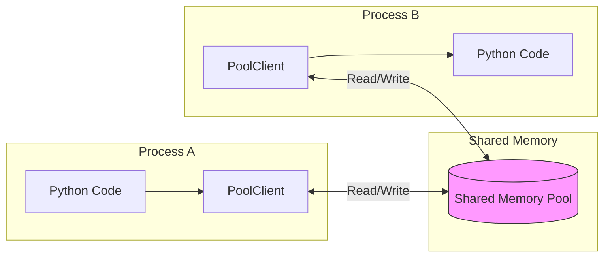
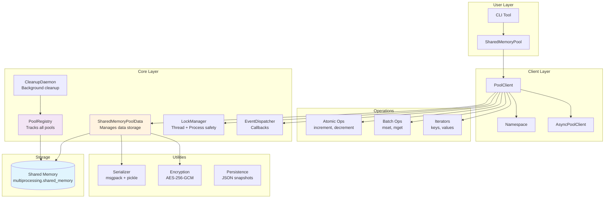
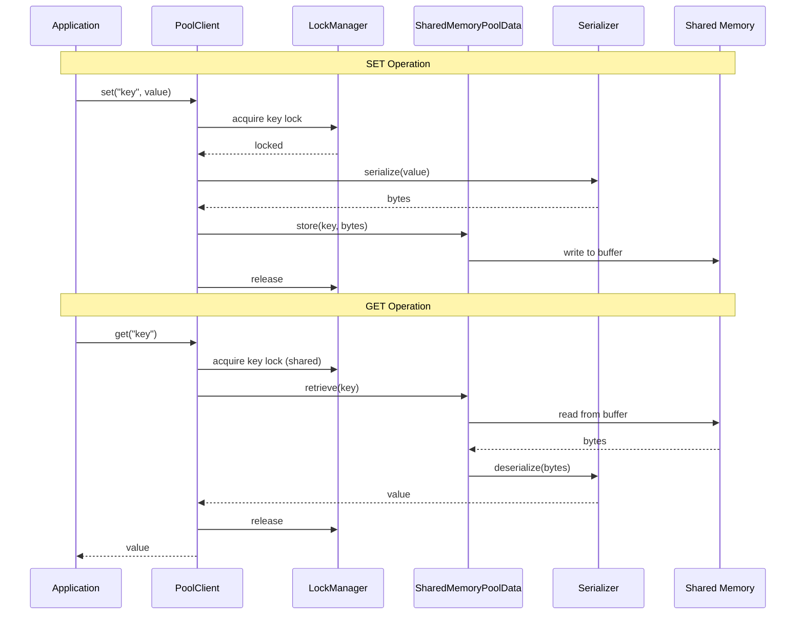
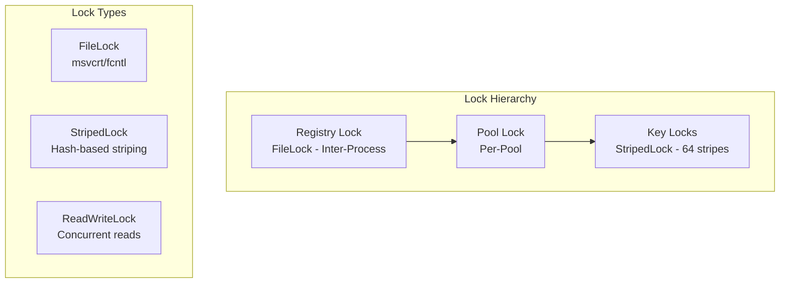
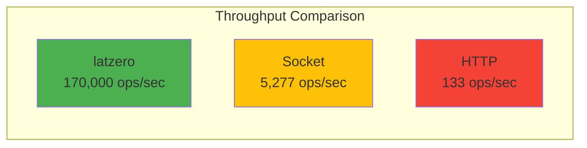
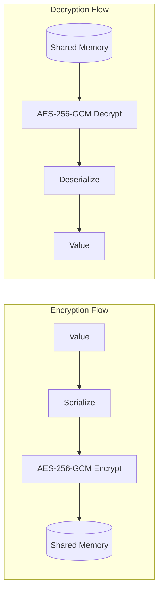

# latzero Documentation

> **Zero-latency, zero-fuss shared memory for Python — dynamic, encrypted, and insanely fast.**

---

## Table of Contents

1. [Overview](#overview)
2. [Installation](#installation)
3. [Quick Start](#quick-start)
4. [Architecture](#architecture)
5. [Core Concepts](#core-concepts)
6. [API Reference](#api-reference)
7. [Advanced Usage](#advanced-usage)
8. [CLI Reference](#cli-reference)
9. [Performance](#performance)
10. [Security](#security)
11. [Troubleshooting](#troubleshooting)

---

## Overview

**latzero** is a high-performance inter-process communication (IPC) library that uses shared memory to enable Python processes to exchange data at blazing speeds — faster than HTTP, faster than sockets, with zero network overhead.

### Key Features

| Feature | Description |
|---------|-------------|
| **Zero Latency** | Direct memory access, no serialization over network |
| **Dynamic Pools** | Memory expands automatically (1MB → 100MB) |
| **Multi-Client** | Multiple processes read/write simultaneously |
| **Encryption** | AES-256-GCM for sensitive data |
| **Auto Cleanup** | TTL-based expiration, orphan detection |
| **Type Safe** | Preserves Python types across processes |

### How It Works



---

## Installation

```bash
# Basic installation
pip install latzero

# With msgpack for 3-5x faster serialization
pip install latzero[fast]

# Development dependencies
pip install latzero[dev]
```

### Requirements

- Python 3.8+
- `cryptography` (for AES encryption)
- `psutil` (for process detection)
- `msgpack` (optional, for faster serialization)

---

## Quick Start

### Basic Example

```python
from latzero import SharedMemoryPool

# Create a pool
pool = SharedMemoryPool()
pool.create("myPool")

# Connect and use
with pool.connect("myPool") as client:
    # Set values
    client.set("user", {"name": "Alice", "age": 30})
    client.set("count", 42)
    
    # Get values
    user = client.get("user")
    print(user)  # {'name': 'Alice', 'age': 30}

# Pool auto-cleans when all clients disconnect
```

### Cross-Process Communication

**Process 1 (Producer):**
```python
from latzero import SharedMemoryPool

pool = SharedMemoryPool()
pool.create("shared_data")

with pool.connect("shared_data") as client:
    client.set("message", "Hello from Process 1!")
    input("Press Enter to exit...")  # Keep pool alive
```

**Process 2 (Consumer):**
```python
from latzero import SharedMemoryPool

pool = SharedMemoryPool()

with pool.connect("shared_data") as client:
    message = client.get("message")
    print(message)  # "Hello from Process 1!"
```

### Encrypted Pool

```python
from latzero import SharedMemoryPool

pool = SharedMemoryPool()
pool.create(
    "secure_pool",
    auth=True,
    auth_key="my_secret_key",
    encryption=True
)

with pool.connect("secure_pool", auth_key="my_secret_key") as client:
    client.set("secrets", {"api_key": "sk-xxx", "token": "abc123"})
    # Data is AES-256 encrypted in shared memory
```

---

## Architecture

### System Overview



### Data Flow



### Memory Layout

```
┌─────────────────────────────────────────────────────────────┐
│                    Shared Memory Segment                     │
├─────────────────────────────────────────────────────────────┤
│ Header (16 bytes)                                           │
│ ┌─────────────────┬─────────────────┐                       │
│ │ Data Length (8B)│ Capacity (8B)   │                       │
│ └─────────────────┴─────────────────┘                       │
├─────────────────────────────────────────────────────────────┤
│ Data Section (serialized dict)                              │
│ ┌───────────────────────────────────────────────────────┐   │
│ │ {                                                     │   │
│ │   "pool:key1": {"value": ..., "timestamp": ..., ...}, │   │
│ │   "pool:key2": {"value": ..., "timestamp": ..., ...}, │   │
│ │   ...                                                 │   │
│ │ }                                                     │   │
│ └───────────────────────────────────────────────────────┘   │
├─────────────────────────────────────────────────────────────┤
│ Available Space (for expansion)                             │
└─────────────────────────────────────────────────────────────┘

Initial Size: 1 MB
Max Size: 100 MB
Expansion: 2x when needed
```

### Locking Strategy



**Striped Lock Visualization:**
```
Keys:     [user:1] [user:2] [order:5] [cart:3] [user:9] ...
              │        │        │        │        │
Hash:         ▼        ▼        ▼        ▼        ▼
Stripes:  [Lock 0] [Lock 1] [Lock 2] ... [Lock 63]
              │        │
              └── Same lock (hash collision OK)
                  Up to 64 concurrent operations!
```

---

## Core Concepts

### Pools

A **pool** is a named shared memory region accessible by multiple processes.

```python
pool = SharedMemoryPool()

# Create with options
pool.create(
    name="myPool",           # Required: unique identifier
    auth=True,               # Require auth key to connect
    auth_key="secret",       # Authentication/encryption key
    encryption=True,         # AES-256 encrypt all data
    ttl=3600                 # Auto-destroy after 1 hour of inactivity
)

# Check if exists
pool.exists("myPool")  # True

# List all pools
pool.list_pools()  # {'myPool': {...info...}}

# Get stats
pool.stats()  # {'pool_count': 1, 'total_clients': 2, ...}

# Destroy (force cleanup)
pool.destroy("myPool")
```

### Clients

A **client** is a connection to a pool. Use context managers for automatic cleanup.

```python
# Context manager (recommended)
with pool.connect("myPool") as client:
    client.set("key", "value")
# Auto-disconnects here

# Manual management
client = pool.connect("myPool")
try:
    client.set("key", "value")
finally:
    client.disconnect()
```

### Keys and Values

Keys are strings. Values can be any pickleable Python object.

```python
# Supported types
client.set("string", "hello")
client.set("number", 42)
client.set("float", 3.14159)
client.set("bool", True)
client.set("list", [1, 2, 3])
client.set("dict", {"nested": {"deep": True}})
client.set("tuple", (1, 2, 3))
client.set("bytes", b"\x00\x01\x02")
client.set("none", None)

# Custom objects (if pickleable)
from dataclasses import dataclass

@dataclass
class User:
    name: str
    age: int

client.set("user", User("Alice", 30))
```

### Auto-Clean (TTL)

Keys can auto-expire after a specified time.

```python
# Expire after 60 seconds
client.set("session", {"user_id": 123}, auto_clean=60)

# Still exists
client.get("session")  # {'user_id': 123}

# After 60 seconds...
client.get("session")  # None (expired)
```

---

## API Reference

### SharedMemoryPool

The main entry point for creating and connecting to pools.

```python
class SharedMemoryPool:
    def __init__(self, auto_cleanup: bool = True):
        """
        Args:
            auto_cleanup: Start background cleanup daemon
        """
    
    def create(
        self,
        name: str,
        auth: bool = False,
        auth_key: str = '',
        encryption: bool = False,
        ttl: Optional[int] = None
    ) -> None:
        """Create a new pool."""
    
    def connect(
        self,
        name: str,
        auth_key: str = '',
        readonly: bool = False
    ) -> PoolClient:
        """Connect to an existing pool."""
    
    def destroy(self, name: str) -> bool:
        """Force destroy a pool."""
    
    def exists(self, name: str) -> bool:
        """Check if pool exists."""
    
    def list_pools(self) -> Dict[str, dict]:
        """List all active pools."""
    
    def stats(self) -> dict:
        """Get global statistics."""
```

### PoolClient

Client for interacting with a pool.

#### Basic Operations

```python
# Set a value (syncs immediately)
client.set(key: str, value: Any, auto_clean: Optional[int] = None) -> None

# Set without immediate sync (100x faster for batched writes)
client.set_fast(key: str, value: Any, auto_clean: Optional[int] = None) -> None

# Flush pending set_fast writes to shared memory
client.flush() -> None

# Get a value
client.get(key: str, default: Any = None) -> Any

# Delete a key
client.delete(key: str) -> bool

# Check existence
client.exists(key: str) -> bool
```

#### Atomic Operations

```python
# Increment (numeric values)
client.increment(key: str, delta: int = 1) -> int

# Decrement
client.decrement(key: str, delta: int = 1) -> int

# Append to list
client.append(key: str, value: Any) -> int  # returns new length

# Update dict
client.update(key: str, updates: dict) -> None
```

#### Batch Operations

```python
# Set multiple
client.mset(data: dict, auto_clean: Optional[int] = None) -> None

# Get multiple
client.mget(keys: List[str]) -> Dict[str, Any]

# Delete multiple
client.delete_many(keys: List[str]) -> int  # returns count deleted
```

#### Iteration

```python
# Get all keys
client.keys(pattern: Optional[str] = None) -> List[str]

# Get all values
client.values(pattern: Optional[str] = None) -> List[Any]

# Get key-value pairs
client.items(pattern: Optional[str] = None) -> List[Tuple[str, Any]]

# Paginated scan
cursor, keys = client.scan(cursor: int = 0, count: int = 100)
```

#### Info and Stats

```python
# Number of keys
client.size() -> int

# Pool statistics
client.stats() -> dict
# Returns: {
#     'name': 'myPool',
#     'clients': 2,
#     'key_count': 150,
#     'encryption': False,
#     'readonly': False,
#     'used_bytes': 50000,
#     'capacity_bytes': 1048576,
#     'utilization': 0.048,
#     'max_bytes': 104857600
# }
```

#### Events

```python
# Register event handler
client.on(event: str, callback: Callable) -> None

# Remove handler
client.off(event: str, callback: Optional[Callable] = None) -> None

# Available events:
# - "on_connect": Called when client connects
# - "on_disconnect": Called when client disconnects  
# - "on_update": Called on set (receives key, value)
# - "on_delete": Called on delete (receives key)
```

#### Namespaces

```python
# Create namespaced view
users = client.namespace("users")

users.set("123", {"name": "Alice"})  # Actually stores "users:123"
users.get("123")  # Retrieves "users:123"
users.keys()  # Only returns keys in this namespace
```

---

## Advanced Usage

### Async API

```python
import asyncio
from latzero import AsyncSharedMemoryPool

async def main():
    pool = AsyncSharedMemoryPool()
    await pool.create("asyncPool")
    
    async with await pool.connect("asyncPool") as client:
        await client.set("key", "value")
        result = await client.get("key")
        print(result)
        
        # Batch operations
        await client.mset({"a": 1, "b": 2, "c": 3})
        data = await client.mget(["a", "b", "c"])
        
        # Atomic operations
        await client.increment("counter")
    
    await pool.destroy("asyncPool")

asyncio.run(main())
```

### Persistence (Snapshots)

Save and restore pool data to disk.

```python
from latzero import PoolSnapshot, save_pool_snapshot, load_pool_snapshot

# Quick save
path = save_pool_snapshot("myPool")
print(f"Saved to {path}")

# Quick load
count = load_pool_snapshot("myPool", path)
print(f"Loaded {count} keys")

# Advanced usage
snapshot = PoolSnapshot("myPool", snapshot_dir="/custom/path")

# Save with custom path
snapshot.save("/backups/mypool_backup.json")

# List available snapshots
for snap in snapshot.list_snapshots():
    print(f"{snap['filename']} - {snap['key_count']} keys")

# Enable auto-snapshots (every 5 minutes)
snapshot.enable_auto_snapshot(interval=300)

# Cleanup old snapshots (keep last 10)
snapshot.cleanup_old_snapshots(keep=10)
```

### Event Hooks

```python
def on_update(key, value):
    print(f"Key updated: {key} = {value}")

def on_delete(key):
    print(f"Key deleted: {key}")

with pool.connect("myPool") as client:
    client.on("on_update", on_update)
    client.on("on_delete", on_delete)
    
    client.set("user", "Alice")  # Prints: Key updated: user = Alice
    client.delete("user")        # Prints: Key deleted: user
```

### Read-Only Clients

```python
# Create a read-only connection
reader = pool.connect("myPool", readonly=True)

# Can read
data = reader.get("key")

# Cannot write - raises ReadOnlyError
reader.set("key", "value")  # ReadOnlyError!
```

### Custom Serialization

```python
from latzero import configure_serializer

# Use msgpack (faster) with compression for large data
configure_serializer(
    prefer_msgpack=True,      # Use msgpack when possible
    compress_threshold=1024   # Compress data > 1KB
)

# Disable compression entirely
configure_serializer(compress_threshold=-1)
```

### Structured Logging

```python
from latzero import configure_logging

# Enable JSON logging
configure_logging(level="DEBUG", format="json")

# Simple format
configure_logging(level="INFO", format="simple")
```

---

## CLI Reference

latzero includes a command-line tool for pool management.

```bash
# List all active pools
latzero list
latzero list --json

# Inspect a specific pool
latzero inspect myPool
latzero inspect myPool --auth-key secret --max-keys 100 --json

# Get a value
latzero get myPool key
latzero get myPool key --json

# Set a value
latzero set myPool key '{"json": "value"}'
latzero set myPool key "string_value" --ttl 60

# Delete a key
latzero delete myPool key

# Clear all keys in a pool
latzero clear myPool
latzero clear myPool -y  # Skip confirmation

# Destroy a pool
latzero destroy myPool
latzero destroy myPool -y

# Cleanup orphaned shared memory
latzero cleanup

# Show global statistics
latzero stats
latzero stats --json
```

---

## Performance

### Benchmarks

| Operation | Latency | Throughput |
|-----------|---------|------------|
| `set_fast()` (batched) | ~0.01ms | **77,000+ ops/sec** |
| `get()` | ~0.003ms | **287,000+ ops/sec** |
| `set()` (immediate sync) | ~1.6ms | 600 ops/sec |
| Mixed (set_fast + get) | ~0.007ms | **146,000+ ops/sec** |

> **Note:** `set_fast()` batches writes and flushes every 100 operations for optimal throughput while maintaining durability.

### Comparison vs Other Methods

| Method | Throughput | Latency | Use Case |
|--------|------------|---------|----------|
| **latzero** | **170,000+ ops/sec** | **0.006ms** | Same-machine IPC |
| Raw Socket | 5,277 ops/sec | 0.15ms | Same/cross-machine |
| HTTP (Flask) | 133 ops/sec | 7.5ms | Cross-machine, REST APIs |

**latzero is 32x faster than Socket and 1,280x faster than HTTP!**



### High-Performance Pattern

For maximum throughput, use `set_fast()` with `flush()`:

```python
with pool.connect("myPool") as client:
    # Batch 1000 writes without syncing each time
    for i in range(1000):
        client.set_fast(f"key_{i}", {"data": i})
    
    # Flush to persist all writes at once
    client.flush()
    
    # Reads are always instant
    for i in range(1000):
        value = client.get(f"key_{i}")
```

### Optimization Tips

1. **Use `set_fast()` for bulk writes**: 100x faster than `set()`
2. **Use msgpack**: Install with `pip install latzero[fast]` for 3-5x faster serialization
3. **Batch operations**: Use `mset()`/`mget()` instead of multiple single calls
4. **Namespaces**: Organize keys with namespaces for cleaner code
5. **Disable compression**: For latency-critical small values, set `compress_threshold=-1`

---

## Security

### Encryption

When `encryption=True`, all data is encrypted with AES-256-GCM:



### Authentication

Pools can require an auth key:

```python
# Create protected pool
pool.create("secure", auth=True, auth_key="my_secret")

# Must provide correct key
pool.connect("secure", auth_key="my_secret")  # OK
pool.connect("secure", auth_key="wrong")      # AuthenticationError!
```

### Security Model

| Threat | Mitigation |
|--------|------------|
| Unauthorized access | Password-based authentication |
| Data leakage | AES-256-GCM encryption |
| Data tampering | GCM provides integrity checking |
| Memory persistence | Pools are ephemeral (auto-cleanup) |

---

## Troubleshooting

### Common Issues

**Pool not found after process exit**
```
PoolNotFound: Pool 'myPool' not found
```
Pools are ephemeral — they disappear when all clients disconnect. Keep at least one client connected, or use persistence snapshots.

**Permission denied on shared memory**
```
PermissionError: [Errno 13] Permission denied
```
On Linux, check `/dev/shm` permissions. On Windows, ensure no antivirus is blocking shared memory.

**Memory full error**
```
MemoryFullError: Cannot expand beyond 104857600 bytes
```
You've hit the 100MB limit per pool. Split data across multiple pools or reduce data size.

### Cleanup Commands

```bash
# Remove orphaned shared memory
latzero cleanup

# Force destroy all pools
python -c "
from latzero import SharedMemoryPool
pool = SharedMemoryPool()
for name in pool.list_pools():
    pool.destroy(name)
"
```

### Debug Logging

```python
from latzero import configure_logging
configure_logging(level="DEBUG", format="simple")
```

---

## License

MIT License - Created by BRAHMAI

https://brahmai.in
