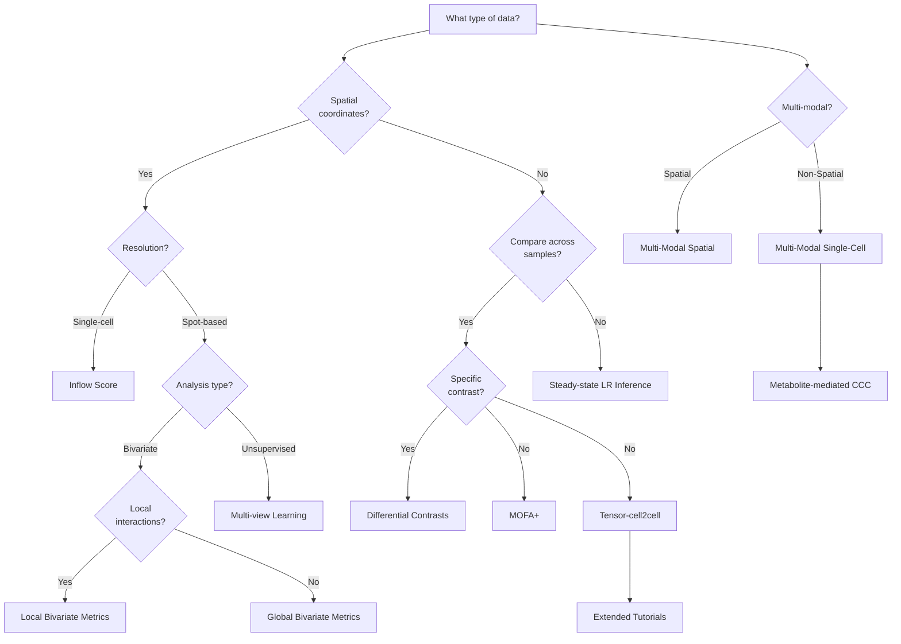

# LIANA+: an all-in-one cell-cell communication framework 

<!-- badges: start -->

<!-- badges: end -->

LIANA+ is a scalable framework that adapts and extends existing methods and knowledge to study cell-cell communication in single-cell, spatially-resolved, and multi-modal omics data. It is part of the [scverse ecosystem](https://github.com/scverse), and relies on [AnnData](https://github.com/scverse/anndata) & [MuData](https://github.com/scverse/mudata) objects as input.

## Contributions

We welcome suggestions, ideas, and contributions! Please do not hesitate to contact us, open issues, and check the [contributions guide](https://liana-py.readthedocs.io/en/latest/contributing.html).

## Vignettes
A set of extensive vignettes can be found in the [LIANA+ documentation](https://liana-py.readthedocs.io/en/latest/).

## Decision Tree

## API
For further information please check LIANA's [API documentation](https://liana-py.readthedocs.io/en/latest/api.html).

## Cite LIANA+:

Dimitrov D., Schäfer P.S.L, Farr E., Rodriguez Mier P., Lobentanzer S., Badia-i-Mompel P., Dugourd A., Tanevski J., Ramirez Flores R.O. and Saez-Rodriguez J. LIANA+ provides an all-in-one framework for cell–cell communication inference. Nat Cell Biol (2024). https://doi.org/10.1038/s41556-024-01469-w

Dimitrov, D., Türei, D., Garrido-Rodriguez M., Burmedi P.L., Nagai, J.S., Boys, C., Flores, R.O.R., Kim, H., Szalai, B., Costa, I.G., Valdeolivas, A., Dugourd, A. and Saez-Rodriguez, J. Comparison of methods and resources for cell-cell communication inference from single-cell RNA-Seq data. Nat Commun 13, 3224 (2022). https://doi.org/10.1038/s41467-022-30755-0

Please also consider citing any of the methods and/or resources that were particularly relevant for your research!

[uv]: https://github.com/astral-sh/uv
[scverse discourse]: https://discourse.scverse.org/
[issue tracker]: https://github.com/saezlab/liana-py/issues
[tests]: https://github.com/dbdimitrov/liana-py/actions/workflows/test.yaml
[documentation]: https://liana-py.readthedocs.io
[changelog]: https://liana-py.readthedocs.io/en/latest/release_notes.html
[api documentation]: https://liana-py.readthedocs.io/en/latest/api.html
[pypi]: https://pypi.org/project/liana
