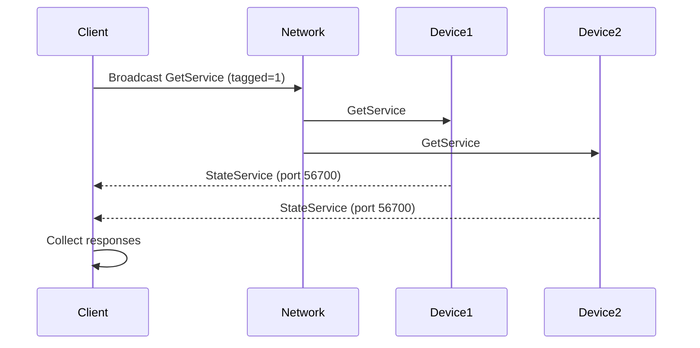
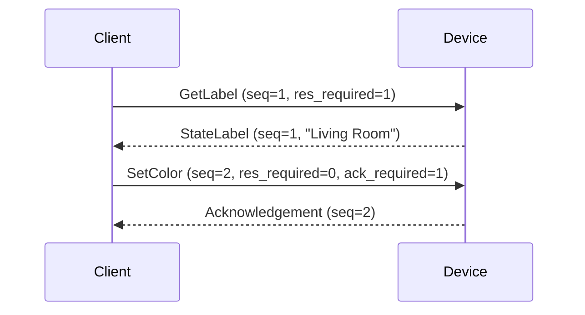
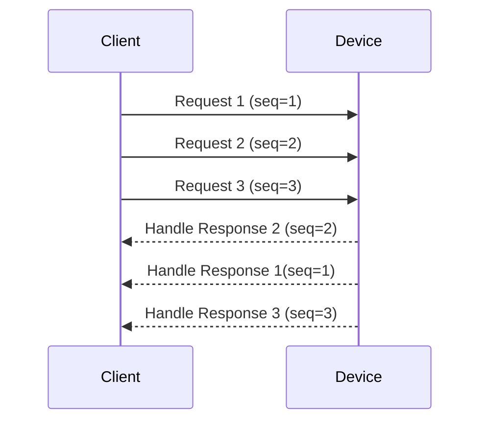

# Protocol Deep Dive

Understanding the LIFX protocol and how lifx implements it.

## Table of Contents

- [Protocol Overview](#protocol-overview)
- [Packet Structure](#packet-structure)
- [Message Flow](#message-flow)
- [Protocol Types](#protocol-types)
- [Code Generation](#code-generation)
- [Low-Level Usage](#low-level-usage)

## Protocol Overview

The LIFX LAN Protocol is a binary protocol using UDP for communication:

- **Port:** 56700 (UDP)
- **Packet Size:** Variable (36-byte header + payload)
- **Transport:** Unreliable (UDP) with application-level reliability
- **Discovery:** Broadcast-based (255.255.255.255)

### Protocol Layers

```
┌─────────────────────────────────────┐
│     Application (lifx API)        │
├─────────────────────────────────────┤
│  Packet Classes (packets.py)        │
├─────────────────────────────────────┤
│  Models (models.py)                 │
│  Serialization (serializer.py)      │
├─────────────────────────────────────┤
│  Header (header.py)                 │
├─────────────────────────────────────┤
│  UDP Transport                      │
└─────────────────────────────────────┘
```

## Packet Structure

### Header Format (36 bytes)

Every LIFX packet starts with a 36-byte header:

```python
from lifx.protocol.header import LifxHeader
from lifx.protocol.models import Serial

# Create serial number
serial = Serial.from_string("d073d5123456")

header = LifxHeader(
    size=64,                    # Total packet size (header + payload)
    protocol=1024,              # Protocol version (always 1024)
    addressable=True,           # Addressing mode
    tagged=False,               # Broadcast vs unicast
    source=0x12345678,          # Unique client ID
    target=serial.to_protocol(), # Device serial (8 bytes with padding)
    res_required=True,          # Expects response
    ack_required=False,         # Expects acknowledgment
    sequence=1,                 # Sequence number (0-255)
    pkt_type=101,               # Message type
)
```

### Header Fields

| Field | Size | Description |
|-------|------|-------------|
| size | 2 bytes | Total packet size including header |
| origin | 2 bits | Message origin (always 0) |
| tagged | 1 bit | Broadcast (1) or targeted (0) |
| addressable | 1 bit | Addressing mode (always 1) |
| protocol | 12 bits | Protocol number (always 1024) |
| source | 4 bytes | Unique client identifier |
| target | 8 bytes | Device MAC address (6 bytes + 2 padding) |
| reserved | 6 bytes | Reserved for future use |
| res_required | 1 bit | Response required flag |
| ack_required | 1 bit | Acknowledgment required flag |
| reserved | 6 bits | Reserved |
| sequence | 1 byte | Wrap-around sequence number |
| reserved | 8 bytes | Reserved |
| pkt_type | 2 bytes | Message type identifier |
| reserved | 2 bytes | Reserved |

### Payload

Variable-length payload following the header:

```python
# Example: SetColor payload (13 bytes)
{
    'reserved': 0,              # 1 byte
    'color': HSBK(...),         # 8 bytes (4 × uint16)
    'duration': 1000,           # 4 bytes (uint32, milliseconds)
}
```

## Message Flow

### Discovery Process



### Request-Response Pattern



### Concurrent Requests

lifx-async supports concurrent requests on a single connection:



## Protocol Types

### Color Representation

LIFX uses HSBK color space:

```python
from lifx import HSBK

color = HSBK(
    hue=180.0,         # 0-360 degrees
    saturation=1.0,    # 0.0-1.0
    brightness=0.75,   # 0.0-1.0
    kelvin=3500,       # 1500-9000
)
```

### Packet Categories

Packets are organized by category:

| Category | Purpose | Examples |
|----------|---------|----------|
| `Device` | Device-wide operations | GetLabel, SetLabel, GetPower |
| `Light` | Light control | SetColor, GetColor, SetWaveform |
| `MultiZone` | Strip/beam control | SetColorZones, GetColorZones |
| `Tile` | Tile device control | GetTileState64, SetTileState64 |

### Common Packet Types

```python
from lifx.protocol import packets

# Device packets
get_label = packets.Device.GetLabel()              # pkt_type=23
set_label = packets.Device.SetLabel(label="Room")  # pkt_type=24

# Light packets
get_color = packets.Light.Get()                    # pkt_type=101
set_color = packets.Light.SetColor(               # pkt_type=102
    color=HSBK(...),
    duration=1000
)

# MultiZone packets
get_zones = packets.MultiZone.GetColorZones(      # pkt_type=502
    start_index=0,
    end_index=8
)
```

## Code Generation

### From protocol.yml

lifx-async auto-generates protocol code from the official LIFX specification:

```yaml
# protocol.yml excerpt
packets:
  - name: SetColor
    pkt_type: 102
    category: light
    fields:
      - name: reserved
        type: uint8
      - name: color
        type: HSBK
      - name: duration
        type: uint32
```

Generates:

```python
# packets.py (generated)
@dataclass
class SetColor:
    PKT_TYPE: ClassVar[int] = 102
    CATEGORY: ClassVar[str] = "Light"

    reserved: int = 0
    color: HSBK = field(default_factory=HSBK)
    duration: int = 0

    def pack(self) -> bytes:
        # Serialization logic
        ...
```

### Regenerating Protocol Code

```bash
# Regenerate Python code
uv run python -m lifx.protocol.generator
```

### Generator Features

- **Type Safety:** Full type hints for all structures
- **Validation:** Bounds checking for protocol values
- **Documentation:** Docstrings from protocol comments
- **Filtering:** Excludes non-lighting categories (Button, Relay)

## Low-Level Usage

### Direct Protocol Usage

```python
from lifx.network.connection import DeviceConnection
from lifx.protocol import packets
from lifx.protocol.protocol_types import HSBK

async def low_level_control():
    # Create connection
    conn = DeviceConnection(
        serial="d073d5000001",
        ip="192.168.1.100"
    )

    # Create packet
    packet = packets.Light.SetColor(
        reserved=0,
        color=HSBK(hue=32768, saturation=65535, brightness=49151, kelvin=3500),
        duration=1000
    )

    # Send and receive response
    response = await conn.request(
        packet,
        timeout=2.0
    )

    print(f"Response: {response}")


```

## Protocol Constants

### Important Values

```python
# Ports
LIFX_UDP_PORT = 56700

# Protocol version
LIFX_PROTOCOL_VERSION = 1024

# Color limits
HUE_MAX = 65535        # Maps to 360°
SATURATION_MAX = 65535 # Maps to 100%
BRIGHTNESS_MAX = 65535 # Maps to 100%
KELVIN_MIN = 1500
KELVIN_MAX = 9000

# Timing
MAX_DURATION = 0xFFFFFFFF  # ~49 days in milliseconds
MIN_DURATION = 0           # Instant
```

## Next Steps

- [Connection Management](advanced-usage.md#connection-management) - Connection patterns
- [API Reference](../api/protocol.md) - Protocol API documentation
- [Architecture](../architecture/overview.md) - System architecture
