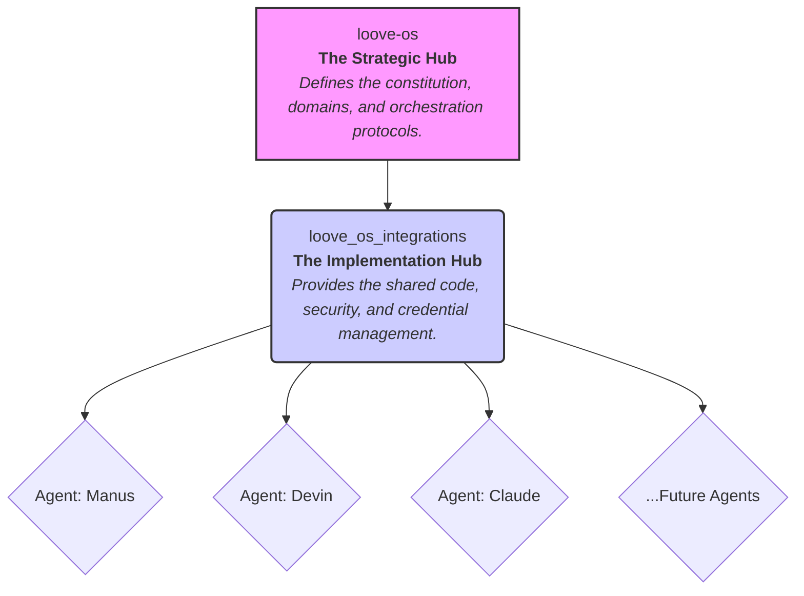

# LOOVE OS Integrations

**Governance:** This repository is governed by the principles and protocols defined in the [loove-os](https://github.com/joshroseman/loove-os) repository.

---

## 1. Purpose and Scope

This repository serves as the central **implementation and infrastructure hub** for the entire LOOVE organization. It provides the shared technical foundation for all AI agents (including Manus, Devin, and Claude) and automated workflows.

Its purpose is to house the practical, reusable code that brings the architectural vision of `loove-os` to life. While `loove-os` defines the "what" and "why," this repository provides the "how."

Key responsibilities of this repository include:

-   **Shared Credential Management:** Providing a single, secure framework for managing API keys and secrets for all agents and services.
-   **Core API Adapters:** Housing the primary integration code for platforms like Asana, Shopify, and Google Ads.
-   **Security and Authentication:** Implementing and managing authentication mechanisms, such as the organization-wide GitHub App.
-   **Reusable Tooling:** Offering common utilities for logging, monitoring, and workflow automation.
-   **Implementation Documentation:** Serving as the central knowledge base for all technical implementation details.

## 2. Architectural Relationship

This repository does not exist in isolation. It is the implementation layer of a broader, two-part architecture:

All code and infrastructure within this repository should align with the guiding principles and protocols established in the `loove-os` repository.

## 3. Core Components

-   **`/integration_validation`**: The cornerstone of the repository. A lightweight, scalable framework for credential management and integration testing used by all agents.
-   **`/src`**: Contains the core API adapters and integration logic for various platforms (Asana, Shopify, etc.).
-   **`/.github/workflows`**: Houses the GitHub Actions for CI/CD, security audits, and automated tasks like token rotation.
-   **`/docs`**: Centralized documentation for all technical implementations, security procedures, and developer onboarding.

## 4. How to Use This Repository

-   **For Agents (Manus, Devin, etc.):** This repository is the source for all shared utilities. When performing a task that requires credentials or a platform API, import the necessary modules from this repository (e.g., `from integration_validation.credential import EnvCredentialManager`).

-   **For Developers:** When building a new integration or a shared service, its code should be added here. Follow the existing patterns for structure, documentation, and testing. Ensure any new component is agent-agnostic.

## 5. Security and Credential Management

Security is a primary function of this repository. The `integration_validation` framework provides a standardized method for accessing credentials from GitHub Secrets.

-   **Golden Rule:** No secrets should ever be hard-coded. All secrets are managed via Organization-level or Repository-level GitHub Secrets.
-   **Authentication:** The primary method for authenticating with GitHub is the centralized **GitHub App**, the scaffolding for which is managed in this repository.

For complete details, see the [SECURITY.md](./SECURITY.md) file and the documentation within the `integration_validation` directory.

---

*This repository serves the entire LOOVE organization. Its name and content reflect its role as a foundational infrastructure layer for all current and future operations.*
