# LSAP: Language Server Agent Protocol

[](https://pypi.org/project/lsp-client/)
[](LICENSE)
[]()

**LSAP (Language Server Agent Protocol)** is an open protocol that defines how AI coding agents interact with Language Servers. It transforms low-level LSP capabilities into high-level, **Agent-Native** cognitive tools, empowering Coding Agents with **Repository-Scale Intelligence**.

As an **Orchestration Layer**, LSAP composes atomic LSP operations into semantic interfaces. This aligns with Agent cognitive logic, allowing them to focus on high-level "intent realization" rather than tedious "editor operations."

## Core Concept: Atomic Capabilities vs. Cognitive Capabilities

The core difference of LSAP lies in how it defines "capabilities." LSP is designed for editors, providing **Atomic** operations; whereas LSAP is designed for Agents, providing **Cognitive** capabilities.

- **LSP (Editor Perspective - Atomic)**:
  - Editors require very low-level instructions: `textDocument/definition` (jump), `textDocument/hover` (hover), `textDocument/documentSymbol` (outline).
  - **The Agent's Dilemma**: If an Agent uses LSP directly, it needs to execute a dozen interactions sequentially like a script (open file -> calculate offset -> request definition -> parse URI -> read file -> extract snippet) just to get a useful context.
- **LSAP (Agent Perspective - Cognitive)**:
  - LSAP encapsulates the complex chain of atomic operations above into a single semantic instruction.
  - **Example**: A single request to "Find all references" triggers background execution of symbol localization, reference search, and context extraction, returning a consolidated **Markdown Report**.

```mermaid
sequenceDiagram
    participant Agent as 🤖 Agent
    participant LSAP as 🧠 LSAP Layer
    participant LSP as 🔧 Language Server

    Note left of Agent: Goal: Find all references of "User"

    Agent->>LSAP: 1. Semantic Request (Locate + References)

    rect rgb(245, 245, 245)
        Note right of LSAP: ⚡️ Auto Orchestration
        LSAP->>LSAP: Parse Semantic Anchor (Fuzzy Match)
        LSAP->>LSP: textDocument/hover (Confirm Symbol Info)
        LSAP->>LSP: textDocument/references (Get Reference List)
        LSP-->>LSAP: Return List<Location>

        loop For each reference point
            LSAP->>LSP: textDocument/documentSymbol (Identify Function/Class)
            LSAP->>LSAP: Read Surrounding Code (Context Lines)
        end
    end

    LSAP-->>Agent: 2. Structured Markdown (Callers + Code Context)
```



## Protocol Specification

LSAP is a formally defined protocol with complete **JSON Schema** specifications for all interaction models. The [`schema/`](schema/) directory contains:

- **Request/Response Schemas**: Each capability (e.g., `definition`, `outline`, `rename`, etc.) has dedicated request and response schemas.
- **Field Definitions**: Precise specifications of input parameters, output fields, and data types.
- **Rendering Templates**: Standardized Markdown templates for formatting responses, ensuring consistent agent-facing outputs.

This formal specification ensures:

- **Type Safety**: Strong contracts between agents and LSAP implementations.
- **Interoperability**: Different LSAP implementations can be swapped without breaking agent workflows.
- **Extensibility**: New capabilities can be added following the established schema patterns.

Example schema files: `definition.request.json`, `definition.response.json`, `reference.request.json`, `reference.response.json`, etc.

## Interaction Examples

LSAP's interaction design strictly follows the **Markdown-First** principle: input expresses intent, and output provides refined knowledge.

### 1. Find References

**Request (using symbol path):**

```json
{
  "locate": {
    "file_path": "src/models.py",
    "locate": "User.validate"
  },
  "mode": "references",
  "max_items": 2
}
```

**Alternative: Request (using find pattern):**

```json
{
  "locate": {
    "file_path": "src/models.py",
    "find": "def validate<|>("
  },
  "mode": "references",
  "max_items": 2
}
```

**Response:**

````markdown
# References Found

Total references: 12 | Showing: 2

### src/auth/login.py:45

In `LoginHandler.authenticate` (`method`)

```python
44 | def authenticate(credentials):
45 |     if not User.validate(credentials):
46 |         raise AuthError()
```

### src/api/register.py:28

In `register_user` (`function`)

```python
27 | def register_user(new_user_data):
28 |     User.validate(new_user_data)
29 |     db.save(new_user_data)
```
````

### 2. File Outline

**Request:**

```json
{
  "file_path": "src/models.py",
  "mode": "outline"
}
```

**Response:**

````markdown
# Outline for `src/models.py`

## User (`class`)

### User.validate (`method`)

```python
def validate(data: dict) -> bool
```

---

Validate user data before saving.

### User.save (`method`)

```python
async def save(self) -> None
```

## Post (`class`)

### Post.publish (`method`)

```python
async def publish(self) -> PublishResult
```
````

### 3. Safe Rename (Two-Step Workflow)

**Request (Preview):**

```json
{
  "locate": {
    "file_path": "src/models.py",
    "locate": "User.validate"
  },
  "new_name": "validate_data",
  "mode": "rename_preview"
}
```

**Response:**

````markdown
# Rename Preview: `validate` → `validate_data`

ID: `abc123`
Summary: Affects 3 files and 8 occurrences.

## `src/models.py`

Line 15:

```diff
- def validate(data: dict) -> bool:
+ def validate_data(data: dict) -> bool:
```

## `src/auth/login.py`

Line 45:

```diff
- if not User.validate(credentials):
+ if not User.validate_data(credentials):
```

---

> [!TIP]
> To apply this rename, use `rename_execute` with `rename_id="abc123"`.
````

**Request (Execute):**

```json
{
  "rename_id": "abc123",
  "exclude_files": ["tests/**"],
  "mode": "rename_execute"
}
```

**Response:**

```markdown
# Rename Applied: `validate` → `validate_data`

Summary: Modified 3 files with 8 occurrences.

- `src/models.py`: 1 occurrence
- `src/auth/login.py`: 4 occurrences
- `src/api/register.py`: 3 occurrences

---

> [!NOTE]
> Rename completed successfully. Excluded files: `tests/**`.
> [!IMPORTANT]
> You must manually rename the symbol in the excluded files to maintain consistency.
```

## I'm Not Convinced...

### "LSAP Just Replicates LSP—What's Special?"

While LSP provides **atomic operations**, LSAP offers **composed capabilities** that brings more powerful functionalities.

For instance, the **[Relation API](docs/schemas/draft/relation.md)** (still in draft, but soon will be released) finds call paths between functions in a single request (handling traversal, cycles, and formatting), a task requiring complex orchestration in raw LSP.

LSAP centralizes these patterns, preventing agents from wasting tokens on orchestration and enabling advanced capabilities like architectural and impact analysis.

### "This Adds Complexity"

LSAP **centralizes** complexity. Instead of every Agent reimplementing LSP orchestration logic, LSAP provides a shared, optimized layer for these common patterns.

## Project Structure

- [`docs/`](docs/): Core protocol definitions and Schema documentation.
- [`python/`](python/): Python SDK reference implementation.
- [`typescript/`](typescript/): TypeScript type definitions and utility library.
- [`web/`](web/): Protocol documentation site.

## Alternatives

### Claude Code

Claude Code have native LSP supports now - Well [they don't](https://www.reddit.com/r/ClaudeAI/comments/1q6q9my/claudecode_v210_just_dropped/).

### Serena

[serena](https://github.com/oraios/serena) is a powerful coding agent toolkit providing semantic retrieval and editing capabilities.

### Other Projects

- [claude-code-lsps](https://github.com/Piebald-AI/claude-code-lsps)
- [cclsp](https://github.com/ktnyt/cclsp)
- [mcpls](https://github.com/bug-ops/mcpls)

## Contributing

We welcome contributions! Please see our [Contributing Guide](CONTRIBUTING.md) for details on development workflows and design principles.

## License

[MIT](LICENSE)
