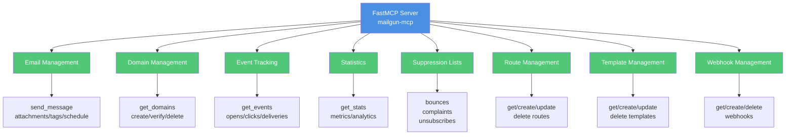

# Mailgun MCP Server

[](https://github.com/lesleslie/crackerjack)
[](https://www.python.org/downloads/)


This project implements a comprehensive MCP server for the Mailgun API using FastMCP.

## Features

The server provides access to the full Mailgun API including:

- **Email Management**: Send emails with attachments, tags, and scheduled delivery
- **Domain Management**: List, create, update, delete, and verify domains
- **Event Tracking**: Get email events (opens, clicks, deliveries, etc.)
- **Statistics**: Get email statistics and metrics
- **Suppression Lists**: Manage bounces, complaints, and unsubscribes
- **Route Management**: Create and manage routing rules
- **Template Management**: Create and manage email templates
- **Webhook Management**: Configure webhooks for event notifications

### Architecture Overview




## Usage

1. **Set environment variables:**

   ```bash
   export MAILGUN_API_KEY="YOUR_API_KEY"
   export MAILGUN_DOMAIN="YOUR_DOMAIN"
   ```

1. **Run the server:**

   ```bash
   uvicorn mailgun_mcp.main:app --reload
   ```

1. **Send a test email:**

   Use the Mailgun API to send an email via an HTTP POST request with proper authentication.
   For detailed instructions, see the Mailgun API documentation.

   

   ```mermaid
   flowchart TD
       Start([Client Request]) --> CheckCreds{API Key?<br/>Domain?}
       CheckCreds -->|No| Error([Return Error])
       CheckCreds -->|Yes| BuildPayload[Build email payload<br/>from/to/subject/html]
       BuildPayload --> HasAttachments{Has<br/>attachments?}
       HasAttachments -->|Yes| EncodeAttach[Base64 encode<br/>attachments]
       HasAttachments -->|No| HasTags{Has tags?}
       EncodeAttach --> HasTags
       HasTags -->|Yes| AddTags[Add tags to<br/>delivery:recipient]
       HasTags -->|No| IsScheduled{Scheduled<br/>delivery?}
       AddTags --> IsScheduled
       IsScheduled -->|Yes| SetSchedule[Set delivery<br/>time]
       IsScheduled -->|No| SendAPI[Send to Mailgun API]
       SetSchedule --> SendAPI
       SendAPI --> Success([Return message ID])

       style Error fill:#E74C3C,color:#fff
       style Success fill:#50C878,color:#fff
       style CheckCreds fill:#F39C12,color:#fff
       style HasAttachments fill:#F39C12,color:#fff
       style HasTags fill:#F39C12,color:#fff
       style IsScheduled fill:#F39C12,color:#fff
   ```

## Available Tools

The MCP server exposes the following tools:

### Email Management

- `send_message`: Send an email message via Mailgun API with support for:
  - Basic email fields (from, to, subject, text)
  - Optional fields (cc, bcc, html)
  - Attachments
  - Tags
  - Scheduled delivery

### Domain Management

- `get_domains`: Get a list of domains from Mailgun
- `get_domain`: Get information about a specific domain from Mailgun
- `create_domain`: Create a new domain in Mailgun
- `delete_domain`: Delete a domain from Mailgun
- `verify_domain`: Trigger verification of a domain in Mailgun

### Events & Logs

- `get_events`: Get email events (opens, clicks, deliveries, etc.) from Mailgun

### Statistics

- `get_stats`: Get email statistics from Mailgun

### Suppression Management

- `get_bounces`: Get email bounces from Mailgun
- `add_bounce`: Add an email address to the bounce list in Mailgun
- `delete_bounce`: Remove an email address from the bounce list in Mailgun
- `get_complaints`: Get email complaints from Mailgun
- `add_complaint`: Add an email address to the complaints list in Mailgun
- `delete_complaint`: Remove an email address from the complaints list in Mailgun
- `get_unsubscribes`: Get unsubscribed email addresses from Mailgun
- `add_unsubscribe`: Add an email address to the unsubscribes list in Mailgun
- `delete_unsubscribe`: Remove an email address from the unsubscribes list in Mailgun

### Route Management

- `get_routes`: Get routes from Mailgun
- `get_route`: Get a specific route from Mailgun
- `create_route`: Create a new route in Mailgun
- `update_route`: Update an existing route in Mailgun
- `delete_route`: Delete a route from Mailgun

### Template Management

- `get_templates`: Get a list of templates from Mailgun
- `get_template`: Get information about a specific template from Mailgun
- `create_template`: Create a new template in Mailgun
- `update_template`: Update an existing template in Mailgun
- `delete_template`: Delete a template from Mailgun

### Webhook Management

- `get_webhooks`: Get all webhooks from Mailgun
- `get_webhook`: Get a specific webhook from Mailgun
- `create_webhook`: Create or update a webhook in Mailgun
- `delete_webhook`: Delete a webhook from Mailgun
