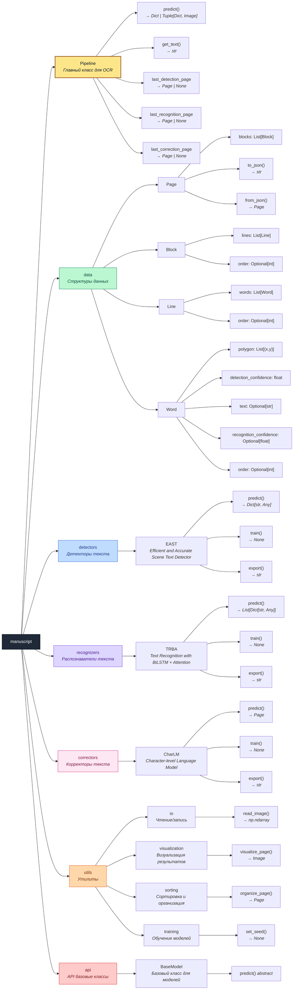

```mermaid
graph LR
    %% Main package
    manuscript[manuscript]

    %% Core modules
    manuscript --> Pipeline["Pipeline<br/><i>Главный класс для OCR</i>"]
    manuscript --> data["data<br/><i>Структуры данных</i>"]
    manuscript --> detectors["detectors<br/><i>Детекторы текста</i>"]
    manuscript --> recognizers["recognizers<br/><i>Распознаватели текста</i>"]
    manuscript --> correctors["correctors<br/><i>Корректоры текста</i>"]
    manuscript --> utils["utils<br/><i>Утилиты</i>"]
    manuscript --> api["api<br/><i>API базовые классы</i>"]

    %% Pipeline methods & properties
    Pipeline --> p_predict["predict()<br/><i>→ Dict | Tuple[Dict, Image]</i>"]
    Pipeline --> p_get_text["get_text()<br/><i>→ str</i>"]
    Pipeline --> p_last_det["last_detection_page<br/><i>→ Page | None</i>"]
    Pipeline --> p_last_rec["last_recognition_page<br/><i>→ Page | None</i>"]
    Pipeline --> p_last_corr["last_correction_page<br/><i>→ Page | None</i>"]

    %% Data structures
    data --> Page["Page"]
    data --> Block["Block"]
    data --> Line["Line"]
    data --> Word["Word"]
    
    Page --> page_blocks["blocks: List[Block]"]
    Page --> page_to_json["to_json()<br/><i>→ str</i>"]
    Page --> page_from_json["from_json()<br/><i>→ Page</i>"]
    Block --> block_lines["lines: List[Line]"]
    Block --> block_order["order: Optional[int]"]
    Line --> line_words["words: List[Word]"]
    Line --> line_order["order: Optional[int]"]
    Word --> word_polygon["polygon: List[(x,y)]"]
    Word --> word_det_conf["detection_confidence: float"]
    Word --> word_text["text: Optional[str]"]
    Word --> word_rec_conf["recognition_confidence: Optional[float]"]
    Word --> word_order["order: Optional[int]"]

    %% Detectors
    detectors --> EAST["EAST<br/><i>Efficient and Accurate Scene Text Detector</i>"]
    EAST --> east_predict["predict()<br/><i>→ Dict[str, Any]</i>"]
    EAST --> east_train["train()<br/><i>→ None</i>"]
    EAST --> east_export["export()<br/><i>→ str</i>"]

    %% Recognizers
    recognizers --> TRBA["TRBA<br/><i>Text Recognition with BiLSTM + Attention</i>"]
    TRBA --> trba_predict["predict()<br/><i>→ List[Dict[str, Any]]</i>"]
    TRBA --> trba_train["train()<br/><i>→ None</i>"]
    TRBA --> trba_export["export()<br/><i>→ str</i>"]

    %% Correctors
    correctors --> CharLM["CharLM<br/><i>Character-level Language Model</i>"]
    CharLM --> charlm_predict["predict()<br/><i>→ Page</i>"]
    CharLM --> charlm_train["train()<br/><i>→ None</i>"]
    CharLM --> charlm_export["export()<br/><i>→ str</i>"]

    %% Utils submodules
    utils --> io["io<br/><i>Чтение/запись</i>"]
    utils --> visualization["visualization<br/><i>Визуализация результатов</i>"]
    utils --> sorting["sorting<br/><i>Сортировка и организация</i>"]
    utils --> training["training<br/><i>Обучение моделей</i>"]

    %% IO functions
    io --> read_image["read_image()<br/><i>→ np.ndarray</i>"]

    %% Visualization functions
    visualization --> visualize_page["visualize_page()<br/><i>→ Image</i>"]

    %% Sorting functions
    sorting --> organize_page["organize_page()<br/><i>→ Page</i>"]

    %% Training functions
    training --> set_seed["set_seed()<br/><i>→ None</i>"]

    %% API
    api --> BaseModel["BaseModel<br/><i>Базовый класс для моделей</i>"]
    BaseModel --> base_predict["predict() <i>abstract</i>"]

    %% Styles
    style manuscript fill:#1f2937,color:#ffffff,stroke:#111827,stroke-width:2px
    style Pipeline fill:#fde68a,color:#111827,stroke:#92400e,stroke-width:2px

    style data fill:#bbf7d0,color:#064e3b,stroke:#047857
    style detectors fill:#bfdbfe,color:#1e3a8a,stroke:#2563eb
    style recognizers fill:#ddd6fe,color:#4c1d95,stroke:#7c3aed
    style correctors fill:#fce7f3,color:#831843,stroke:#db2777
    style utils fill:#fed7aa,color:#7c2d12,stroke:#ea580c
    style api fill:#fecaca,color:#7f1d1d,stroke:#dc2626
```
