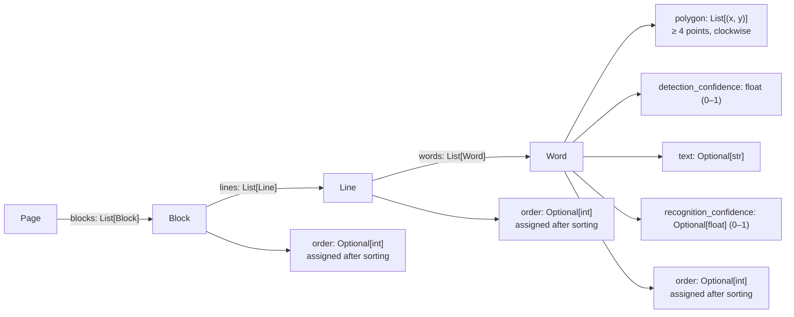

```mermaid
graph LR

    %% Entities
    Page[Page]
    Block[Block]
    Line[Line]
    Word[Word]

    %% Relations
    Page -->|"blocks: List[Block]"| Block
    Block -->|"lines: List[Line]"| Line
    Line -->|"words: List[Word]"| Word

    %% Word fields
    Word --> Wpoly["polygon: List[(x, y)]<br>≥ 4 points, clockwise"]
    Word --> Wdet["detection_confidence: float (0–1)"]
    Word --> Wtext["text: Optional[str]"]
    Word --> Wrec["recognition_confidence: Optional[float] (0–1)"]
    Word --> WordOrder["order: Optional[int]<br>assigned after sorting"]

    %% Line fields
    Line --> LineOrder["order: Optional[int]<br>assigned after sorting"]

    %% Block fields
    Block --> BlockOrder["order: Optional[int]<br>assigned after sorting"]
```