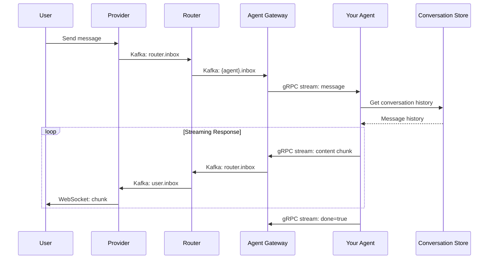

# March Agent SDK

Python SDK for building AI agents in the March AI platform. Provides agent registration, message handling via Kafka (through Agent Gateway), streaming responses, and integrations with LangGraph and Pydantic AI.

## Overview

The March Agent SDK (`march-agent`) enables developers to build AI agents that integrate with the March AI Management platform. Agents register themselves, receive messages through Kafka topics, and stream responses back to users.

### Key Features

- **Agent Registration**: Automatic registration with AI Inventory
- **Message Handling**: Decorator-based handlers with sender filtering
- **Response Streaming**: Chunked responses via Kafka/Centrifugo
- **Conversation History**: Access to message history via Conversation Store
- **LangGraph Integration**: HTTP-based checkpoint saver for LangGraph graphs
- **Pydantic AI Integration**: Persistent message history for Pydantic AI agents
- **Error Handling**: Automatic error responses to users on handler failures

## Architecture

```
┌─────────────────────────────────────────────────────────────────────────────┐
│                           Your Agent Application                            │
├─────────────────────────────────────────────────────────────────────────────┤
│                                                                             │
│    MarchAgentApp                                                            │
│    ├── register_me() → Agent                                                │
│    │   ├── @on_message decorator                                            │
│    │   └── streamer() → Streamer                                            │
│    └── run() → Start consume loop                                           │
│                                                                             │
│    Extensions:                                                              │
│    ├── HTTPCheckpointSaver (LangGraph)                                      │
│    └── PydanticAIMessageStore (Pydantic AI)                                 │
│                                                                             │
└──────────────────────────────────┬──────────────────────────────────────────┘
                                   │ gRPC (Kafka) + HTTP (APIs)
                                   ▼
┌─────────────────────────────────────────────────────────────────────────────┐
│                           Agent Gateway                                      │
├─────────────────────────────────────────────────────────────────────────────┤
│  gRPC: AgentStream (bidirectional)      HTTP: /s/{service}/* proxy          │
│  - Auth                                 - /s/ai-inventory/*                 │
│  - Subscribe/Unsubscribe                - /s/conversation-store/*           │
│  - Produce/Consume messages                                                 │
└─────────────────┬───────────────────────────────────┬───────────────────────┘
                  │                                   │
                  ▼                                   ▼
           ┌──────────────┐                  ┌────────────────────┐
           │    Kafka     │                  │   AI Inventory /   │
           │  {agent}.inbox │                │ Conversation Store │
           └──────────────┘                  └────────────────────┘
```

### Message Flow



## Installation

```bash
# Basic installation
pip install march-agent

# With LangGraph support
pip install march-agent[langgraph]

# With Pydantic AI support
pip install march-agent[pydantic]

# Development installation
pip install -e ".[dev]"
```

## Quick Start

```python
from march_agent import MarchAgentApp

# Initialize the app
app = MarchAgentApp(
    gateway_url="agent-gateway:8080",
    api_key="your-api-key"
)

# Register an agent
agent = app.register_me(
    name="my-assistant",
    about="A helpful AI assistant",
    document="Answers general questions and provides helpful information.",
    representation_name="My Assistant"
)

# Handle messages
@agent.on_message
async def handle_message(message, sender):
    # Access conversation history
    history = message.conversation.get_history(limit=10)

    # Stream response
    async with agent.streamer(message) as s:
        s.stream("Hello! ")
        s.stream("How can I help you today?")

# Run the agent
app.run()
```

## Configuration

### Environment Variables

| Variable | Description | Default |
|----------|-------------|---------|
| `GATEWAY_URL` | Agent Gateway endpoint | Required |
| `GATEWAY_API_KEY` | API key for authentication | Required |

### MarchAgentApp Options

```python
app = MarchAgentApp(
    gateway_url="agent-gateway:8080",    # Gateway endpoint
    api_key="key",                        # Authentication key
    heartbeat_interval=60,                # Heartbeat frequency (seconds)
    max_concurrent_tasks=100,             # Max concurrent message handlers
    error_message_template="...",         # Error message sent to users
)
```

## API Reference

### MarchAgentApp

Main application class for initializing and running agents.

```python
app = MarchAgentApp(gateway_url, api_key)

# Register an agent
agent = app.register_me(
    name="agent-name",           # Unique identifier (used for routing)
    about="Short description",   # Brief description for agent selection
    document="Full docs...",     # Detailed documentation
    representation_name="Name",  # Display name (optional)
    metadata={"key": "value"},   # Additional metadata (optional)
    category_name="my-category", # Category in kebab-case (optional, auto-created)
    tag_names=["tag-1", "tag-2"],# Tags in kebab-case (optional, auto-created)
    example_prompts=["Ask me anything"],  # Example prompts for users (optional)
    is_experimental=False,       # Mark as experimental (optional)
    force_update=False,          # Bypass content hash check (optional)
)

# Start consuming messages
app.run()  # Blocks until shutdown
```

### Agent

Handles message registration and response streaming.

```python
# Register message handler (all senders)
@agent.on_message
async def handle(message, sender):
    pass

# Filter by sender
@agent.on_message(senders=["user"])
async def handle_user(message, sender):
    pass

# Exclude sender
@agent.on_message(senders=["~other-agent"])
async def handle_not_other(message, sender):
    pass
```

### Message

Represents an incoming message with conversation context.

```python
@agent.on_message
async def handle(message, sender):
    message.id                  # Message ID
    message.conversation_id     # Conversation ID
    message.content             # Message content
    message.created_at          # Timestamp

    # Access conversation history
    message.conversation.get_history(limit=10)
```

### Streamer

Streams response chunks back to the user (or another agent).

```python
@agent.on_message
async def handle(message, sender):
    # Basic streaming
    async with agent.streamer(message) as s:
        s.stream("Chunk 1...")
        s.stream("Chunk 2...")

    # Streaming with options
    async with agent.streamer(
        message,
        send_to="user",      # or another agent name
        awaiting=True,       # Set awaiting_route to this agent
    ) as s:
        # Non-persisted content (not saved to DB)
        s.stream("Thinking...", persist=False, event_type="thinking")

        # Persisted content
        s.stream("Here's my response...")

        # Set response schema for forms
        s.set_response_schema({
            "type": "object",
            "properties": {
                "name": {"type": "string"}
            }
        })
```

## Extensions

### LangGraph Integration

Use `HTTPCheckpointSaver` to persist LangGraph state via the Conversation Store checkpoint API.

```python
from march_agent import MarchAgentApp
from march_agent.extensions.langgraph import HTTPCheckpointSaver
from langgraph.graph import StateGraph

app = MarchAgentApp(gateway_url="...", api_key="...")
checkpointer = HTTPCheckpointSaver(app=app)

# Define your LangGraph
graph = StateGraph(MyState)
# ... add nodes and edges ...
compiled = graph.compile(checkpointer=checkpointer)

agent = app.register_me(name="langgraph-agent", ...)

@agent.on_message
async def handle(message, sender):
    config = {"configurable": {"thread_id": message.conversation_id}}

    async with agent.streamer(message) as s:
        # Graph state persists across messages via checkpointer
        result = await compiled.ainvoke(
            {"messages": [message.content]},
            config
        )
        s.stream(result["messages"][-1])

app.run()
```

### Pydantic AI Integration

Use `PydanticAIMessageStore` to persist Pydantic AI message history.

```python
from march_agent import MarchAgentApp
from march_agent.extensions.pydantic_ai import PydanticAIMessageStore
from pydantic_ai import Agent as PydanticAgent

app = MarchAgentApp(gateway_url="...", api_key="...")
store = PydanticAIMessageStore(app=app)

my_llm = PydanticAgent('openai:gpt-4o', system_prompt="You are helpful.")

agent = app.register_me(name="pydantic-agent", ...)

@agent.on_message
async def handle(message, sender):
    # Load previous messages
    history = await store.load(message.conversation_id)

    async with agent.streamer(message) as s:
        async with my_llm.run_stream(
            message.content,
            message_history=history
        ) as result:
            async for chunk in result.stream_text():
                s.stream(chunk)

        # Save updated history
        await store.save(message.conversation_id, result.all_messages())

app.run()
```

## Advanced Usage

### Inter-Agent Communication

Agents can send messages to other agents using the `send_to` parameter.

```python
@agent.on_message(senders=["user"])
async def handle_user(message, sender):
    # Forward to specialist agent
    async with agent.streamer(message, send_to="specialist-agent") as s:
        s.stream("Forwarding your question to the specialist...")

@agent.on_message(senders=["specialist-agent"])
async def handle_specialist(message, sender):
    # Respond to user with specialist's answer
    async with agent.streamer(message, send_to="user") as s:
        s.stream(f"The specialist says: {message.content}")
```

### Dynamic Forms with Response Schema

Request structured input from users using JSON Schema forms.

```python
@agent.on_message
async def handle(message, sender):
    async with agent.streamer(message, awaiting=True) as s:
        s.stream("Please fill out this form:")
        s.set_response_schema({
            "type": "object",
            "title": "Contact Information",
            "properties": {
                "name": {"type": "string", "title": "Full Name"},
                "email": {"type": "string", "format": "email"},
                "message": {"type": "string", "title": "Message"}
            },
            "required": ["name", "email"]
        })

# When user submits form, message.content will be JSON
@agent.on_message
async def handle_form(message, sender):
    import json
    data = json.loads(message.content)
    name = data.get("name")
    # Process form data...
```

### Error Handling

Customize error handling behavior:

```python
app = MarchAgentApp(
    gateway_url="...",
    api_key="...",
    error_message_template="Sorry, something went wrong. Please try again."
)

agent = app.register_me(...)

# Disable automatic error responses
agent.send_error_responses = False

@agent.on_message
async def handle(message, sender):
    try:
        # Your logic
        pass
    except Exception as e:
        # Custom error handling
        async with agent.streamer(message) as s:
            s.stream(f"I encountered an issue: {str(e)}")
```

## Project Structure

```
ai-framework/
├── src/
│   └── march_agent/
│       ├── __init__.py           # Package exports
│       ├── app.py                # MarchAgentApp
│       ├── agent.py              # Agent class
│       ├── message.py            # Message class
│       ├── streamer.py           # Streamer class
│       ├── conversation.py       # Conversation helper
│       ├── conversation_client.py # HTTP client for Conversation Store
│       ├── checkpoint_client.py  # HTTP client for checkpoints
│       ├── agent_state_client.py # HTTP client for agent state
│       ├── gateway_client.py     # gRPC client for Agent Gateway
│       ├── gateway_pb2.py        # Generated protobuf
│       ├── gateway_pb2_grpc.py   # Generated gRPC stubs
│       ├── heartbeat.py          # Heartbeat manager
│       ├── exceptions.py         # Custom exceptions
│       └── extensions/
│           ├── __init__.py
│           ├── langgraph.py      # LangGraph HTTPCheckpointSaver
│           └── pydantic_ai.py    # Pydantic AI MessageStore
├── tests/
├── pyproject.toml
└── README.md
```

## Development

### Running Tests

```bash
# Install dev dependencies
pip install -e ".[dev]"

# Run tests with coverage
pytest

# Run specific test file
pytest tests/test_agent.py -v
```

### Regenerating Protobuf

If the gateway.proto file changes:

```bash
python -m grpc_tools.protoc \
    -I../../agent-gateway/proto \
    --python_out=src/march_agent \
    --grpc_python_out=src/march_agent \
    ../../agent-gateway/proto/gateway.proto
```

## Dependencies

| Package | Purpose |
|---------|---------|
| grpcio | gRPC communication with Agent Gateway |
| grpcio-tools | Protobuf compilation |
| protobuf | Message serialization |
| requests | Sync HTTP for registration |
| aiohttp | Async HTTP for runtime operations |

### Optional Dependencies

| Package | Install Command | Purpose |
|---------|-----------------|---------|
| langgraph | `pip install march-agent[langgraph]` | LangGraph checkpoint integration |
| pydantic-ai | `pip install march-agent[pydantic]` | Pydantic AI message history |
