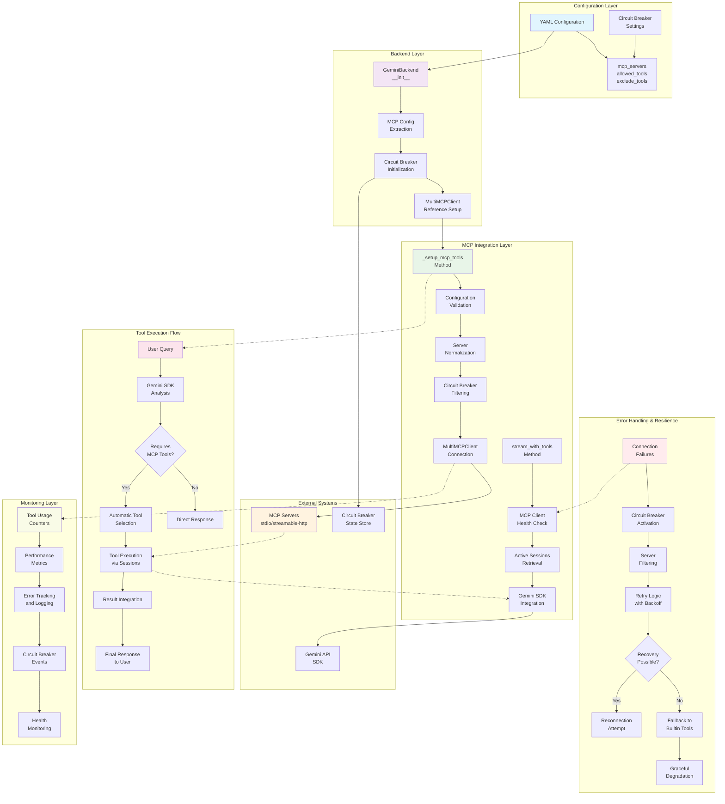
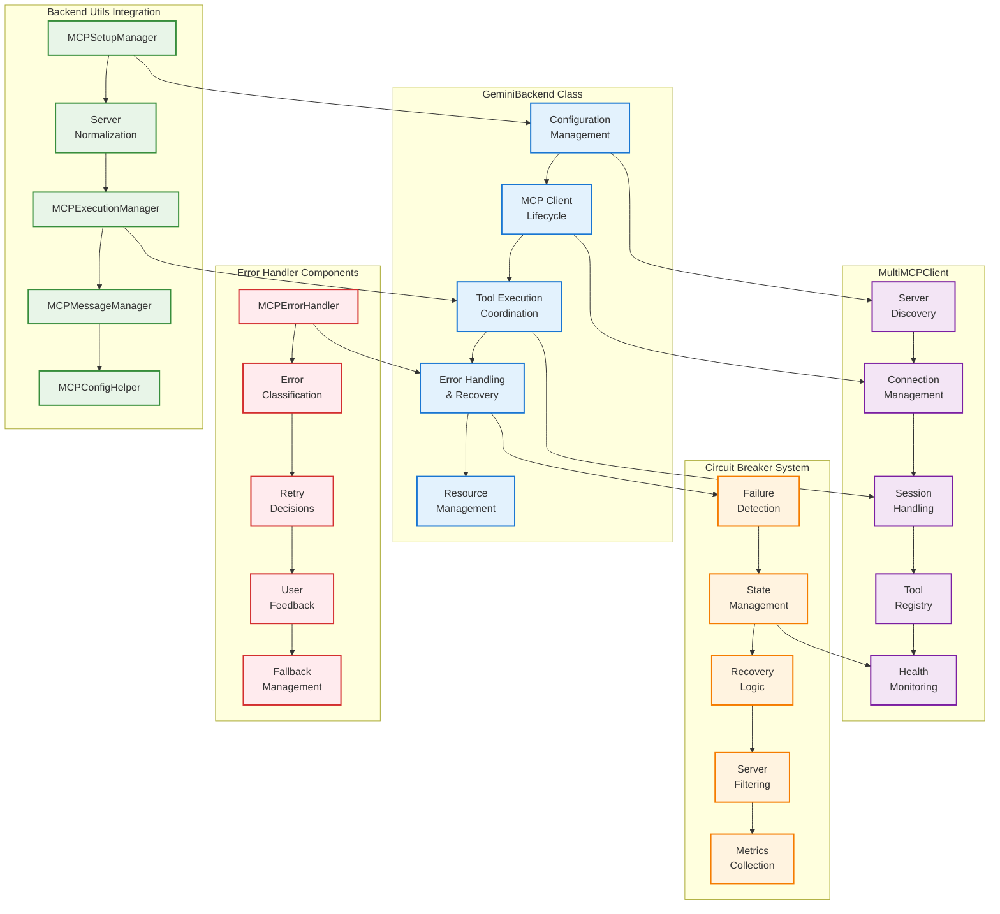
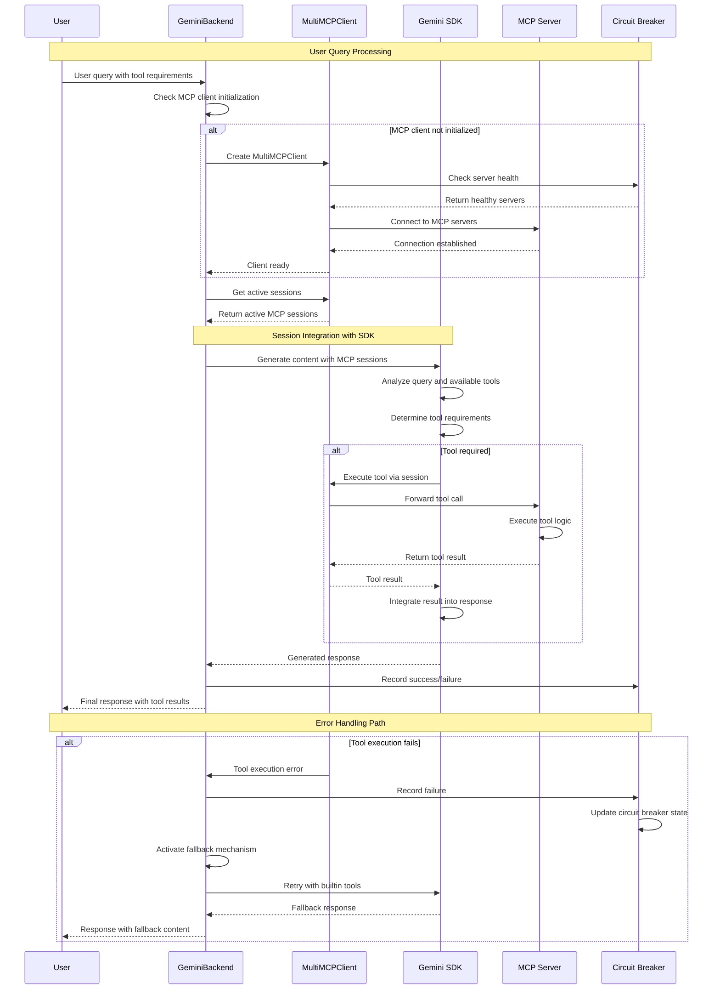
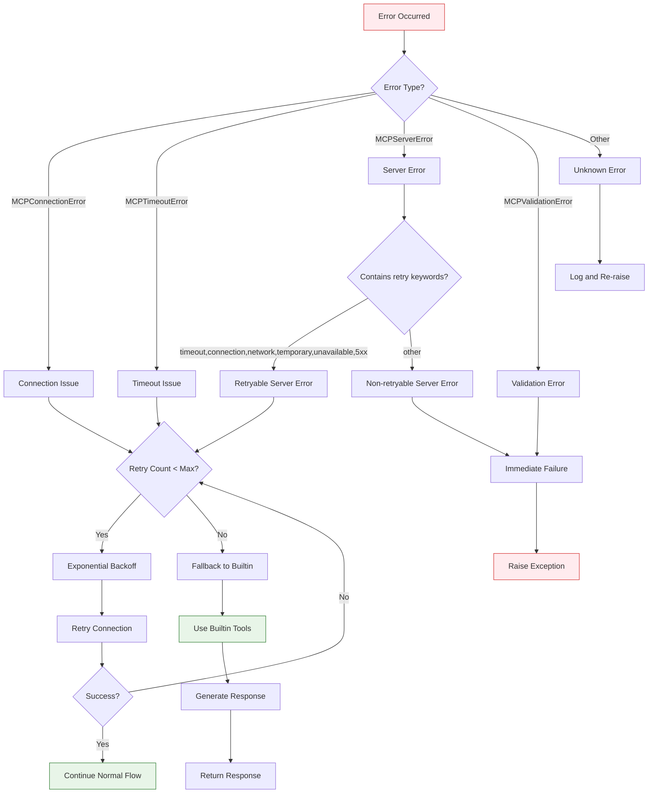

 Gemini MCP Integration Analysis

## Executive Summary

Gemini uses MCP sessions as tools by passing an MCP client session directly to the Gemini SDK, which automatically manages the session and enables seamless tool calling with MCP servers

Key features of the Gemini MCP integration include:

- **Session-based tool execution**: MCP tools are exposed as sessions to the Gemini SDK, which handles tool calling automatically
- **Robust error handling**: Circuit breaker patterns, exponential backoff retry logic, and graceful degradation
- **Resource management**: Proper connection lifecycle management with async context managers
- **Comprehensive monitoring**: Tool usage tracking, performance metrics, and detailed logging
- **Fallback mechanisms**: Automatic fallback to builtin tools when MCP connections fail

This approach provides a more streamlined user experience compared to manual tool calling, as the SDK handles the complexity of determining when and how to use tools based on the conversation context.

## MCP Integration Architecture in Gemini Backend

### Architecture Overview

The Gemini backend implements a sophisticated layered architecture for MCP integration. The visual diagrams below illustrate:

1. **Architecture Overview**: Complete system architecture showing all layers and data flow
2. **Detailed Component Architecture**: Internal structure of key components
3. **Session-Based Tool Calling Process**: Sequence diagram of tool execution flow
4. **Circuit Breaker State Machine**: State transitions for fault tolerance
5. **Error Handling Decision Tree**: Logic flow for different error scenarios
6. **Data Flow Architecture**: End-to-end data flow from input to output

These diagrams provide a comprehensive visual understanding of how MCP tools are integrated, configured, and executed within the Gemini backend:



### Detailed Component Architecture



### Session-Based Tool Calling Process



### Circuit Breaker State Machine

```mermaid
stateDiagram-v2
    [*] --> Closed: Initialization
    Closed --> Open: Failure threshold reached
    Open --> HalfOpen: Recovery timeout
    HalfOpen --> Closed: Test request succeeds
    HalfOpen --> Open: Test request fails

    state Closed as "Closed State\n✅ All servers available\n✅ Normal operation"
    state Open as "Open State\n❌ Server disabled\n❌ Requests blocked"
    state HalfOpen as "Half-Open State\n⚠️ Testing recovery\n⚠️ Limited requests"
```

### Error Handling Decision Tree



### Data Flow Architecture

```mermaid
graph LR
    subgraph "Input Sources"
        Y1[YAML Config<br/>mcp_servers]
        Y2[Environment<br/>Variables]
        Y3[Runtime<br/>Parameters]
    end

    subgraph "Configuration Processing"
        C1[MCPConfigValidator<br/>validate_backend_mcp_config]
        C2[MCPSetupManager<br/>normalize_mcp_servers]
        C3[MCPConfigHelper<br/>build_circuit_breaker_config]
    end

    subgraph "Backend Integration"
        B1[GeminiBackend<br/>__init__]
        B2[_setup_mcp_tools]
        B3[stream_with_tools]
        B4[Error Handlers]
    end

    subgraph "MCP Layer"
        M1[MultiMCPClient<br/>create_and_connect]
        M2[MCPClient<br/>Individual Servers]
        M3[Active Sessions<br/>Tool Registry]
    end

    subgraph "Gemini SDK"
        G1[generate_content_stream<br/>with sessions]
        G2[Automatic Tool<br/>Detection]
        G3[Tool Result<br/>Integration]
    end

    subgraph "Output"
        O1[Stream Chunks<br/>to UI]
        O2[Tool Results<br/>Integrated]
        O3[Error Messages<br/>Fallback Content]
    end

    %% Data flow connections
    Y1 --> C1
    Y2 --> C1
    Y3 --> B1

    C1 --> C2
    C2 --> C3
    C3 --> B1

    B1 --> B2
    B2 --> M1
    M1 --> M2
    M2 --> M3

    B3 --> G1
    M3 -.-> G1
    G1 --> G2
    G2 --> G3

    G3 --> O1
    B4 --> O3
    M2 -.-> O2

    %% Styling
    classDef input fill:#e3f2fd,stroke:#1976d2,stroke-width:2px
    classDef config fill:#f3e5f5,stroke:#7b1fa2,stroke-width:2px
    classDef backend fill:#fff3e0,stroke:#f57c00,stroke-width:2px
    classDef mcp fill:#e8f5e8,stroke:#388e3c,stroke-width:2px
    classDef sdk fill:#fce4ec,stroke:#c2185b,stroke-width:2px
    classDef output fill:#f9fbe7,stroke:#689f38,stroke-width:2px

    class Y1,Y2,Y3 input
    class C1,C2,C3 config
    class B1,B2,B3,B4 backend
    class M1,M2,M3 mcp
    class G1,G2,G3 sdk
    class O1,O2,O3 output
```



### Initialization and Configuration Handling

The Gemini backend's MCP integration begins in the `__init__` method, where MCP-related configuration is extracted and validated:

```python
def __init__(self, api_key: Optional[str] = None, **kwargs):
    # MCP integration setup
    self.mcp_servers = kwargs.pop("mcp_servers", [])
    self.allowed_tools = kwargs.pop("allowed_tools", None)
    self.exclude_tools = kwargs.pop("exclude_tools", None)
    self._mcp_client: Optional[MultiMCPClient] = None
    self._mcp_initialized = False
```

The initialization process includes:

1. **Configuration extraction**: MCP servers, tool filtering parameters, and circuit breaker settings
2. **State initialization**: Client references, monitoring counters, and connection flags
3. **Circuit breaker setup**: Optional circuit breaker initialization for fault tolerance
4. **Validation preparation**: Setting up for later configuration validation

### MCP Client Setup Through `_setup_mcp_tools()`

The `_setup_mcp_tools()` method handles the complex process of establishing MCP connections:

```python
async def _setup_mcp_tools(self, agent_id: Optional[str] = None) -> None:
    # Configuration validation
    if MCPConfigValidator is not None:
        validator = MCPConfigValidator()
        validated_config = validator.validate_backend_mcp_config(backend_config)

    # Server normalization and filtering
    normalized_servers = self._normalize_mcp_servers()
    filtered_servers = self._apply_mcp_tools_circuit_breaker_filtering(normalized_servers)

    # Client creation with retry logic
    self._mcp_client = await MultiMCPClient.create_and_connect(
        filtered_servers,
        timeout_seconds=30,
        allowed_tools=allowed_tools,
        exclude_tools=exclude_tools
    )
```

Key aspects of the setup process:

- **Validation**: Uses `MCPConfigValidator` to ensure configuration correctness
- **Normalization**: Converts various server configuration formats to standardized dictionaries
- **Circuit breaker filtering**: Removes servers that are currently failing based on circuit breaker state
- **Connection establishment**: Creates and connects to MCP servers with timeout handling
- **Success tracking**: Records successful connections for circuit breaker management

### Session-Based Tool Execution in `stream_with_tools()`

The core of the Gemini MCP integration lies in the session-based approach within `stream_with_tools()`:

```python
# Reuse active sessions from MultiMCPClient
mcp_sessions = self._mcp_client.get_active_sessions()
session_config = dict(config)
session_config["tools"] = mcp_sessions

# SDK handles automatic tool calling
stream = await client.aio.models.generate_content_stream(
    model=model_name, contents=full_content, config=session_config
)
```

This approach differs significantly from manual tool calling:

- **Automatic execution**: The Gemini SDK determines when tools are needed and calls them automatically
- **Session reuse**: Active MCP sessions are passed directly to the SDK
- **Transparent integration**: Tool results are seamlessly integrated into the response stream
- **No manual parsing**: No need to parse tool calls or manage execution manually

### Relationship with MultiMCPClient

The Gemini backend relies heavily on the `MultiMCPClient` from `mcp_tools.client`:

- **Connection management**: Handles multiple MCP server connections simultaneously
- **Session provision**: Provides active sessions that can be used by the Gemini SDK
- **Tool filtering**: Applies allowed/excluded tool filters at the client level
- **Health monitoring**: Tracks connection status and provides server information

## Specific mcp_tools Utilities Used

### Used Utilities from backend_utils.py

The Gemini backend leverages several utilities from the `mcp_tools.backend_utils` module:

#### MCPSetupManager
- **Purpose**: Server configuration normalization and validation
- **Usage**: `normalize_mcp_servers()` method converts various server config formats
- **Implementation**: Validates required fields and ensures consistent structure

#### MCPExecutionManager
- **Purpose**: Function execution with retry logic (used in fallback scenarios)
- **Usage**: `execute_function_with_retry()` for manual tool calling when sessions fail
- **Features**: Exponential backoff, circuit breaker integration, statistics tracking

#### MCPErrorHandler
- **Purpose**: Standardized error handling and classification
- **Usage**: `get_error_details()`, `is_transient_error()`, `log_error()` methods
- **Benefits**: Consistent error messaging and retry decision logic

#### MCPCircuitBreakerManager
- **Purpose**: Circuit breaker operations for fault tolerance
- **Usage**: Server filtering, success/failure recording, event management
- **Methods**: `apply_circuit_breaker_filtering()`, `record_success()`, `record_failure()`

#### MCPMessageManager
- **Purpose**: Message history management
- **Usage**: `trim_message_history()` to prevent unbounded memory growth
- **Implementation**: Preserves system messages while limiting total message count

#### MCPConfigHelper
- **Purpose**: Configuration validation and circuit breaker setup
- **Usage**: `build_circuit_breaker_config()` for creating circuit breaker configurations
- **Features**: Transport-type-specific configurations, validation support

### Used Exceptions from exceptions.py

The Gemini backend imports and handles all MCP exception types:

- **MCPError**: Base exception for all MCP-related errors
- **MCPConnectionError**: Connection establishment failures
- **MCPTimeoutError**: Operation timeout errors
- **MCPServerError**: Server-side errors and failures
- **MCPValidationError**: Configuration and input validation errors
- **MCPAuthenticationError**: Authentication and authorization failures
- **MCPResourceError**: Resource availability and access errors


### Circuit Breaker Integration

The circuit breaker integration provides fault tolerance:

```python
# Initialization
from ..mcp_tools.circuit_breaker import MCPCircuitBreaker
mcp_tools_config = MCPConfigHelper.build_circuit_breaker_config("mcp_tools")
self._mcp_tools_circuit_breaker = MCPCircuitBreaker(mcp_tools_config)

# Usage
filtered_servers = self._apply_mcp_tools_circuit_breaker_filtering(servers)
await self._record_mcp_tools_success(connected_servers)
await self._record_mcp_tools_failure(failed_servers, error_message)
```

## Configuration Flow

### mcp_servers Parameter Handling

The configuration flow begins with the `mcp_servers` parameter in the constructor:

1. **Extraction**: Retrieved from kwargs during backend initialization
2. **Storage**: Stored as instance variable for later use
3. **Validation**: Passed through `MCPConfigValidator` if available
4. **Normalization**: Converted to standardized format using `MCPSetupManager`

### Configuration Validation Using MCPConfigValidator

```python
if MCPConfigValidator is not None:
    validator = MCPConfigValidator()
    validated_config = validator.validate_backend_mcp_config({
        "mcp_servers": self.mcp_servers,
        "allowed_tools": self.allowed_tools,
        "exclude_tools": self.exclude_tools
    })
```

The validation process:
- **Schema validation**: Ensures required fields are present
- **Type checking**: Validates data types and formats
- **Security validation**: Checks security configurations
- **Tool filtering validation**: Validates allowed/excluded tool lists

### Server Normalization and Filtering

Server configurations undergo multiple processing steps:

1. **Normalization**: Convert various formats (dict, list) to standardized list of dictionaries
2. **Required field validation**: Ensure 'type' and 'name' fields are present
3. **Circuit breaker filtering**: Remove servers that are currently failing
4. **Transport type separation**: Separate stdio/streamable-http from http servers

### Tool Filtering with allowed_tools and exclude_tools

Tool filtering is applied at multiple levels:

- **Configuration level**: Specified in YAML configuration
- **Validation level**: Validated by `MCPConfigValidator`
- **Client level**: Applied when creating `MultiMCPClient`
- **Session level**: Enforced when sessions are created

## Session-Based vs Manual Tool Calling

### Session-Based Approach

The Gemini backend's session-based approach offers several advantages:

**Automatic Tool Selection**:
```python
# Sessions are passed to SDK, which handles tool calling automatically
session_config["tools"] = mcp_sessions
stream = await client.aio.models.generate_content_stream(
    model=model_name, contents=full_content, config=session_config
)
```

**Benefits**:
- No manual tool call parsing required
- SDK determines optimal tool usage timing
- Seamless integration of tool results into response
- Reduced complexity in backend implementation

### Automatic Tool Calling

The Gemini SDK handles tool calling automatically:

1. **Context analysis**: SDK analyzes conversation context to determine tool needs
2. **Tool selection**: Chooses appropriate tools from available sessions
3. **Execution**: Calls tools and integrates results
4. **Response generation**: Incorporates tool results into final response

### Fallback Mechanisms

When MCP sessions fail, the system gracefully falls back:

```python
except (MCPConnectionError, MCPTimeoutError, MCPServerError, MCPError) as e:
    # Emit user-friendly error message
    async for chunk in self._handle_mcp_error_and_fallback(e):
        yield chunk

    # Fallback to non-MCP streaming
    manual_config = dict(config)
    if all_tools:
        manual_config["tools"] = all_tools
```

**Fallback sequence**:
1. MCP session failure detected
2. User notification via stream chunks
3. Fallback to builtin tools (search, code execution)
4. Continue with standard Gemini capabilities


## Error Handling and Resilience

### Circuit Breaker Implementation

The circuit breaker prevents cascading failures:

```python
class MCPCircuitBreaker:
    def should_skip_server(self, server_name: str) -> bool:
        # Check if server should be skipped due to failures

    def record_success(self, server_name: str) -> None:
        # Record successful operation

    def record_failure(self, server_name: str) -> None:
        # Record failure and potentially open circuit
```

**Circuit breaker states**:
- **Closed**: Normal operation, all servers available
- **Open**: Server temporarily disabled due to failures
- **Half-open**: Testing server recovery

### Retry Logic

Exponential backoff with jitter is implemented for connection attempts:

```python
for retry_count in range(1, max_mcp_retries + 1):
    try:
        # Connection attempt
        await asyncio.sleep(0.5 * retry_count)  # Progressive backoff
        self._mcp_client = await MultiMCPClient.create_and_connect(...)
        break
    except Exception as e:
        # Handle retry logic
```

**Retry characteristics**:
- Maximum 5 retry attempts
- Progressive backoff (0.5s, 1.0s, 1.5s, 2.0s, 2.5s)
- Circuit breaker integration
- User feedback on retry attempts

### Error Classification

Different MCP error types receive different handling:

- **MCPConnectionError**: Retryable, circuit breaker tracked
- **MCPTimeoutError**: Retryable, may indicate server load
- **MCPServerError**: Conditionally retryable based on error message keywords
- **MCPAuthenticationError**: Non-retryable, immediate failure
- **MCPValidationError**: Non-retryable, configuration issue

### Graceful Degradation

The system degrades gracefully when MCP tools fail:

1. **Error detection**: Specific error types are identified
2. **User notification**: Clear error messages via stream chunks
3. **Fallback activation**: Switch to builtin tools or basic capabilities
4. **Continued operation**: System remains functional without MCP tools

### User Feedback

Error communication through stream chunks provides real-time feedback:

```python
yield StreamChunk(
    type="content",
    content=f"\n⚠️  {user_message} ({error}); continuing without MCP tools\n",
)
```

**Feedback characteristics**:
- Real-time error notifications
- User-friendly error messages
- Clear indication of fallback behavior
- No interruption of conversation flow

## Tool Execution Flow

### MCP Client Connection

The connection process involves multiple steps:

1. **Configuration validation**: Validate server configurations
2. **Server normalization**: Convert to standard format
3. **Circuit breaker filtering**: Remove failing servers
4. **Connection establishment**: Create MultiMCPClient connections
5. **Session retrieval**: Get active sessions for SDK use

### Session Management

Active sessions are managed through the MultiMCPClient:

```python
mcp_sessions = self._mcp_client.get_active_sessions()
if not mcp_sessions:
    raise RuntimeError("No active MCP sessions available")
```

**Session characteristics**:
- Represent active MCP server connections
- Contain tool definitions and capabilities
- Can be passed directly to Gemini SDK
- Automatically handle tool execution

### Streaming Integration

MCP tool results are integrated into the response stream:

```python
async for chunk in stream:
    if hasattr(chunk, "text") and chunk.text:
        chunk_text = chunk.text
        full_content_text += chunk_text
        yield StreamChunk(type="content", content=chunk_text)
```

**Integration features**:
- Real-time streaming of tool results
- Seamless integration with model responses
- Automatic tool usage indicators
- Comprehensive logging of tool activities

### Tool Call Tracking

Comprehensive monitoring tracks tool usage:

```python
# Track MCP tool usage attempt
self._mcp_tool_calls_count += 1
log_tool_call(agent_id, "mcp_session_tools", {
    "session_count": len(mcp_sessions),
    "call_number": self._mcp_tool_calls_count
})
```

**Tracking metrics**:
- Total tool calls attempted
- Successful tool executions
- Failed tool attempts
- Connection retry counts

### Success/Failure Recording

Circuit breaker events are recorded for each operation:

```python
# Record success for connected servers
await self._record_mcp_tools_success(connected_servers)

# Record failure for circuit breaker
await self._record_mcp_tools_failure(failed_servers, error_message)
```

## Resource Management

### Connection Lifecycle

MCP connections follow a structured lifecycle:

**Setup in `__aenter__`**:
```python
async def __aenter__(self) -> "GeminiBackend":
    await self._setup_mcp_tools(agent_id=self.agent_id)
    return self
```

**Cleanup in `__aexit__`**:
```python
async def __aexit__(self, exc_type, exc_val, exc_tb) -> None:
    await self.cleanup_mcp()
```

### Client Cleanup

Proper disconnection is handled in the `cleanup_mcp()` method:

```python
async def cleanup_mcp(self):
    if self._mcp_client:
        try:
            await self._mcp_client.disconnect()
            log_backend_activity("gemini", "MCP client disconnected", {})
        except Exception as e:
            self._mcp_error_details(e, "disconnect", log=True)
        finally:
            self._mcp_client = None
            self._mcp_initialized = False
```

### Resource Tracking

Connection state and tool usage are continuously monitored:

- **Connection status**: Tracked through `_mcp_initialized` flag
- **Active sessions**: Monitored via `MultiMCPClient.get_active_sessions()`
- **Tool usage**: Counters for calls, successes, and failures
- **Circuit breaker state**: Per-server failure tracking

### Memory Management

MCPMessageManager.trim_message_history() is called via gemini backend's _trim_message_history() wrapper method.

Message history is trimmed to prevent unbounded growth:

```python
def _trim_message_history(self, messages: List[Dict[str, Any]]) -> List[Dict[str, Any]]:
    max_items = getattr(self, '_max_mcp_message_history', 200)
    return MCPMessageManager.trim_message_history(messages, max_items)
```

**Memory management features**:
- Configurable message history limits
- Preservation of system messages
- Automatic trimming during execution
- Prevention of memory leaks

## Integration Points with MassGen Framework

### Agent Configuration

MCP configuration flows from YAML to backend:

```yaml
agents:
  - id: "gemini_mcp_agent"
    backend:
      type: "gemini"
      model: "gemini-2.5-flash"
      mcp_servers:
        - name: "weather"
          type: "stdio"
          command: "npx"
          args: ["-y", "@fak111/weather-mcp"]
```

**Configuration flow**:
1. YAML parsing by MassGen orchestrator
2. Backend instantiation with mcp_servers parameter
3. Configuration validation and normalization
4. MCP client setup and connection

### Logging Integration

Comprehensive logging integrates with MassGen's logging system:

```python
log_backend_activity("gemini", "MCP sessions initialized", {}, agent_id=agent_id)
log_tool_call(agent_id, "mcp_session_tools", tool_data, backend_name="gemini")
log_stream_chunk("backend.gemini", "content", chunk_text, agent_id)
```

**Logging categories**:
- Backend activity logging
- Tool call logging
- Stream chunk logging
- Error and warning logging

### UI Streaming

MCP tool results are streamed to the display layer:

```python
yield StreamChunk(type="content", content="🔧 [MCP Tools] Session-based tools used\n")
yield StreamChunk(type="tool_calls", tool_calls=tool_calls_detected)
yield StreamChunk(type="complete_message", complete_message=complete_message)
```

**Streaming features**:
- Real-time tool usage indicators
- Tool call result streaming
- Error message streaming
- Complete message assembly

### Orchestrator Coordination

The orchestrator manages backend lifecycle:

- **Initialization**: Backend creation with MCP configuration
- **Context management**: Async context manager entry/exit
- **Resource cleanup**: Automatic cleanup on completion
- **Error handling**: Orchestrator-level error management

## Performance and Monitoring

### Tool Usage Tracking

Comprehensive metrics track MCP tool performance:

```python
# Tool usage counters
self._mcp_tool_calls_count = 0
self._mcp_tool_failures = 0
self._mcp_tool_successes = 0
self._mcp_connection_retries = 0
```

**Tracked metrics**:
- Total tool calls attempted
- Successful tool executions
- Failed tool attempts
- Connection retry attempts

### Connection Retry Tracking

Connection attempts are monitored and logged:

```python
for retry_count in range(1, max_mcp_retries + 1):
    self._mcp_connection_retries = retry_count
    log_backend_activity("gemini", "MCP connection retry", {
        "attempt": retry_count,
        "max_retries": max_mcp_retries
    })
```

### Cost Calculation

MCP tool usage affects cost estimates:

```python
def calculate_cost(self, input_tokens: int, output_tokens: int, model: str) -> float:
    # Base model costs
    input_cost = (input_tokens / 1_000_000) * rate
    output_cost = (output_tokens / 1_000_000) * rate

    # Tool usage costs (estimates)
    tool_costs = 0.0
    if self.search_count > 0:
        tool_costs += self.search_count * 0.01

    return input_cost + output_cost + tool_costs
```

### Circuit Breaker Metrics

Circuit breaker state provides failure tracking:

- **Failure counts**: Per-server failure tracking
- **Recovery timing**: Circuit breaker reset times
- **Success rates**: Success/failure ratios
- **Server availability**: Current server status

## Configuration Examples

### Single Server Setup (gemini_mcp_example.yaml)

```yaml
agents:
  - id: "gemini2.5flash_mcp_weather"
    backend:
      type: "gemini"
      model: "gemini-2.5-flash"
      mcp_servers:
        - name: "weather"
          type: "stdio"
          command: "npx"
          args: ["-y", "@fak111/weather-mcp"]
```

**Configuration breakdown**:
- **Single server**: One MCP server for weather information
- **stdio transport**: Uses standard input/output for communication
- **NPM package**: Weather MCP server from npm registry
- **Simple setup**: Minimal configuration for basic MCP integration

### Multi-Server Configuration (multimcp_gemini.yaml)

```yaml
mcp_servers:
  - name: "airbnb_search"
    type: "stdio"
    command: "npx"
    args: ["-y", "@openbnb/mcp-server-airbnb", "--ignore-robots-txt"]
    security:
      level: "moderate"
  - name: "brave_search"
    type: "stdio"
    command: "npx"
    args: ["-y", "@modelcontextprotocol/server-brave-search"]
    env:
      BRAVE_API_KEY: "${BRAVE_API_KEY}"
    security:
      level: "moderate"
```

**Configuration features**:
- **Multiple servers**: Airbnb search and Brave search integration
- **Environment variables**: Secure API key handling
- **Security levels**: Moderate security configuration
- **Complex workflows**: Support for multi-tool research tasks

### Environment Variable Handling

Environment variables are securely managed:

```yaml
env:
  BRAVE_API_KEY: "${BRAVE_API_KEY}"
```

**Security features**:
- **Variable substitution**: Runtime environment variable resolution
- **Secure storage**: API keys stored in environment, not configuration
- **Validation**: Environment variable presence validation
- **Error handling**: Clear errors for missing required variables

### Security Configuration

Security levels provide different protection levels:

```yaml
security:
  level: "moderate"
```

**Security levels**:
- **strict**: Maximum security, limited tool access
- **moderate**: Balanced security and functionality
- **permissive**: Minimal restrictions, maximum functionality
