<p align="center">
  <picture>
    <source media="(prefers-color-scheme: dark)" srcset="https://raw.githubusercontent.com/Leezekun/MassGen/main/assets/logo-dark.png">
    <source media="(prefers-color-scheme: light)" srcset="https://raw.githubusercontent.com/Leezekun/MassGen/main/assets/logo.png">
    
  </picture>
</p>

<div align="center">

[](https://docs.massgen.ai)
[](https://github.com/Leezekun/MassGen)
[](https://www.python.org/downloads/)
[](LICENSE)

</div>

<div align="center">

[](https://x.massgen.ai)
[](https://www.linkedin.com/company/massgen-ai)
[](https://discord.massgen.ai)

</div>

<h1 align="center">🚀 MassGen: Multi-Agent Scaling System for GenAI</h1>

<p align="center">
  <i>MassGen is a cutting-edge multi-agent system that leverages the power of collaborative AI to solve complex tasks.</i>
</p>

<p align="center">
  <a href="https://www.youtube.com/watch?v=5JofXWf_Ok8">
    
  </a>
</p>

<p align="center">
  <i>Scaling AI with collaborative, continuously improving agents</i>
</p>

MassGen is a cutting-edge multi-agent system that leverages the power of collaborative AI to solve complex tasks. It assigns a task to multiple AI agents who work in parallel, observe each other's progress, and refine their approaches to converge on the best solution to deliver a comprehensive and high-quality result. The power of this "parallel study group" approach is exemplified by advanced systems like xAI's Grok Heavy and Google DeepMind's Gemini Deep Think.

This project started with the "threads of thought" and "iterative refinement" ideas presented in [The Myth of Reasoning](https://docs.ag2.ai/latest/docs/blog/2025/04/16/Reasoning/), and extends the classic "multi-agent conversation" idea in [AG2](https://github.com/ag2ai/ag2). Here is a [video recording](https://www.youtube.com/watch?v=xM2Uguw1UsQ) of the background context introduction presented at the Berkeley Agentic AI Summit 2025.

<p align="center">
  <b>🤖 For LLM Agents:</b> <a href="AI_USAGE.md">AI_USAGE.md</a> - Complete automation guide to run MassGen inside an LLM
</p>

<p align="center">
  <b>📚 For Contributors:</b> See <a href="https://massgen.github.io/Handbook/">MassGen Contributor Handbook</a> - Centralized policies and resources for development and research teams
</p>

---

## 📋 Table of Contents

<details open>
<summary><h3>✨ Key Features</h3></summary>

- [Cross-Model/Agent Synergy](#-key-features-1)
- [Parallel Processing](#-key-features-1)
- [Intelligence Sharing](#-key-features-1)
- [Consensus Building](#-key-features-1)
- [Live Visualization](#-key-features-1)
</details>

<details open>
<summary><h3>🆕 Latest Features</h3></summary>

- [v0.1.45 Features](#-latest-features-v0145)
</details>

<details open>
<summary><h3>🏗️ System Design</h3></summary>

- [System Architecture](#%EF%B8%8F-system-design-1)
- [Parallel Processing](#%EF%B8%8F-system-design-1)
- [Real-time Collaboration](#%EF%B8%8F-system-design-1)
- [Convergence Detection](#%EF%B8%8F-system-design-1)
- [Adaptive Coordination](#%EF%B8%8F-system-design-1)
</details>

<details open>
<summary><h3>🚀 Quick Start</h3></summary>

- [📥 Installation](#1--installation)
- [🔐 API Configuration](#2--api-configuration)
- [🧩 Supported Models and Tools](#3--supported-models-and-tools)
  - [Models](#models)
  - [Tools](#tools)
- [🏃 Run MassGen](#4--run-massgen)
  - [CLI Configuration Parameters](#cli-configuration-parameters)
  - [1. Single Agent (Easiest Start)](#1-single-agent-easiest-start)
  - [2. Multi-Agent Collaboration (Recommended)](#2-multi-agent-collaboration-recommended)
  - [3. Model Context Protocol (MCP)](#3-model-context-protocol-mcp)
  - [4. File System Operations](#4-file-system-operations--workspace-management)
  - [5. Project Integration (NEW in v0.0.21)](#5-project-integration--user-context-paths-new-in-v0021)
  - [Backend Configuration Reference](#backend-configuration-reference)
  - [Interactive Multi-Turn Mode](#interactive-multi-turn-mode)
- [📊 View Results](#5--view-results)
  - [Real-time Display](#real-time-display)
  - [Comprehensive Logging](#comprehensive-logging)
</details>

<details open>
<summary><h3>🤖 Automation & LLM Integration</h3></summary>

- [Automation Mode](#-automation--llm-integration)
- [BackgroundShellManager](#using-backgroundshellmanager)
- [Status File Reference](#statusjson-structure)
- [Full Automation Guide](https://docs.massgen.ai/en/latest/user_guide/automation.html)
</details>

<details open>
<summary><h3>💡 Case Studies & Examples</h3></summary>

- [Case Studies](#-case-studies)
</details>

<details open>
<summary><h3>🗺️ Roadmap</h3></summary>

- [Recent Achievements (v0.1.45)](#recent-achievements-v0145)
- [Previous Achievements (v0.0.3 - v0.1.44)](#previous-achievements-v003---v0144)
- [Key Future Enhancements](#key-future-enhancements)
  - Bug Fixes & Backend Improvements
  - Advanced Agent Collaboration
  - Expanded Model, Tool & Agent Integrations
  - Improved Performance & Scalability
  - Enhanced Developer Experience
- [v0.1.46 Roadmap](#v0146-roadmap)
</details>

<details open>
<summary><h3>📚 Additional Resources</h3></summary>

- [🤝 Contributing](#-contributing)
- [📄 License](#-license)
- [⭐ Star History](#-star-history)
</details>

---

## ✨ Key Features

| Feature | Description |
|---------|-------------|
| **🤝 Cross-Model/Agent Synergy** | Harness strengths from diverse frontier model-powered agents |
| **⚡ Parallel Processing** | Multiple agents tackle problems simultaneously |
| **👥 Intelligence Sharing** | Agents share and learn from each other's work |
| **🔄 Consensus Building** | Natural convergence through collaborative refinement |
| **🖥️ Live Visualization** | Interactive Textual TUI with timeline, agent cards, and vote tracking (default). Also available: Web UI, Rich display. |

---

## 🆕 Latest Features (v0.1.45)

**🎉 Released: January 30, 2026**

**What's New in v0.1.45:**
- **🖥️ TUI as Default** - Superior Textual Terminal UI now launches by default for all users with automatic config migration
- **⚙️ Config Migration** - Example configs updated to use `textual_terminal` display mode
- **🚀 Enhanced Setup** - Setup wizard (`--setup`, `--quickstart`) generates TUI configs by default
- **📚 Documentation Polish** - Enhanced first-run experience and prominent TUI feature descriptions
- **🔧 Bug Fixes** - Fixed case study page paths, PyPI packaging, and ReadTheDocs configuration

**Try v0.1.45 Features:**
```bash
# Install or upgrade
pip install --upgrade massgen

# Experience TUI by default (no --display flag needed)
uv run massgen --config @examples/basic/multi/three_agents_default \
  "Compare the benefits of solar, wind, and hydro energy"

# Use legacy Rich display if needed
uv run massgen --display rich "Your question"

# Setup wizard generates TUI configs automatically
uv run massgen --quickstart
```

→ [See full release history and examples](massgen/configs/README.md#release-history--examples)

---

## 🏗️ System Design

MassGen operates through an architecture designed for **seamless multi-agent collaboration**:

```mermaid
graph TB
    O[🚀 MassGen Orchestrator<br/>📋 Task Distribution & Coordination]

    subgraph Collaborative Agents
        A1[Agent 1<br/>🏗️ Anthropic/Claude + Tools]
        A2[Agent 2<br/>🌟 Google/Gemini + Tools]
        A3[Agent 3<br/>🤖 OpenAI/GPT + Tools]
        A4[Agent 4<br/>⚡ xAI/Grok + Tools]
    end

    H[🔄 Shared Collaboration Hub<br/>📡 Real-time Notification & Consensus]

    O --> A1 & A2 & A3 & A4
    A1 & A2 & A3 & A4 <--> H

    classDef orchestrator fill:#e1f5fe,stroke:#0288d1,stroke-width:3px
    classDef agent fill:#f3e5f5,stroke:#7b1fa2,stroke-width:2px
    classDef hub fill:#e8f5e8,stroke:#388e3c,stroke-width:2px

    class O orchestrator
    class A1,A2,A3,A4 agent
    class H hub
```



The system's workflow is defined by the following key principles:

**Parallel Processing** - Multiple agents tackle the same task simultaneously, each leveraging their unique capabilities (different models, tools, and specialized approaches).

**Real-time Collaboration** - Agents continuously share their working summaries and insights through a notification system, allowing them to learn from each other's approaches and build upon collective knowledge.

**Convergence Detection** - The system intelligently monitors when agents have reached stability in their solutions and achieved consensus through natural collaboration rather than forced agreement.

**Adaptive Coordination** - Agents can restart and refine their work when they receive new insights from others, creating a dynamic and responsive problem-solving environment.

This collaborative approach ensures that the final output leverages collective intelligence from multiple AI systems, leading to more robust and well-rounded results than any single agent could achieve alone.

---

> 📖 **Complete Documentation:** For comprehensive guides, API reference, and detailed examples, visit **[MassGen Official Documentation](https://docs.massgen.ai/)**

---

## 🚀 Quick Start

### 1. 📥 Installation

**Method 1: PyPI Installation** (Recommended - Python 3.11+):

```bash
# Install MassGen via pip
pip install massgen

# Or with uv (faster)
pip install uv
uv venv && source .venv/bin/activate
uv pip install massgen

# If you install massgen in uv, make sure you either activate your venv using source .venv/bin/activate
# Or include "uv run" before all commands
```

**Quickstart Setup** (Fastest way to get running):

```bash
# Step 1: Set up API keys, Docker, and skills
uv run massgen --setup

# Step 2: Create a simple config and start
uv run massgen --quickstart
```

The `--setup` command will:
- Configure your API keys (OpenAI, Anthropic, Google, xAI)
- Offer to set up Docker images for code execution
- Offer to install skills (openskills, Anthropic collection)

The `--quickstart` command will:
- Ask how many agents you want (1-5, default 3)
- Ask which backend/model for each agent
- Auto-detect Docker availability and configure execution mode
- Create a ready-to-use config and launch into interactive TUI mode

**🖥️ Textual TUI (Default Display Mode):**

MassGen launches with an interactive Terminal User Interface (TUI) by default, providing:
- 📊 **Real-time timeline** of all agent activities
- 🎯 **Individual agent status cards** for each team member
- 🗳️ **Vote visualization** and consensus tracking
- 💬 **Multi-turn conversation** management
- ⌨️ **Keyboard controls** for navigation (↑/↓ to scroll, 'q' to cancel)

**Legacy Rich display:**
```bash
massgen --display rich "Your question"
```

**Alternative: Full Setup Wizard**

For more control, use the full configuration wizard:
```bash
uv run massgen --init
```

This guides you through use case selection (Research, Code, Q&A, etc.) and advanced configuration options.

**After setup:**
```bash
# Interactive mode
uv run massgen

# Single query
uv run massgen "Your question here"

# With example configurations
uv run massgen --config @examples/basic/multi/three_agents_default "Your question"
```

→ See [Installation Guide](https://docs.massgen.ai/en/latest/quickstart/installation.html) for complete setup instructions.

**Method 2: Development Installation** (for contributors):

**Clone the repository**
```bash
git clone https://github.com/Leezekun/MassGen.git
cd MassGen
```

**Install in editable mode with pip**

**Option 1 (recommended): Installing with uv (faster)**

```bash
uv venv
source .venv/bin/activate  # Windows: .venv\Scripts\activate
uv pip install -e .

# If you install massgen in uv, make sure you either activate your venv using source .venv/bin/activate
# Or include "uv run" before all commands

# Automated setup (works on all platforms) - installs dependencies, skills, Docker images, also sets up API keys
uv run massgen --setup

# Or use the bash script (Unix/Linux/macOS only), need manually config API keys, see sections below
uv run ./scripts/init.sh

# If you would like to install other dependencies later
# Here is a light-weighted setup script which only installs skills (works on all platforms)
uv run massgen --setup-skills

# Or use the bash script (Unix/Linux/macOS only)
uv run ./scripts/init_skills.sh
```

**Option 2: Using traditional Python env**

```bash
pip install -e .

# Optional: External framework integration
pip install -e ".[external]"

# Automated setup (works on all platforms) - installs dependencies, skills, Docker images, also sets up API keys
massgen --setup

# Or use the bash script (Unix/Linux/macOS only), need manually config API keys, see sections below
./scripts/init.sh

# If you would like to install other dependencies later
# Here is a light-weighted setup script which only installs skills (works on all platforms)
massgen --setup-skills

# Or use the bash script (Unix/Linux/macOS only)
./scripts/init_skills.sh
```

> **Note:** The `--setup` and `--setup-skills` commands work cross-platform (Windows, macOS, Linux). The bash scripts (`init.sh`, `init_skills.sh`) are Unix-only but provide additional dev setup like Docker image builds.

<details>
<summary><b>Alternative Installation Methods</b> (click to expand)</summary>

**Using uv with venv:**
```bash
git clone https://github.com/Leezekun/MassGen.git
cd MassGen
uv venv
source .venv/bin/activate  # Windows: .venv\Scripts\activate
uv pip install -e .
```

**Using traditional Python venv:**
```bash
git clone https://github.com/Leezekun/MassGen.git
cd MassGen
python -m venv .venv
source .venv/bin/activate  # Windows: .venv\Scripts\activate
pip install -e .
```

**Global installation with uv tool:**
```bash
git clone https://github.com/Leezekun/MassGen.git
cd MassGen
uv tool install -e .
# Now run from any directory
uv tool run massgen --config @examples/basic/multi/three_agents_default "Question"
```

**Backwards compatibility (uv run):**
```bash
cd /path/to/MassGen
uv run massgen --config @examples/basic/multi/three_agents_default "Question"
uv run python -m massgen.cli --config config.yaml "Question"
```

</details>

**Optional CLI Tools:**
```bash
# Claude Code CLI - Advanced coding assistant
npm install -g @anthropic-ai/claude-code

# LM Studio - Local model inference
# MacOS/Linux:
sudo ~/.lmstudio/bin/lms bootstrap
# Windows:
cmd /c %USERPROFILE%\.lmstudio\bin\lms.exe bootstrap
```

**After setup:**
```bash
# Interactive mode
uv run massgen

# Single query
uv run massgen "Your question here"

# With example configurations
uv run massgen --config @examples/basic/multi/three_agents_default "Your question"
```

### 2. 🔐 API Configuration

**Create a `.env` file in your working directory with your API keys:**

```bash
# Copy this template to .env and add your API keys
OPENAI_API_KEY=sk-...
ANTHROPIC_API_KEY=sk-ant-...
GOOGLE_API_KEY=...
XAI_API_KEY=...

# Optional: Additional providers
CEREBRAS_API_KEY=...
TOGETHER_API_KEY=...
GROQ_API_KEY=...
OPENROUTER_API_KEY=...
```

MassGen automatically loads API keys from `.env` in your current directory.

→ **Complete setup guide with all providers:** See [API Key Configuration](https://docs.massgen.ai/en/latest/quickstart/installation.html#api-key-configuration) in the docs

**Get API keys:**
 - [OpenAI](https://platform.openai.com/api-keys) | [Claude](https://docs.anthropic.com/en/api/overview) | [Gemini](https://ai.google.dev/gemini-api/docs) | [Grok](https://docs.x.ai/docs/overview)
 - [Azure OpenAI](https://learn.microsoft.com/en-us/azure/ai-services/openai/) | [Cerebras](https://inference-docs.cerebras.ai/introduction) | [OpenRouter](https://openrouter.ai/docs/api/api-reference/api-keys/create-keys) | [More providers...](https://docs.massgen.ai/en/latest/reference/supported_models.html)

### 3. 🧩 Supported Models and Tools

#### Models

The system currently supports multiple model providers with advanced capabilities:

**API-based Models:**
- **OpenAI**: GPT-5.2 (recommended default), GPT-5.1, GPT-5 series (GPT-5, GPT-5-mini, GPT-5-nano), GPT-5.1-Codex series, GPT-4.1 series, GPT-4o, o4-mini with reasoning, web search, code interpreter, and computer-use support
  - **Note**: We recommend GPT-5.2/5.1/5 over Codex models. Codex models are [optimized for shorter system messages](https://cookbook.openai.com/examples/gpt-5-codex_prompting_guide) and may not work well with MassGen's coordination prompts.
  - **Reasoning**: GPT-5.1 and GPT-5.2 default to `reasoning: none`. MassGen automatically sets `reasoning.effort: medium` when no reasoning config is provided, matching GPT-5's default behavior.
- **Azure OpenAI**: Any Azure-deployed models (GPT-4, GPT-4o, GPT-35-turbo, etc.)
- **Claude / Anthropic**: Claude Opus 4.5, Claude Haiku 4.5, Claude Sonnet 4.5, Claude Opus 4.1, Claude Sonnet 4
  - Advanced tooling: web search, code execution, Files API, programmatic tool calling, tool search with deferred loading
- **Claude Code**: Native Claude Code SDK with server-side session persistence and built-in dev tools
- **Gemini**: Gemini 3 Pro, Gemini 2.5 Flash, Gemini 2.5 Pro with code execution and grounding
- **Grok / xAI**: Grok-4.1, Grok-4, Grok-3, Grok-3-mini with Grok Live Search
- **Cerebras AI**: Ultra-fast inference for supported models
- **Together AI**, **Fireworks AI**, **Groq**: Fast inference for LLaMA, Mistral, Qwen, and other open models
- **OpenRouter**: Multi-model aggregator with dynamic model listing (400+ models)
- **Kimi / Moonshot**: Chinese AI models via OpenAI-compatible API
- **Nebius AI Studio**: Cloud inference platform
- **POE**: Quora AI platform with dynamic model discovery
- **Qwen / Alibaba**: DashScope API for Qwen models
- **Z AI / Zhipu**: GLM-4.5 and related models

**Local Model Support:**
- **vLLM & SGLang**: Unified inference backend supporting both vLLM and SGLang servers
  - vLLM (port 8000) and SGLang (port 30000) with OpenAI-compatible API
  - Support for `top_k`, `repetition_penalty`, `chat_template_kwargs` parameters
  - SGLang-specific `separate_reasoning` parameter for thinking models
  - Mixed server deployments with configuration example: `two_qwen_vllm_sglang.yaml`

- **LM Studio**: Run open-weight models locally with automatic server management
  - Automatic LM Studio CLI installation
  - Auto-download and loading of models
  - Support for LLaMA, Mistral, Qwen and other open-weight models

→ For complete model list and configuration details, see [Supported Models](https://docs.massgen.ai/en/latest/reference/supported_models.html)

#### Tools

MassGen agents can leverage various tools to enhance their problem-solving capabilities:

- **Built-in Tools**: Web search, code execution, bash/shell (provider-dependent)
- **Filesystem**: Native file operations or via MCP
- **MCP Integration**: Connect to any MCP server for extended capabilities
- **Custom Tools**: Define your own tools via YAML configuration
- **Multimodal**: Image, audio, video understanding and generation (native or via custom tools)

→ For detailed backend capabilities and tool support matrix, see [User Guide - Backends](https://docs.massgen.ai/en/latest/user_guide/backends.html#backend-capabilities)

---

### 4. 🏃 Run MassGen

> **Complete Usage Guide:** For all usage modes, advanced features, and interactive multi-turn sessions, see [Running MassGen](https://docs.massgen.ai/en/latest/quickstart/running-massgen.html)

#### 🚀 Getting Started

#### CLI Configuration Parameters

| Parameter          | Description |
|-------------------|-------------|
| `--config`         | Path to YAML configuration file with agent definitions, model parameters, backend parameters and UI settings |
| `--backend`        | Backend type for quick setup without a config file (`claude`, `claude_code`, `gemini`, `grok`, `openai`, `azure_openai`, `zai`). Optional for [models with default backends](massgen/utils.py).|
| `--model`          | Model name for quick setup (e.g., `gemini-2.5-flash`, `gpt-5-nano`, ...). `--config` and `--model` are mutually exclusive - use one or the other. |
| `--system-message` | System prompt for the agent in quick setup mode. If `--config` is provided, `--system-message` is omitted. |
| `--no-display`     | Disable real-time streaming UI coordination display (fallback to simple text output).|
| `--no-logs`        | Disable real-time logging.|
| `--debug`          | Enable debug mode with verbose logging (NEW in v0.0.13). Shows detailed orchestrator activities, agent messages, backend operations, and tool calls. Debug logs are saved to `agent_outputs/log_{time}/massgen_debug.log`. |
| `"<your question>"`         | Optional single-question input; if omitted, MassGen enters interactive chat mode. |

#### **0. OpenAI-Compatible HTTP Server (NEW)**

Run MassGen as an **OpenAI-compatible** HTTP API (FastAPI + Uvicorn). This is useful for integrating MassGen with existing tooling that expects `POST /v1/chat/completions`.

```bash
# Start server (defaults: host 0.0.0.0, port 4000)
massgen serve

# With explicit bind + defaults for model/config
massgen serve --host 0.0.0.0 --port 4000 --config path/to/config.yaml --default-model gpt-5
```

**Endpoints**

- `GET /health`
- `POST /v1/chat/completions` (supports `stream: true` SSE and OpenAI-style tool calling)

**cURL examples**

```bash
# Health
curl http://localhost:4000/health

# Non-streaming chat completion
curl http://localhost:4000/v1/chat/completions \
  -H "Content-Type: application/json" \
  -d '{
    "model": "massgen",
    "messages": [{"role": "user", "content": "hi"}],
    "stream": false
  }'

# Streaming (Server-Sent Events)
curl -N http://localhost:4000/v1/chat/completions \
  -H "Content-Type: application/json" \
  -d '{
    "model": "massgen",
    "messages": [{"role": "user", "content": "hi"}],
    "stream": true
  }'
```

**Notes**

- Client-provided `tools` are supported, but tool names that collide with MassGen workflow tools are rejected.
- Environment variables (optional): `MASSGEN_SERVER_HOST`, `MASSGEN_SERVER_PORT`, `MASSGEN_SERVER_DEFAULT_CONFIG`, `MASSGEN_SERVER_DEFAULT_MODEL`, `MASSGEN_SERVER_DEBUG`.


#### **1. Single Agent (Easiest Start)**

**Quick Start Commands:**
```bash
# Quick test with any supported model - no configuration needed
uv run python -m massgen.cli --model claude-sonnet-4-5-20250929 "What is machine learning?"
uv run python -m massgen.cli --model gemini-3-pro-preview "Explain quantum computing"
uv run python -m massgen.cli --model gpt-5-nano "Summarize the latest AI developments"
```

**Configuration:**

Use the `agent` field to define a single agent with its backend and settings:

```yaml
agent:
  id: "<agent_name>"
  backend:
    type: "azure_openai" | "chatcompletion" | "claude" | "claude_code" | "gemini" | "grok" | "openai" | "zai" | "lmstudio" #Type of backend
    model: "<model_name>" # Model name
    api_key: "<optional_key>"  # API key for backend. Uses env vars by default.
  system_message: "..."    # System Message for Single Agent
```

→ [See all single agent configs](massgen/configs/basic/single/)


#### **2. Multi-Agent Collaboration (Recommended)**

**Configuration:**

Use the `agents` field to define multiple agents, each with its own backend and config:

**Quick Start Commands:**

```bash
# Three powerful agents working together - Gemini, GPT-5, and Grok
massgen --config @examples/basic/multi/three_agents_default \
  "Analyze the pros and cons of renewable energy"
```

**This showcases MassGen's core strength:**
- **Gemini 3 Pro** - Fast research with web search
- **GPT-5 Nano** - Advanced reasoning with code execution
- **Grok-4 Fast** - Real-time information and alternative perspectives

```yaml
agents:  # Multiple agents (alternative to 'agent')
  - id: "<agent1 name>"
    backend:
      type: "azure_openai" | "chatcompletion" | "claude" | "claude_code" | "gemini" | "grok" | "openai" |  "zai" | "lmstudio" #Type of backend
      model: "<model_name>" # Model name
      api_key: "<optional_key>"  # API key for backend. Uses env vars by default.
    system_message: "..."    # System Message for Single Agent
  - id: "..."
    backend:
      type: "..."
      model: "..."
      ...
    system_message: "..."
```

→ [Explore more multi-agent setups](massgen/configs/basic/multi/)


#### **3. Model context protocol (MCP)**

The [Model context protocol](https://modelcontextprotocol.io/) (MCP) standardises how applications expose tools and context to language models. From the official documentation:

>MCP is an open protocol that standardizes how applications provide context to LLMs. Think of MCP like a USB-C port for AI applications. Just as USB-C provides a standardized way to connect your devices to various peripherals and accessories, MCP provides a standardized way to connect AI models to different data sources and tools.

**MCP Configuration Parameters:**

| Parameter | Type | Required | Description |
|-----------|------|----------|-------------|
| `mcp_servers` | dict | **Yes** (for MCP) | Container for MCP server definitions |
| └─ `type` | string | Yes | Transport: `"stdio"` or `"streamable-http"` |
| └─ `command` | string | stdio only | Command to run the MCP server |
| └─ `args` | list | stdio only | Arguments for the command |
| └─ `url` | string | http only | Server endpoint URL |
| └─ `env` | dict | No | Environment variables to pass |
| `allowed_tools` | list | No | Whitelist specific tools (if omitted, all tools available) |
| `exclude_tools` | list | No | Blacklist dangerous/unwanted tools |


**Quick Start Commands ([Check backend MCP support here](#tools)):**

```bash
# Weather service with GPT-5
massgen --config @examples/tools/mcp/gpt5_nano_mcp_example \
  "What's the weather forecast for New York this week?"

# Multi-tool MCP with Gemini - Search + Weather + Filesystem (Requires BRAVE_API_KEY in .env)
massgen --config @examples/tools/mcp/multimcp_gemini \
  "Find the best restaurants in Paris and save the recommendations to a file"
```

**Configuration:**

```yaml
agents:
  # Basic MCP Configuration:
  backend:
    type: "openai"              # Your backend choice
    model: "gpt-5-mini"         # Your model choice

    # Add MCP servers here
    mcp_servers:
      weather:                  # Server name (you choose this)
        type: "stdio"           # Communication type
        command: "npx"          # Command to run
        args: ["-y", "@modelcontextprotocol/server-weather"]  # MCP server package

  # That's it! The agent can now check weather.

  # Multiple MCP Tools Example:
  backend:
    type: "gemini"
    model: "gemini-3.0-pro-preview"
    mcp_servers:
      # Web search
      search:
        type: "stdio"
        command: "npx"
        args: ["-y", "@modelcontextprotocol/server-brave-search"]
        env:
          BRAVE_API_KEY: "${BRAVE_API_KEY}"  # Set in .env file

      # HTTP-based MCP server (streamable-http transport)
      custodm_api:
        type: "streamable-http"   # For HTTP/SSE servers
        url: "http://localhost:8080/mcp/sse"  # Server endpoint


  # Tool configuration (MCP tools are auto-discovered)
  allowed_tools:                        # Optional: whitelist specific tools
    - "mcp__weather__get_current_weather"
    - "mcp__test_server__mcp_echo"
    - "mcp__test_server__add_numbers"

  exclude_tools:                        # Optional: blacklist specific tools
    - "mcp__test_server__current_time"
```

→ [View more MCP examples](massgen/configs/tools/mcp/)

→ For comprehensive MCP integration guide, see [MCP Integration](https://docs.massgen.ai/en/latest/user_guide/mcp_integration.html)

#### **4. File System Operations & Workspace Management**

MassGen provides comprehensive file system support through multiple backends, enabling agents to read, write, and manipulate files in organized workspaces.


**Filesystem Configuration Parameters:**

| Parameter | Type | Required | Description |
|-----------|------|----------|-------------|
| `cwd` | string | **Yes** (for file ops) | Working directory for file operations (agent-specific workspace) |
| `snapshot_storage` | string | Yes | Directory for workspace snapshots |
| `agent_temporary_workspace` | string | Yes | Parent directory for temporary workspaces |


**Quick Start Commands:**

```bash
# File operations with Claude Code
massgen --config @examples/tools/filesystem/claude_code_single \
  "Create a Python web scraper and save results to CSV"

# Multi-agent file collaboration
massgen --config @examples/tools/filesystem/claude_code_context_sharing \
  "Generate a comprehensive project report with charts and analysis"
```

**Configuration:**

```yaml
# Basic Workspace Setup:
agents:
  - id: "file-agent"
    backend:
      type: "claude_code"          # Backend with file support
      cwd: "workspace"             # Isolated workspace for file operations

# Multi-Agent Workspace Isolation:
agents:
  - id: "agent_a"
    backend:
      type: "claude_code"
      cwd: "workspace1"            # Agent-specific workspace

  - id: "agent_b"
    backend:
      type: "gemini"
      cwd: "workspace2"            # Separate workspace

orchestrator:
  snapshot_storage: "snapshots"              # Shared snapshots directory
  agent_temporary_workspace: "temp_workspaces" # Temporary workspace management
```
**Available File Operations:**
- **Claude Code**: Built-in tools (Read, Write, Edit, MultiEdit, Bash, Grep, Glob, LS, TodoWrite)
- **Other Backends**: Via [MCP Filesystem Server](https://github.com/modelcontextprotocol/servers/blob/main/src%2Ffilesystem%2FREADME.md)

**Workspace Management:**
- **Isolated Workspaces**: Each agent's `cwd` is fully isolated and writable
- **Snapshot Storage**: Share workspace context between Claude Code agents
- **Temporary Workspaces**: Agents can access previous coordination results

→ [View more filesystem examples](massgen/configs/tools/filesystem/)

> ⚠️ **IMPORTANT SAFETY WARNING**
>
> MassGen agents can **autonomously read, write, modify, and delete files** within their permitted directories.
>
> **Before running MassGen with filesystem access:**
> - Only grant access to directories you're comfortable with agents modifying
> - Use the permission system to restrict write access where needed
> - Consider testing in an isolated directory or virtual environment first
> - Back up important files before granting write access
> - Review the `context_paths` configuration carefully
>
> The agents will execute file operations without additional confirmation once permissions are granted.

→ For comprehensive file operations guide, see [File Operations](https://docs.massgen.ai/en/latest/user_guide/file_operations.html)

#### **5. Project Integration & User Context Paths (NEW in v0.0.21)**

Work directly with your existing projects! User Context Paths allow you to share specific directories with all agents while maintaining granular permission control. This enables secure multi-agent collaboration on your real codebases, documentation, and data.

MassGen automatically organizes all its working files under a `.massgen/` directory in your project root, keeping your project clean and making it easy to exclude MassGen's temporary files from version control.

**Project Integration Parameters:**

| Parameter | Type | Required | Description |
|-----------|------|----------|-------------|
| `context_paths` | list | **Yes** (for project integration) | Shared directories for all agents |
| └─ `path` | string | Yes | Absolute or relative path to your project directory (**must be directory, not file**) |
| └─ `permission` | string | Yes | Access level: `"read"` or `"write"` (write applies only to final agent) |
| └─ `protected_paths` | list | No | Files/directories immune from modification (relative to context path) |

**⚠️ Important Notes:**
- Context paths must point to **directories**, not individual files
- Paths can be **absolute** or **relative** (resolved against current working directory)
- **Write permissions** apply only to the **final agent** during presentation phase
- During coordination, all context paths are **read-only** to protect your files
- MassGen validates all paths during startup and will show clear error messages for missing paths or file paths


**Quick Start Commands:**

```bash
# Multi-agent collaboration to improve the website in `massgen/configs/resources/v0.0.21-example
massgen --config @examples/tools/filesystem/gpt5mini_cc_fs_context_path "Enhance the website with: 1) A dark/light theme toggle with smooth transitions, 2) An interactive feature that helps users engage with the blog content (your choice - could be search, filtering by topic, reading time estimates, social sharing, reactions, etc.), and 3) Visual polish with CSS animations or transitions that make the site feel more modern and responsive. Use vanilla JavaScript and be creative with the implementation details."
```

**Configuration:**

```yaml
# Basic Project Integration:
agents:
  - id: "code-reviewer"
    backend:
      type: "claude_code"
      cwd: "workspace"             # Agent's isolated work area

orchestrator:
  context_paths:
    - path: "."                    # Current directory (relative path)
      permission: "write"          # Final agent can create/modify files
      protected_paths:             # Optional: files immune from modification
        - ".env"
        - "config.json"
    - path: "/home/user/my-project/src"  # Absolute path example
      permission: "read"           # Agents can analyze your code

# Advanced: Multi-Agent Project Collaboration
agents:
  - id: "analyzer"
    backend:
      type: "gemini"
      cwd: "analysis_workspace"

  - id: "implementer"
    backend:
      type: "claude_code"
      cwd: "implementation_workspace"

orchestrator:
  context_paths:
    - path: "../legacy-app/src"   # Relative path to existing codebase
      permission: "read"           # Read existing codebase
    - path: "../legacy-app/tests"
      permission: "write"          # Final agent can write new tests
      protected_paths:             # Protect specific test files
        - "integration_tests/production_data_test.py"
    - path: "/home/user/modernized-app"  # Absolute path
      permission: "write"          # Final agent can create modernized version
```

**This showcases project integration:**
- **Real Project Access** - Work with your actual codebases, not copies
- **Secure Permissions** - Granular control over what agents can read/modify
- **Multi-Agent Collaboration** - Multiple agents safely work on the same project
- **Context Agents** (during coordination): Always READ-only access to protect your files
- **Final Agent** (final execution): Gets the configured permission (READ or write)

**Use Cases:**
- **Code Review**: Agents analyze your source code and suggest improvements
- **Documentation**: Agents read project docs to understand context and generate updates
- **Data Processing**: Agents access shared datasets and generate analysis reports
- **Project Migration**: Agents examine existing projects and create modernized versions

**Clean Project Organization:**
```
your-project/
├── .massgen/                          # All MassGen state
│   ├── sessions/                      # Multi-turn conversation history (if using interactively)
│   │   └── session_20240101_143022/
│   │       ├── turn_1/                # Results from turn 1
│   │       ├── turn_2/                # Results from turn 2
│   │       └── SESSION_SUMMARY.txt    # Human-readable summary
│   ├── workspaces/                    # Agent working directories
│   │   ├── agent1/                    # Individual agent workspaces
│   │   └── agent2/
│   ├── snapshots/                     # Workspace snapshots for coordination
│   └── temp_workspaces/               # Previous turn results for context
├── massgen/
└── ...
```

**Benefits:**
- ✅ **Clean Projects** - All MassGen files contained in one directory
- ✅ **Easy Gitignore** - Just add `.massgen/` to `.gitignore`
- ✅ **Portable** - Move or delete `.massgen/` without affecting your project
- ✅ **Multi-Turn Sessions** - Conversation history preserved across sessions

**Configuration Auto-Organization:**
```yaml
orchestrator:
  # User specifies simple names - MassGen organizes under .massgen/
  snapshot_storage: "snapshots"         # → .massgen/snapshots/
  agent_temporary_workspace: "temp"     # → .massgen/temp/

agents:
  - backend:
      cwd: "workspace1"                 # → .massgen/workspaces/workspace1/
```

→ For comprehensive project integration guide, see [Project Integration](https://docs.massgen.ai/en/latest/user_guide/project_integration.html)

**Security Considerations:**
- **Agent ID Safety**: Avoid using agent+incremental digits for IDs (e.g., `agent1`, `agent2`). This may cause ID exposure during voting
- **File Access Control**: Restrict file access using MCP server configurations when needed
- **Path Validation**: All context paths are validated to ensure they exist and are directories (not files)
- **Directory-Only Context Paths**: Context paths must point to directories, not individual files

---

#### Additional Examples by Provider

**Claude (Recursive MCP Execution - v0.0.20+)**
```bash
# Claude with advanced tool chaining
massgen --config @examples/tools/mcp/claude_mcp_example \
  "Research and compare weather in Beijing and Shanghai"
```

**OpenAI (GPT-5 Series with MCP - v0.0.17+)**
```bash
# GPT-5 with weather and external tools
massgen --config @examples/tools/mcp/gpt5_nano_mcp_example \
  "What's the weather of Tokyo"
```

**Gemini (Multi-Server MCP - v0.0.15+)**
```bash
# Gemini with multiple MCP services
massgen --config @examples/tools/mcp/multimcp_gemini \
  "Find accommodations in Paris with neighborhood analysis"    # (requires BRAVE_API_KEY in .env)
```

**Claude Code (Development Tools)**
```bash
# Professional development environment with auto-configured workspace
uv run python -m massgen.cli \
  --backend claude_code \
  --model sonnet \
  "Create a Flask web app with authentication"

# Default workspace directories created automatically:
# - workspace1/              (working directory)
# - snapshots/              (workspace snapshots)
# - temp_workspaces/        (temporary agent workspaces)
```

**Local Models (LM Studio - v0.0.7+)**
```bash
# Run open-source models locally
massgen --config @examples/providers/local/lmstudio \
  "Explain machine learning concepts"
```

→ [Browse by provider](massgen/configs/providers/) | [Browse by tools](massgen/configs/tools/) | [Browse teams](massgen/configs/teams/)

#### Additional Use Case Examples

**Question Answering & Research:**
```bash
# Complex research with multiple perspectives
massgen --config @examples/basic/multi/gemini_gpt5_claude \
  "What's best to do in Stockholm in October 2025"

# Specific research requirements
massgen --config @examples/basic/multi/gemini_gpt5_claude \
  "Give me all the talks on agent frameworks in Berkeley Agentic AI Summit 2025"
```

**Creative Writing:**
```bash
# Story generation with multiple creative agents
massgen --config @examples/basic/multi/gemini_gpt5_claude \
  "Write a short story about a robot who discovers music"
```

**Development & Coding:**
```bash
# Full-stack development with file operations
massgen --config @examples/tools/filesystem/claude_code_single \
  "Create a Flask web app with authentication"
```

**Web Automation:** (still in test)
```bash
# Browser automation with screenshots and reporting
# Prerequisites: npm install @playwright/mcp@latest (for Playwright MCP server)
massgen --config @examples/tools/code-execution/multi_agent_playwright_automation \
  "Browse three issues in https://github.com/Leezekun/MassGen and suggest documentation improvements. Include screenshots and suggestions in a website."

# Data extraction and analysis
massgen --config @examples/tools/code-execution/multi_agent_playwright_automation \
  "Navigate to https://news.ycombinator.com, extract the top 10 stories, and create a summary report"
```

→ [**See detailed case studies**](docs/source/examples/case_studies/README.md) with real session logs and outcomes

#### Interactive Mode & Advanced Usage

**Multi-Turn Conversations:**
```bash
# Start interactive chat (no initial question)
massgen --config @examples/basic/multi/three_agents_default

# Debug mode for troubleshooting
massgen --config @examples/basic/multi/three_agents_default \
  --debug "Your question"
```

## Configuration Files

MassGen configurations are organized by features and use cases. See the [Configuration Guide](massgen/configs/README.md) for detailed organization and examples.

**Quick navigation:**
- **Basic setups**: [Single agent](massgen/configs/basic/single/) | [Multi-agent](massgen/configs/basic/multi/)
- **Tool integrations**: [MCP servers](massgen/configs/tools/mcp/) | [Web search](massgen/configs/tools/web-search/) | [Filesystem](massgen/configs/tools/filesystem/)
- **Provider examples**: [OpenAI](massgen/configs/providers/openai/) | [Claude](massgen/configs/providers/claude/) | [Gemini](massgen/configs/providers/gemini/)
- **Specialized teams**: [Creative](massgen/configs/teams/creative/) | [Research](massgen/configs/teams/research/) | [Development](massgen/configs/teams/development/)

See MCP server setup guides: [Discord MCP](massgen/configs/docs/DISCORD_MCP_SETUP.md) | [Twitter MCP](massgen/configs/docs/TWITTER_MCP_ENESCINAR_SETUP.md)

#### Backend Configuration Reference

For detailed configuration of all supported backends (OpenAI, Claude, Gemini, Grok, etc.), see:

→ **[Backend Configuration Guide](massgen/configs/BACKEND_CONFIGURATION.md)**

#### Interactive Multi-Turn Mode

MassGen supports an interactive mode where you can have ongoing conversations with the system:

```bash
# Start interactive mode with a single agent (no tool enabled by default)
uv run python -m massgen.cli --model gpt-5-mini

# Start interactive mode with configuration file
uv run python -m massgen.cli \
  --config massgen/configs/basic/multi/three_agents_default.yaml
```

**Interactive Mode Features:**
- **Multi-turn conversations**: Multiple agents collaborate to chat with you in an ongoing conversation
- **Real-time coordination tracking**: Live visualization of agent interactions, votes, and decision-making processes
- **Real-time feedback**: Displays real-time agent and system status with enhanced coordination visualization
- **Multi-line input**: Use `"""` or `'''` to enter multi-line messages
- **Slash commands**:
  - `/help` or `/h` - Show available commands
  - `/status` - Display current system status
  - `/config` - Open the configuration file
  - `/clear` or `/reset` - Clear conversation history and start fresh
  - `/quit`, `/exit`, or `/q` - Exit the session (or press `Ctrl+C`)

**Watch the recorded demo:**

[](https://www.youtube.com/watch?v=h1R7fxFJ0Zc)

### 5. 📊 View Results

The system provides multiple ways to view and analyze results:

#### Real-time Display
- **Live Collaboration View**: See agents working in parallel through a multi-region terminal display
- **Status Updates**: Real-time phase transitions, voting progress, and consensus building
- **Streaming Output**: Watch agents' reasoning and responses as they develop

**Watch an example here:**

[](https://www.youtube.com/watch?v=Dp2oldJJImw)

#### Comprehensive Logging

All sessions are automatically logged with detailed information for debugging and analysis.

**Real-time Interaction:**
- Press `r` during execution to view the coordination table in your terminal
- Watch agents collaborate, vote, and reach consensus in real-time

##### Logging Storage Structure

```
.massgen/
└── massgen_logs/
    └── log_YYYYMMDD_HHMMSS/           # Timestamped log directory
        ├── agent_<id>/                 # Agent-specific coordination logs
        │   └── YYYYMMDD_HHMMSS_NNNNNN/ # Timestamped coordination steps
        │       ├── answer.txt          # Agent's answer at this step
        │       ├── context.txt         # Context available to agent
        │       └── workspace/          # Agent workspace (if filesystem tools used)
        ├── agent_outputs/              # Consolidated output files
        │   ├── agent_<id>.txt          # Complete output from each agent
        │   ├── final_presentation_agent_<id>.txt       # Winning agent's final answer
        │   ├── final_presentation_agent_<id>_latest.txt # Symlink to latest
        │   └── system_status.txt       # System status and metadata
        ├── final/                      # Final presentation phase
        │   └── agent_<id>/             # Winning agent's final work
        │       ├── answer.txt          # Final answer
        │       └── context.txt         # Final context
        ├── coordination_events.json    # Structured coordination events
        ├── coordination_table.txt      # Human-readable coordination table
        ├── vote.json                   # Final vote tallies and consensus data
        ├── massgen.log                 # Complete debug log (or massgen_debug.log in debug mode)
        ├── snapshot_mappings.json      # Workspace snapshot metadata
        └── execution_metadata.yaml     # Query, config, and execution details
```

##### Key Log Files

- **Coordination Table** (`coordination_table.txt`): Complete visualization of multi-agent coordination with event timeline, voting patterns, and consensus building
- **Coordination Events** (`coordination_events.json`): Structured JSON log of all events (started_streaming, new_answer, vote, restart, final_answer)
- **Vote Summary** (`vote.json`): Final vote tallies, winning agent, and consensus information
- **Execution Metadata** (`execution_metadata.yaml`): Original query, timestamp, configuration, and execution context for reproducibility
- **Agent Outputs** (`agent_outputs/`): Complete output history and final presentations from all agents
- **Debug Log** (`massgen.log`): Complete system operations, API calls, tool usage, and error traces (use `--debug` for verbose logging)

→ For comprehensive logging guide and debugging techniques, see [Logging & Debugging](https://docs.massgen.ai/en/latest/user_guide/logging.html)

---

## 🤖 Automation & LLM Integration

**→ For LLM agents: See [AI_USAGE.md](AI_USAGE.md) for complete command-line usage guide**

MassGen provides **automation mode** designed for LLM agents and programmatic workflows:

### Quick Start - Automation Mode

```bash
# Run with minimal output and status tracking
uv run massgen --automation --config your_config.yaml "Your question"
```

### Comprehensive Guide

→ **Full automation guide with examples:** [Automation Guide](https://docs.massgen.ai/en/latest/user_guide/automation.html)

Topics covered:
- Complete automation patterns with error handling
- Parallel experiment execution
- Performance tips and troubleshooting

### Python API & LiteLLM

Use MassGen programmatically with the familiar LiteLLM/OpenAI interface:

```python
from dotenv import load_dotenv
load_dotenv()  # Load API keys from .env

import litellm
from massgen import register_with_litellm

register_with_litellm()

# Multi-agent with slash format: "backend/model"
response = litellm.completion(
    model="massgen/build",
    messages=[{"role": "user", "content": "Compare AI approaches"}],
    optional_params={"models": ["openai/gpt-5", "groq/llama-3.3-70b"]}
)
print(response.choices[0].message.content)  # Final consensus answer
```

Or use the direct Python API:

```python
from dotenv import load_dotenv
load_dotenv()

import asyncio
import massgen

result = asyncio.run(massgen.run(
    query="What is machine learning?",
    models=["openai/gpt-5", "gemini/gemini-3-pro-preview"]
))
print(result["final_answer"])  # Consensus answer from winning agent
```

> **Full API reference:** [Programmatic API Guide](https://docs.massgen.ai/en/latest/user_guide/integration/python_api.html)

---

## 💡 Case Studies

To see how MassGen works in practice, check out these detailed case studies based on real session logs:

**Featured:**
- [**Multi-Turn Persistent Memory**](docs/source/examples/case_studies/multi-turn-persistent-memory.md) - Research-to-implementation workflow demonstrating memory system (v0.1.5) | [📹 Watch Demo](https://youtu.be/wWxxFgyw40Y)

**All Case Studies:**
- [**MassGen Case Studies**](docs/source/examples/case_studies/README.md)
- [**Case Studies Documentation**](https://docs.massgen.ai/en/latest/examples/case_studies.html) - Browse case studies online

---


## 🗺️ Roadmap

MassGen is currently in its foundational stage, with a focus on parallel, asynchronous multi-agent collaboration and orchestration. Our roadmap is centered on transforming this foundation into a highly robust, intelligent, and user-friendly system, while enabling frontier research and exploration.

⚠️ **Early Stage Notice:** As MassGen is in active development, please expect upcoming breaking architecture changes as we continue to refine and improve the system.

### Recent Achievements (v0.1.45)

**🎉 Released: January 30, 2026**

#### TUI as Default Display Mode
- **Default Experience**: Textual Terminal UI now launches by default for all new installations
- **Automatic Migration**: Existing configs with `rich_terminal` automatically migrate with deprecation warning
- **Config Updates**: Example Configs updated to use `textual_terminal` display mode
- **Legacy Access**: Use `--display rich` flag to explicitly request legacy Rich display

#### Enhanced Setup & First-Run Experience
- **Setup Wizard**: `--setup` and `--quickstart` commands now generate TUI configs by default
- **Documentation**: Clear TUI benefits highlighted throughout documentation
- **User Experience**: Improved first-run experience with prominent TUI feature descriptions

#### Bug Fixes & Infrastructure
- **Case Study Paths**: Fixed documentation rendering for case study pages
- **PyPI Packaging**: Added missing files to `MANIFEST.in` for complete package distribution
- **ReadTheDocs**: Updated configuration with Python 3.12 for documentation builds

### Previous Achievements (v0.0.3 - v0.1.44)

✅ **Execute Mode for Independent Plan Selection (v0.1.44)**: Mode cycling through Normal → Planning → Execute via `Shift+Tab` or mode bar, plan selector browsing up to 10 recent plans with timestamps, view full plan modal with complete task breakdown, empty submission for plan execution, context path preservation between planning and execution phases, enhanced case studies with interactive setup guides, TUI performance optimizations with viewport-based rendering

✅ **Tool Call Batching & Interactive Case Studies (v0.1.43)**: Consecutive MCP tool calls grouped into collapsible tree views with "+N more" indicators and click-to-expand. New interactive case studies page with side-by-side SVG comparisons. `PlanOptionsPopover` for browsing plans and selecting depth. Quoted path support for paths with spaces. Final presentation display and TUI polish fixes.

✅ **TUI Visual Redesign & Human Input Queue (v0.1.42)**: Modern "Conversational AI" aesthetic with rounded corners, redesigned agent tabs with dot indicators, adaptive tool cards, polished modals. New `HumanInputHook` for injecting messages to agents mid-stream with thread-safe per-agent tracking. AG2 single-agent coordination fix.

✅ **Async Subagent Execution (v0.1.41)**: Background subagent execution with `async_=True` for non-blocking parallel work, poll for completion and retrieve results, per-round timeout control with `subagent_round_timeouts` config, extended subagent parameters for timeout and concurrency control

✅ **Textual TUI Interactive Mode (v0.1.40)**: Interactive terminal UI with `--display textual` for real-time agent streaming, comprehensive modals for costs/votes/workspace/answers, context path injection with `@path/to/file` syntax, human feedback integration via prompt modals

✅ **Plan and Execute Workflow (v0.1.39)**: Complete plan-then-execute workflow with `--plan-and-execute` for autonomous planning and execution, `--execute-plan` to run existing plans without re-planning, task verification workflow with `verified` status and verification groups for batch validation, plan storage system in `.massgen/plans/` with frozen snapshots and execution tracking, Response API function call message sanitization fixes

✅ **Task Planning & Two-Tier Workspaces (v0.1.38)**: Task planning mode with `--plan` flag for structured work breakdown (plan-only, no auto-execution), git-backed two-tier workspaces separating scratch exploration from final deliverables, automatic CLAUDE.md/AGENTS.md discovery for project context, batch image analysis with multi-image comparison, circuit breaker for timeout denial loops, Docker health monitoring

✅ **Execution Traces & Thinking Mode (v0.1.37)**: Full execution history preserved as `execution_trace.md` for compression recovery and cross-agent coordination, Claude Code and Gemini reasoning content streaming buffer integration, standardized agent labeling across all backends

✅ **@path Context Handling & Hook Framework (v0.1.36)**: Inline file picker with `@path` syntax and autocomplete, PreToolUse/PostToolUse hooks for permission validation and content injection, global and per-agent hook registration, built-in `MidStreamInjectionHook` and `HighPriorityTaskReminderHook`, Claude Code hooks compatibility, improved Docker resource management

✅ **Log Analysis CLI & Logfire Observability (v0.1.35)**: `massgen logs analyze` command with prompt mode and multi-agent self-analysis, Logfire workflow attributes for round context and vote reasoning, `direct_mcp_servers` config for keeping specific MCPs as protocol tools, improved tool handling for unknown tools and vote-only mode fixes

✅ **OpenAI-Compatible Server & Model Discovery (v0.1.34)**: Local HTTP server with `massgen serve` compatible with any OpenAI SDK client, dynamic model discovery for Groq and Together backends via authenticated API calls, WebUI file diffs and answer refresh polling, subagent status tracking and cancellation recovery improvements

✅ **Reactive Context Compression & Streaming Buffers (v0.1.33)**: Automatic conversation compression when context length errors occur, streaming buffer system tracking partial responses for recovery, file overwrite protection in `write_file` tool, task plan duplicate prevention, Grok MCP tools visibility fix, Gemini vote-only mode fix, GPT-5 model behavior improvements

✅ **Multi-Turn Session Export & Per-Attempt Logging (v0.1.32)**: Turn range selection for session export (`--turns`), workspace export controls (`--no-workspace`, `--workspace-limit`), Logfire moved to optional `[observability]` extra, per-attempt isolated log files with handler reconfiguration, automatic DOCX/PPTX/XLSX to PDF conversion for session sharing

✅ **Logfire Observability & Azure Tool Streaming (v0.1.31)**: Optional Logfire integration with automatic LLM instrumentation for OpenAI, Claude, and Gemini backends, Azure OpenAI tool calls yielded as structured chunks, `--logfire` CLI flag and `MASSGEN_LOGFIRE_ENABLED` environment variable

✅ **OpenRouter Web Search & Persona Diversity (v0.1.30)**: Native web search via OpenRouter plugins with `enable_web_search`, persona diversity modes (`perspective`/`implementation`) with phase-based adaptation, Azure multi-endpoint auto-detection, environment variable expansion with `${VAR}` syntax

✅ **Subagent System & Tool Metrics (v0.1.29)**: Spawn parallel child MassGen processes with isolated workspaces and automatic result aggregation, enhanced tool metrics with per-call averages and min/max/median distribution, CLI per-agent system messages via `massgen --quickstart`

✅ **Unified Multimodal Tools & Artifact Previews (v0.1.28)**: Consolidated `read_media` tool for image/audio/video analysis, unified `generate_media` tool for media creation (images, videos, audio), Web UI artifact previewer for PDFs/DOCX/PPTX/images/HTML/SVG/Markdown/Mermaid, OpenRouter tool-capable model filtering, Azure OpenAI fixes

✅ **Session Sharing & Log Analysis (v0.1.27)**: Session sharing via GitHub Gist with `massgen export`, log analysis CLI with `massgen logs` command, per-LLM call timing metrics, Gemini 3 Flash model support, enhanced CLI config builder with per-agent web search and system messages

✅ **Web UI Setup & Shadow Agent Depth (v0.1.26)**: Docker diagnostics module, Web UI setup wizard with guided first-run experience, shadow agent response depth for test-time compute scaling, GPT-5.1-Codex family models

✅ **UI-TARS & Evolving Skills (v0.1.25)**: ByteDance's UI-TARS-1.5-7B for GUI automation, GPT-5.2 model support, evolving skill creator system with session persistence, enhanced Textual terminal with adaptive layouts

✅ **Multi-Backend Cost Tracking (v0.1.24)**: Real-time token counting for OpenRouter, xAI/Grok, Gemini, and Claude Code backends with `/inspect c` cost breakdown showing per-agent token usage, aggregated session cost totals with improved display formatting

✅ **Turn History Inspection & Web UI Automation (v0.1.23)**: Interactive `/inspect` commands for reviewing turn details with menu navigation, `AutomationView` component for programmatic monitoring, `SessionMountManager` for Docker container persistence across turns, flag-based cancellation with terminal restoration, `run_async_safely()` for nested event loop handling

✅ **Shadow Agent Architecture (v0.1.22)**: Lightweight shadow agents respond to broadcasts in parallel without interrupting parent work, inheriting full conversation history and current turn context via `asyncio.gather()` parallelization

✅ **Graceful Cancellation & Session Resumption (v0.1.21)**: Ctrl+C saves partial progress during coordination, cancelled sessions resume with `--continue` preserving agent answers and workspaces

✅ **Web UI & Auto Docker Setup (v0.1.20)**: Browser-based real-time visualization with React frontend, WebSocket streaming, timeline views, and workspace browsing. Automatic Docker container setup for computer use agents with pre-configured X11 virtual display, xdotool, Firefox, Chromium, and scrot

✅ **LiteLLM Integration & Claude Strict Tool Use (v0.1.19)**: MassGen as LiteLLM custom provider with `run()` and `build_config()` programmatic API, Claude strict tool use with structured outputs, Gemini exponential backoff for rate limit resilience

✅ **Agent Communication System (v0.1.18)**: Human broadcast Q&A via `ask_others()` tool with three modes, blocking execution with inline response delivery, session-persistent Q&A history

✅ **Claude Advanced Tooling (v0.1.18)**: Programmatic tool calling via `enable_programmatic_flow` flag, server-side tool discovery via `enable_tool_search` with regex or bm25 variants

✅ **Textual Terminal Display (v0.1.17)**: Interactive terminal UI using the Textual library with dark/light themes, multi-panel layout for agents and orchestrator, real-time streaming with syntax highlighting, content filtering for critical patterns

✅ **Terminal Evaluation & Cost Tracking (v0.1.16)**: Automated VHS recording with AI-powered terminal display evaluation, LiteLLM integration for accurate pricing across 500+ models with reasoning/cached tokens support, memory archiving for multi-turn session persistence, four self-evolution skills for MassGen development

✅ **Persona Generation & Docker Distribution (v0.1.15)**: Automatic persona generation for agent diversity with multiple strategies (complementary, diverse, specialized, adversarial), GitHub Container Registry integration with ARM support, custom tools in isolated Docker containers for security, MassGen pre-installed in Docker images

✅ **Parallel Tool Execution & Gemini 3 Pro (v0.1.14)**: Configurable concurrent tool execution across all backends with asyncio-based scheduling, Gemini 3 Pro integration with function calling, interactive quickstart workflow, MCP registry client for server metadata

✅ **Code-Based Tools & MCP Registry (v0.1.13)**: CodeAct paradigm implementation with tool integration via importable Python code reducing token usage by 98%, MCP server registry with auto-discovery and on-demand loading, TOOL.md documentation standard

✅ **NLIP Integration & Skills System (v0.1.13)**: Advanced tool routing with Natural Language Interface Protocol across Claude, Gemini, and OpenAI backends, cross-platform automated skills installer for openskills CLI, Anthropic skills, and Crawl4AI

✅ **System Prompt Architecture Refactoring (v0.1.12)**: Hierarchical system prompt structure with XML-based formatting for Claude, improved LLM attention management

✅ **Semtools & Serena Skills (v0.1.12)**: Semantic search via embedding-based similarity, symbol-level code understanding via LSP integration, local execution mode for non-Docker environments

✅ **Multi-Agent Computer Use (v0.1.12)**: Enhanced Gemini computer use with Docker integration, VNC visualization, multi-agent coordination combining Claude (Docker/Linux) and Gemini (Browser)

✅ **Skills System (v0.1.11)**: Modular prompting framework with SkillsManager for dynamic skill loading, automatic discovery with always/optional categories, file search skill, Docker-compatible mounting

✅ **Memory MCP Tool & Filesystem Integration (v0.1.11)**: MCP server for memory management with markdown-based storage, short-term/long-term memory tiers, automatic workspace persistence, orchestrator integration for cross-agent memory sharing, enhanced Windows support for long system prompts

✅ **Rate Limiting System (v0.1.11)**: Multi-dimensional limiting (RPM, TPM, RPD) for Gemini models with configurable thresholds, YAML-based configuration, CLI integration with --enable-rate-limiting flag, asyncio lock fix for event loop reuse

✅ **Framework Interoperability Streaming (v0.1.10)**: Real-time intermediate step streaming for LangGraph and SmoLAgent with log/output distinction, enhanced debugging for external framework reasoning steps

✅ **Docker Configuration Enhancements (v0.1.10)**: Nested authentication with separate mount and environment variable arrays, custom image support via Dockerfile.custom-example, automatic package installation

✅ **Universal Workspace Isolation (v0.1.10)**: Instance ID generation extended to all execution modes ensuring safe parallel execution, enhanced workspace path uniqueness across concurrent sessions

✅ **Session Management System (v0.1.9)**: Complete session state tracking and restoration with SessionState dataclass and SessionRegistry for multi-turn persistence across CLI invocations, workspace continuity preserving agent states and coordination history between turns

✅ **Computer Use Tools (v0.1.9)**: Native Claude and Gemini computer use API integration for browser and desktop automation with screenshot analysis and action generation, lightweight browser automation for specific tasks without full computer use overhead

✅ **Fuzzy Model Matching (v0.1.9)**: Intelligent model name search with approximate inputs (e.g., "sonnet" → "claude-sonnet-4-5-20250929"), model catalog system with curated lists across providers, enhanced config builder with automatic model search

✅ **Backend Capabilities Expansion (v0.1.9)**: Comprehensive backend registry with detailed specifications for all providers, audio/video support, hardware acceleration, unified access across diverse model families, enhanced memory update logic focusing on actionable patterns

✅ **Automation Mode for LLM Agents (v0.1.8)**: Complete infrastructure for running MassGen inside LLM agents with SilentDisplay class for minimal output (~10 lines vs 250-3,000+), real-time status.json monitoring updated every 2 seconds, meaningful exit codes (0=success, 1=config error, 2=execution error, 3=timeout, 4=interrupted), automatic workspace isolation for parallel execution, meta-coordination capabilities allowing MassGen to run MassGen

✅ **DSPy Question Paraphrasing Integration (v0.1.8)**: Intelligent question diversity for multi-agent coordination with semantic-preserving paraphrasing module supporting three strategies (diverse/balanced/conservative), automatic semantic validation to ensure meaning preservation, thread-safe caching system with SHA-256 hashing, support for all backends as paraphrasing engines, orchestrator integration for automatic question variant distribution

✅ **Agent Task Planning System (v0.1.7)**: MCP-based planning server with task lifecycle management, dependency tracking with automatic validation and blocking, status transitions between pending/in_progress/completed/blocked states, orchestrator integration for plan-aware multi-agent coordination

✅ **Background Shell Execution (v0.1.7)**: Persistent shell sessions for long-running commands with BackgroundShell class supporting async execution, real-time output streaming and monitoring, automatic timeout handling, enhanced code execution server with background capabilities

✅ **Preemption Coordination (v0.1.7)**: Agents can interrupt ongoing coordination to submit better answers without full restart, partial progress preservation during preemption, enhanced coordination tracker logging preemption events

✅ **Framework Interoperability (v0.1.6)**: AG2 nested chat, LangGraph workflows, AgentScope agents, OpenAI Assistants, and SmoLAgent integrated as custom tools with cross-framework collaboration and streaming support for AG2

✅ **Configuration Validator (v0.1.6)**: Comprehensive YAML validation with ConfigValidator class, pre-commit integration, and detailed error messages with actionable suggestions

✅ **Unified Tool Execution (v0.1.6)**: ToolExecutionConfig dataclass standardizing tool handling across ResponseBackend, ChatCompletionsBackend, and ClaudeBackend with consistent error reporting

✅ **Gemini Backend Simplification (v0.1.6)**: Removed gemini_mcp_manager and gemini_trackers modules, consolidated code reducing codebase by 1,598 lines

✅ **Memory System (v0.1.5)**: Long-term semantic memory via mem0 integration with fact extraction and retrieval across sessions, short-term conversational memory for active context, automatic context compression when approaching token limits, cross-agent memory sharing with turn-aware filtering, session management for memory isolation and continuation, Qdrant vector database integration for semantic search

✅ **Multimodal Generation Tools (v0.1.4)**: Create images from text via DALL-E API, generate videos from descriptions, text-to-speech with audio transcription support, document generation for PDF/DOCX/XLSX/PPTX formats, image transformation capabilities for existing images

✅ **Binary File Protection (v0.1.4)**: Automatic blocking prevents text tools from accessing 40+ binary file types including images, videos, audio, archives, and Office documents, intelligent error messages guide users to appropriate specialized tools for binary content

✅ **Crawl4AI Integration (v0.1.4)**: Intelligent web scraping with LLM-powered content extraction and customizable extraction patterns for structured data retrieval from websites

✅ **Post-Evaluation Workflow (v0.1.3)**: Winning agents evaluate their own answers before submission with submit and restart capabilities, supports answer confirmation and orchestration restart with feedback across all backends

✅ **Multimodal Understanding Tools (v0.1.3)**: Analyze images, transcribe audio, extract video frames, and process documents (PDF/DOCX/XLSX/PPTX) with structured JSON output, works across all backends via OpenAI GPT-4.1 integration

✅ **Docker Sudo Mode (v0.1.3)**: Privileged command execution in Docker containers for system-level operations requiring elevated permissions

✅ **Intelligent Planning Mode (v0.1.2)**: Automatic question analysis determining operation irreversibility via `_analyze_question_irreversibility()` in orchestrator, selective tool blocking with `set_planning_mode_blocked_tools()` and `is_mcp_tool_blocked()` methods, read-only MCP operations during coordination with write operations blocked, zero-configuration transparent operation, multi-workspace support

✅ **Model Updates (v0.1.2)**: Claude 4.5 Haiku model `claude-haiku-4-5-20251001`, reorganized Claude model priorities with `claude-sonnet-4-5-20250929` default, Grok web search fix with `_add_grok_search_params()` method for proper `extra_body` parameter handling

✅ **Custom Tools System (v0.1.1)**: User-defined Python function registration using `ToolManager` class in `massgen/tool/_manager.py`, cross-backend support alongside MCP servers, builtin/MCP/custom tool categories with automatic discovery, 40+ examples in `massgen/configs/tools/custom_tools/`, voting sensitivity controls with three-tier quality system (lenient/balanced/strict), answer novelty detection preventing duplicates

✅ **Backend Enhancements (v0.1.1)**: Gemini architecture refactoring with extracted MCP management (`gemini_mcp_manager.py`), tracking (`gemini_trackers.py`), and utilities, new capabilities registry in `massgen/backend/capabilities.py` documenting feature support across all backends

✅ **PyPI Package Release (v0.1.0)**: Official distribution via `pip install massgen` with simplified installation, global `massgen` command accessible from any directory, comprehensive Sphinx documentation at [docs.massgen.ai](https://docs.massgen.ai/), interactive setup wizard with use case presets and API key management, enhanced CLI with `@examples/` prefix for built-in configurations

✅ **Docker Execution Mode (v0.0.32)**: Container-based isolation with secure command execution in isolated Docker containers preventing host filesystem access, persistent state management with packages and dependencies persisting across conversation turns, multi-agent support with dedicated isolated containers for each agent, configurable security with resource limits (CPU, memory), network isolation modes, and read-only volume mounts

✅ **MCP Architecture Refactoring (v0.0.32)**: Simplified client with renamed `MultiMCPClient` to `MCPClient` reflecting streamlined architecture, code consolidation by removing deprecated modules and consolidating duplicate MCP protocol handling, improved maintainability with standardized type hints, enhanced error handling, and cleaner code organization

✅ **Claude Code Docker Integration (v0.0.32)**: Automatic tool management with Bash tool automatically disabled in Docker mode routing commands through execute_command, MCP auto-permissions with automatic approval for MCP tools while preserving security validation, enhanced guidance with system messages preventing git repository confusion between host and container environments

✅ **Universal Command Execution (v0.0.31)**: MCP-based execute_command tool works across Claude, Gemini, OpenAI, and Chat Completions providers, comprehensive security with permission management and command filtering, code execution in planning mode for safer coordination

✅ **External Framework Integration (v0.0.31)**: Multi-agent conversations using external framework group chat patterns, smart speaker selection (automatic, round-robin, manual) powered by LLMs, enhanced adapter supporting native group chat coordination

✅ **Audio & Video Generation (v0.0.31)**: Audio tools for text-to-speech and transcription, video generation using OpenAI's Sora-2 API, multimodal expansion beyond text and images

✅ **Multimodal Support Extension (v0.0.30)**: Audio and video processing for Chat Completions and Claude backends (WAV, MP3, MP4, AVI, MOV, WEBM formats), flexible media input via local paths or URLs, extended base64 encoding for audio/video files, configurable file size limits

✅ **Claude Agent SDK Migration (v0.0.30)**: Package migration from `claude-code-sdk` to `claude-agent-sdk>=0.0.22`, improved bash tool permission validation, enhanced system message handling

✅ **Qwen API Integration (v0.0.30)**: Added Qwen API provider to Chat Completions ecosystem with `QWEN_API_KEY` support, video understanding configuration examples

✅ **MCP Planning Mode (v0.0.29)**: Strategic planning coordination strategy for safer MCP tool usage, multi-backend support (Response API, Chat Completions, Gemini), agents plan without execution during coordination, 5 planning mode configurations

✅ **File Operation Safety (v0.0.29)**: Read-before-delete enforcement with `FileOperationTracker` class, `PathPermissionManager` integration with operation tracking methods, enhanced file operation safety mechanisms

✅ **External Framework Integration (v0.0.28)**: Adapter system for external agent frameworks with async execution, code execution in multiple environments (Local, Docker, Jupyter, YepCode), ready-to-use configurations for framework integration

✅ **Multimodal Support - Image Processing (v0.0.27)**: New `stream_chunk` module for multimodal content, image generation and understanding capabilities, file upload and search for document Q&A, Claude Sonnet 4.5 support, enhanced workspace multimodal tools

✅ **File Deletion and Workspace Management (v0.0.26)**: New MCP tools (`delete_file`, `delete_files_batch`, `compare_directories`, `compare_files`) for workspace cleanup and file comparison, consolidated `_workspace_tools_server.py`, enhanced path permission manager

✅ **Protected Paths and File-Based Context Paths (v0.0.26)**: Protect specific files within write-permitted directories, grant access to individual files instead of entire directories

✅ **Multi-Turn Filesystem Support (v0.0.25)**: Multi-turn conversation support with persistent context across turns, automatic `.massgen` directory structure, workspace snapshots and restoration, enhanced path permission system with smart exclusions, and comprehensive backend improvements

✅ **SGLang Backend Integration (v0.0.25)**: Unified vLLM/SGLang backend with auto-detection, support for SGLang-specific parameters like `separate_reasoning`, and dual server support for mixed vLLM and SGLang deployments

✅ **vLLM Backend Support (v0.0.24)**: Complete integration with vLLM for high-performance local model serving, POE provider support, GPT-5-Codex model recognition, backend utility modules refactoring, and comprehensive bug fixes including streaming chunk processing

✅ **Backend Architecture Refactoring (v0.0.23)**: Major code consolidation with new `base_with_mcp.py` class reducing ~1,932 lines across backends, extracted formatter module for better code organization, and improved maintainability through unified MCP integration

✅ **Workspace Copy Tools via MCP (v0.0.22)**: Seamless file copying capabilities between workspaces, configuration organization with hierarchical structure, and enhanced file operations for large-scale collaboration

✅ **Grok MCP Integration (v0.0.21)**: Unified backend architecture with full MCP server support, filesystem capabilities through MCP servers, and enhanced configuration files

✅ **Claude Backend MCP Support (v0.0.20)**: Extended MCP integration to Claude backend, full MCP protocol and filesystem support, robust error handling, and comprehensive documentation

✅ **Comprehensive Coordination Tracking (v0.0.19)**: Complete coordination tracking and visualization system with event-based tracking, interactive coordination table display, and advanced debugging capabilities for multi-agent collaboration patterns

✅ **Comprehensive MCP Integration (v0.0.18)**: Extended MCP to all Chat Completions backends (Cerebras AI, Together AI, Fireworks AI, Groq, Nebius AI Studio, OpenRouter), cross-provider function calling compatibility, 9 new MCP configuration examples

✅ **OpenAI MCP Integration (v0.0.17)**: Extended MCP (Model Context Protocol) support to OpenAI backend with full tool discovery and execution capabilities for GPT models, unified MCP architecture across multiple backends, and enhanced debugging

✅ **Unified Filesystem Support with MCP Integration (v0.0.16)**: Complete `FilesystemManager` class providing unified filesystem access for Gemini and Claude Code backends, with MCP-based operations for file manipulation and cross-agent collaboration

✅ **MCP Integration Framework (v0.0.15)**: Complete MCP implementation for Gemini backend with multi-server support, circuit breaker patterns, and comprehensive security framework

✅ **Enhanced Logging (v0.0.14)**: Improved logging system for better agents' answer debugging, new final answer directory structure, and detailed architecture documentation

✅ **Unified Logging System (v0.0.13)**: Centralized logging infrastructure with debug mode and enhanced terminal display formatting

✅ **Windows Platform Support (v0.0.13)**: Windows platform compatibility with improved path handling and process management

✅ **Enhanced Claude Code Agent Context Sharing (v0.0.12)**: Claude Code agents now share workspace context by maintaining snapshots and temporary workspace in orchestrator's side

✅ **Documentation Improvement (v0.0.12)**: Updated README with current features and improved setup instructions

✅ **Custom System Messages (v0.0.11)**: Enhanced system message configuration and preservation with backend-specific system prompt customization

✅ **Claude Code Backend Enhancements (v0.0.11)**: Improved integration with better system message handling, JSON response parsing, and coordination action descriptions

✅ **Azure OpenAI Support (v0.0.10)**: Integration with Azure OpenAI services including GPT-4.1 and GPT-5-chat models with async streaming

✅ **MCP (Model Context Protocol) Support (v0.0.9)**: Integration with MCP for advanced tool capabilities in Claude Code Agent, including Discord and Twitter integration

✅ **Timeout Management System (v0.0.8)**: Orchestrator-level timeout with graceful fallback and enhanced error messages

✅ **Local Model Support (v0.0.7)**: Complete LM Studio integration for running open-weight models locally with automatic server management

✅ **GPT-5 Series Integration (v0.0.6)**: Support for OpenAI's GPT-5, GPT-5-mini, GPT-5-nano with advanced reasoning parameters

✅ **Claude Code Integration (v0.0.5)**: Native Claude Code backend with streaming capabilities and tool support

✅ **GLM-4.5 Model Support (v0.0.4)**: Integration with ZhipuAI's GLM-4.5 model family

✅ **Foundation Architecture (v0.0.3)**: Complete multi-agent orchestration system with async streaming, builtin tools, and multi-backend support

✅ **Extended Provider Ecosystem**: Support for 15+ providers including Cerebras AI, Together AI, Fireworks AI, Groq, Nebius AI Studio, and OpenRouter

### Key Future Enhancements

-   **Bug Fixes & Backend Improvements:** Fixing image generation path issues and adding Claude multimodal support
-   **Advanced Agent Collaboration:** Exploring improved communication patterns and consensus-building protocols to improve agent synergy
-   **Expanded Model Integration:** Adding support for more frontier models and local inference engines
-   **Improved Performance & Scalability:** Optimizing the streaming and logging mechanisms for better performance and resource management
-   **Enhanced Developer Experience:** Completing tool registration system and web interface for better visualization

We welcome community contributions to achieve these goals.

### v0.1.46 Roadmap

Version 0.1.46 focuses on fixing TUI scrolling and timeline management issues:

#### Planned Features
- **Fix TUI Scrolling Problem** ([#824](https://github.com/Leezekun/MassGen/issues/824)): Fix blank space issues when TUI truncates older items after reaching item limit
- **Timeline Truncation Fix**: Ensure proper rendering of final presentation box without being pushed down
- **Container Height Management**: Fix container height calculations for proper reflow when content is truncated

Key technical approach:
- **Item Removal Logic**: Fix timeline item removal to properly reclaim space with smooth transitions
- **Final Presentation Positioning**: Ensure final answer box displays correctly without empty space
- **Edge Case Handling**: Test with long-running sessions and various terminal sizes

---

## 🤝 Contributing

We welcome contributions! Please see our [Contributing Guidelines](CONTRIBUTING.md) for details.

---

## 🤝 Acknowledge

We thank AgentWeb

<a href="https://www.agentweb.pro/">
  
</a>

for their kind sponsorship.

---

## 📄 License

This project is licensed under the Apache License 2.0 - see the [LICENSE](LICENSE) file for details.

---

<div align="center">

**⭐ Star this repo if you find it useful! ⭐**

Made with ❤️ by the MassGen team

</div>

## ⭐ Star History

[](https://www.star-history.com/#Leezekun/MassGen&Date)
