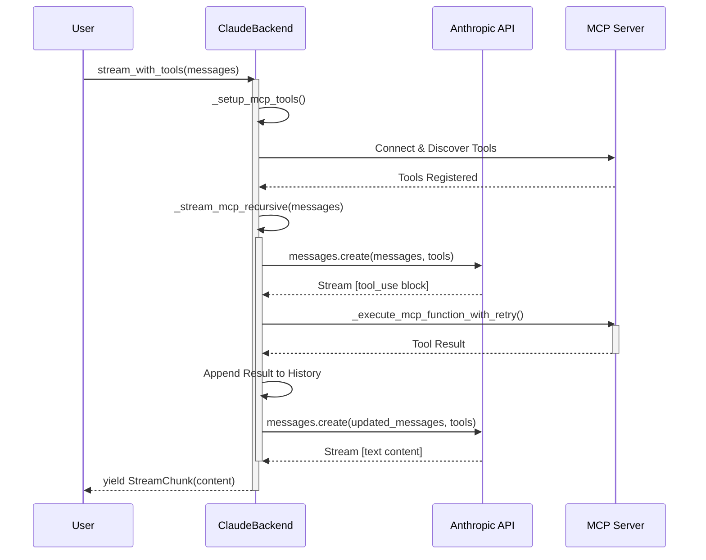

# MCP Integration in ClaudeBackend

## Overview

The `ClaudeBackend` in `massgen/backend/claude.py` features a robust and resilient Model Context Protocol (MCP) integration. Unlike other backends that might differentiate between multiple transport types, the Claude backend uses a **unified recursive model** to handle all external tools. It leverages a single `MultiMCPClient` to manage both `stdio` and `streamable-http` servers, providing a streamlined and powerful way to extend Claude's capabilities with custom tools.

The core of this implementation is the `_stream_mcp_recursive` function, which allows for multiple rounds of tool execution within a single user request, enabling complex, multi-step agentic workflows.

## Key Features

-   **Recursive Execution Loop**: Enables multi-step tool usage where the model can call tools, process results, and call more tools in a continuous loop until it arrives at a final answer.
-   **Unified Tool Management**: Seamlessly combines built-in Claude tools (Web Search, Code Execution), user-defined functions, and external MCP tools into a single, coherent toolset for the model.
-   **Claude-Specific Format Conversion**: Automatically converts all tools into the specific `input_schema` format required by the Anthropic Messages API.
-   **Resilience and Fault Tolerance**: Integrates a circuit breaker pattern to prevent calls to failing MCP servers and a retry mechanism with exponential backoff for individual function calls.
-   **Advanced Streaming & UI Feedback**: Provides real-time status updates for MCP operations (connection, tool calls, completion) directly in the stream, allowing for a transparent user experience.
-   **Graceful Error Handling**: If MCP servers fail during setup or execution, the backend automatically falls back to a non-MCP mode, ensuring the user still receives a response from the model.

## Architecture

### Architectural Flow

The Claude backend uses a simplified, unified architecture compared to multi-transport backends. All MCP tools (`stdio` and `streamable-http`) are managed by a single `MultiMCPClient`, and the core logic is contained within a recursive loop.

```mermaid
graph TD
    subgraph "Configuration Layer"
        A1[YAML Configuration] --> A2[mcp_servers]
    end

    subgraph "ClaudeBackend Layer"
        B1[__init__] --> B2[Circuit Breaker Setup]
        B2 --> B3[_setup_mcp_tools]
        B3 --> B4[MultiMCPClient<br/>(stdio/streamable-http)]
    end

    subgraph "Recursive Execution Loop"
        C1[_stream_mcp_recursive] --> C2{Model Needs Tool?}
        C2 -->|Yes| C3[_execute_mcp_function_with_retry]
        C3 --> C4[Append Result to History]
        C4 --> C1
        C2 -->|No| C5[Yield Final Response]
    end

    subgraph "External Systems"
        D1[Anthropic API]
        D2[MCP Servers]
    end

    A1 --> B1
    B4 --> D2
    C1 --> D1
    C3 --> B4
```

### Unified MCP Client

The Claude backend does not separate MCP servers by transport type. Instead, it uses a single `MultiMCPClient` instance from `massgen.mcp_tools` to manage all configured `stdio` and `streamable-http` servers. This simplifies the architecture and allows for consistent handling of all external tools.

```python
# A single client manages all stdio and streamable-http servers
self._mcp_client: Optional[MultiMCPClient] = None

# A single function registry holds all discovered tools
self.functions: Dict[str, Function] = {}
```

### Recursive Execution Model

The backend's power lies in its recursive design. When the model uses an MCP tool, the backend doesn't simply return the result. Instead, it executes the tool, appends the result to the conversation history, and **calls the model again with the updated history**. This loop continues until the model generates a text response instead of another tool call.

This approach allows the agent to perform complex tasks that require sequential tool use, such as reading a file, analyzing its content, and then writing a summary to a new file.

## Core Components

-   **`ClaudeBackend.__init__`**: Initializes the backend, loads MCP server configurations from the agent config, and prepares the single circuit breaker for all MCP tools.

-   **`_setup_mcp_tools`**: This async method is the heart of the connection process. It normalizes server configurations, filters out any servers currently blocked by the circuit breaker, and initializes the `MultiMCPClient` to connect to the available servers and discover their tools.

-   **`_convert_mcp_tools_to_claude_format`**: A utility that transforms the discovered MCP functions into the JSON format that the Anthropic API expects for its `tools` parameter.

-   **`_build_claude_api_params`**: Constructs the final payload for the Anthropic API call. It gathers all tools—built-in, user-defined, and MCP—and converts them into the correct format. It also handles message history conversion.

-   **`_stream_mcp_recursive`**: The core of the agentic loop. This function:
    1.  Sends the current message history to the Claude API.
    2.  Streams the response, identifying any `tool_use` blocks.
    3.  If an MCP tool is called, it executes it via `_execute_mcp_function_with_retry`.
    4.  Appends the tool result to the message history.
    5.  **Recursively calls itself** with the new, updated message history.
    6.  If no MCP tools are called, it yields the final text response and terminates the loop.

-   **`_execute_mcp_function_with_retry`**: Executes a single MCP function, handling JSON parsing, retries with backoff, and reporting success or failure to the circuit breaker.

-   **`_handle_mcp_error_and_fallback`**: A crucial error handler. If the MCP client fails to connect or a tool fails catastrophically, this function catches the error, yields a user-friendly message, and re-runs the request in a non-MCP mode.

-   **Resource Management (`__aenter__`/`__aexit__`)**: The backend uses an async context manager to ensure that MCP resources are properly managed.
    -   The `__aenter__` method is responsible for calling `_setup_mcp_tools`, which establishes connections to the MCP servers before a request is processed.
    -   The `__aexit__` method ensures that `cleanup_mcp` is called when the context is exited, guaranteeing that connections are closed and resources are released, even if errors occur.

## Execution Workflow

A typical request involving an MCP tool follows this sequence:



## Design Choices and Implications

-   **Recursive Model**: The recursive approach is extremely powerful for creating autonomous agents that can solve multi-step problems. However, it carries a risk of long-running loops and high token costs. This is mitigated by the `MCPMessageManager`, which trims the conversation history to prevent uncontrolled growth.

-   **Unified Client**: By using a single client for `stdio` and `streamable-http`, the architecture is simplified. This means the backend has full control over the connection and can support local development servers, but it does not support a native HTTP transport if Anthropic were to introduce one in the future.

## Security and Performance

-   **Network Flexibility**: Because the implementation uses the `mcp_tools` library for `streamable-http`, it is not subject to the same network restrictions as a native API implementation. It can connect to servers on `localhost`, private networks, and corporate VPNs, making it ideal for development and internal enterprise tools.
-   **Asynchronous Operations**: The entire workflow is built on `asyncio` for non-blocking I/O, ensuring efficient handling of network requests and subprocesses.
-   **Circuit Breaker**: Prevents the system from repeatedly trying to connect to a failing server, improving stability.
-   **Bounded History**: The `MCPMessageManager` is used to trim the conversation history within the recursive loop, preventing infinite growth and excessive token consumption.
-   **Thread Safety**: A lock (`_stats_lock`) is used to safely increment tool usage counters in the async environment.

## Configuration Example

The `ClaudeBackend` is configured via the same `mcp_servers` block in the agent's YAML configuration file. It supports `stdio` and `streamable-http` transport types.

```yaml
# Example configuration for the Claude backend
mcp_servers:
  # stdio transport: for local command-line tools
  file_system_tools:
    type: "stdio"
    command: "python"
    args: ["-m", "mcp_file_server"]
    # Optional: specify which tools to use from this server
    allowed_tools:
      - "read_file"
      - "write_file"
      - "list_directory"

  # streamable-http transport: for web-based streaming services
  web_search_service:
    type: "streamable-http"
    url: "https://api.custom_search.example.com/mcp"
    # Optional: add authorization headers
    authorization: "Bearer ${SEARCH_API_TOKEN}"
```

### Key Configuration Options

-   **`type`**: Specifies the transport. For the `ClaudeBackend`, this can be `stdio` or `streamable-http`.
-   **`command` / `args`**: Used for `stdio` servers to define the command to execute the local tool server.
-   **`url`**: Used for `streamable-http` servers to specify the endpoint of the remote tool server.
-   **`authorization`**: (Optional) Provides an authorization header for `streamable-http` servers. It supports environment variable substitution with the `${VAR_NAME}` syntax.
-   **`allowed_tools` / `exclude_tools`**: (Optional) A list of tool names to explicitly include or exclude from a given server, allowing for fine-grained control over the available tools.