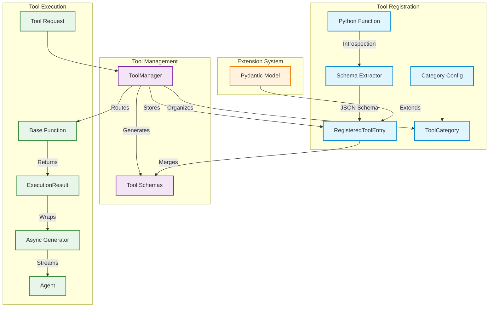

# MassGen Tool System

## Overview

**What is the Tool System?**
The MassGen Tool System is a flexible, extensible framework for managing and executing tools that AI agents can use during task solving. Think of it as a plugin system that allows agents to interact with code execution, file operations, and custom workflows in a standardized, type-safe way.

**What does this module do?**
The Tool System provides a unified interface for:

- Registering tools (custom functions)
- Managing tool categories
- Generating JSON schemas from Python functions automatically
- Executing tools asynchronously with streaming support
- Extending tool schemas dynamically with Pydantic models
- Handling multimodal outputs (text, images, audio)

**Why do you need it?**
Instead of hardcoding capabilities into each AI agent, the Tool System enables:

- **Type Safety**: Automatic schema generation from function signatures
- **Extensibility**: Easy addition of custom tools without modifying core code
- **Categorization**: Organize tools by purpose and enable/disable groups
- **Streaming Results**: Support for long-running operations with progress updates
- **Multimodal Support**: Handle text, images, and audio outputs seamlessly

This module makes it easy to give AI agents new capabilities while maintaining consistency and safety.

## Architecture



## Features

### What You Can Do

- **Register Any Function**: Turn any Python function into an agent tool automatically
- **Schema Generation**: Automatic JSON schema from docstrings and type hints
- **Category Management**: Group tools into categories
- **Preset Arguments**: Hide complex configuration from agents while controlling behavior
- **Schema Extension**: Dynamically add new parameters using Pydantic models
- **Streaming Support**: Handle long-running operations with progress updates
- **Multimodal Output**: Return text, images, or audio content
- **Post-Processing**: Transform tool results before returning to agents

### Tool Registration Methods

- **Function Registration**: Direct function objects or callables
- **Path-Based Loading**: Load from Python files or module names
- **Built-in Tools**: Pre-configured tools for common tasks
- **Custom Tools**: User-defined functions with automatic schema extraction

## Quick Start

### Basic Usage

#### 1. Create and Register a Simple Tool

```python
from massgen.tool import ToolManager, ExecutionResult, TextContent

# Initialize the tool manager
manager = ToolManager()

# Define a simple tool function
async def calculate_sum(a: int, b: int) -> ExecutionResult:
    """Add two numbers together.

    Args:
        a: First number
        b: Second number

    Returns:
        ExecutionResult containing the sum
    """
    result = a + b
    return ExecutionResult(
        output_blocks=[TextContent(data=f"The sum is: {result}")]
    )

# Register the tool
manager.add_tool_function(func=calculate_sum)

# Get schemas for all tools
schemas = manager.fetch_tool_schemas()
print(f"Registered tools: {[s['function']['name'] for s in schemas]}")
```

#### 2. Execute a Tool

```python
async def execute_example():
    # Prepare tool request
    tool_request = {
        "name": "custom_tool__calculate_sum",  # Prefixed with custom_tool__
        "input": {"a": 5, "b": 3}
    }

    # Execute and get results
    async for result in manager.execute_tool(tool_request):
        print(result.output_blocks[0].data)
        # Output: "The sum is: 8"
```

#### 3. Use Tool Categories

```python
# Create a category for math tools
manager.setup_category(
    category_name="math",
    description="Mathematical operations",
    enabled=True,  # Enable by default
    usage_hints="Use these tools for calculations and numeric analysis"
)

# Register tool in category
manager.add_tool_function(
    func=calculate_sum,
    category="math"
)

# Disable all math tools at once
manager.modify_categories(["math"], enabled=False)

# Get schemas (math tools won't be included)
schemas = manager.fetch_tool_schemas()
```

## Core Components

### ToolManager

The central class for tool registration and execution.

**Key Methods:**

- `add_tool_function()`: Register a tool
- `delete_tool_function()`: Remove a tool
- `setup_category()`: Create a tool category
- `modify_categories()`: Enable/disable categories
- `fetch_tool_schemas()`: Get JSON schemas for active tools
- `execute_tool()`: Execute a tool and stream results
- `apply_extension_model()`: Add schema extensions

**Example:**

```python
manager = ToolManager()

# Register a tool from a file
manager.add_tool_function(
    path="massgen/tool/_code_executors/_python_executor.py",
    func="run_python_script",
    category="code_execution",
    description="Execute Python code in a sandbox"
)

# Register with preset arguments
manager.add_tool_function(
    func=my_api_call,
    preset_args={"api_key": "secret", "timeout": 30}  # Hidden from schema
)
```

### RegisteredToolEntry

Data model for registered tools containing:

- `tool_name`: Unique identifier
- `category`: Tool category
- `base_function`: The callable function
- `schema_def`: JSON schema
- `preset_params`: Hidden preset arguments
- `extension_model`: Optional Pydantic extension
- `post_processor`: Optional result transformer

### ExecutionResult

Container for tool execution outputs:

```python
from massgen.tool import ExecutionResult, TextContent, ImageContent

# Simple text result
result = ExecutionResult(
    output_blocks=[TextContent(data="Operation completed")]
)

# Multimodal result with image
result = ExecutionResult(
    output_blocks=[
        TextContent(data="Generated image:"),
        ImageContent(data="base64_encoded_image_data")
    ],
    meta_info={"model": "dalle-3", "size": "1024x1024"}
)

# Streaming result
result = ExecutionResult(
    output_blocks=[TextContent(data="Processing...")],
    is_streaming=True,
    is_final=False
)
```

## Built-in Tools

### Code Executors

#### run_python_script

Execute Python code in an isolated subprocess.

```python
from massgen.tool import run_python_script

result = await run_python_script(
    source_code="""
print("Hello from Python!")
result = 2 + 2
print(f"Result: {result}")
""",
    max_duration=60.0  # Timeout in seconds
)
```

#### run_shell_script

Execute shell commands safely.

```python
from massgen.tool import run_shell_script

result = await run_shell_script(
    command="ls -la /tmp",
    max_duration=30.0
)
```

### File Handlers

#### read_file_content

Read files with optional line range.

```python
from massgen.tool import read_file_content

# Read entire file
result = await read_file_content(
    target_path="/path/to/file.txt"
)

# Read specific line range
result = await read_file_content(
    target_path="/path/to/file.txt",
    line_range=[10, 20]  # Lines 10-20
)

# Read last 100 lines
result = await read_file_content(
    target_path="/path/to/file.txt",
    line_range=[-100, -1]  # Negative indices from end
)
```

#### save_file_content

Write content to files.

```python
from massgen.tool import save_file_content

result = await save_file_content(
    target_path="/path/to/output.txt",
    file_content="Hello, World!",
    create_dirs=True  # Create parent directories
)
```

#### append_file_content

Append or insert content into files.

```python
from massgen.tool import append_file_content

# Append to end
result = await append_file_content(
    target_path="/path/to/log.txt",
    additional_content="New log entry\n"
)

# Insert at specific line
result = await append_file_content(
    target_path="/path/to/file.txt",
    additional_content="Inserted line\n",
    line_position=5  # Insert at line 5
)
```

### Workflow Toolkits

#### NewAnswerToolkit

Allows agents to submit new answers during coordination.

```python
from massgen.tool.workflow_toolkits import NewAnswerToolkit

toolkit = NewAnswerToolkit()
tools = toolkit.get_tools(config={
    "api_format": "chat_completions",
    "enable_workflow_tools": True
})
```

#### VoteToolkit

Enables agents to vote for other agents' answers.

```python
from massgen.tool.workflow_toolkits import VoteToolkit

toolkit = VoteToolkit(valid_agent_ids=["agent1", "agent2", "agent3"])
tools = toolkit.get_tools(config={
    "api_format": "chat_completions",
    "enable_workflow_tools": True
})
```

## Advanced Features

### Schema Extension

Dynamically add parameters to tool schemas using Pydantic models.

```python
from pydantic import BaseModel, Field
from massgen.tool import ToolManager

class AdvancedParams(BaseModel):
    """Additional parameters for advanced users."""
    debug: bool = Field(default=False, description="Enable debug output")
    retry_count: int = Field(default=3, description="Number of retries")

manager = ToolManager()
manager.add_tool_function(func=my_tool)

# Extend the schema
manager.apply_extension_model(
    tool_name="custom_tool__my_tool",
    model_class=AdvancedParams
)

# Schema now includes debug and retry_count parameters
```

### Preset Arguments

Hide configuration from agents while controlling behavior.

```python
# Register with preset arguments
manager.add_tool_function(
    func=api_call_function,
    preset_args={
        "api_key": os.getenv("API_KEY"),
        "base_url": "https://api.example.com",
        "timeout": 30
    }
)

# Agents only see and provide user-facing parameters
# api_key, base_url, timeout are automatically added during execution
```

### Post-Processing

Transform tool results before returning to agents.

```python
def cleanup_output(request: dict, result: ExecutionResult) -> ExecutionResult:
    """Remove sensitive information from output."""
    for block in result.output_blocks:
        if isinstance(block, TextContent):
            # Redact API keys, tokens, etc.
            block.data = re.sub(r'api_key=\w+', 'api_key=***', block.data)
    return result

manager.add_tool_function(
    func=my_api_tool,
    post_processor=cleanup_output
)
```

### Streaming Results

Support long-running operations with progress updates.

```python
from typing import AsyncGenerator
from massgen.tool import ExecutionResult, TextContent

async def long_running_task() -> AsyncGenerator[ExecutionResult, None]:
    """Tool that streams progress updates."""

    # Initial status
    yield ExecutionResult(
        output_blocks=[TextContent(data="Starting task...")],
        is_streaming=True,
        is_final=False
    )

    # Progress updates
    for i in range(1, 6):
        await asyncio.sleep(1)
        yield ExecutionResult(
            output_blocks=[TextContent(data=f"Progress: {i*20}%")],
            is_streaming=True,
            is_final=False
        )

    # Final result
    yield ExecutionResult(
        output_blocks=[TextContent(data="Task completed!")],
        is_streaming=True,
        is_final=True
    )

# Register and execute
manager.add_tool_function(func=long_running_task)

async for result in manager.execute_tool({"name": "custom_tool__long_running_task", "input": {}}):
    print(result.output_blocks[0].data)
```

### Tool Loading Strategies

#### Load from Built-in Tools

```python
# Load by function name (auto-discovered)
manager.add_tool_function(func="run_python_script")
```

#### Load from File Path

```python
# Load from specific file
manager.add_tool_function(
    path="my_tools/data_processor.py",
    func="process_data"
)

# Load main/first function from file
manager.add_tool_function(
    path="my_tools/analyzer.py"  # Loads 'main' or first public function
)
```

#### Load from Module

```python
# Load from module name
manager.add_tool_function(
    path="massgen.tool._code_executors",
    func="run_python_script"
)
```

## Configuration Integration

### Usage with MassGen Agents

The tool system integrates seamlessly with MassGen's agent backends:

```yaml
# In agent configuration
agents:
  - id: "coder_agent"
    backend:
      type: "claude_code"
      model: "claude-sonnet-4"

      # Built-in tools are auto-configured
      # Custom tools can be added via ToolManager

      allowed_tools:
        - "custom_tool__data_analyzer"
        - "custom_tool__file_processor"

      exclude_tools:
        - "custom_tool__run_shell_script"  # Disable specific tools
```

### Custom Tool Registration

```python
from massgen.tool import ToolManager

def setup_custom_tools(manager: ToolManager):
    """Set up custom tools for an agent."""

    # Create category
    manager.setup_category(
        category_name="data_processing",
        description="Tools for data analysis and transformation",
        enabled=True
    )

    # Register custom tools
    manager.add_tool_function(
        path="my_tools/analyzer.py",
        func="analyze_dataset",
        category="data_processing",
        preset_args={"max_rows": 10000}
    )

    manager.add_tool_function(
        path="my_tools/visualizer.py",
        func="create_chart",
        category="data_processing"
    )

    return manager
```

## Tool Schema Format

Tools are exposed to AI agents using JSON Schema format compatible with function calling APIs:

```json
{
  "type": "function",
  "function": {
    "name": "custom_tool__calculate_statistics",
    "description": "Calculate statistical measures for a dataset.\n\nComputes mean, median, standard deviation, and other metrics.",
    "parameters": {
      "type": "object",
      "properties": {
        "data": {
          "type": "array",
          "items": {"type": "number"},
          "description": "List of numeric values to analyze"
        },
        "metrics": {
          "type": "array",
          "items": {"type": "string"},
          "description": "Statistical metrics to compute (mean, median, std, etc.)"
        },
        "round_to": {
          "type": "integer",
          "description": "Number of decimal places for results",
          "default": 2
        }
      },
      "required": ["data"]
    }
  }
}
```

### Schema Generation

Schemas are automatically generated from:

- **Function signature**: Parameter names and types
- **Type hints**: Python type annotations
- **Docstrings**: Google-style docstrings for descriptions
- **Default values**: Optional parameters with defaults
- **Pydantic models**: Type-safe data structures

Example:

```python
from typing import List, Optional

async def analyze_text(
    text: str,
    language: str = "english",
    metrics: Optional[List[str]] = None
) -> ExecutionResult:
    """Analyze text and extract linguistic metrics.

    Performs natural language analysis including sentiment,
    readability, and keyword extraction.

    Args:
        text: The text content to analyze
        language: Language code for analysis (default: english)
        metrics: Specific metrics to compute (optional)

    Returns:
        ExecutionResult with analysis results
    """
    # Implementation
    ...

# Schema automatically includes:
# - text: required string parameter
# - language: optional string with default "english"
# - metrics: optional array of strings
# - Description from docstring
```

## Error Handling

### Exception Types

```python
from massgen.tool._exceptions import (
    ToolException,              # Base exception
    InvalidToolArgumentsException,  # Invalid arguments
    ToolNotFoundException,      # Tool not found
    ToolExecutionException,     # Execution failed
    CategoryNotFoundException   # Category not found
)

# Usage
try:
    await manager.execute_tool(tool_request)
except ToolNotFoundException as e:
    print(f"Tool not found: {e.tool_name}")
except ToolExecutionException as e:
    print(f"Execution failed: {e.error_details}")
except InvalidToolArgumentsException as e:
    print(f"Invalid arguments: {e.error_msg}")
```

### Execution Error Handling

Tool execution errors are returned as ExecutionResult:

```python
async for result in manager.execute_tool({"name": "unknown_tool", "input": {}}):
    # Returns error as result, doesn't raise exception
    print(result.output_blocks[0].data)
    # Output: "ToolNotFound: No tool named 'unknown_tool' exists"
```

### Best Practices

```python
async def safe_tool_execution():
    """Safe pattern for tool execution."""

    # 1. Check if tool exists
    schemas = manager.fetch_tool_schemas()
    available_tools = [s['function']['name'] for s in schemas]

    if "custom_tool__my_tool" not in available_tools:
        print("Tool not available")
        return

    # 2. Validate input before execution
    tool_request = {
        "name": "custom_tool__my_tool",
        "input": validate_input(user_input)
    }

    # 3. Handle execution results
    try:
        async for result in manager.execute_tool(tool_request):
            if result.was_interrupted:
                print("Tool was cancelled")
                break

            if result.is_final:
                # Process final result
                process_result(result)
    except Exception as e:
        print(f"Unexpected error: {e}")
```

## Documentation

For detailed information on specific components:

- **[Tool Manager](docs/manager.md)**: Complete ToolManager API reference
- **[Execution Results](docs/execution_results.md)**: ExecutionResult and content types
- **[Built-in Tools](docs/builtin_tools.md)**: Detailed guide to built-in tools
- **[Workflow Toolkits](docs/workflow_toolkits.md)**: NewAnswer and Vote toolkits
- **[Exceptions](docs/exceptions.md)**: Exception classes and handling

## Troubleshooting

### Common Issues

**Tool Not Found**

```
ToolNotFound: No tool named 'my_tool' exists
```

- Verify tool was registered with correct name
- Check if category is enabled
- Custom tools are prefixed with `custom_tool__`

**Schema Generation Fails**

```
TypeError: cannot create schema for function with **kwargs
```

- Set `allow_var_kwargs=True` when registering
- Or remove `**kwargs` from function signature

**Execution Timeout**

```python
# For code execution tools, adjust timeout
result = await run_python_script(
    source_code=code,
    max_duration=300  # 5 minutes
)
```

**Category Conflicts**

```
ValueError: Category 'tools' already exists or is reserved
```

- Use unique category names
- Avoid reserved name "default"

### Debug Mode

Enable detailed logging:

```python
import logging

# Enable debug logging for tool system
logging.getLogger('massgen.tool').setLevel(logging.DEBUG)

# See tool registration and execution details
manager.add_tool_function(func=my_tool)
```

## Examples

### Example 1: Data Processing Tool

```python
from typing import List, Dict
from massgen.tool import ToolManager, ExecutionResult, TextContent
import json

async def process_json_data(
    data: List[Dict],
    filter_key: str,
    filter_value: str
) -> ExecutionResult:
    """Filter JSON data by key-value pair.

    Args:
        data: List of dictionaries to filter
        filter_key: Key to filter on
        filter_value: Value to match

    Returns:
        ExecutionResult with filtered data
    """
    filtered = [item for item in data if item.get(filter_key) == filter_value]

    return ExecutionResult(
        output_blocks=[
            TextContent(data=f"Found {len(filtered)} matching items:\n{json.dumps(filtered, indent=2)}")
        ],
        meta_info={"original_count": len(data), "filtered_count": len(filtered)}
    )

# Setup
manager = ToolManager()
manager.setup_category("data", "Data processing tools", enabled=True)
manager.add_tool_function(func=process_json_data, category="data")
```

### Example 2: Multi-Category System

```python
# Create specialized categories
categories = {
    "analysis": ("Data analysis and statistics", True),
    "visualization": ("Chart and graph generation", True),
    "export": ("Data export and formatting", False)  # Disabled by default
}

for name, (desc, enabled) in categories.items():
    manager.setup_category(name, desc, enabled=enabled)

# Register tools in categories
manager.add_tool_function(func=calculate_stats, category="analysis")
manager.add_tool_function(func=create_chart, category="visualization")
manager.add_tool_function(func=export_csv, category="export")

# Enable export tools when needed
manager.modify_categories(["export"], enabled=True)
```

### Example 3: Streaming Progress Tool

```python
from typing import AsyncGenerator
import asyncio

async def batch_processor(
    items: List[str],
    operation: str
) -> AsyncGenerator[ExecutionResult, None]:
    """Process items in batches with progress updates.

    Args:
        items: List of items to process
        operation: Operation to perform on each item
    """
    total = len(items)

    for i, item in enumerate(items, 1):
        # Simulate processing
        await asyncio.sleep(0.5)

        # Yield progress
        progress = int((i / total) * 100)
        yield ExecutionResult(
            output_blocks=[
                TextContent(data=f"Processing {i}/{total} ({progress}%): {item}")
            ],
            is_streaming=True,
            is_final=(i == total)
        )

# Execute with streaming
async for result in manager.execute_tool({
    "name": "custom_tool__batch_processor",
    "input": {"items": ["a", "b", "c"], "operation": "analyze"}
}):
    print(result.output_blocks[0].data)
```

## Best Practices

### Tool Design

1. **Single Responsibility**: Each tool should do one thing well
2. **Clear Documentation**: Use detailed docstrings with parameter descriptions
3. **Type Hints**: Always include type annotations for automatic schema generation
4. **Error Handling**: Return errors as ExecutionResult, don't raise exceptions
5. **Async First**: Use async functions for I/O-bound operations

### Security

1. **Input Validation**: Validate all tool arguments
2. **Sandboxing**: Use code executors for untrusted code
3. **Preset Arguments**: Hide sensitive config (API keys, credentials)
4. **Timeouts**: Set reasonable timeouts for all operations
5. **Resource Limits**: Prevent resource exhaustion (memory, CPU)

### Performance

1. **Lazy Loading**: Load tools only when needed
2. **Streaming**: Use generators for large outputs
3. **Caching**: Cache expensive computations
4. **Async Execution**: Don't block the event loop
5. **Clean Resources**: Always clean up in finally blocks

### Integration

1. **Consistent Naming**: Use clear, descriptive tool names
2. **Category Organization**: Group related tools
3. **Schema Clarity**: Provide clear parameter descriptions
4. **Version Compatibility**: Document required dependencies
5. **Testing**: Test tools independently before registration

## Integration with MassGen

The Tool System is deeply integrated with MassGen's multi-agent framework:

```python
from massgen.orchestrator import Orchestrator
from massgen.tool import ToolManager

# Tools are automatically available to agents
orchestrator = Orchestrator(config_path="config.yaml")

# Agents discover and use tools during task execution
result = await orchestrator.run_task("Analyze the dataset and create visualizations")

# Tool execution is logged and tracked
# Results are shared between agents during coordination
```

This integration allows agents to dynamically discover and use tools while the orchestrator manages execution, logging, and result coordination.

---

**Made with the MassGen Tool System**
