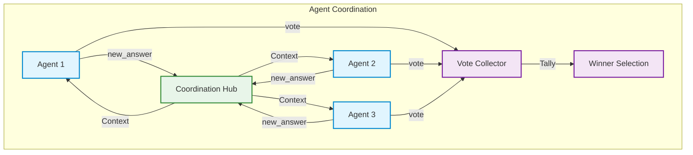

# Workflow Toolkits Documentation

## Overview

Workflow toolkits are specialized tools designed for multi-agent coordination in MassGen. They enable agents to submit new answers, vote on proposals, and participate in collaborative decision-making processes.

**What are Workflow Toolkits?**
Think of workflow toolkits as the communication system that allows agents to coordinate with each other. Just like team members in a meeting can propose ideas and vote on them, workflow toolkits give agents the ability to:
- Submit new answer proposals during coordination rounds
- Vote for which agent's answer should be used as the final result
- Coordinate their work toward a common goal

**Why do you need them?**
Multi-agent systems become much more powerful when agents can collaborate. Workflow toolkits enable:
- **Democratic Decision Making**: Agents vote on the best solution
- **Iterative Refinement**: Agents can revise their answers based on others' work
- **Consensus Building**: System converges on the best answer through collaboration
- **Specialization**: Different agents can focus on different aspects

## Architecture



## BaseToolkit

Base class for all workflow toolkits.

```python
from abc import ABC, abstractmethod
from enum import Enum
from typing import Any, Dict, List

class ToolType(Enum):
    """Types of tools available in the system."""
    BUILTIN = "builtin"
    WORKFLOW = "workflow"
    MCP = "mcp"

class BaseToolkit(ABC):
    """Abstract base class for all toolkits."""

    @property
    @abstractmethod
    def toolkit_id(self) -> str:
        """Unique identifier for the toolkit."""

    @property
    @abstractmethod
    def toolkit_type(self) -> ToolType:
        """Type of the toolkit."""

    @abstractmethod
    def get_tools(self, config: Dict[str, Any]) -> List[Dict[str, Any]]:
        """Get tool definitions based on configuration."""

    @abstractmethod
    def is_enabled(self, config: Dict[str, Any]) -> bool:
        """Check if the toolkit is enabled."""
```

## NewAnswerToolkit

**What it does**: Provides the `new_answer` tool that allows agents to submit updated answers during coordination rounds. This is how agents participate in the collaborative refinement process.

**Why use it**: Essential for multi-agent coordination. Agents need a way to submit their answers and see others' answers to collaborate effectively.

**Location**: `massgen.tool.workflow_toolkits.new_answer`

### Initialization

```python
from massgen.tool.workflow_toolkits import NewAnswerToolkit

toolkit = NewAnswerToolkit(template_overrides=None)
```

**Parameters**:
- `template_overrides` (optional): Custom descriptions or schema modifications

### Methods

#### get_tools()

**What it does**: Generates tool definitions for the `new_answer` tool in the requested API format.

**Parameters**:
- `config` (required): Configuration dictionary with:
  - `api_format`: Format to use ("chat_completions", "claude", "response")
  - `enable_workflow_tools`: Whether workflow tools are enabled

**Returns**: List of tool definitions (empty if not enabled)

**Supported API Formats**:

1. **chat_completions**: OpenAI function calling format
2. **claude**: Anthropic Claude tool format
3. **response**: Google Gemini function declarations

```python
# OpenAI format
tools = toolkit.get_tools({
    "api_format": "chat_completions",
    "enable_workflow_tools": True
})

# Claude format
tools = toolkit.get_tools({
    "api_format": "claude",
    "enable_workflow_tools": True
})

# Gemini format
tools = toolkit.get_tools({
    "api_format": "response",
    "enable_workflow_tools": True
})
```

#### is_enabled()

**What it does**: Checks if the toolkit should be active based on configuration.

**Returns**: Boolean indicating if toolkit is enabled

```python
config = {
    "api_format": "chat_completions",
    "enable_workflow_tools": True
}

if toolkit.is_enabled(config):
    print("NewAnswerToolkit is active")
```

### Tool Schema

The `new_answer` tool accepts these parameters:

**Parameters**:
- `new_answer` (required): The agent's updated answer or analysis

**Example Tool Call**:

```json
{
  "name": "new_answer",
  "input": {
    "new_answer": "Based on the analysis, the optimal solution is to use approach B because it has better performance characteristics and lower complexity. The data shows a 30% improvement in processing time compared to approach A.",
  }
}
```

### Integration Example

```python
from massgen.tool.workflow_toolkits import NewAnswerToolkit

# Create toolkit
new_answer_toolkit = NewAnswerToolkit()

# Get tool definitions
config = {
    "api_format": "chat_completions",
    "enable_workflow_tools": True
}

tools = new_answer_toolkit.get_tools(config)

# Use with agent
agent_tools.extend(tools)

# Agent can now call new_answer during coordination
```

### Usage Pattern

**Coordination Flow**:

1. **Initial Answer**: Agent submits first answer via `new_answer`
2. **See Others**: Agent receives context showing other agents' answers
3. **Refine**: Agent calls `new_answer` again with improved answer
4. **Iterate**: Process continues until convergence or max rounds

**Example Agent Behavior**:

```python
# Round 1: Initial answer
await call_tool("new_answer", {
    "new_answer": "Initial analysis suggests X",
})

# Round 2: After seeing other agents' work
await call_tool("new_answer", {
    "new_answer": "Refined analysis: X is optimal because of Y and Z. Agent2's point about performance is valid.",
})

# Round 3: Final refinement
await call_tool("new_answer", {
    "new_answer": "Final comprehensive answer incorporating all perspectives...",
})
```

## VoteToolkit

**What it does**: Provides the `vote` tool that allows agents to vote for which agent's answer should be selected as the final result.

**Why use it**: Enables democratic decision-making in multi-agent systems. Instead of picking randomly, agents collectively decide on the best answer.

**Location**: `massgen.tool.workflow_toolkits.vote`

### Initialization

```python
from massgen.tool.workflow_toolkits import VoteToolkit

toolkit = VoteToolkit(
    valid_agent_ids=["agent1", "agent2", "agent3"],
    template_overrides=None
)
```

**Parameters**:
- `valid_agent_ids` (optional): List of valid agent IDs that can be voted for
- `template_overrides` (optional): Custom descriptions or schema modifications

### Methods

#### get_tools()

**What it does**: Generates tool definitions for the `vote` tool in the requested API format.

**Parameters**:
- `config` (required): Configuration dictionary (same format as NewAnswerToolkit)

**Returns**: List of tool definitions

```python
tools = toolkit.get_tools({
    "api_format": "chat_completions",
    "enable_workflow_tools": True
})
```

#### is_enabled()

**What it does**: Checks if voting is enabled.

**Returns**: Boolean

### Tool Schema

The `vote` tool accepts these parameters:

**Parameters**:
- `agent_id` (required): ID of the agent to vote for
- `reason` (optional): Explanation for the vote

**Validation**:
- If `valid_agent_ids` is set, votes are validated against this list
- Invalid agent IDs are rejected

**Example Tool Call**:

```json
{
  "name": "vote",
  "input": {
    "agent_id": "agent2",
    "reason": "Agent2's answer is most comprehensive and addresses all aspects of the problem. The performance analysis is thorough and the solution is practical."
  }
}
```

### Integration Example

```python
from massgen.tool.workflow_toolkits import VoteToolkit

# Create toolkit with valid agents
vote_toolkit = VoteToolkit(
    valid_agent_ids=["researcher", "analyst", "expert"]
)

# Get tool definitions
config = {
    "api_format": "chat_completions",
    "enable_workflow_tools": True,
    "valid_agent_ids": ["researcher", "analyst", "expert"]
}

tools = vote_toolkit.get_tools(config)

# Use with agent
agent_tools.extend(tools)

# Agent can now vote
```

### Voting Patterns

**Simple Voting**:

```python
# Agent votes for the best answer
await call_tool("vote", {
    "agent_id": "expert",
    "reason": "Expert provided the most detailed technical analysis"
})
```

## Helper Function

### get_workflow_tools()

**What it does**: Convenience function that returns tools from both NewAnswerToolkit and VoteToolkit.

**Why use it**: Simplifies setup when you need both toolkits.

**Location**: `massgen.tool.workflow_toolkits`

```python
from massgen.tool.workflow_toolkits import get_workflow_tools

tools = get_workflow_tools(
    valid_agent_ids=["agent1", "agent2", "agent3"],
    template_overrides=None,
    api_format="chat_completions"
)

# Returns tools from both toolkits:
# - new_answer
# - vote
```

**Parameters**:
- `valid_agent_ids` (optional): List of valid agent IDs for voting
- `template_overrides` (optional): Custom descriptions
- `api_format` (optional): API format to use (default: "chat_completions")

**Returns**: List of tool definitions from both toolkits

## Complete Integration Example

```python
from massgen.tool import ToolManager
from massgen.tool.workflow_toolkits import get_workflow_tools

# Set up tool manager
manager = ToolManager()

# Get workflow tools
workflow_tools = get_workflow_tools(
    valid_agent_ids=["researcher", "analyst", "expert"],
    api_format="chat_completions"
)

# Add to agent's tool list
agent_config = {
    "tools": workflow_tools,
    "enable_workflow_tools": True
}

# During coordination:
# 1. Agents submit answers via new_answer
# 2. System shares context between agents
# 3. Agents refine answers
# 4. Agents vote via vote
# 5. System selects winner based on votes
```

## Advanced Usage

### Custom Template Overrides

Override default descriptions or add custom fields:

```python
template_overrides = {
    "new_answer": {
        "description": "Submit your analysis with supporting evidence",
        "parameters": {
            "additional_field": {
                "type": "string",
                "description": "Custom field"
            }
        }
    }
}

toolkit = NewAnswerToolkit(template_overrides=template_overrides)
```

### Dynamic Agent Lists

Update valid agents dynamically:

```python
# Initial setup
vote_toolkit = VoteToolkit(valid_agent_ids=["agent1", "agent2"])

# Update for new round (create new instance)
vote_toolkit = VoteToolkit(valid_agent_ids=["agent1", "agent2", "agent3"])
```

### Multi-Format Support

Generate tools for multiple API formats:

```python
new_answer_toolkit = NewAnswerToolkit()

# OpenAI agents
openai_tools = new_answer_toolkit.get_tools({
    "api_format": "chat_completions",
    "enable_workflow_tools": True
})

# Claude agents
claude_tools = new_answer_toolkit.get_tools({
    "api_format": "claude",
    "enable_workflow_tools": True
})

# Gemini agents
gemini_tools = new_answer_toolkit.get_tools({
    "api_format": "response",
    "enable_workflow_tools": True
})
```

## Best Practices

### NewAnswerToolkit

1. **Incremental Refinement**: Build on previous answers
2. **Reference Others**: Acknowledge other agents' contributions

### VoteToolkit

1. **Reasoned Votes**: Always include reasoning
2. **Objective Criteria**: Base votes on clear criteria
3. **Valid IDs**: Ensure agent IDs are correct
4. **Respectful Feedback**: Explain votes constructively

### General

1. **Enable Both**: Use NewAnswer and Vote together
2. **Validate Configuration**: Check `enable_workflow_tools` flag
3. **Handle Errors**: Gracefully handle tool call failures
4. **Monitor Usage**: Track coordination patterns

## Troubleshooting

### Tools Not Available

**Problem**: Workflow tools don't appear in agent's tool list

**Solutions**:
```python
# Check enable flag
config["enable_workflow_tools"] = True

# Verify toolkit is enabled
assert toolkit.is_enabled(config)

# Check API format
assert config["api_format"] in ["chat_completions", "claude", "response"]
```

### Invalid Agent ID

**Problem**: Vote rejected due to invalid agent ID

**Solutions**:
```python
# Check valid_agent_ids list
print(f"Valid agents: {config.get('valid_agent_ids', [])}")

# Ensure agent ID matches exactly
vote_toolkit = VoteToolkit(valid_agent_ids=["agent_1", "agent_2"])
# Use "agent_1" not "agent1" or "Agent_1"
```

### Tool Schema Mismatch

**Problem**: Tool call fails due to schema mismatch

**Solutions**:
```python
# Verify tool schema
tools = toolkit.get_tools(config)
print(json.dumps(tools[0], indent=2))

# Check required parameters
# new_answer requires: new_answer, summary
# vote requires: agent_id
```

---

For more information, see:
- [ToolManager Documentation](manager.md)
- [ExecutionResult Documentation](execution_results.md)
- [Built-in Tools Guide](builtin_tools.md)
