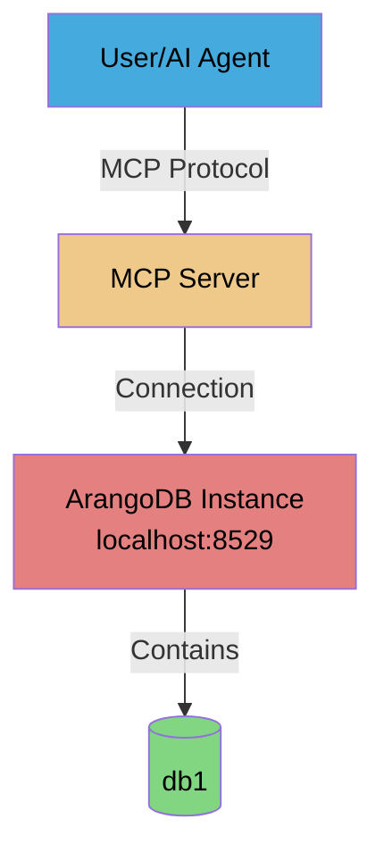

# Scenario 1: Single Instance, Single Database

**Pre-requisites:**
 - [ArangoDB running](../../getting-started/install-arangodb.md)
 - mcp-arangodb-async installed

---

**Concepts covered:**
- Basic ArangoDB setup with Docker
- Admin CLI database configuration
- MCP server connection and testing
- Database resolution fundamentals

**Skills you will practice:**
- Starting ArangoDB with Docker Compose
- Using Admin CLI to configure databases
- Testing database connections
- Executing basic MCP operations

---

**Setup:** 1 user + 1 MCP server + 1 ArangoDB instance (port 8529) + 1 database

**Use Case:** Basic setup for a single project or development environment.

## Architecture Diagram



## Setup Commands

### Step 1: Create the database with a new user

**Create a environment file for the user's credentials**

```dotenv
# Root credentials
# Reuse the root password from when you installed ArangoDB
ARANGO_ROOT_PASSWORD=your-secure-password

# New user credentials
ARANGO_USERNAME=user1
ARANGO_PASSWORD=user1_password
```

> [!NOTE]
> This environment file is only used to create the database and user with a first password. Later, it would a user's responsibility to [manage their credentials](../cli-reference.md#user-password).

**Create the database with the new user**

```bash
maa db add db1 \
  --url http://localhost:8529 \
  --with-user user1 \
  --env-file .user1.env
```

Then, confirm when prompted.

**Expected output:**

```text
The following actions will be performed:
  [ADD] Database 'db1'
  [ADD] User 'user1' (active: true)
  [GRANT] Permission rw: user1 → db1

Are you sure you want to proceed? [y/N]: y
db add:
[ADDED] Database 'db1'
[ADDED] User 'user1' (active: true)
[GRANTED] Permission rw: user1 → db1
```

### Step 2: Verify the configuration

```bash
maa db list --env-file .user1.env
```

**Expected output:**
```
Databases (2):
  - _system (system)
  - db1
```

### Step 3: Add the database to the configuration file

```bash
maa db config add first_db \
  --url http://localhost:8529 \
  --database db1 \
  --username user1 \
  --password-env ARANGO_PASSWORD
```

Then, confirm when prompted.

**Expected output:**

```text
The following actions will be performed:
  [ADD] Database configuration 'first_db'
  [ADD]   URL: http://localhost:8529
  [ADD]   Database: db1
  [ADD]   Username: user1

Are you sure you want to proceed? [y/N]: y
db config add:
[ADDED] Database configuration 'first_db'
[ADDED]   URL: http://localhost:8529
[ADDED]   Database: db1
[ADDED]   Username: user1

Configuration saved to: path/to/config/databases.yaml
```

You can then confirm the configuration was saved:

```bash
maa db config list
```

**Expected output:**

```text
Configured databases (1):
Configuration file: path/to/config/databases.yaml

  first_db:
    URL: http://localhost:8529
    Database: db1
    Username: user1
    Password env: ARANGO_PASSWORD
    Timeout: 30.0s
```

> [!NOTE]
> You need to restart the MCP server for the changes in the config file to take effect if it was already running.

### Step 4: Adapt your MCP Host's configuration to use the new config file

The [quickstart guide](../../getting-started/quickstart.md#step-3-configure-mcp-client) covered how to launch the MCP server referencing a database directly through environment variables. Now that we have a config file, we need to update the MCP Host's configuration to use it. This can be done easily by passing the [`--config-file` argument](../cli-reference.md#server) to the `server` command.

Thus, you can rewrite the mcp server configuration as:

```json
{
  "mcpServers": {
    "arangodb": {
      "command": "python",
      "args": ["-m", "mcp_arangodb_async", "server", "--config-file", "path/to/config/databases.yaml"],
      "env": {
        "ARANGO_PASSWORD": "user1_password"
      }
    }
  }
}
```

Note that only the password needs to be passed as an environment variable. The config file contains the rest of the database connection information.

The `--config-file` argument can also be passed in for the Conda/Mamba/Micromamba and uv launchers:

<details>
<summary><b>Conda/Mamba/Micromamba</b></summary>

Assuming you [installed the package in an environment named `mcp-arango`](../../getting-started/quickstart.md#step-1-install-from-pypi), use:

- `"command": "conda|mamba|micromamba"`
- `"args": ["run", "-n", "mcp-arango", "maa", "server", "--config-file", "path/to/config/databases.yaml"]`

</details>

<details>
<summary><b>uv</b></summary>

Assuming you [installed the package in a virtual environment](../../getting-started/quickstart.md#step-1-install-from-pypi), use:

- `"command": "uv"`
- `"args": ["run", "--directory", "/path/to/project", "maa", "server", "--config-file", "path/to/config/databases.yaml"]`

</details>

## Verification Steps

### Test 1: Check database connection

```bash
maa db config test first_db --env-file .user1.env
```

> [!NOTE]
> This command uses the yaml config file's key `first_db` to resolve the database, NOT the database name `db1`.

**Expected output:**
```
✓ Connection to 'first_db' successful
  ArangoDB version: 3.11.14
```

### Test 2: List available databases via MCP

With the [MCP server configured](../../getting-started/quickstart.md#step-3-configure-mcp-client) in your preferred MCP Host (e.g. Claude Desktop, LM Studio, etc.) and use the multi-tenancy request using the tool `arango_list_available_databases`.
This will confirm that the MCP server has loaded the expected config file.

**Example prompt:**

```markdown
List the available databases.
```

### Test 3: Create a collection and insert data

Start the MCP server and use the multi-tenancy request using the tool `arango_create_collection` and `arango_insert`. 

**Example prompt:**

```markdown
Create collection "test" in database "db1". Insert the document {"name": "John", "age": 30} into the collection.
```

**Checking the results:**

You can check the results using the ArangoDB web interface or the Admin CLI. Go to the url <http://localhost:8529> and login with the user `user1` and password `user1_password`. Then, select the database `db1` and you should see the collection `test` with the document `{"name": "John", "age": 30}`.

## Checkpoint: Single Database Setup

**What you've accomplished:**
- Set up ArangoDB with Docker
- Configured your first database using Admin CLI
- Verified MCP server connectivity
- Performed basic database operations

**Key concepts learned:**
- Database configuration with environment variables
- Admin CLI database management
- MCP tool usage for database operations

**Next up:**
- Add a second database to the same ArangoDB instance
- Learn database switching and resolution

---

## Configuration Updates

Use the `db config update` command to modify existing database configurations. This is useful when:
- Changing server URLs (e.g., switching from development to production)
- Updating timeout settings
- Renaming configuration keys
- Modifying descriptions

### Common Update Operations

**Update URL and timeout:**
```bash
maa db config update first_db --url http://new-host:8529 --timeout 60
```

**Rename configuration key:**
```bash
maa db config update first_db --key production
```

**Update multiple fields:**
```bash
maa db config update first_db \
  --url http://staging:8529 \
  --database staging_db \
  --timeout 45 \
  --description "Staging environment"
```

**Preview changes with dry-run:**
```bash
maa db config update first_db --url http://new:8529 --dry-run
```

**Clear description:**
```bash
maa db config update first_db --description ""
```

---

## Advanced: Using Shorthand Aliases

<details>
<summary>💡 Complete scenario workflow with shorthand aliases</summary>

**Scenario 1 - Single Instance, Single Database:**

```bash
# Step 1: Create database with user (using short aliases)
maa db add db1 --with-user user1 -E .user1.env

# Step 2: Verify configuration
maa db list -E .user1.env

# Step 3: Add to config file
maa db config add first_db -u http://localhost:8529 -d db1 -U user1 -P ARANGO_PASSWORD

# Step 4: Test connection
maa db config test first_db -E .user1.env
```

**Alias reference:**
- `-u` = `--url`
- `-d` = `--database`
- `-U` = `--username`
- `-E` = `--environment-file` / `--env-file`
- `-P` = `--arango-password-env` / `--pw-env`

See [CLI Reference](../cli-reference.md) for complete list.
</details>

---

> **Next:** [Scenario 2: Single Instance, Multiple Databases](02-single-instance-multiple-databases.md)