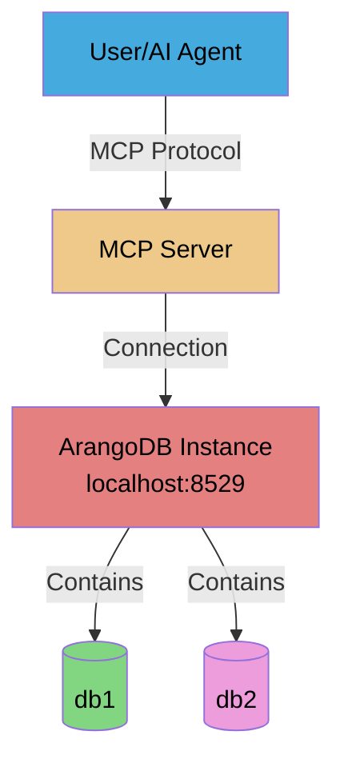

# Scenario 2: Single Instance, Multiple Databases

---

**Concepts covered:**
- Multiple database configuration on single instance
- Database switching and focused database concept
- Cross-database operations without switching
- Password environment variable reuse

**Skills you will practice:**
- Adding databases to existing ArangoDB instance
- Using arango_set_focused_database for context switching
- Performing cross-database comparisons
- Managing multiple database configurations

---

**Setup:** 1 user + 1 MCP server + 1 ArangoDB instance (port 8529) + 2 databases

**Use Case:** Environment separation (development/testing) on the same ArangoDB instance.

**Building on:** [Scenario 1](01-single-instance-single-database.md) (db1 already exists)

## Architecture Diagram



## Setup Commands

### Step 1: Add second database (building on Scenario 1)

```bash
maa db add db2 \
  --url http://localhost:8529 \
  --with-user user1 \
  --env-file .user1.env
```

**Expected output:**

```text
The following actions will be performed:
  [ADD] Database 'db2'
  [EXISTS] User 'user1' (already exists)
  [GRANT] Permission rw: user1 → db2

Are you sure you want to proceed? [y/N]: y
db add:
[ADDED] Database 'db2'
[EXISTS] User 'user1' (already exists)
[GRANTED] Permission rw: user1 → db2
```

### Step 2: Add second database to configuration file

```bash
maa db config add second_db \
  --url http://localhost:8529 \
  --database db2 \
  --username user1 \
  --password-env ARANGO_PASSWORD
```

> [!NOTE]
> We are reusing the same `ARANGO_PASSWORD` environment variable because it's the same user (user1) on the same ArangoDB instance.

**Expected output:**

```text
The following actions will be performed:
  [ADD] Database configuration 'second_db'
  [ADD]   URL: http://localhost:8529
  [ADD]   Database: db2
  [ADD]   Username: user1

Are you sure you want to proceed? [y/N]: y
db config add:
[ADDED] Database configuration 'second_db'
[ADDED]   URL: http://localhost:8529
[ADDED]   Database: db2
[ADDED]   Username: user1

Configuration saved to: path/to/config/databases.yaml
```

### Step 3: Verify both databases are configured

```bash
maa db config list
```

**Expected output:**
```
Configured databases (2):
Configuration file: path/to/config/databases.yaml

  first_db:
    URL: http://localhost:8529
    Database: db1
    Username: user1
    Password env: ARANGO_PASSWORD
    Timeout: 30.0s

  second_db:
    URL: http://localhost:8529
    Database: db2
    Username: user1
    Password env: ARANGO_PASSWORD
    Timeout: 30.0s
```

## Verification Steps

### Test 1: Check both database connections

```bash
maa db config test first_db --env-file .user1.env
maa db config test second_db --env-file .user1.env
```

> [!NOTE]
> This command uses the yaml config file's key `first_db` and `second_db` to resolve the database, NOT the database name `db1` and `db2`.

**Expected output:**
```
✓ Connection to 'first_db' successful
  ArangoDB version: 3.11.14

✓ Connection to 'second_db' successful
  ArangoDB version: 3.11.14
```

> [!NOTE]
> You need to restart the MCP server for the changes to take effect if it was already running.

### Test 2: List available databases via MCP

In your MCP Host of choice, with the MCP server configured as in the [previous scenario](./01-single-instance-single-database.md#step-4-adapt-your-mcp-hosts-configuration-to-use-the-new-config-file), **restart** the MCP server and use the multi-tenancy request using the tool `arango_list_available_databases`.
This will confirm that the MCP server has loaded the expected config file.

> [!NOTE]
> We can reuse the same MCP server configuration because the database connection information is now in the config file, and this is for the same user so the password environment variable is still valid.

**Example prompt:**

```markdown
List the available databases.
```

**Expected behavior:**
- MCP server calls `arango_list_available_databases` tool
- Returns both databases configured in the YAML file

**Expected response:**
```json
{
  "databases": [
      {
        "key": "first_db",
        "url": "http://localhost:8529",
        "database": "db1",
        "username": "user1"
      },
      {
        "key": "second_db",
        "url": "http://localhost:8529",
        "database": "db2",
        "username": "user1"
      }
    ],
  "total_count": 2
}
```

### Test 3: Switch between databases

**Example prompt:**
```markdown
Successively focus on first_db, then second_db to query their content. Confirm the content of each database is different.
```

**Expected behavior:**
- MCP server calls `arango_set_focused_database` to switch contexts
- MCP server calls `arango_list_collections` or direct `arango_query` with no database override parameter

### Test 4: Cross-database comparison without switching

**Example prompt:**
```markdown
This time, query both first_db and second_db directly without switching the focused database.
```

**Expected behavior:**
- MCP server calls `arango_query` with database parameter override
- Demonstrates per-tool database selection

### Test 5: Create different data in each database

**Example prompt:**
```markdown
Create a collection called "projects" in db1 and insert a document with name "Project Alpha" and status "active".
Then create a collection called "experiments" in db2 and insert a document with name "Experiment Beta" and phase "testing". Finally, list all collections and all documents in both databases to confirm the content was added correctly.
```

**Expected behavior:**
- MCP server creates collections in different databases
- MCP server inserts different data in each database
- Demonstrates database isolation

## Checkpoint: Multiple Databases

**What you've accomplished:**
- Added a second database to the same ArangoDB instance
- Learned database switching with focused database
- Performed cross-database operations using database parameter
- Verified data isolation between databases

**Key concepts learned:**
- Database parameter override for per-tool database selection
- Focused database for workflow-based database switching
- Password environment variable reuse for same user/instance
- Data isolation between databases on same instance

**Next up:**
- Scale to multiple ArangoDB instances
- Learn complete instance isolation
- Manage different credentials for different instances

---

## Configuration Updates

Use the `db config update` command to modify existing database configurations. This is useful when:
- Changing timeout settings for specific databases
- Updating descriptions to reflect environment changes
- Renaming configuration keys for better organization

### Common Update Operations

**Update timeout for a specific database:**
```bash
maa db config update first_db --timeout 60
```

**Rename configuration key:**
```bash
maa db config update first_db --key production
```

**Update description:**
```bash
maa db config update first_db --description "Production database"
```

**Update multiple fields:**
```bash
maa db config update first_db \
  --timeout 45 \
  --description "Updated production environment"
```

**Preview changes with dry-run:**
```bash
maa db config update first_db --timeout 60 --dry-run
```

---

## Advanced: Using Shorthand Aliases

<details>
<summary>💡 Complete scenario workflow with shorthand aliases</summary>

**Scenario 2 - Single Instance, Multiple Databases:**

```bash
# Step 1: Add second database with user
maa db add db2 --with-user user1 -E .user1.env

# Step 2: Add to config file
maa db config add second_db -u http://localhost:8529 -d db2 -U user1 -P ARANGO_PASSWORD

# Step 3: Verify both databases
maa db config list

# Verification: Test both connections
maa db config test first_db -E .user1.env
maa db config test second_db -E .user1.env
```

**Alias reference:**
- `-u` = `--url`
- `-d` = `--database`
- `-U` = `--username`
- `-E` = `--environment-file` / `--env-file`
- `-P` = `--arango-password-env` / `--pw-env`

See [CLI Reference](../cli-reference.md) for complete list.
</details>

---

> **Previous:** [Scenario 1: Single Instance, Single Database](01-single-instance-single-database.md)
> **Next:** [Scenario 3: Multiple Instances, Multiple Databases](03-multiple-instances-multiple-databases.md)