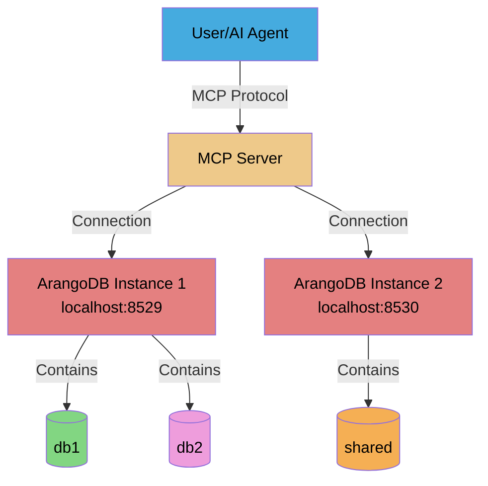

# Scenario 3: Multiple Instances, Multiple Databases

---

**Concepts covered:**
- Multiple ArangoDB instance deployment
- Instance-specific environment variables
- Complete isolation between instances
- Port mapping and network configuration

**Skills you will practice:**
- Configuring multiple Docker services
- Managing separate credentials for different instances
- Testing instance isolation
- Scaling multi-tenancy architecture

---

**Setup:** 1 user + 1 MCP server + 2 ArangoDB instances (ports 8529 & 8530) + 3 databases total

**Use Case:** Complete isolation between environments, different ArangoDB versions, or production/non-production separation.

**Building on:** [Scenario 2](02-single-instance-multiple-databases.md) (db1 and db2 on port 8529)

## Architecture Diagram



## Setup Commands

### Step 1: Start second ArangoDB instance on port 8530

Update your `docker-compose.yml` [file](../../getting-started/install-arangodb.md#step-1-create-docker-compose-file) to include a second instance:

```yaml
services:

# ...
# Existing arangodb service
# ...

  arangodb2:
    image: arangodb:3.11
    environment:
      ARANGO_ROOT_PASSWORD: ${ARANGO_INSTANCE2_ROOT_PASSWORD:-changeme}
    ports:
      - "${ARANGO_INSTANCE2_PORT:-8530}:8529"
    volumes:
      - arangodb_data_2:/var/lib/arangodb3
      - arangodb_apps_2:/var/lib/arangodb3-apps
    healthcheck:
      test: >
        arangosh --server.username root
        --server.password "${ARANGO_INSTANCE2_ROOT_PASSWORD:-changeme}"
        --javascript.execute-string "require('@arangodb').db._version()"
        > /dev/null 2>&1 || exit 1
      interval: 5s
      timeout: 2s
      retries: 30
    restart: unless-stopped

volumes:

  # ...
  # Existing volumes
  # ...

  arangodb_data_2:
    driver: local
  arangodb_apps_2:
    driver: local
```

### Step 2: Add the second root password to the environment file

In the `.arangodb-launch.env` [file](../../getting-started/install-arangodb.md#step-2-create-environment-file), add a second root password, as well as a port that will be used for the second ArangoDB instance:

```dotenv
ARANGO_INSTANCE2_ROOT_PASSWORD=instance2-password
ARANGO_INSTANCE2_PORT=8530
```

### Step 3: Start the second ArangoDB instance

```bash
docker compose --env-file arangodb-launch.env up -d arangodb2
```

### Step 4: Add shared database on second instance

Add a specific password for user1 to access the second instance in `.user1.env`:

```dotenv
# ...
# Existing variables
# ...

USER1_INSTANCE2_PASSWORD=user1_password2
```

```bash
maa db add shared \
  --url http://localhost:8530 \
  --with-user user1 \
  --env-file .user1.env \
  --arango-password-env USER1_INSTANCE2_PASSWORD \
  --arango-root-password-env ARANGO_INSTANCE2_ROOT_PASSWORD
```

> [!NOTE]
> We are explicitely specifying the root and user password environment variables because we are already using the default `ARANGO_ROOT_PASSWORD` and `ARANGO_PASSWORD` variables for the first instance. Hence, to avoid promoting bad practices of reusing the same credentials across different instances, we set different variable names in `.user1.env` and using the `--arango-password-env` and `--arango-root-password-env` options to specify them.

**Expected output:**

```text
The following actions will be performed:
  [ADD] Database 'shared'
  [ADD] User 'user1' (active: true)
  [GRANT] Permission rw: user1 → shared

Are you sure you want to proceed? [y/N]: y
db add:
[ADDED] Database 'shared'
[ADDED] User 'user1' (active: true)
[GRANTED] Permission rw: user1 → shared
```

### Step 5: Configure the shared database in the YAML file

Similarly to the previous scenario, we need to add the database to the YAML file to make it accessible to the MCP server.

```bash
maa db config add shared_db \
  --url http://localhost:8530 \
  --database shared \
  --username user1 \
  --password-env USER1_INSTANCE2_PASSWORD
```

**Expected output:**

```text
The following actions will be performed:
  [ADD] Database configuration 'shared_db'
  [ADD]   URL: http://localhost:8530
  [ADD]   Database: shared
  [ADD]   Username: user1

Are you sure you want to proceed? [y/N]: y
db config add:
[ADDED] Database configuration 'shared_db'
[ADDED]   URL: http://localhost:8530
[ADDED]   Database: shared
[ADDED]   Username: user1

Configuration saved to: path/to/config/databases.yaml
```

You can then confirm the configuration was saved:

```bash
maa db config list
```

**Expected output:**
```
Configured databases (3):
Configuration file: path/to/config/databases.yaml

  first_db:
    URL: http://localhost:8529
    Database: db1
    Username: user1
    Password env: ARANGO_PASSWORD
    Timeout: 30.0s

  second_db:
    URL: http://localhost:8529
    Database: db2
    Username: user1
    Password env: ARANGO_PASSWORD
    Timeout: 30.0s

  shared_db:
    URL: http://localhost:8530
    Database: shared
    Username: user1
    Password env: USER1_INSTANCE2_PASSWORD
    Timeout: 30.0s
```


### Add the password to the second instance in the MCP Host's configuration

In the previous scenario, [we had only one password](./01-single-instance-single-database.md#step-4-adapt-your-mcp-hosts-configuration-to-use-the-new-config-file) to pass to the MCP server. Now that we have a new instance using a new password, the MCP server configuration must be updated accordingly:

```json
{
  "mcpServers": {
    "arangodb": {
      "command": "<your command>",
      "args": "<your args>",
      "env": {
        "ARANGO_PASSWORD": "user1_password",
        "USER1_INSTANCE2_PASSWORD": "user1_password2"
      }
    }
  }
}
```

> [!NOTE]
> You must restart the MCP server for all changes to take effect if it was already running.

## Verification Steps

### Test 1: Check all database connections

```bash
maa db config test first_db --env-file .user1.env
maa db config test second_db --env-file .user1.env
maa db config test shared_db --env-file .user1.env
```

**Expected output:**
```
✓ Connection to 'first_db' successful
  ArangoDB version: 3.11.14
✓ Connection to 'second_db' successful
  ArangoDB version: 3.11.14
✓ Connection to 'shared_db' successful
  ArangoDB version: 3.11.14
```

### Test 2: List all available databases

**Example prompt:**
```markdown
List all available databases configured for this MCP server.
```

**Expected behavior:**
- MCP server calls `arango_list_available_databases` tool
- Returns all three databases across both instances

**Expected response:**
```json
{
  "databases": [
    {
      "key": "first_db",
      "url": "http://localhost:8529",
      "database": "db1",
      "username": "user1"
    },
    {
      "key": "second_db",
      "url": "http://localhost:8529",
      "database": "db2",
      "username": "user1"
    },
    {
      "key": "shared_db",
      "url": "http://localhost:8530",
      "database": "shared",
      "username": "user1"
    }
  ],
  "total_count": 3
}
```

### Test 3: Test instance-specific operations

**Example prompt:**
```markdown
Create a collection called "methods" in shared database and insert a document "protocol_base" with field "description" set to "our baseline protocol".
Then, update the experiment beta in db2 with a new field to reference the protocol_base document in the methods collection of the shared database.
```

**Expected behavior:**
- MCP server might get focused on shared database or the database override parameter will be used.
- MCP server creates a collection and inserts a document in the shared database
- MCP server updates a document in db2 to reference the document in the shared database
- Demonstrates operations across multiple instances and databases

## Checkpoint: Multiple Instances

**What you've accomplished:**
- Deployed multiple ArangoDB instances with Docker Compose
- Configured databases across different instances
- Verified complete instance isolation
- Managed separate credentials for different instances

**Key concepts learned:**
- Instance-level isolation vs database-level isolation
- Port mapping for multiple services
- Environment variable management for multiple instances
- Network-level separation of data

---

## Configuration Updates

Use the `db config update` command to modify existing database configurations across multiple instances. This is useful when:
- Changing server URLs when migrating instances
- Updating timeout settings for specific environments
- Renaming configuration keys for better organization
- Modifying descriptions to reflect instance purpose

### Common Update Operations

**Update URL for a production instance:**
```bash
maa db config update prod_db --url http://prod-arango:8529
```

**Update timeout for development instance:**
```bash
maa db config update dev_db --timeout 45
```

**Rename configuration key:**
```bash
maa db config update staging_db --key staging
```

**Update multiple fields:**
```bash
maa db config update prod_db \
  --url http://new-prod:8529 \
  --timeout 60 \
  --description "Production instance - High availability"
```

**Preview changes with dry-run:**
```bash
maa db config update prod_db --url http://new-prod:8529 --dry-run
```

---

## Advanced: Using Shorthand Aliases

<details>
<summary>💡 Complete scenario workflow with shorthand aliases</summary>

**Scenario 3 - Multiple Instances, Multiple Databases:**

```bash
# Step 4: Add shared database on second instance
maa db add shared \
  --with-user user1 \
  -u http://localhost:8530 \
  -E .user1.env \
  -P USER1_INSTANCE2_PASSWORD \
  -R ARANGO_INSTANCE2_ROOT_PASSWORD

# Step 5: Configure shared database
maa db config add shared_db -u http://localhost:8530 -d shared -U user1 -P USER1_INSTANCE2_PASSWORD

# Verification: Test all connections
maa db config test first_db -E .user1.env
maa db config test second_db -E .user1.env
maa db config test shared_db -E .user1.env
```

**Alias reference:**
- `-u` = `--url`
- `-d` = `--database`
- `-U` = `--username`
- `-E` = `--environment-file` / `--env-file`
- `-P` = `--arango-password-env` / `--pw-env`
- `-R` = `--arango-root-password-env` / `--root-pw-env`

See [CLI Reference](../cli-reference.md) for complete list.
</details>

---

> **Previous:** [Scenario 2: Single Instance, Multiple Databases](02-single-instance-multiple-databases.md)
> **Next:** [Back to Overview](README.md)