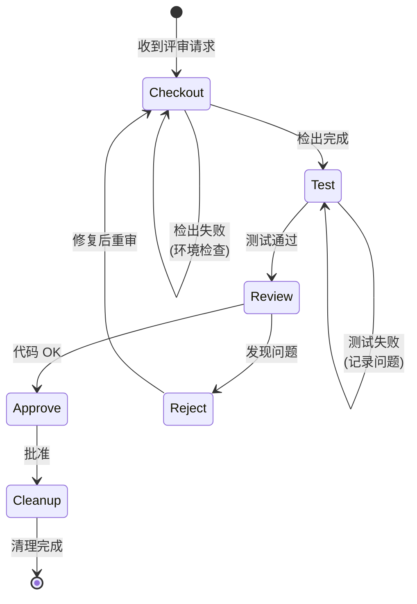

# Reviewer Flow

Reviewer 角色的标准化工作流，确保 "Checkout → Test → Review → Decide → Cleanup" 流程。

## 工作流状态机



## 执行步骤

### 1. Checkout (检出)

- **目标**: 获取待评审的代码
- **检查点**:
  - [ ] 检出 PR/Branch
  - [ ] 确认与 Base 分支的差异
  - [ ] 检查环境配置

### 2. Test (测试)

- **目标**: 验证功能正确性和测试覆盖
- **检查点**:
  - [ ] 运行单元测试
  - [ ] 运行集成测试 (如适用)
  - [ ] 验证手动测试场景
  - [ ] 检查测试覆盖率报告

### 3. Review (代码审查)

- **目标**: 检查代码质量和设计合理性
- **检查清单**:
  - [ ] **功能**: 代码是否实现了需求？
  - [ ] **设计**: 架构是否合理？
  - [ ] **可读性**: 代码是否易于理解？
  - [ ] **测试**: 测试是否充分？
  - [ ] **文档**: 文档是否同步更新？
  - [ ] **合规**: 是否遵循项目规范？

### 4. Decide (决策)

- **目标**: 做出批准或拒绝的决定
- **选项**:
  - **Approve**: 代码可以合并
  - **Reject**: 需要修改，提供具体反馈
  - **Request Changes**: 小问题，可快速修复

### 5. Cleanup (清理)

- **目标**: 完成评审后的环境清理
- **检查点**:
  - [ ] 删除本地分支 (如适用)
  - [ ] 更新 Issue 状态
  - [ ] 记录评审意见到 Review Comments

## 决策分支

| 条件 | 动作 |
|------|------|
| 测试失败 | Reject，要求修复测试 |
| 代码风格问题 | Request Changes 或提供建议 |
| 设计问题 | Reject，要求重新设计 |
| 文档缺失 | Request Changes，要求补充 |
| 修复后重审 | 返回 Checkout，重新执行流程 |

## 评审意见模板

```markdown
## Review Comments

### ✅ 优点
- 

### ⚠️ 建议
- 

### ❌ 必须修改
- 

### 📝 其他
- 
```

## 合规要求

- **必须**: 所有测试通过才能 Approve
- **必须**: 拒绝时必须提供具体反馈
- **禁止**: 未经测试直接 Approve
- **建议**: 使用 `monoco issue close --prune` 合并后清理
