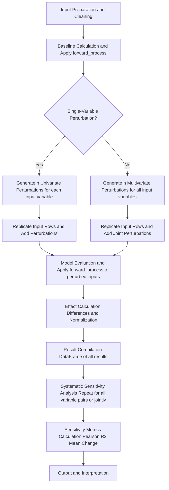

# `monte-carlo-sensitivity` 

Monte-Carlo Sensitivity Analysis Python Package

[Gregory H. Halverson](https://github.com/gregory-halverson-jpl) (they/them)<br>
[gregory.h.halverson@jpl.nasa.gov](mailto:gregory.h.halverson@jpl.nasa.gov)<br>
Lead developer and designer<br>
NASA Jet Propulsion Laboratory 329G

Margaret C. Johnson (she/her)<br>
[maggie.johnson@jpl.nasa.gov](mailto:maggie.johnson@jpl.nasa.gov)<br>
Sensitivity and uncertainty analysis<br>
NASA Jet Propulsion Laboratory 398L

## Installation

This Python package is distributed using the pip package manager. Install it with the package name `monte-carlo-sensitivity` with dashes.

<!--
   The following Mermaid diagram is compatible with GitHub rendering. If you do not see the diagram, ensure you are viewing this file on GitHub.com and that Mermaid diagrams are supported in your environment.
-->



## Scientific Background

Monte Carlo sensitivity analysis is a widely used approach for quantifying the influence of input uncertainties on model outputs. By repeatedly perturbing input variables and observing the resulting changes in outputs, this method provides robust estimates of sensitivity metrics, even for nonlinear or complex models [1,2].

This package implements both univariate and multivariate perturbation strategies, following best practices in uncertainty quantification and sensitivity analysis [3,4].

### References

1. Saltelli, A., et al. (2008). Global Sensitivity Analysis: The Primer. Wiley.
2. Helton, J.C., & Davis, F.J. (2003). Latin hypercube sampling and the propagation of uncertainty in analyses of complex systems. Reliability Engineering & System Safety, 81(1), 23-69.
3. Iooss, B., & Lemaître, P. (2015). A review on global sensitivity analysis methods. In Uncertainty management in Simulation-Optimization of Complex Systems (pp. 101-122). Springer.
4. Pianosi, F., et al. (2016). Sensitivity analysis of environmental models: A systematic review with practical workflow. Environmental Modelling & Software, 79, 214-232.

---

## Comparison to Other Tools

While packages such as [SALib](https://salib.readthedocs.io/) provide a range of sensitivity analysis methods, `monte-carlo-sensitivity` focuses on flexible, simulation-based perturbation workflows that are easy to integrate with arbitrary models and data pipelines.

---

The `monte-carlo-sensitivity` package provides a robust, simulation-based framework for quantifying the sensitivity of model outputs to input variables using Monte Carlo perturbation and statistical analysis. The methodology supports both single-variable and joint (multi-variable) perturbation workflows.

### 1. Input Preparation and Cleaning

- Start with an input DataFrame (`input_df`) containing all relevant variables.
- Specify the input variables to perturb and the output variables to analyze. These can be single variables or lists of variables, depending on the function used.
- Remove rows with missing values (NaNs) as needed to ensure valid analysis.

### 2. Monte Carlo Perturbation of Inputs

#### Single-Variable Perturbation (`perturbed_run`)

For each input variable and output variable pair:

1. **Baseline Calculation:**
   - Compute the unperturbed output by applying a user-defined model or function (`forward_process`) to the input data.

2. **Perturbation Generation:**
   - For each row, generate `n` random perturbations for the selected input variable (default: normal distribution, mean zero, std equal to the variable's std).
   - Replicate each input row `n` times and add the generated perturbations to the selected input variable, creating a set of perturbed inputs.

3. **Model Evaluation:**
   - Apply the model to the perturbed inputs to obtain perturbed outputs.

4. **Effect Calculation:**
   - Compute the difference between perturbed and unperturbed values for both input and output.
   - Normalize these differences (typically by dividing by the standard deviation).

5. **Result Compilation:**
   - Aggregate the results into a DataFrame, including unperturbed and perturbed values, perturbations, and their normalized forms.

#### Joint (Multivariate) Perturbation (`joint_perturbed_run`)

For joint sensitivity analysis, multiple input variables are perturbed simultaneously, optionally allowing for correlations between them:

1. **Baseline Calculation:**
   - Compute the unperturbed output using the user-defined `forward_process` function.

2. **Joint Perturbation Generation:**
   - For each row, generate `n` random perturbation vectors for the selected input variables, using a multivariate distribution (default: multivariate normal with zero mean and diagonal covariance from input stds).
   - Replicate each input row `n` times and add the generated perturbation vectors to the input variables, creating a set of jointly perturbed inputs.

3. **Model Evaluation:**
   - Apply the model to the perturbed inputs to obtain perturbed outputs.

4. **Effect Calculation:**
   - Compute the difference between perturbed and unperturbed values for both input and output variables.
   - Normalize these differences (typically by dividing by the standard deviation for each variable).

5. **Result Compilation:**
   - Aggregate the results into a DataFrame, including unperturbed and perturbed values, perturbations, and their normalized forms for all input and output variables.

### 3. Systematic Sensitivity Analysis (Multiple Variables)

- Repeat the above Monte Carlo perturbation process for every combination of input and output variable (single-variable mode), or for all variables jointly (joint mode).
- Concatenate all results into a comprehensive DataFrame (`perturbation_df`) that records all perturbations and their effects.

### 4. Sensitivity Metrics Calculation

For each input-output variable pair, calculate the following metrics using the normalized perturbations:

- **Pearson Correlation:** Measures the linear relationship between normalized input and output perturbations.
- **R² (Coefficient of Determination):** Quantifies the proportion of variance in the output explained by the input perturbation (via linear regression).
- **Mean Normalized Change:** The average normalized change in the output variable due to input perturbation.

These metrics are aggregated into a summary DataFrame (`sensitivity_metrics_df`).

### 5. Output and Interpretation

- The process returns both the detailed perturbation results and the summary sensitivity metrics.
- This enables a comprehensive, quantitative assessment of how each input variable influences each output variable, supporting robust model evaluation and interpretation.

---

## Usage

Import this package in Python as `monte_carlo_sensitivity` with underscores.

Below are examples of how to use the key functions in the package:

### Sensitivity Analysis

The `sensitivity_analysis` function performs systematic sensitivity analysis by perturbing input variables and observing the effect on output variables.

```python
import pandas as pd
from monte_carlo_sensitivity import sensitivity_analysis

# Example input DataFrame
input_df = pd.DataFrame({
    "input_var1": [1, 2, 3],
    "input_var2": [4, 5, 6],
    "output_var": [7, 8, 9]
})

# Define a forward process function
def forward_process(df):
    df["output_var"] = df["input_var1"] + df["input_var2"]
    return df

# Perform sensitivity analysis
perturbation_df, sensitivity_metrics = sensitivity_analysis(
    input_df=input_df,
    input_variables=["input_var1", "input_var2"],
    output_variables=["output_var"],
    forward_process=forward_process,
    n=100
)

print(perturbation_df)
print(sensitivity_metrics)
```

### Perturbed Run

The `perturbed_run` function performs a Monte Carlo sensitivity analysis by perturbing a single input variable and observing the effect on a single output variable.

```python
import pandas as pd
from monte_carlo_sensitivity import perturbed_run

# Example input DataFrame
input_df = pd.DataFrame({
    "input_var1": [1, 2, 3],
    "input_var2": [4, 5, 6],
    "output_var": [7, 8, 9]
})

# Define a forward process function
def forward_process(df):
    df["output_var"] = df["input_var1"] + df["input_var2"]
    return df

# Perform a perturbed run
results = perturbed_run(
    input_df=input_df,
    input_variable="input_var1",
    output_variable="output_var",
    forward_process=forward_process,
    n=100
)

print(results)
```

### Joint Perturbed Run

The `joint_perturbed_run` function evaluates the sensitivity of output variables to joint perturbations in multiple input variables.

```python
import pandas as pd
from monte_carlo_sensitivity import joint_perturbed_run

# Example input DataFrame
input_df = pd.DataFrame({
    "input_var1": [1, 2, 3],
    "input_var2": [4, 5, 6],
    "output_var": [7, 8, 9]
})

# Define a forward process function
def forward_process(df):
    df["output_var"] = df["input_var1"] + df["input_var2"]
    return df

# Perform a joint perturbed run
results = joint_perturbed_run(
    input_df=input_df,
    input_variable=["input_var1", "input_var2"],
    output_variable=["output_var"],
    forward_process=forward_process,
    n=100
)

print(results)
```

### Using Constraints to Keep Values Within Physical Bounds

The \`sensitivity_analysis\` and \`perturbed_run\` functions support optional \`input_min\` and \`input_max\` parameters to constrain perturbed values within physically meaningful ranges. This is useful when input variables have natural bounds (e.g., temperature > 0 Kelvin, probabilities between 0 and 1, concentrations ≥ 0).

\`\`\`python
import pandas as pd
from monte_carlo_sensitivity import sensitivity_analysis

# Example with a temperature variable that must stay positive
input_df = pd.DataFrame({
    "temperature": [250, 300, 350],  # Kelvin
    "pressure": [101.3, 105.0, 110.0],  # kPa
})

def forward_process(df):
    # Some model that depends on temperature and pressure
    df["reaction_rate"] = df["temperature"] * 0.01 + df["pressure"] * 0.02
    return df

# Apply constraints so temperature stays positive and pressure stays in realistic range
perturbation_df, sensitivity_metrics = sensitivity_analysis(
    input_df=input_df,
    input_variables=["temperature", "pressure"],
    output_variables=["reaction_rate"],
    forward_process=forward_process,
    n=100,
    perturbation_std=50.0,  # Large perturbations
    input_min={"temperature": 0.0, "pressure": 0.0},  # Per-variable minimums
    input_max={"temperature": 500.0, "pressure": 200.0}  # Per-variable maximums
)

# All perturbed temperature values will be clipped to [0, 500]
# All perturbed pressure values will be clipped to [0, 200]
\`\`\`

**Constraint Options:**

- **Scalar constraints** (apply to all variables):
  \`\`\`python
  sensitivity_analysis(..., input_min=0.0, input_max=100.0)
  \`\`\`

- **Per-variable constraints** (different bounds for each variable):
  \`\`\`python
  sensitivity_analysis(..., 
      input_min={"var1": 0.0, "var2": -10.0}, 
      input_max={"var1": 100.0, "var2": 50.0})
  \`\`\`

- **Partial constraints** (only constrain some variables):
  \`\`\`python
  sensitivity_analysis(..., 
      input_min={"temperature": 0.0},  # Only temperature has a minimum
      input_max=None)  # No maximum constraints
  \`\`\`

**Important Notes:**

1. **Backward compatibility:** When constraints are not specified (default \`None\`), the behavior is identical to previous versions.

2. **Implementation method:** Constraints are enforced using post-perturbation clipping. After generating random perturbations, values outside the specified bounds are clipped to the limits using \`numpy.clip()\`.

3. **Statistical implications:** 
   - When constraints are rarely hit (<5% of samples), the statistical properties of the analysis remain largely unaffected.
   - When many samples hit the bounds, clipping introduces bias by truncating the distribution, which can reduce observed sensitivity.
   - For cases where statistical rigor is critical and many samples would be clipped, consider reducing \`perturbation_std\` or implementing truncated distributions (future enhancement).

4. **Actual perturbations:** After clipping, the actual applied perturbations are recalculated to match the clipped values, ensuring the \`input_perturbation\` column in results accurately reflects what was applied.

