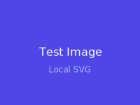

# Image Rendering Test Suite

Comprehensive tests for the mrmd image rendering system, including position modifiers and captions.

---

## 1. Basic Images (Default Block)

Standard markdown images render as centered blocks:


---

## 2. Images with Captions

Using the title attribute for captions:


---

## 3. Position Modifiers

### 3.1 Align Right (`>`)

>

The image above is aligned to the right side of the editor.

---

### 3.2 Align Left (`<`)

<

The image above is aligned to the left side of the editor.

---

### 3.3 Wide / Full-Bleed (`^`)

^

This image breaks out of the content column for maximum impact.

---

### 3.4 Small / Thumbnail (`_`)

_

Small images are great for icons or thumbnails that don't need to dominate the page.

---

## 4. Multiple Aligned Images

### 4.1 Alternating Alignment

>

<

")

---

### 4.2 Consecutive Right Alignment

>

>

---

## 5. Local Images

Testing local file loading:



---

## 6. Reference-Style Images

Defining images separately:

![Nature reference][nature-ref]

![Architecture reference][arch-ref]>

Reference-style image with right alignment.

[nature-ref]: https://picsum.photos/seed/nature-ref/500/350 "Nature scene (reference style)"
[arch-ref]: https://picsum.photos/seed/arch-ref/300/200 "Modern architecture"

---

## 7. Images in Context

### 7.1 In a Blockquote

> Here's an important quote with an image:
>
> 
>
> The image adds visual context to the quoted material.

### 7.2 In a List

Key concepts with illustrations:

1. **Concept One** - Introduction
   _

2. **Concept Two** - Development
   _

3. **Concept Three** - Conclusion
   _

---

## 8. Edge Cases

### 8.1 No Alt Text


### 8.2 Very Long Caption


### 8.3 Special Characters in Alt/Caption


### 8.4 Small Wide (Contradiction Test)

What happens with `^` on a naturally small image?

^

---

## 9. Broken Images (Error Handling)

These should show error states gracefully:


---

## 10. Images in Tables (Tufte Style)

Tufte loved small visualizations in tables - sparklines, icons, thumbnails:

### Product Comparison

| Product | Preview | Rating | Status |
|---------|---------|--------|--------|
| Alpine Lake |  | ⭐⭐⭐⭐⭐ | Active |
| Forest Trail |  | ⭐⭐⭐⭐ | Active |
| Desert Sunset |  | ⭐⭐⭐ | Pending |


### Team Directory

| Photo | Name | Role |
|-------|------|------|
|  | Alice Chen | Engineering Lead |
|  | Bob Smith | Product Manager |
|  | Carol Davis | Designer |


### Data with Sparklines

| Metric | Trend | Current | Change |
|--------|-------|---------|--------|
| Revenue |  | $1.2M | +12% |
| Users |  | 45.2K | +8% |
| Engagement |  | 72% | -3% |


### Multiple Images in Cell

| Category | Options |
|----------|---------|
| Colors |    |
| Sizes |    |


---

## 11. Size Comparison

Same image, different positions:

### Default (centered block)


### Small (`_`)
_

### Wide (`^`)
^

### Float right (`>`)
>

Text wrapping around the float-right version of the same image.

---

## 12. Rapid Sequence

Multiple images in quick succession:


---

## 13. Mixed Content Layout

>

### Section with Right-Aligned Image

The image above is right-aligned. In a block-based editor, each element flows vertically.

**Key points:**
- Block images take their natural height
- Position modifiers control alignment (left, center, right)
- Content flows naturally below each image

> Block widgets render between lines, avoiding the overlap issues of absolute positioning.

---

## Syntax Reference

### Position Modifiers

| Modifier | Syntax | Effect |
|----------|--------|--------|
| Default | `` | Centered block |
| Right | `>` | Align right |
| Left | `<` | Align left |
| Wide | `^` | Full-bleed |
| Small | `_` | Thumbnail |

### Captions

| Feature | Syntax | Effect |
|---------|--------|--------|
| Caption | `` | Caption below image |
| Combined | `>` | Caption + position |

### Tables

Images work inside table cells:

```markdown
| Preview | Name |
|---------|------|
|  | Item |
```

---

*End of test suite*
