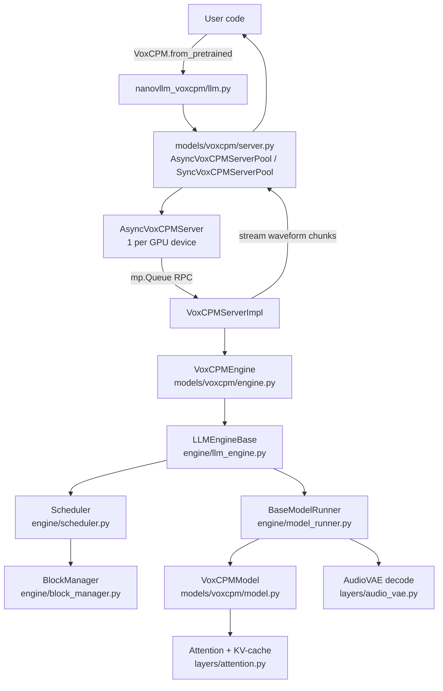
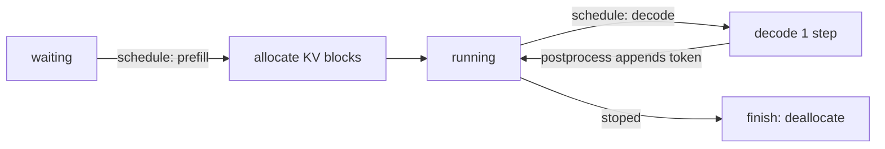
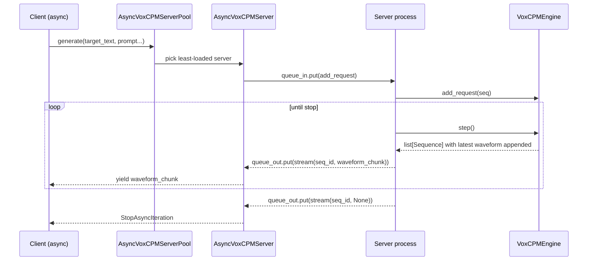

# nano-vllm-voxcpm Architecture

This document explains the architecture of the `nanovllm_voxcpm/` package: what the major modules do, how they interact at runtime, and where to start when you are new to the codebase.

## Contents (Jump Table)

- [Mental Model](#mental-model-one-paragraph)
- [High-Level Component Diagram](#high-level-component-diagram)
- [Package Layout](#package-layout)
- [Core Runtime Concepts](#core-runtime-concepts)
- [VoxCPM Integration](#voxcpm-integration-model-specific-layer)
- [Weight Loading and LoRA](#weight-loading-and-lora)
- [Data Flow Walkthrough](#data-flow-walkthrough-what-happens-on-one-step)
- [Where To Start](#where-to-start-recommended-reading-order)
- [Extending the System](#extending-the-system-adding-a-new-model-family)
- [Operational Notes / Pitfalls](#operational-notes--pitfalls)

Quick navigation commands (recommended)

- List major sections with line numbers: `rg -n "^## " ARCHITECTURE.md`
- List subsections with line numbers: `rg -n "^### " ARCHITECTURE.md`
- Jump in a pager by line: `less +<LINE> ARCHITECTURE.md` (example: `less +180 ARCHITECTURE.md`)

The repository provides:

- A **model-agnostic inference runtime** (scheduling + KV-cache management + execution abstraction).
- A **concrete model integration** for **VoxCPM** (audio generation) built on top of that runtime.

This is GPU-centric code. Many paths assume CUDA, FlashAttention (`flash-attn`), Triton, and NCCL.

## Mental Model (One Paragraph)

At runtime, a *request* is represented as a `Sequence` (prompt state + generated tokens + KV-cache mapping). The `Scheduler` batches sequences and enforces resource limits. The `BlockManager` allocates a shared KV-cache block pool and supports prefix caching via hashing. The engine (`LLMEngineBase`) runs an event loop: it schedules sequences, converts them into lightweight `RunnerTask` objects, calls the GPU runner (`BaseModelRunner`) to execute the model, then merges outputs back into each `Sequence` until they finish. VoxCPM provides the model-specific glue: how to build inputs from text/audio, how to interpret outputs (latents + stop flag + waveform chunks), and how to expose this as an async streaming server.

## High-Level Component Diagram

## Package Layout

`nanovllm_voxcpm/` is split into three main layers:

1) **Public entrypoint**

- `nanovllm_voxcpm/__init__.py`: exports `VoxCPM`.
- `nanovllm_voxcpm/llm.py`: user-facing factory (`VoxCPM.from_pretrained`) that returns a server pool.
- `nanovllm_voxcpm/config.py`: generic runtime `Config` shared by the core engine.

2) **Model-agnostic runtime core** (`nanovllm_voxcpm/engine/`)

- `engine/sequence.py`: per-request state (`Sequence`), including KV mapping (`block_table`) and prefix-cache token stream (`token_ids`).
- `engine/block_manager.py`: KV-cache block pool + prefix caching + ref-counting.
- `engine/scheduler.py`: batching policy (prefill vs decode), preemption, and interaction with KV allocation.
- `engine/model_runner.py`: multi-GPU runner abstraction (`BaseModelRunner`) and the picklable `RunnerTask`.
- `engine/llm_engine.py`: orchestration loop (`LLMEngineBase`).

3) **Model integration** (`nanovllm_voxcpm/models/voxcpm/`)

- `models/voxcpm/config.py`: Pydantic model configs (VoxCPMConfig, LoRAConfig, etc.).
- `models/voxcpm/model.py`: `VoxCPMModel` definition (text LM + residual LM + local encoder + diffusion decoder + stop predictor).
- `models/voxcpm/runner.py`: `VoxCPMRunner` (build tensors, set attention context, run model, decode to waveform chunk).
- `models/voxcpm/engine.py`: `VoxCPMEngine` (create `Sequence`, implement preprocess/postprocess glue).
- `models/voxcpm/server.py`: multiprocessing server + async streaming API + LoRA methods.
- `models/voxcpm/utils.py`: tokenizer wrapper to split multi-char Chinese tokens.

Supporting utilities / layers:

- `nanovllm_voxcpm/utils/context.py`: global “attention context” (slot mapping, cu_seqlens, etc.) used by flash-attn kernels.
- `nanovllm_voxcpm/utils/loader.py`: load `.safetensors` weights and LoRA weights with name mapping.
- `nanovllm_voxcpm/layers/*`: tensor-parallel linear/embedding layers, flash-attn attention, LoRA layers, and AudioVAE.

## Core Runtime Concepts

### 1) Sequence (Request State)

File: `nanovllm_voxcpm/engine/sequence.py`

`Sequence` is the single source of truth for one in-flight request:

- `token_ids: list[int | bytes]` is the *prefix-cache key stream*. It is not necessarily what the model directly consumes.
- `custom_payload` is model-specific state (for VoxCPM: text tokens, audio features, masks, sampling controls, streaming buffers).
- `block_table: list[int]` maps logical token positions to physical KV-cache blocks.
- `num_cached_tokens` indicates how many prompt tokens can be skipped due to KV prefix caching.
- `stoped` (typo in name, but used consistently) indicates the request should end.

Why `int | bytes` tokens?

- Prefix caching hashes tokens in full KV blocks. VoxCPM needs to hash both text ids (`int`) and audio latent patches (`bytes`), so the token stream supports both.

### 2) KV Cache as a Block Pool (+ Prefix Caching)

File: `nanovllm_voxcpm/engine/block_manager.py`

KV memory is managed as a fixed-size block pool:

- A **block** stores KV for `block_size` token positions.
- A sequence holds a **block table** listing which blocks it owns.
- Blocks are **ref-counted** so multiple sequences can share blocks when prefix caching hits.

Prefix caching mechanism (important for performance):

- Only **full blocks** are eligible for caching.
- A rolling hash is computed per block and chained by prefix: hash(block_i) depends on hash(block_{i-1}).
- A cache hit requires (1) hash match and (2) token contents match.

### 3) Scheduling: Prefill vs Decode

File: `nanovllm_voxcpm/engine/scheduler.py`

The scheduler maintains:

- `waiting`: newly added sequences without allocated KV.
- `running`: sequences that have KV and can be decoded step-by-step.

It alternates between two modes:

- **Prefill**: admit from `waiting` while respecting `max_num_seqs`, `max_num_batched_tokens`, and KV availability. Allocate blocks and compute (only) the uncached tail.
- **Decode**: round-robin over `running`. Ensure KV space for the current last token (and preempt others if necessary).

### 4) Runner: GPU Execution Boundary

File: `nanovllm_voxcpm/engine/model_runner.py`

The engine passes the runner a list of `RunnerTask` objects:

- small + picklable (needed for multiprocessing and shared-memory RPC)
- carries KV mapping (`block_table`, `block_size`) + lengths (`seq_length`, `num_cached_tokens`) + model payload

`BaseModelRunner` responsibilities:

- initialize NCCL process group (`torch.distributed.init_process_group`)
- load model weights
- allocate per-layer KV cache tensors based on available GPU memory
- set the global attention context (prefill vs decode)
- optionally capture CUDA graphs for decode (disabled when `enforce_eager=True`)

### 5) Attention Context (FlashAttention Integration)

Files:

- `nanovllm_voxcpm/utils/context.py`
- `nanovllm_voxcpm/layers/attention.py`

FlashAttention kernels require metadata such as:

- packed sequence boundaries (`cu_seqlens_q`, `cu_seqlens_k`)
- max sequence lengths for kernel launch (`max_seqlen_q`, `max_seqlen_k`)
- where to write KV (`slot_mapping`)
- how to map logical positions to physical blocks (`block_tables`)

This repo stores that metadata in a module-level global `Context`. The runner sets it before calling the model; attention layers read it inside their forward pass.

## VoxCPM Integration (Model-Specific Layer)

The VoxCPM integration demonstrates how to plug a model into the runtime.

### VoxCPMModel

File: `nanovllm_voxcpm/models/voxcpm/model.py`

`VoxCPMModel` combines several parts:

- `base_lm`: a causal transformer LM over a combined stream of (text tokens + audio embeddings).
- `residual_lm`: a smaller LM (no vocab embedding) for acoustic refinement.
- `feat_encoder`: a non-causal local transformer encoder over audio features.
- `feat_decoder`: a diffusion-style decoder (CFM/DiT) that predicts the next latent patch.
- `stop_head`: predicts a stop flag.

The model returns (at least):

- `latents`: predicted feature patch (for VoxCPM, shaped like `[P, D]` for patch size `P` and feature dim `D`).
- `stop_flag`: whether generation should end.

### VoxCPMEngine (Glue Code)

File: `nanovllm_voxcpm/models/voxcpm/engine.py`

`VoxCPMEngine` subclasses `LLMEngineBase` and implements the two crucial adapters:

- `preprocess_seq(seq, is_prefill)`: convert `Sequence` into a `RunnerTask` and slice away cached tokens for prefill.
- `postprocess_seq(seq, outputs, is_prefill)`: append the new “token” (latent patch bytes) to `Sequence.token_ids`, extend the model payload, and set `seq.stoped` when needed.

It also builds the initial `Sequence` in `add_request(...)`:

- Tokenizes `prompt_text + target_text` (tokenizer wrapper handles multi-char Chinese tokens).
- Adds an `audio_start_token` sentinel.
- Optionally appends prompt audio latents, stored as `bytes` in `token_ids` for prefix caching.

### VoxCPMRunner (Execution + VAE Decode)

File: `nanovllm_voxcpm/models/voxcpm/runner.py`

`VoxCPMRunner` is the concrete `BaseModelRunner` implementation:

- builds packed GPU tensors from per-sequence numpy payloads
- calls `prepare_prefill_context` / `prepare_decode_context`
- runs the model via `run_model`
- decodes predicted latents to waveform chunks using `AudioVAE.decode`

The runner returns Python-friendly outputs per sequence:

- `latents` (numpy)
- `stop_flag` (int)
- `waveforms` (numpy float32 chunk)

Audio format note:

- The waveform chunk sample rate is `VoxCPMRunner.vae.sample_rate` (configured by `AudioVAEConfig.sample_rate`, default 16000).

### VoxCPM Server (Multiprocessing + Async Streaming)

File: `nanovllm_voxcpm/models/voxcpm/server.py`

The server stack has three layers:

1) `VoxCPMServerImpl`: owns the `VoxCPMEngine` and provides methods like `add_request`, `step`, `encode_latents`.
2) `AsyncVoxCPMServer`: runs `VoxCPMServerImpl` in a spawned process and communicates through `mp.Queue` (RPC + stream messages).
3) `AsyncVoxCPMServerPool`: manages one server per GPU device and load-balances requests.

Parallelism note:

- The current VoxCPM server construction uses one process per GPU device (the server pool). The generic engine/runner supports tensor-parallel multi-process execution via `Config.tensor_parallel_size`, but `VoxCPMServerImpl` currently builds `Config(...)` with the default `tensor_parallel_size=1`.

Streaming model:

- The server process runs a loop: handle pending commands, then repeatedly call `llm.step()` until all sequences finish.
- After each step, it emits a waveform chunk for each active sequence.
- The async client yields those chunks in an async generator.

## Weight Loading and LoRA

### Base weights (.safetensors)

File: `nanovllm_voxcpm/utils/loader.py`

`load_model(model, path)`:

- iterates over `*.safetensors` files in a directory
- loads each tensor and copies into the corresponding parameter
- supports “packed modules” (e.g., fused QKV or gate/up) via `packed_modules_mapping` on the model

### LoRA

Files:

- `nanovllm_voxcpm/models/voxcpm/config.py` (LoRAConfig)
- `nanovllm_voxcpm/layers/lora.py` (LoRA modules)
- `nanovllm_voxcpm/utils/loader.py` (load_lora_weights)
- `nanovllm_voxcpm/models/voxcpm/server.py` (server APIs)

LoRA is implemented with:

- fused LoRA input projections where possible (to reduce matmuls)
- enable/disable via a scaling buffer (`lora_scaling`) so CUDA graphs can remain valid
- name mapping when loading external LoRA checkpoints because this repo uses fused projections internally

Server-side API surface:

- `set_lora_enabled(enabled: bool)`
- `load_lora(lora_path: str)`
- `reset_lora()`

## Data Flow Walkthrough (What Happens on One Step)

1) `Scheduler.schedule()` picks a list of `Sequence` and returns `is_prefill`.
2) VoxCPM engine converts each `Sequence` to a `RunnerTask` (slicing away cached prefix tokens during prefill).
3) Runner sets the global attention `Context` and executes the model forward.
4) Runner converts model outputs to numpy, decodes a waveform chunk via `AudioVAE`, and returns results.
5) VoxCPM engine appends the new latent patch into `Sequence.token_ids`, updates request payload, and sets `seq.stoped` if needed.
6) Scheduler deallocates KV blocks for finished sequences.

## Where To Start (Recommended Reading Order)

If you are new, the fastest path is:

1) `nanovllm_voxcpm/llm.py` (public entrypoint, server pool selection)
2) `nanovllm_voxcpm/models/voxcpm/server.py` (async streaming + process loop)
3) `nanovllm_voxcpm/models/voxcpm/engine.py` (how VoxCPM maps requests to the runtime)
4) `nanovllm_voxcpm/engine/llm_engine.py` (generic orchestration)
5) `nanovllm_voxcpm/engine/scheduler.py` + `nanovllm_voxcpm/engine/block_manager.py` (batching + KV blocks + prefix caching)
6) `nanovllm_voxcpm/engine/model_runner.py` + `nanovllm_voxcpm/layers/attention.py` (context + flash-attn + KV writes)
7) `nanovllm_voxcpm/models/voxcpm/model.py` (the actual VoxCPM model)

## Extending the System (Adding a New Model Family)

The runtime is intentionally model-agnostic. A new model family typically adds a new package under `nanovllm_voxcpm/models/<name>/` with:

- `config.py`: Pydantic config types.
- `model.py`: `torch.nn.Module` defining the forward pass.
- `runner.py`: subclass of `BaseModelRunner` implementing `init_model`, `run`, and dummy input/output builders.
- `engine.py`: subclass of `LLMEngineBase` implementing `preprocess_seq` and `postprocess_seq`.
- (optional) `server.py`: if you want the same multiprocessing + streaming interface.

Key rule: the core engine/scheduler/block manager only “understand” `Sequence` length and `block_table`. Everything else is model-specific payload.

## Operational Notes / Pitfalls

- This package assumes **CUDA + NCCL**; `BaseModelRunner` initializes a NCCL process group even for world size 1.
- The runner uses pinned-memory host tensors and `cuda(non_blocking=True)` transfers to reduce input overhead.
- Prefix caching hashes mixed `int`/`bytes` token streams; ensure your model-specific `Sequence.token_ids` uniquely represent the causal prefix.
- Decode uses (optional) CUDA graph replay for small batch sizes; disable with `enforce_eager=True` if debugging.
