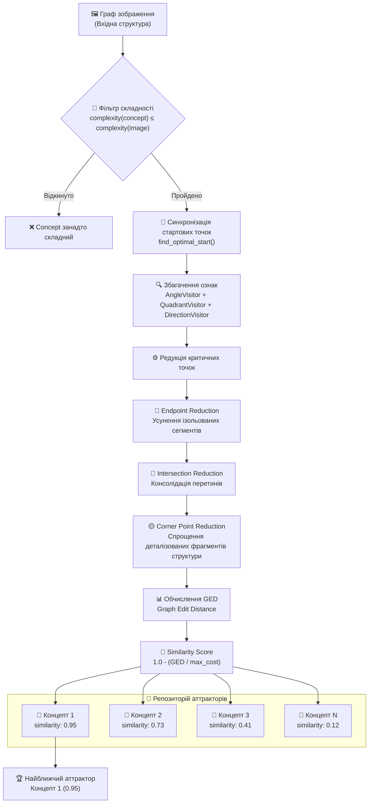

# NaturalAGI

NaturalAGI is a research project focused on developing a natural approach to Artificial General Intelligence through image processing, pattern recognition, and concept formation. The project implements a pipeline for processing visual data, extracting structural features, and forming abstract concepts through defined reduction rules. **The core goal is to build a classification algorithm that learns from training data without using backpropagation or traditional neural network approaches.**

## Getting Started

### Prerequisites

- Python 3.12+
- [uv](https://docs.astral.sh/uv/) (recommended) or pip

### Installation

1. Clone the repository:
```bash
git clone https://github.com/your-org/NaturalAGI.git
cd NaturalAGI
```

2. Install uv (if not already installed):
```bash
curl -LsSf https://astral.sh/uv/install.sh | sh
```

3. Create and activate the virtual environment:
```bash
uv venv natural-agi --python 3.12
source natural-agi/bin/activate  # On Windows: natural-agi\Scripts\activate
```

4. Install dependencies:
```bash
uv sync              # Core dependencies only
uv sync --all-extras # All dependencies including ML and dev tools
```

### Optional Dependency Groups

| Group | Description | Install Command |
|-------|-------------|-----------------|
| dev | Jupyter notebooks, visualization, linting | `uv sync --extra dev` |
| ml | PyTorch, torch-geometric, deep learning tools | `uv sync --extra ml` |


# Project Overview

## 0 Аннотація

### 0.1 Коротке резюме підходу та результатів

### 0.2 Перелік внеску роботи (булет-список)

## 1. Вступ ⚠️ *(WIP: Work in progress)*

1.1. Проблема та мотивація

1.2. Мета проєкту (elevator-pitch 3–5 речень)

1.3. Основні завдання та очікувані результати

1.4. Новизна та відмінності від існуючих ШНМ (3–5 пунктів)

1.5. Чому це важливо зараз (обмеження сучасних підходів)


## 2 Архітектура та загальний пайплайн системи 


### 2.1. Попередня обробка

- **Скелетизація.** Перетворити вхідний контур/зображення на граф‑подібний скелет (вузли/ребра), що зберігає топологію та прибирає товщину й шум.

- **Первинний аналіз контуру (виділення первинних параметрів).** Обчислити базові параметри зі скелета (напр., angles with Ox, length of the lines, coordinates, normalized coordinates, etc.).

### 2.2. Формування концепту

- **Вторинний аналіз контуру (від агрегованої/стабільної стартової точки).** Стартувати з найстабільнішої стартової точки та отримати вторинні параметри (напр., quadrant, half-plane тощо).

- **Структурні та ознакові редукції.** Структурне спрощення графів об’єднанням/видаленням вузлів і ребер; редукція набору параметрів до найбільш загального значення зі збереженням топології структури.

- **Ітеративна композиція концепту.** Багаторазово уточнювати концепт до стабілізації — канонічного аттрактора, що фіксує загальну структуру та статистику класу.

### 2.3. Класифікація (для кожного концепту)

- **Перевірка складності (якщо концепт складніший за зображення — відхилення).** Рання відмова: пропускати концепти, чия мінімальна складність перевищує складність кандидата.

- **Вторинний аналіз контуру (від стартової точки концепту).** Почати з найближчої точки до стартової точки концепту та отримати вторинні ознаки (quadrant, half-plane тощо).

- **Структурна редукція.** Звести граф на етапі інференсу до порівнюваного концепту для коректного структурного зіставлення з концептом.

- **Розрахунок рівня активації.** Обчислити міру відповідності (активацію) за структурною та параметричною подібністю між редукованим зразком і концептом.

### 2.4. Прийняття рішення

- **Порівняння рівнів активації.** Порівняти активації між усіма концептами та обрати найвищу; при нічиїх використовувати найбільш складний концепт.

- **Результат класифікації.** Повернути прогнозований клас разом із рівнем активації/довірою.

## 3. Переддетектори: побудова первісного графа та первісна обробка

### 3.1 Вхідні сигнали нейрона-детектора

### 3.1.1 Вступ та Постановка Проблеми

Функція скелетонізування перетворює растрові зображення у структуровані графові представлення, придатні для аналізу патернів та розпізнавання концепцій. Цей процес вирішує фундаментальну задачу перетворення пікселево-базованих даних зображень у математичні графові структури, зберігаючи при цьому основні топологічні та геометричні характеристики.

Система поєднує класичне морфологічне скелетонізування з навчанням топології на основі нейронних мереж для обробки різноманітних типів зображень, зберігаючи при цьому обчислювальну ефективність. Підхід вирішує обмеження традиційних алгоритмів скелетонізування, які часто створюють фрагментовані або надмірно складні скелетні структури.

#### 3.1.2 Морфологічне Скелетонізування

Морфологічна попередня обробка використовує бінарне порогування з адаптивним вибором порога:

```math
I_{\text{binary}}(x,y) = \begin{cases}
1, & \text{if } I(x,y) > \theta \\
0, & \text{otherwise}
\end{cases}
```

Система застосовує морфологічні операції замикання та видалення малих об'єктів для усунення шуму, зберігаючи при цьому структурні елементи. Скелетонізування використовує перетворення медіальної осі, реалізоване в scikit-image [1], створюючи витончені представлення, які зберігають топологію, водночас зменшуючи структурні елементи до ширини одного пікселя.

#### 3.1.3 Алгоритм Growing Neural Gas

Алгоритм Growing Neural Gas (GNG) [2] забезпечує теоретичну основу для навчання топологічних зв'язків з даних скелетних точок. GNG динамічно конструює мережеві топології шляхом поступового додавання вузлів та коригування з'єднань на основі розподілу вхідних даних.

#### 3.1.4 Спрощення Мережі

Спрощення мережі використовує алгоритм Рамера-Дугласа-Пекера (RDP) [3] для зменшення складності, зберігаючи при цьому основні геометричні характеристики. Алгоритм використовує критерій перпендикулярної відстані для виключення точок.

### 3.2 Архітектура Алгоритму

Конвеєр скелетонізування складається з восьми послідовних етапів:

1. **Бінарна Попередня Обробка**: Адаптивне порогування з морфологічними операціями
2. **Морфологічне Скелетонізування**: Перетворення медіальної осі
3. **Обрізання Гілок**: Усунення хибних гілок за допомогою бібліотеки skan [4]
4. **Витягування Точок**: Перетворення у хмари точок для нейронної обробки
5. **Підгонка Нейронної Мережі**: Навчання топології GNG
6. **Спрощення Мережі**: Зменшення складності на основі RDP
7. **Конструювання Графу**: Генерація графу NetworkX з атрибутами вузлів/ребер
8. **Нормалізація**: Нормалізація координат для інваріантності масштабу

Система використовує адаптивний вибір порога для балансування зменшення шуму із структурною повнотою. Алгоритм починає з високих значень порога для мінімізації шуму та витягування лише найвиразніших структурних особливостей, забезпечуючи чисті скелетні представлення. Однак високі пороги можуть призвести до відключених компонентів, коли основні з'єднувальні структури опиняються нижче порога.

Для вирішення цього компромісу система ітеративно зменшує значення порога при виявленні відключених графів, поступово включаючи раніше "втрачені" структурні деталі, поки не буде досягнуто зв'язності графу. Цей адаптивний підхід забезпечує, що фінальне представлення містить достатню структурну інформацію для збереження топологічної цілісності, зберігаючи при цьому переваги зменшення шуму від початкової обробки з високим порогом.

**Рисунок 1: Повний Конвеєр Скелетонізування**


*Рисунок 1: Всебічна ілюстрація конвеєра скелетонізування, що демонструє поступове перетворення від вхідного растрового зображення через морфологічну обробку, навчання топології нейронної мережі та фінальне графове представлення.*

**Рисунок 2: Аналіз Адаптивного Вибору Порога**

Наступна послідовність демонструє ітеративну стратегію зменшення порога, застосовану для досягнення оптимальної зв'язності при збереженні придушення шуму:


*Рисунок 2: Поступове зменшення порога, що демонструє механізм адаптивного вибору. (а) Початковий високий поріг (θ=200) створює чисті, але потенційно відключені структури. (б) Проміжний поріг (θ=195) починає відновлювати з'єднувальні елементи. (в) Фінальний поріг (θ=180) досягає зв'язності, зберігаючи при цьому основні структурні характеристики. Алгоритм систематично зменшує значення порога, поки не будуть задоволені критерії зв'язності графу.*

Цей ітеративний підхід реалізує математичну оптимізацію:

```math
\theta_{\text{optimal}} = \arg\max_{\theta} \{\theta : \text{connectivity}(G_{\theta}) = \text{true} \land \theta \geq \theta_{\text{min}}\}
```

де G_θ представляє граф, отриманий з бінарного зображення I_θ, а connectivity(G_θ) оцінює обмеження топологічної зв'язності.

### 3.3 Первинний аналіз контуру

#### 3.3.1 Структурні елементи та їх опис

#### 3.3.2 Типи точок

Система розрізняє чотири основні типи точок, кожен з яких характеризується специфічними властивостями та енергетичним рівнем:

- **`Point`** - звичайна точка, місце з'єднання відрізків
- **`EndPoint`** - термінальна точка структури, після якої розвиток структури відсутній
- **`CornerPoint`** - кутова точка з'єднання відрізків, характеризується зміною звичайного напрямку розвитку структури
- **`IntersectionPoint`** - точка з'єднання відрізків з більш ніж двома відрізками

#### 3.3.3 Типи відрізків

Відрізки (`Line`) класифікуються за геометричними характеристиками:

- **`HorizontalLine`** - відрізок з більшою горизонтальною проекцією ніж вертикальною
- **`VerticalLine`** - відрізок з більшою вертикальною проекцією ніж горизонтальною

### 3.3.4 Параметри структурних елементів

#### 3.3.1 Параметри відрізків (Line)

Кожен відрізок характеризується наступними параметрами:

**Геометричні параметри:**
- `x1`, `y1` - координати початку відрізка (абсолютні значення)
- `x2`, `y2` - координати кінця відрізка (абсолютні значення)
- `length` - довжина відрізка (абсолютне значення)

**Кутові та напрямкові параметри:**
- `angle_with_origin` - кут між відрізком та віссю X (0-360° з кроком 5°)
- `quadrant` - квадрант розташування відрізка при аналізі контуру (1-4)
- `horizontal_direction` - напрямок горизонтального розвитку ["RIGHT", "LEFT"]
- `vertical_direction` - напрямок вертикального розвитку ["TOP", "BOTTOM"]

#### 3.3.5 Параметри точок

Точки характеризуються параметрами:

**Просторові параметри:**
- `x`, `y` - координати точки (абсолютні значення)
- `relative_distance` - відстань до центру структури (абсолютне значення)

**Геометричні параметри:**
- `angle` - кут між двома відрізками, що сходяться в точці (0-360°)
- `segments` - сегменти розташування відносно центру структури ["TOP", "BOTTOM", "LEFT", "RIGHT"]

### 3.4 Структура первісного графу

Після етапів скелетонізації та попереднього аналізу структура подається у вигляді графа, що містить точки, відрізки та їх параметри.


Граф складається з точок і відрізків; кожна точка належить принаймні одному відрізку.

:::mermaid
graph TD
A(EndPoint) -- Належить до --> B(Line)
C(EndPoint) -- Належить до --> B(Line)
:::

Точка може належати кільком відрізкам одночасно (точка перетину або кутова точка), тому вона може представлятися як `IntersectionPoint` або `CornerPoint`.

:::mermaid
graph TD
A(EndPoint) -- Належить до --> B(Line)
C(IntersectionPoint) -- Належить до --> B(Line)
C(IntersectionPoint/CornerPoint) -- Належить до --> D(Line)
E(EndPoint) -- Належить до --> D(Line)
:::

Сформований первісний граф є базовою структурою та моделлю постсинаптичних сигналів.

### 3.5 Системи координат

Ключовою проблемою в розпізнаванні образів та аналізі зображень є виділення ознак, інваріантних до геометричних перетворень, таких як переміщення, обертання та масштабування. Для вирішення цієї задачі запропонована методологія використовує фреймворк подвійної системи координат для представлення та аналізу структурної інформації, отриманої із зображень. У цьому розділі формалізовано визначення та застосування двох різних систем координат: Абсолютної (СК_A) та Відносної (СК_R).

#### 3.5.1 Абсолютна система координат (СК_A)

Абсолютна система координат (СК_A) визначається як основна система відліку, що зазвичай відповідає піксельним координатам вхідного зображення. Усі початкові точки даних, такі як вузли та ребра графа, згенерованого під час процесу скелетонізації, спочатку представлені в СК_A. Ця система забезпечує пряме відображення просторового розташування ознак на вихідному зображенні. Однак представлення в СК_A є чутливим до положення об'єкта, що означає, що просте переміщення об'єкта призведе до абсолютно іншого набору координат для його складових точок. Ця залежність від положення робить СК_A непридатною для надійної класифікації об'єктів та формування концептів, де ідентичність об'єкта не повинна бути прив'язана до його місцезнаходження.


#### 3.5.2 Відносна система координат (СК_R)

Для досягнення інваріантності до переміщення — фундаментальної вимоги для узагальненого зіставлення зразків — ми вводимо Відносну систему координат (СК_R). Початок СК_R визначається в обчисленому центрі аналізованої структури. Цей центр може бути визначений різними методами, наприклад, як геометричний центроїд (центр мас) усіх точок у графовому представленні структури. Перераховуючи координати всіх точок відносно цього структурного центру, ми ефективно нормалізуємо положення об'єкта. Отримане представлення в СК_R залежить лише від внутрішньої геометрії структури, а не від її абсолютного розташування на зображенні. Це перетворення є першим кроком до створення канонічного представлення об'єкта.


#### 3.5.3 Мета та забезпечення інваріантності

Основна мета цього підходу з подвійною системою — відокремити внутрішні геометричні властивості об'єкта від його зовнішніх позиційних властивостей. Хоча СК_A є важливою для початкової обробки та візуалізації, СК_R є критично важливою для наступних етапів виділення ознак, класифікації та створення концептів. Перетворення з СК_A в СК_R гарантує, що виділені ознаки є інваріантними до переміщення. Подальші етапи аналізу можуть розвивати цей підхід, нормалізуючи дані щодо обертання (наприклад, шляхом вирівнювання структури за її головною віссю) та масштабу (наприклад, шляхом нормалізації координат до стандартного розміру), досягаючи таким чином повної геометричної інваріантності. Цей багаторівневий підхід до нормалізації є наріжним каменем побудови надійної та узагальненої системи візуального розуміння.

### 3.6 Сегментація

Для переходу від кількісного опису геометрії до якісного, що є ключовим для узагальнення та формування абстрактних концептів, у проєкті вводиться ієрархічна система просторової сегментації. Ця система структурує простір у відносній системі координат (СК_R) і дозволяє класифікувати відрізки та точки контуру на основі їхнього розташування відносно початкової точки. Сегментація функціонує як набір порогових рівнів для визначення якісних просторових параметрів.

Процес сегментації реалізовано на трьох рівнях деталізації:

1.  **Сегментація на півплощини:** На найвищому рівні абстракції простір ділиться на дві півплощини (наприклад, верхню та нижню, або ліву та праву) відносно осі, що проходить через початкову точку. Це дозволяє отримати найбільш загальну якісну характеристику напрямку відрізку.

2.  **Сегментація на квадранти:** Наступний рівень деталізації передбачає поділ простору на чотири квадранти. Це забезпечує більш точну класифікацію напрямку, дозволяючи розрізняти чотири основні напрямки (наприклад, "вперед-вгору", "назад-вгору", "назад-вниз", "вперед-вниз").

3.  **Сегментація на сегменти квадрантів:** Для найтоншої якісної оцінки кожен квадрант може бути додатково поділений на менші кутові сегменти. Це дає можливість фіксувати більш специфічні напрямки, що може бути критично для розрізнення складних структур.

Цей ієрархічний підхід дозволяє системі аналізувати об'єкти на різних рівнях абстракції. Використовуючи ці сегментації як порогові рівні, система перетворює неперервні кутові метрики на дискретний набір якісних ознак. Наприклад, замість точного кута відрізку (наприклад, 45 градусів), система класифікує його як такий, що належить до "першого квадранта" або навіть до певного "сегмента першого квадранта". Такий підхід значно підвищує стійкість моделі до незначних варіацій у формі та орієнтації, що є необхідною умовою для створення узагальнених візуальних концептів.

### 3.4 Типи та правила редукції

Система застосовує правила редукції для оптимізації структурного представлення:

#### 3.4.1 Редукція точки перетину до кінцевої точки

**Рисунок 3: Редукція IntersectionPoint → EndPoint**


*Якщо після структурної редукції кількість відрізків (`Line`) для заданої точки дорівнює 1, то точка перетину (`IntersectionPoint`) спрощується до кінцевої точки (`EndPoint`).*

#### 3.4.2 Редукція точки перетину до кутової точки

**Рисунок 4: Редукція IntersectionPoint → CornerPoint**
⚠️


*Якщо після структурної редукції кількість відрізків (`Line`) для заданої точки не відповідає визначеній кількості для точки перетину (`IntersectionPoint`), то точка перетину спрощується до кутової точки (`CornerPoint`).*

#### 3.4.3 Редукція кутової точки

Редукція кутової точки (`CornerPoint`) до кінцевої точки (`EndPoint`) виконується за тими ж правилами, що і для точки перетину (`IntersectionPoint`).

## 4. Енергетичний ландшафт і градієнтний спуск (⚠️ WIP)

### 4.1 Структура зміни параметрів, сегментація

#### 4.1.1 Енергетичні рівні параметрів

При навчанні (формуванні концепту) система узагальнює значення параметрів і переходить на інші енергетичні рівні, реалізуючи градієнтний спуск по енергетичному ландшафту для пошуку параметрів, які належатимуть до всіх тренувальних даних концепту.

Система застосовує різні стратегії енергетичної оптимізації залежно від типу даних параметра:

#### 4.1.2 Стратегії енергетичної оптимізації за типами даних

##### 4.1.2.1 Абсолютні значення (числові параметри)

**Двурівнева енергетична структура:**
- **Вищий рівень енергії**: абсолютне значення величини параметра
- **Нижчий рівень енергії**: діапазон значень для всіх тренувальних даних концепту

*Застосовується для:* координати (`x`, `y`), довжина відрізка (`length`), відстань (`relative_distance`), кути (`angle`, `angle_with_origin`)

##### 4.1.2.2 Списки значень (множинні параметри)

**Стратегія перетину множин:**
- **Вищий рівень енергії**: конкретне значення зі списку
- **Нижчий рівень енергії**: перетин множин усіх тренувальних даних

*Застосовується для:* сегменти (`segments`), які можуть містити декілька значень ["TOP", "BOTTOM", "LEFT", "RIGHT"]

##### 4.1.2.3 Строкові значення (категоріальні параметри)

**Стратегія бінарної відповідності:**
- **Енергія = 1**: повна відповідність строкового значення у всіх тренувальних даних
- **Енергія = 0**: відсутність повної відповідності → параметр видаляється зі структурного елементу

*Застосовується для:* напрямки (`horizontal_direction`, `vertical_direction`), квадранти (`quadrant`)

#### 4.1.3 Приклади енергетичної оптимізації

##### 4.1.3.1 Абсолютні значення

**Приклад з кутом:**
- Семпл 1: кут 90°, Семпл 2: кут 85°, Семпл 3: кут 95°
- **Результат**: діапазон [85°-95°], центр 90°


##### 4.1.3.2 Списки значень

**Приклад з сегментами:**
- Семпл 1: ["TOP", "RIGHT"], Семпл 2: ["TOP", "LEFT"]
- **Результат**: перетин = ["TOP"]


##### 4.1.3.3 Строкові значення

**Приклад з напрямком:**
- Семпл 1: "RIGHT", Семпл 2: "RIGHT", Семпл 3: "LEFT"
- **Результат**: відсутність повної відповідності → параметр видаляється (енергія = 0)


# 5. Етап формування концепту в процесі навчання

## 5.1 Вступ та Постановка Проблеми

Етап формування концепту представляє центральний компонент системи NaturalAGI, який відрізняється від традиційних підходів машинного навчання відсутністю градієнтного спуску та нейронних мереж. Замість цього система використовує структурний аналіз графів та ітеративне знаходження спільних підструктур для створення абстрактних представлень класів об'єктів.

**Фундаментальна проблема** полягає в необхідності навчитися розпізнавати абстрактні структурні шаблони з колекції графових представлень зображень, що належать до одного класу, при збереженні лише найбільш значущих топологічних та геометричних характеристик, спільних для всіх навчальних зразків.

**Концептуальна основа**: Формування концепту розглядається як **етап формування атрактору** у послідовності навчальних графів. Для набору графів зображень $\{G_1, G_2, \dots, G_n\}$, що представляють структурні шаблони одного класу об'єктів, мета полягає у побудові концептуального графу $C$, який зберігає суттєві структурні елементи, присутні у всіх навчальних зразках, при усуненні специфічних для зразків варіацій та шуму.

**Інкрементальний підхід**

$$
C_0 = G_1
$$

$$
C_{i+1}=\mathcal{A}(C_i, G_{i+1}),\quad i=1,2,\dots,n-1
$$

де $\mathcal{A}$ позначає процедуру **формування атрактору**, яка інтегрує новий граф у поточний концепт, зберігаючи тільки узгоджені та стійкі підструктури.

### 5.1.1 Енергетичний ландшафт концепту

Раніше ми розглядали поняття *енергетичного ландшафту* — багатовимірної поверхні, мінімальні точки якої відповідають стійким конфігураціям системи. Для відкритих систем визначається ландшафт спокою $E_{\mathrm{l\,rest}}$ із глобальним мінімумом, енергія якого позначається порогом $\mathrm{Tr}_1$. Аналогічно, у процесі формування концепту граф $C_i$ можна розглядати як поточну «точку» на енергетичному ландшафті класу; **процедура формування атрактору** поступово зміщує систему до глибшого мінімуму, де узгодженість між зразками максимальна.

У цьому контексті *структурна редукція* виконує роль зниження локальної енергії під час переходу від індивідуальних графів до узагальненого концепту, що відповідає руху по ландшафту до більш глобального мінімуму.

### 5.1.2 Пороги $\mathrm{Tr}_1,\;\mathrm{Tr}_2,\;\mathrm{Tr}_3$

* **$\mathrm{Tr}_1$ (поріг спокою).** Мінімальна енергія, до якої система прагне у відсутності зовнішнього впливу; у нашій задачі це «стабільний» концепт після обробки всіх зразків.
* **$\mathrm{Tr}_2$ (поріг активації).** Позначає додаткову енергію, необхідну для переходу системи зі стану спокою до активного навчання чи оновлення концепту; у енергетичному ландшафті він відповідає глибині «ям» та «каналів».
* **$\mathrm{Tr}_3$ (поріг структурної стійкості).** Визначає область флуктуацій, після яких порушується цілісність структурних зв’язків; перевищення $\mathrm{Tr}_3$ у графі означає втрату топологічної цілісності концепту.

У навчальному циклі NaturalAGI $\mathrm{Tr}_2$ корелює з моментом, коли новий граф $G_{i+1}$ містить достатньо відмінних елементів, щоб викликати зміну в існуючому концепті, тоді як $\mathrm{Tr}_3$ визначає межу, після якої концепт необхідно перебудувати (наприклад, при появі підкласів).

**Поріг $\mathrm{Tr}_3$ ще не реалізований та потребує додаткового дослідження практичної реалізації.**

### 5.1.3 Інформаційна та термодинамічна ентропія

Ми трактуємо інформацію як «узагальнене суб’єктивне представлення енергії у вибраній знаковій системі», що об’єднує термодинамічну й інформаційну ентропії. У нашій моделі це проявляється так:

* Скорочення кількості структурних елементів (редукція) зменшує мікроскопічні стани графа, отже — його ентропію.
* Одночасно, узгодження параметрів (довжини, кутів, сегментів) під час формування концепту збільшує їх «внутрішню упорядкованість», що відповідає зменшенню енергії системи.

## 5.2 Опис редукції типів структурних елементів

Система редукції типів структурних елементів забезпечує гнучке оброблення структурних варіацій між навчальними зразками через впровадження ієрархічної схеми редукції, що дозволяє витончене оброблення структурних відмінностей.

### 5.2.1 Ієрархія редукції критичних точок

Система встановлює чітку ієрархічну таксономію редукції для критичних точок:

```
IntersectionPoint → CornerPoint → Point
```

**Правила редукції точок перетину:**
- Якщо після структурної редукції кількість відрізків для заданої точки дорівнює 1, то `IntersectionPoint` спрощується до `EndPoint`
- Якщо кількість відрізків не відповідає визначеній кількості для точки перетину, то `IntersectionPoint` спрощується до `CornerPoint`

**Правила редукції кутових точок:**
- `CornerPoint` може бути спрощена до `EndPoint` за тими ж правилами, що і для `IntersectionPoint`
- `CornerPoint` може бути редукована до загального типу `Point` при втраті специфічних кутових характеристик

### 5.2.2 Ієрархія редукції відрізків

Система також реалізує редукцію для відрізків:

```
VerticalLine → Line
HorizontalLine → Line
```

### 5.2.3 Стратегія редукції кінцевих точок (EndPoint)

Редукція кінцевих точок реалізує складний алгоритм, що забезпечує структурну узгодженість між концептом та навчальними зразками через видалення надлишкових або неузгоджених кінцевих точок.

#### 5.2.3.1 Семантична ідентифікація кінцевих точок

**Автоматичне виявлення**: Система автоматично ідентифікує вузли як кінцеві точки, якщо вони мають тільки одне з'єднання та не є стартовими точками:

```math
\text{IsEndPoint}(v) = \begin{cases}
\text{true}, & \text{if } \deg(v) = 1 \land v \notin \text{StartPoints} \\
\text{false}, & \text{otherwise}
\end{cases}
```

**Коригування міток**: Якщо вузол семантично є кінцевою точкою, але не має відповідної мітки, система автоматично додає мітку `EndPoint` та `Point`.

#### 5.2.3.2 Редукція на основі ступеня вузла

**Перевірка відповідності**: Для кожного вузла, помітченого як `EndPoint`, система перевіряє відповідність його ступеня (кількість з'єднань):

- Якщо `EndPoint` має ступінь ≠ 1, мітку `EndPoint` видаляється
- Додається мітка `CornerPoint` для збереження структурної ролі

#### 5.2.3.3 Двофазний алгоритм редукції

**Фаза 1: Редукція за порогом подібності**

Система обчислює матрицю подібності між кінцевими точками концепту та зображення:

```math
S_{ij} = \text{Similarity}(\text{endpoint}_i^{concept}, \text{endpoint}_j^{image})
```

Кінцеві точки з максимальною подібністю нижче порога $\theta = 0.2$ видаляються як неузгоджені.

**Фаза 2: Вирівнювання кількості**

Якщо після першої фази кількість кінцевих точок у концепті та зображенні різна, система:

1. Ідентифікує граф з більшою кількістю кінцевих точок
2. Обчислює надлишок: $\Delta = |\text{endpoints}_{concept}| - |\text{endpoints}_{image}|$
3. Вибирає $\Delta$ кінцевих точок з найнижчою подібністю для видалення

#### 5.2.3.4 Алгоритм знаходження шляху для видалення

**Пошук шляху до критичної точки**: Для кожної кінцевої точки, що підлягає видаленню, система знаходить шлях до наступної критичної точки:

<!-- TODO додати зображення яке показує цей процес -->

**Видалення шляху**: Система видаляє всі вузли на шляху від кінцевої точки до (але не включаючи) наступної критичної точки, зберігаючи топологічну цілісність графу.

#### 5.2.3.5 Обробка виняткових ситуацій

**Відсутність кінцевих точок**: 
- Якщо концепт не має кінцевих точок, всі кінцеві точки зображення видаляються
- Якщо зображення не має кінцевих точок, всі кінцеві точки концепту видаляються

**Неможливість знаходження шляху**: Якщо система не може знайти шлях від кінцевої точки до критичної точки, генерується виняток для забезпечення структурної цілісності.

**Принцип збереження критичних елементів**: `StartPoint` та критичні точки перетину не підлягають видаленню під час редукції кінцевих точок, забезпечуючи збереження суттєвих структурних меж і опорних точок для структурного аналізу. Це гарантує, що топологічна цілісність графу зберігається навіть після агресивної редукції.

### 5.2.4 Механізм енергетичної оптимізації

При редукції типу точки (від точки перетину до кінцевої або кутової точки) енергія системи зменшується, що відповідає принципу мінімізації енергії. Це реалізує природний градієнт спуску по енергетичному ландшафту для пошуку параметрів, які належатимуть до всіх тренувальних даних концепту.

## 5.3 Знаходження стартової точки для обходу графу

Вибір стартової точки є критичним етапом, що забезпечує консистентні опорні кадри для порівняння та інтеграції графів. Система використовує кластерний аналіз критичних точок для ідентифікації оптимальних стартових позицій.

### 5.3.1 Стратегія вибору на основі кластеризації

**Множинна кластерізація**: Алгоритм використовує декілька методів кластеризації (DBSCAN, OPTICS, Agglomerative Clustering) для аналізу просторового розподілу критичних точок у всіх навчальних зразках. Процес кластеризації оперує нормалізованими координатами для забезпечення інваріантності до масштабу:

```math
(x_{\text{norm}}, y_{\text{norm}}) = (x - x_{\text{centroid}}, y - y_{\text{centroid}})
```

**Адаптивний вибір параметрів**: Система реалізує адаптивне налаштування параметрів кластеризації на основі характеристик зразків:

- **Epsilon кластеризації**: Інкрементально регулюється від 0.01 до максимального порога
- **Мінімальна кількість зразків**: Масштабується як відсоток від загальної кількості зразків (40%-80%)
- **Максимальна кількість ітерацій**: Обмежується для запобігання надмірних обчислень (зазвичай 15)

### 5.3.2 Класифікація типів структур

Стратегія вибору включає аналіз типу структури, що розрізняє відкриті та закриті структурні шаблони:

```math
\text{StructureType} = \begin{cases}
\text{OPEN}, & \text{if } \exists G_i : \text{EndPoint} \in \text{CriticalPoints}(G_i) \\
\text{CLOSED}, & \text{otherwise}
\end{cases}
```

### 5.3.3 Анкерна стратегія обходу

**Анкерування у StartPoint**: Алгоритм ідентифікує спеціальні вузли `StartPoint` в обох графах і використовує їх як анкери для початкового зіставлення, забезпечуючи структурно значущі точки для вирівнювання.

**Зростання від анкерів**: Після встановлення анкерів алгоритм розширює спільний граф назовні від цих точок через граф, підтримуючи "фронтир" вузлів, суміжних з поточним збігом, та ітеративно знаходить найкращі збіги для додавання.

## 5.4 Знаходження аттрактору. Переходи між енергетичними рівнями. Приклад формування концепту для цифри 3

### 5.4.1 Концепція енергетичного аттрактору

Енергетичний аттрактор представляє стабільний стан концепту, в якому система досягає мінімальної енергії при збереженні максимальної інформативності. Процес формування концепту можна розглядати як пошук глобального мінімуму в енергетичному ландшафті структурних параметрів.

### 5.4.3 Приклад формування концепту для цифри 3


*First step is getting the first image as the initial concept.*

<br>


*On the second iteration we see that the image has additional end point, so we remove the redundant endpoint branch and reduce the nearest IntersectionPoint to the CornerPoint. Then we update the concept graph properties with the new information obtained from the image graph.*

<br>


*Third iteration of concept formation. We have the redundant corner point in the lower half of the structure, we remove it and align the neighboring points, so we don't have the gap between the points. Then we update the concept graph properties with the new information obtained from the image graph.*

<br>


*Fourth iteration of concept formation. We see the noise in the graph, we identify that as the redundant substructure (Endpoint and Line till the nearest IntersectionPoint). Then we remove it and update the concept graph properties with the new information obtained from the image graph.*

**We repeat this process until we have stable concept graph that represents the object class.**

## 5.5 Порівняльна таблиця для різної кількості аугментацій

### 5.5.1 Метрики якості концепту

<!-- TODO додати метрики якості концепту -->

### 5.5.2 Аналіз ефективності

<!-- TODO додати аналіз ефективності -->

### 5.5.3 Якісні характеристики

<!-- TODO додати якісні характеристики -->

# 6. Інференс і конкуренція реакцій (WTA)

## 6.1 Інференс як редукція до аттрактора(ів)

### Концептуальна основа інференсу

В системі інференс розглядається як процес поступової редукції вхідного структурного представлення (графа зображення) до одного або кількох найближчих **аттракторів** - канонічних структурних паттернів, що зберігаються в репозиторії концептів. Цей процес ґрунтується на принципі, що кожен концепт представляє собою стабільний стан в просторі структурних конфігурацій, до якого можуть бути приведені схожі структури через послідовність операцій редукції.

### Аттрактори як концепти

**Аттрактори** в системі - це концепти, що зберігаються у Neo4j як графові структури з такими характеристиками:

```
Аттрактор = {
    структурна_топологія: Graph(V, E),
    критичні_точки: {intersection, endpoint, corner},
    геометричні_властивості: {angles, directions, positions},
    семантичні_мітки: {labels, types, features}
}
```

Кожен аттрактор представляє "басейн притягання" для схожих структур - множину всіх графів зображень, які можуть бути приведені до цього концепту через допустимі операції редукції.

### Оператори редукції

Процес приведення до аттракторів здійснюється через послідовність **операторів редукції**, кожен з яких має специфічну роль:

#### 1. Фільтр складності (Complexity Filter)

```math
\text{ComplexityFilter}(G_{\text{image}}, C) = 
\begin{cases}
\text{PASS}, & \text{if } \mathcal{C}(C) \leq \mathcal{C}(G_{\text{image}}) \\
\text{REJECT}, & \text{otherwise}
\end{cases}
```

де $\mathcal{C}(G) = |V(G)| + |E(G)|$ - структурна складність графа

**Енергетична інтерпретація**: Відкидає аттрактори з вищою структурною складністю за принципом монотонності - складніша структура не може бути відновлена з простішої.

#### 2. Стартова синхронізація (Start Point Alignment)

**Псевдокод:**
```
АЛГОРИТМ StartPointAlignment(G_image, G_concept):
    1. s_concept ← FindOptimalStart(G_concept)
    2. s_image ← FindCorrespondingStart(G_image, s_concept)  
    3. G_aligned ← ReorderTraversal(G_image, s_image)
    4. ПОВЕРНУТИ G_aligned
```

**Роль**: Встановлює консистентну точку відліку для структурного порівняння, мінімізуючи варіативність в просторі можливих відповідностей.

#### 3. Збагачення ознак (Feature Enhancement)
Застосовує набір visitor-патернів для обчислення додаткових структурних властивостей:

- **AngleVisitor**: обчислює кутові характеристики між сегментами
- **QuadrantVisitor**: визначає просторове розташування елементів  
- **DirectionVisitor**: аналізує напрямки структурного розвитку

#### 4. Редукція критичних точок (Critical Point Reduction)

Три спеціалізовані стратегії послідовно спрощують структуру:

**a) Endpoint Reduction Strategy**

**Псевдокод:**
```
АЛГОРИТМ EndpointReduction(G_image, G_concept):
    1. E_image ← GetEndpoints(G_image)
    2. E_concept ← GetEndpoints(G_concept)
    3. S ← CalculateSimilarityMatrix(E_image, E_concept)
    
    4. // Фаза 1: видалення за порогом подібності
    5. E_low ← {e ∈ E_image | max(S[e]) < θ_similarity}
    6. FOREACH e ∈ E_low DO RemoveEndpointPath(G_image, e)
    
    7. // Фаза 2: балансування кількості
    8. IF |E_image| > |E_concept| THEN
    9.     Δ ← |E_image| - |E_concept|
    10.    E_excess ← SelectLowestSimilarity(E_image, Δ)
    11.    FOREACH e ∈ E_excess DO RemoveEndpointPath(G_image, e)
    
    12. ПОВЕРНУТИ G_image
```

**Енергетична роль**: Усуває "шум" в вигляді ізольованих сегментів, що не впливають на основну структуру.

**b) Intersection Reduction Strategy**

**Псевдокод:**
```
АЛГОРИТМ IntersectionReduction(G_image, G_concept):
    1. I_image ← GetIntersectionPoints(G_image)
    2. I_concept ← GetIntersectionPoints(G_concept)
    3. S ← CalculateSimilarityMatrix(I_image, I_concept)
    
    4. IF |I_image| > |I_concept| THEN
    5.     Δ ← |I_image| - |I_concept|
    6.     I_excess ← SelectLowestSimilarity(I_image, Δ)
    7.     
    8.     FOREACH p ∈ I_excess DO
    9.         path ← FindPathToNearestCritical(G_image, p)
    10.        target ← GetTargetNode(path)
    11.        MergeIntersectionPoints(G_image, path, target)
    
    12. ПОВЕРНУТИ G_image
```

**Енергетична роль**: Консолідує фрагментовані перетини в цілісні структурні вузли.

**c) Corner Point Reduction Strategy**

**Псевдокод:**
```
АЛГОРИТМ CornerPointReduction(G_image, G_concept):
    1. P_concept ← FindCriticalPaths(G_concept)
    2. P_image ← FindCriticalPaths(G_image)
    3. 
    4. FOREACH path_c ∈ P_concept DO
    5.     path_i ← FindBestMatchingPath(path_c, P_image)
    6.     C_concept ← GetCornerPoints(path_c)
    7.     C_image ← GetCornerPoints(path_i)
    8.     
    9.     IF |C_image| > |C_concept| THEN
    10.        Δ ← |C_image| - |C_concept|
    11.        S ← CalculateSimilarityMatrix(C_image, C_concept)
    12.        C_excess ← SelectLowestSimilarity(C_image, Δ)
    13.        FOREACH c ∈ C_excess DO RemoveCornerPoint(G_image, c)
    
    14. ПОВЕРНУТИ G_image
```

**Енергетична роль**: Спрощує деталізовані фрагменти структури.

### Оцінка близькості: Graph Edit Distance (GED)

**Близькість** до аттрактора вимірюється через **Graph Edit Distance** - мінімальну кількість операцій редагування, необхідну для перетворення редукованого графа зображення в граф концепту.

#### Енергетична інтерпретація GED

В контексті аттракторів, GED інтерпретується як **енергія активації**, необхідна для переходу з поточного стану (редукований граф зображення) до цільового стану (концепт-аттрактор):

```
E_activation = GED(G_reduced, G_concept)
Similarity = 1.0 - (E_activation / E_max)
```

де `E_max = |V_image| + |V_concept| + |E_image| + |E_concept|` - максимально можлива енергія.

#### Операції редагування та їх енергетичні вартості

**1. Вартості підстановки вершин (Node Substitution)**

```math
C_{\text{node}}(v_i, v_c) = \begin{cases}
\infty, & \text{if } \mathcal{L}(v_c) \not\subseteq \mathcal{L}(v_i) \\
\sum_{p \in P_{\text{common}}} \min\left(C_{\text{prop}}(v_i^p, v_c^p), \frac{1}{|P_{\text{common}}|}\right), & \text{otherwise}
\end{cases}
```

де:
- $\mathcal{L}(v)$ - множина лейблів вершини $v$
- $P_{\text{common}} = P_i \cap P_c \cap F$ - спільні властивості для порівняння
- $F$ - множина предвизначених ознак для порівняння

**2. Спеціалізовані функції вартості властивостей**

**Числові властивості** (координати, кути):
```math
C_{\text{numeric}}(v_i, v_c) = \begin{cases}
0.0, & \text{if } |v_i - v_c| < \epsilon \\
1.0, & \text{otherwise}
\end{cases}
```
де $\epsilon = 10^{-10}$ - толерантність для числових порівнянь.

**Діапазонові властивості** (flexible ranges):
```math
C_{\text{range}}(v_i, R_c) = \begin{cases}
1.0, & \text{if } v_i \notin [R_{\min}, R_{\max}] \\
0.0, & \text{if } R_{\max} = R_{\min} \\
\frac{|v_i - R_{\text{center}}|}{R_{\text{width}}/2} \times C_{\max}, & \text{if } v_i \in [R_{\min}, R_{\max}]
\end{cases}
```
де $R_{\text{width}} = R_{\max} - R_{\min}$, $R_{\text{center}} = \frac{R_{\max} + R_{\min}}{2}$.

**Список властивостей** (підмножини):
```math
C_{\text{list}}(L_i, L_c) = \begin{cases}
0.0, & \text{if } L_c \subseteq L_i \\
1.0, & \text{otherwise}
\end{cases}
```

**3. Операції з ребрами**

```math
\begin{align}
C_{\text{edge\_del}}(e) &= 0.1 \\
C_{\text{edge\_ins}}(e) &= 0.1 \\
\text{EdgeMatch}(e_1, e_2) &= \text{TRUE}
\end{align}
```

#### Процес обчислення близькості

**Псевдокод:**
```
АЛГОРИТМ CalculateProximity(G_reduced, G_concept):
    1. // Обчислення оптимального шляху редагування
    2. (edit_path, E_total) ← OptimalEditPaths(
         G_reduced, G_concept,
         C_node, C_del=1.0, C_ins=1.0, 
         EdgeMatch, C_edge_del, C_edge_ins
       )
    
    3. // Нормалізація до similarity score  
    4. E_max ← |V(G_reduced)| + |V(G_concept)| + 
              |E(G_reduced)| + |E(G_concept)|
    
    5. // Перетворення енергії в similarity
    6. similarity ← 1.0 - (E_total / E_max)
    7. ПОВЕРНУТИ max(0.0, min(1.0, similarity))
```

**Математична формалізація:**
```math
\text{Similarity}(G_{\text{reduced}}, G_{\text{concept}}) = 1 - \frac{\text{GED}(G_{\text{reduced}}, G_{\text{concept}})}{E_{\max}}
```

де $E_{\max} = |V_{\text{reduced}}| + |V_{\text{concept}}| + |E_{\text{reduced}}| + |E_{\text{concept}}|$

#### Інтерпретація результатів близькості

- **Similarity = 1.0**: Ідеальне співпадіння (нульова енергія активації)
- **Similarity ≥ 0.8**: Сильна структурна подібність (низька енергія)  
- **Similarity ≥ 0.6**: Помірна подібність (середня енергія)
- **Similarity < 0.4**: Слабка подібність (висока енергія)
- **Similarity = 0.0**: Відсутність структурної подібності

### Блок-схема процесу інференсу



### Загальний алгоритм інференсу

Процес інференсу в NaturalAGI можна формалізувати як **енергетичну оптимізацію**:

```
Inference: G_input → argmin_{C∈Concepts} E_activation(G_input, C)

де E_activation = GED(Reduce(G_input), C)
```

#### Етапи інференсу (згідно блок-схеми):

**1. Пре-фільтрація (Energy Barriers)**
- Відкидання концептів з вищою структурною складністю
- Базується на принципі монотонності складності

**2. Структурна підготовка (State Preparation)**  
- Синхронізація стартових точок для консистентного порівняння
- Збагачення ознак для повнішого структурного опису

**3. Послідовна редукція (Descent to Attractors)**
- Endpoint reduction: усунення структурного "шуму"
- Intersection reduction: консолідація фрагментованих вузлів  
- Corner point reduction: спрощення деталізованих фрагментів структури

**4. Енергетичне оцінювання (Proximity Measurement)**
- Обчислення GED між редукованим графом та кожним концептом
- Перетворення в similarity score через нормалізацію

**5. Селекція аттрактора (Attractor Selection)**
- Ідентифікація концепту з найвищим similarity score
- Класифікація за енергетичними рівнями

Цей підхід забезпечує **робастну класифікацію** структурних паттернів через природну аналогію з фізичними системами, де стабільні конфігурації (концепти) діють як аттрактори для схожих структур в просторі можливих конфігурацій.

## 6.2 Карти концепт-нейронів і WTA

Система класифікації організована як **розподілена нейронна мережа**, де кожен концепт функціонує як спеціалізований нейрон з власною топологічною специфічністю. Ця архітектура забезпечує паралельну обробку та конкурентну селекцію через біологічно інспіровані механізми активації.

### 6.2.1 Організація концепт-нейронів

**Топологія мережі**: Концепт-репозиторій містить N концепт-нейронів, кожен з яких представляє унікальну структурну конфігурацію у просторі графових патернів. Паралельна архітектура дозволяє одночасну активацію всіх нейронів при надходженні вхідного сигналу (image graph).

**Активаційна функція**: Кожен концепт-нейрон i обчислює рівень активації через нормалізовану схожість:

```
activation_i = max(0, min(1, 1 - GED(G_image, G_concept_i) / max_cost_i))
```

де max_cost_i = |V_image| + |V_concept_i| забезпечує розмірно-інваріантну нормалізацію.

### 6.2.2 Механізми збудження та гальмування

**Збудження (Excitation)**: Система застосовує градаційну активацію через тип-специфічні функції схожості. Висока структурна відповідність призводить до сильної активації нейрона, при цьому толерантність до мінорних геометричних варіацій забезпечує робастність розпізнавання.

**Гальмування (Inhibition)**: Двоступенева система гальмування запобігає неправильним активаціям:

1. **Complexity-based inhibition**: Концепт-нейрони з складністю, що перевищує складність вхідного зображення, автоматично блокуються:
   ```
   inhibition_i = 1 if complexity(G_concept_i) > complexity(G_image) else 0
   ```

2. **Label compatibility inhibition**: Семантична несумісність призводить до повного гальмування активації.

### 6.2.3 Winner-Take-All механізм

**Конкурентна селекція**: Система реалізує soft Winner-Take-All правило через багатокритеріальне ранжування активованих нейронів:

```
winner = argmax_i {similarity_i | similarity_i > θ}
```

**Ієрархічна конкуренція**: Первинна конкуренція відбувається за рівнем схожості, вторинна - за структурною складністю концепту. Це забезпечує селекцію найбільш специфічного та релевантного паттерну.

### 6.2.4 Нормалізація відповідей

**Адаптивна нормалізація**: Система використовує розмірно-залежну нормалізацію для забезпечення справедливої конкуренції між концептами різної складності:

```
normalized_response = (max_possible_cost - actual_cost) / max_possible_cost
```

**Стабілізація активації**: Обмеження діапазону [0,1] запобігає перенасиченню та забезпечує стабільну поведінку мережі при варіативних вхідних даних.

Ця нейро-інспірована архітектура забезпечує **ефективну структурну класифікацію** через розподілену обробку, конкурентну селекцію та адаптивну нормалізацію, демонструючи високу точність (82.4%) та збалансованість (F1-score: 82.3%) у розпізнаванні графових патернів.

## 6.3 Тай-брейки й допоміжні метрики

### Єдиний метрик подібності: GED-базований score

У системі класифікації подібність між концептом і зображенням обчислюється **виключно через Graph Edit Distance (GED)**:

```math
\text{similarity}(C_i) = 1.0 - \frac{\text{GED}(G_{\text{image}}, G_{C_i})}{\text{max\_possible\_cost}}
```

де:
```math
\text{max\_possible\_cost} = \max(|V_{\text{image}}| + |V_{C_i}|, 1)
```

### Простий тай-брейк механізм

При ідентичних similarity scores система використовує **двокритеріальне сортування**:

```
ALGORITHM SimpleTieBreaking
INPUT: classification_results[]
OUTPUT: ranked_results[]

1. FILTER results WHERE is_minor = true
2. SORT results by:
   a. similarity (descending)
   b. concept_complexity (descending)
3. RETURN sorted_results
```

### Метрика структурної складності

**Складність концепту** обчислюється як проста сума:

```math
\text{complexity}(C_i) = |V_{C_i}| + |E_{C_i}|
```

Концепти з вищою складністю отримують пріоритет при однаковій подібності, оскільки складніші концепти вважаються більш специфічними та інформативними.

### Приклад розв'язання нічиї

**Сценарій:** Зображення класифікується проти трьох концептів з ідентичним similarity = 0.84:

| Концепт               | Similarity | Nodes | Edges | Complexity | Ранг |
| --------------------- | ---------- | ----- | ----- | ---------- | ---- |
| $C_{\text{eight}}$    | 0.84       | 8     | 9     | 17         | 1    |
| $C_{\text{zero}}$     | 0.84       | 6     | 7     | 13         | 3    |
| $C_{\text{infinity}}$ | 0.84       | 7     | 8     | 15         | 2    |

**Результат:** $C_{\text{eight}}$ перемагає завдяки найвищій структурній складності (17).

### Обмеження поточного підходу

**Недоліки простого тай-брейка:**
- Відсутність семантичного аналізу при однаковій подібності
- Складність не завжди корелює з семантичною релевантністю
- Неможливість врахування додаткових структурних характеристик

**Переваги:**
- Детерміністичний результат
- Мінімальні обчислювальні витрати
- Простота реалізації та налагодження


# 7 Результати експериментів

## 7.1 MNIST

### 7.1.1 Без аугментації

45 тренувальних зображень для 6 класів

**Результати експерименту:** run_20250915_141039-no-augmentation

| Метрика                      | Значення |
| ---------------------------- | -------- |
| Загальна кількість зображень | 5,467    |
| Успішно класифіковано        | 5,411    |
| Коефіцієнт успіху            | 99.19%   |
| Точність (Accuracy)          | 63.63%   |
| Прецизійність (Precision)    | 67.99%   |
| Повнота (Recall)             | 63.63%   |
| F1-міра                      | 62.57%   |

### 7.1.2 З аугментацією (+ 2 додаткових зображення)

**Результати експерименту:** run_20250915_205201-2-augmentation

| Метрика                      | Значення |
| ---------------------------- | -------- |
| Загальна кількість зображень | 5,467    |
| Успішно класифіковано        | 5,417    |
| Коефіцієнт успіху            | 99.30%   |
| Точність (Accuracy)          | 69.54%   |
| Прецизійність (Precision)    | 78.83%   |
| Повнота (Recall)             | 69.54%   |
| F1-міра                      | 66.01%   |

### 7.1.3 З аугментацією (+ 5 додаткових зображень)

**Результати експерименту:** run_20250916_200429-5-augmentation

| Метрика                      | Значення |
| ---------------------------- | -------- |
| Загальна кількість зображень | 5,467    |
| Успішно класифіковано        | 5,429    |
| Коефіцієнт успіху            | 99.51%   |
| Точність (Accuracy)          | 71.95%   |
| Прецизійність (Precision)    | 81.99%   |
| Повнота (Recall)             | 71.95%   |
| F1-міра                      | 72.37%   |

### 7.1.4 З аугментацією (+ 10 додаткових зображень)

**Результати експерименту:** run_20250917_151628-10-augmentation

| Метрика                      | Значення |
| ---------------------------- | -------- |
| Загальна кількість зображень | 5,467    |
| Успішно класифіковано        | 5,454    |
| Коефіцієнт успіху            | 99.98%   |
| Точність (Accuracy)          | 79.83%   |
| Прецизійність (Precision)    | 81.82%   |
| Повнота (Recall)             | 79.83%   |
| F1-міра                      | 79.87%   |

## 7.2 Аналіз результатів

Експерименти демонструють чітку тенденцію покращення якості класифікації зі збільшенням кількості аугментованих зображень:

- **Точність** зростає з 63.63% (без аугментації) до 79.83% (10 додаткових зображень)
- **Прецизійність** покращується з 67.99% до 81.82%
- **F1-міра** зростає з 62.57% до 79.87%
- **Коефіцієнт успіху** підвищується з 99.19% до 99.98%

### 7.2.1 Візуалізація результатів


*Рисунок 7.1: Порівняння метрик продуктивності для різних рівнів аугментації даних та тренд точності*

### 7.2.2 Ключові висновки

1. **Поступове покращення**: Кожне збільшення кількості аугментованих зображень призводить до покращення всіх метрик.

2. **Найбільший ефект на початку**: Перехід від відсутності аугментації до +2 зображень дає значне покращення точності на 5.91%, що демонструє критичну важливість навіть мінімальної аугментації.

3. **Стабільний ріст**: Подальше збільшення кількості аугментованих зображень (+5 і +10) продовжує покращувати результати, хоча темпи зростання сповільнюються.

4. **Високий коефіцієнт успіху**: Всі експерименти показують успішність обробки понад 99%, що вказує на стабільність алгоритму.