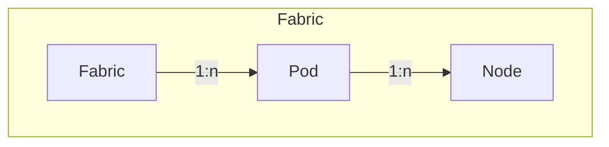

# Fabrics

An ACI Fabric represents the physical and logical underlay that hosts
one or more tenants and their policies.
It encompasses pods, nodes, interfaces, domains, and VLAN resources
that collectively provide the infrastructure on which tenant
constructs operate.

## Fabric

A **Fabric** represents a single ACI deployment containing Pods, Nodes,
and fabric-level policy objects.
A Fabric can host multiple Tenants.

The **ACIFabric** model has the following fields:

*Required fields*:

- **Name**: the ACI Fabric name.
- **Fabric ID**: numeric identifier configured during APIC fabric setup.
    - Values: `1`–`128`
- **Infrastructure VLAN ID**: fabric-wide infrastructure VLAN used for
  APIC-to-switch communication.
    - Values: `1`–`4094`

*Optional fields*:

- **Description**: a description of the Fabric.
- **Infrastructure VLAN**: reference to a NetBox VLAN documenting the
  same VLAN ID.
- **GiPo pool**: reference to a NetBox Prefix representing the
  Bridge Domain multicast (GiPo) pool used for fabric multicast
  (for example, `225.0.0.0/15`).
- **NetBox tenant**: association to a NetBox Tenant.
- **Comments**: a text field for notes (Markdown supported).
- **Tags**: a list of NetBox tags.

## Pod

An **ACI Pod** groups a set of leaf and spine nodes within a Fabric.
Pods provide a way to scale the fabric by grouping nodes into separate
domains while maintaining a unified management plane.
Each Pod within a Fabric must have a unique identifier and is assigned
a TEP pool for internal addressing.

The **ACIPod** model has the following fields:

*Required fields*:

- **Name**: the Pod name.
- **ACI Fabric**: reference to the related ACIFabric.
- **Pod ID**: unique numeric identifier within the Fabric.
    - Values: `1`–`255`

*Optional fields*:

- **Name alias**: an optional alias for the Pod name.
- **Description**: a description of the Pod.
- **TEP Pool**: reference to a NetBox Prefix representing the
  pod-wide IPv4 Tunnel Endpoint (TEP) pool.
    - Recommended: a dedicated unicast IPv4 prefix sized appropriately
      for the expected scale
      (commonly `/16`; smaller pools may be supported depending on
      APIC release and fabric scale).
- **NetBox tenant**: association to a NetBox Tenant.
- **Comments**: a text field for notes (Markdown supported).
- **Tags**: a list of NetBox tags.

## Node

An **ACI Node** represents a single managed element inside a Pod.
Most commonly a **leaf** or **spine** switch, and an **APIC**
controller.
Nodes are the building blocks of the fabric topology and are referenced by
their Node ID within the Pod.

In NetBox, an ACI Node is primarily a **documentation and association
object**:

- It anchors the Node to an **ACI Pod** (and therefore to a Fabric).
- It optionally maps the Node to a **NetBox object** (typically a
  `dcim.Device`, and in some lab/virtual setups a
  `virtualization.VirtualMachine`).
- It can document the Node’s **role**, **deployment type**, and
  (optionally) the assigned **TEP IP** used for tunnel endpoints
  within the Pod.

The **ACINode** model has the following fields:

*Required fields*:

- **Name**: the Node name.
- **ACI Pod**: reference to the related ACIPod.
- **Node ID**: numeric identifier of the node within the Fabric.
    - Values: `1`–`100` (APIC), `101`–`4000` (Leaf/Spine)

*Optional fields*:

- **Name alias**: an optional alias for the Node name.
- **Description**: a description of the Node.
- **Node object type / Node object**: optional mapping to a NetBox object.
    - Supported object types are limited (**Device** or
      **Virtual Machine**).
    - If an **Object Type** is selected, the referenced **Object** must
      be set as well.
    - The referenced object must match the Pod’s **scope** (for example,
      Site/Region/Group or Location hierarchy)
- **Role**: functional role of the node in the topology.
    - Values: **Leaf**, **Spine**, **APIC**
- **Type Type**: documents the deployment type of the node.
    - Examples: virtual leaf, remote leaf (WAN), tier‑2 leaf
- **TEP IP Address**: optional reference to a NetBox IPAddress
  documenting the node’s Tunnel Endpoint (TEP).
    - The IP must be inside the Pod’s **TEP Pool** prefix.
    - The IP’s **VRF** must match the TEP Pool’s VRF (if applicable).
    - The host mask length must match the pool mask length.
- **NetBox tenant**: association to a NetBox Tenant.
- **Comments**: a text field for notes (Markdown supported).
- **Tags**: a list of NetBox tags.
