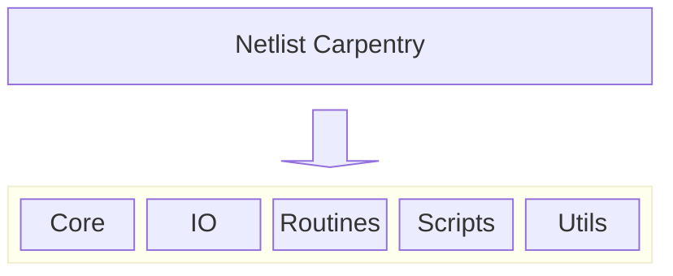
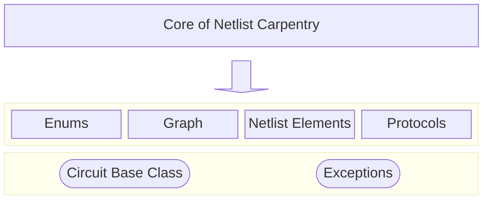

# High-Level Overview of the Codebase

Netlist Carpentry consists of 5 main subparts.

-   Inside the **Core** tree, all main functionality of this project can be found, including the data structures and most of the related methods.
-   The **IO** contains functionality related to reading Verilog code (or rather from netlists) as well as writing the internal data to Verilog.
-   Inside the **Routines**, several pre-defined processes can be found, regarding circuit optimization, analysis and transformation.
-   The **Scripts** subtree contains Shell scripts (e.g. for Yosys EQY) as well as Python Scripts for several use cases (e.g. transforming a Verilog file to a JSON netlist using Yosys).
-   Finally, the **Utils** subtree contains a bunch of helpful modules, the most important ones being:
    -   `cfg.py`: Provides a bunch of configurable values that affect the behavior of Netlist Carpentry in certain ways.
    -   `gate_lib.py`: The internal Gate Library, which is used to build instances of primitive gates inside modules.
    The gates from the gate library provide their own Verilog templates and signal evaluation methods.
    -   `gate_lib_factory.py`: Provides an easy and handy way to instantiate gates from the gate library into a given module.
    -   `log.py`: The logger module, mainly a wrapper around Python's `logging` library.

## The Core package
The core of the framework consists of the main data structures used within the framework.

The core package is the Domain Model and Validation Engine of the framework.
It serves as the "single source of truth" for the circuit design, extracting the actual meaning of the netlist (which may be of different file formats like Verilog or JSON) into a unified representation.

This structure implements the [Hexagonal Architecture (or Ports and Adapters)](https://en.wikipedia.org/wiki/Hexagonal_architecture_(software)):
-   Isolation:
    The core has zero dependencies on the outside world (no file I/O, no CLI logic).
    This makes it easy to test.
-   Type Safety:
    By separating the actual netlist element objects (`netlist_elements` package) from the graph logic, the system e.g. ensures that you can't accidentally do stuff on the graph (where only shallow nodes and edges are present) that should only be available for the actual object.
-   Scalability:
    If you want to add a new feature (e.g. "Calculate Power Consumption"), you can write a function that iterates over the Circuit object in core and collects the consumption data of every instance (if annotated accordingly) without needing to know if the original file was Verilog, a JSON netlist, or something entirely else.

The `graph` subpackage is aimed to provide some utilities when analyzing a module graph.
This includes pattern matching (powered by graph isomorpisms) and graph visualization.
This package may change in the future, however, especially since parts of it are clunky and may be rewritten.

## The IO package
All input and output is handled inside this package.

If the user provides a Verilog file, the subpackage `io.read` handles the transformation of the Verilog file into a JSON netlist and the subsequent reading of the generated JSON netlist.
Currently, the only supported format is Verilog/SystemVerilog through the Yosys-generated JSON netlists.
You can implement your own circuit parser (e.g. for VHDL) by extending `AbstractReader` class of `io.read.abstract_reader` and implementing `AbstractReader.read` and `AbstractReader.transform_to_circuit`.
The first method should parse the text file and translate it into a Python object of your choice (a dictionary or a custom object might be the best idea) and perform initial cleaning (if applicable).
The second method (`transform_to_circuit`) should then call your `read` method and create the appropriate NetlistElement objects.
The implementation for the Verilog read-in via Yosys (`io.read.yosys_netlist`) can be used as a reference here.

The other subpackage `io.write` handles the Verilog output of Netlist Carpentry.
Currently, only Verilog is supported.
All objects from the internal representation are transformed to valid Verilog code, where primitive gate instances are transformed into continuous assignments, or always blocks.
For reference, the implementation for the Verilog write-out can be found at `io.write.py2v`.

## The Routines package
Contains some predefined routines, such as optimization functions and design-for-test utilities (e.g. a simple scan-chain-insertion workflow).

## The Scripts package
This package is designated for script that may be used in certain use cases.
This includes a script builder to dynamically generate Yosys scripts based on given attributes, both for synthesis and equivalence checking with Yosys.

## The Utils package
Here are a bunch of utility modules, the most important ones are:
-   `cfg`:
    The internal config with some values used throughout Netlist Carpentry.
    The global config instance can be retrieved via `from netlist_carpentry import CFG`.
-   `gate_lib`:
    A set of primitive gates with predefined behavior, interface and functions.
-   `gate_lib_factory`:
    Provides a method for each gate from the gate_lib to instantiate it easily into a given circuit module.
-   `log`:
    The logger for Netlist Carpentry, which uses Python's `logging` module with some tweaks.
    The global logger instance can be retrieved via `from netlist_carpentry import LOG`.
