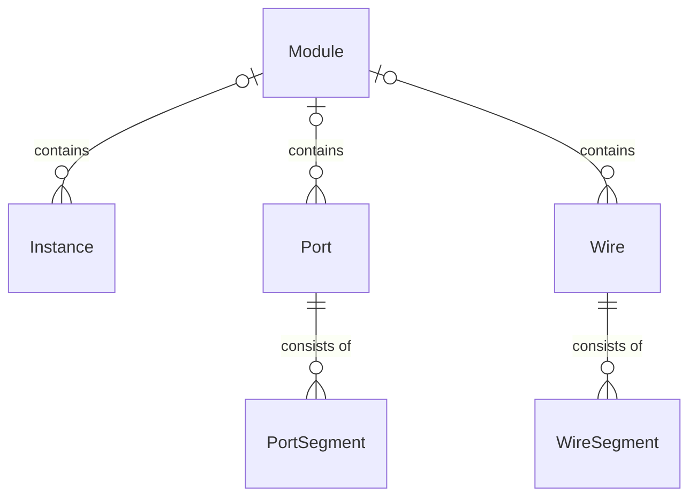

# Netlist Carpentry Core Components
The core of Netlist Carpentry consists of data structures to express the interactions and relations between different circuit elements.
The diagram below shows the relations (simplified) between the individual classes and data structures.
Each module can have an arbitrary amount of instances, ports and wires, but each instance port and wire belongs to at most one parent module[^1].
Similarly, each wire and port can consist of any number of port segments (or slices), but each segment must be assigned to exactly one parent port or wire.

[^1]: Instances, Ports and Wires can also exist without a parent module, however, most operations referring to the environment of the object will fail. This may happen temporarily, e.g. if an object is removed from a module and inserted into another module.
