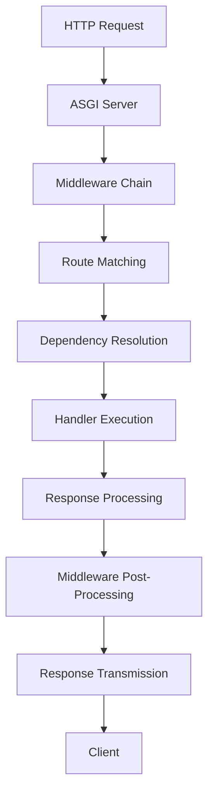

# 🚀 Core Concepts

Nexios is a modern, async-first Python web framework built on ASGI (Asynchronous Server Gateway Interface) 🌐. It combines high performance ⚡ with developer-friendly features while maintaining a clean and maintainable architecture. This guide will help you understand the fundamental concepts that make Nexios powerful and easy to use.

## 🧠 Framework Philosophy

Nexios is designed around several core principles that guide its architecture and API design:

### 1. **Simplicity First 🎯**
Nexios prioritizes simplicity in its API design. The goal is to make common tasks straightforward while keeping advanced features accessible when needed.

```python
# Simple route definition
@app.get("/users/{user_id}")
async def get_user(request, response):
    user_id = request.path_params.user_id
    return response.json({"id": user_id, "name": "John Doe"})

# Simple middleware addition
app.add_middleware(CORSMiddleware())
```

### 2. **Performance by Default ⚡**
Every design decision in Nexios considers performance implications. The framework is optimized for high-throughput applications without sacrificing developer experience.

### 3. **Type Safety Throughout 📝**
Full type hint support means better IDE integration, fewer runtime errors, and more maintainable code.

```python
from nexios.http import Request, Response
from typing import Dict, Any

@app.get("/api/data")
async def get_data(request: Request, response: Response) -> Dict[str, Any]:
    return response.json({"status": "success"})
```

### 4. **Production Ready 🏭**
Built-in features for security 🔒, monitoring 📊, and deployment mean you can focus on business logic rather than infrastructure concerns.

### 5. **Developer Experience 💻**
Excellent tooling 🛠️, clear error messages 📢, and comprehensive documentation make development enjoyable and efficient.

## 🌐 Understanding ASGI

ASGI (Asynchronous Server Gateway Interface) is the foundation that enables Nexios to handle concurrent connections efficiently 🔄. Understanding ASGI is key to understanding Nexios.

### 🤔 What is ASGI?

ASGI is a specification that defines how web servers communicate with Python web applications. It's the successor to WSGI (Web Server Gateway Interface) and provides several key improvements:

- **Async Support 🔄**: Native async/await support for non-blocking operations
- **Concurrent Requests 🌊**: Ability to handle multiple requests simultaneously
- **WebSocket Support 📡**: Built-in support for WebSocket connections
- **HTTP/2 Support 🚀**: Modern HTTP protocol support
- **Lifespan Protocol 🔄**: Application startup and shutdown management

### ASGI vs WSGI

| Feature | WSGI | ASGI |
|---------|------|------|
| **Concurrency** | Synchronous, one request at a time | Asynchronous, concurrent requests 🌊 |
| **WebSockets** | Not supported | Native support 📡 |
| **HTTP/2** | Limited support | Full support 🚀 |
| **Performance** | Good for simple apps | Excellent for high-load apps ⚡ |
| **Complexity** | Simple to understand | More complex but more powerful 🔧 |

### Why ASGI Matters

ASGI enables Nexios to:

1. **Handle Thousands of Concurrent Connections 🌊**: Unlike WSGI applications that process one request at a time, ASGI applications can handle multiple requests concurrently.

2. **Provide Real-time Features 📡**: WebSocket support enables real-time communication without additional infrastructure.

3. **Scale Efficiently 📈**: Better resource utilization means you can serve more users with fewer servers.

4. **Support Modern Web Standards 🌐**: HTTP/2, Server-Sent Events, and other modern web features are supported natively.

## 🏗️ Framework Architecture

Nexios follows a layered architecture that separates concerns and promotes maintainability. Let's explore each layer:

### 1. ASGI Foundation Layer 🌐

The foundation layer handles the low-level ASGI protocol and provides the interface between your application and the web server.

```python
# This is what happens under the hood
async def __call__(self, scope: Scope, receive: Receive, send: Send):
    if scope["type"] == "http":
        await self.handle_http_request(scope, receive, send)
    elif scope["type"] == "websocket":
        await self.handle_websocket(scope, receive, send)
```

**Key Components:**
- **Scope 📋**: Contains request metadata (headers, method, path, etc.)
- **Receive 📥**: Callback to receive request body data
- **Send 📤**: Callback to send response data

### 2. Middleware Layer 🚰

Middleware provides a way to process requests and responses as they flow through your application. Middleware can modify requests, add headers, handle authentication, and more.

```python
from nexios.middleware import BaseMiddleware

class LoggingMiddleware(BaseMiddleware):
    async def __call__(self, request, response, call_next):
        # Pre-processing: Log the incoming request
        print(f"Request: {request.method} {request.path}")
        
        # Call the next middleware/handler
        response = await call_next()
        
        # Post-processing: Log the response
        print(f"Response: {response.status_code}")
        
        return response
```

**Middleware Chain Flow:**
```
Request → Middleware 1 → Middleware 2 → Handler → Middleware 2 → Middleware 1 → Response
```

### 3. Routing Layer 🛣️

The routing layer matches incoming requests to the appropriate handlers based on URL patterns and HTTP methods.

```python
# Route definition with path parameters
@app.get("/users/{user_id:int}")
async def get_user(request, response):
    user_id = request.path_params.user_id  # Automatically converted to int
    return response.json({"id": user_id})

# Route with query parameters
@app.get("/search")
async def search(request, response):
    query = request.query_params.get("q", "")
    page = int(request.query_params.get("page", 1))
    return response.json({"query": query, "page": page})
```

**Routing Features:**
- **Path Parameters 🔢**: Dynamic URL segments with type conversion
- **Query Parameters ❓**: URL query string parsing
- **HTTP Method Matching 🌐**: Different handlers for GET, POST, PUT, etc.
- **Route Groups 📁**: Organize related routes together
- **Nested Routers 🔗**: Modular route organization

### 4. Handler Layer

Handlers are where your business logic lives. They receive requests and return responses.

```python
@app.post("/users")
async def create_user(request, response):
    # Extract data from request
    user_data = await request.json
    
    # Validate data (you can use Pydantic models)
    if not user_data.get("name"):
        return response.json({"error": "Name is required"}, status_code=400)
    
    # Process the request
    user = await create_user_in_database(user_data)
    
    # Return response
    return response.json(user, status_code=201)
```

**Handler Characteristics:**
- **Async by Design**: All handlers must be async functions
- **Request/Response Objects**: Standard interface for accessing request data and building responses
- **Error Handling**: Exceptions are caught and processed by exception handlers
- **Dependency Injection**: Clean way to inject dependencies

### 5. Response Layer

The response layer handles converting handler return values into proper HTTP responses.

```python
# Different response types
@app.get("/api/data")
async def get_data(request, response):
    # JSON response
    return response.json({"status": "success"})
    
    # Text response
    return response.text("Hello, World!")
    
    # HTML response
    return response.html("<h1>Hello</h1>")
    
    # File response
    return response.file("path/to/file.pdf")
    
    # Redirect
    return response.redirect("/new-location")
```

## Request Lifecycle

Understanding the request lifecycle helps you build more efficient applications. Here's what happens when a request comes in:

### 1. **Request Reception**
The ASGI server receives the HTTP request and creates a scope object containing request metadata.

### 2. **Middleware Processing**
The request flows through the middleware chain. Each middleware can:
- Modify the request
- Add headers
- Perform authentication
- Handle CORS
- Log information
- Short-circuit the request (e.g., for caching)

### 3. **Route Matching**
The router examines the request path and method to find the appropriate handler.

### 4. **Dependency Resolution**
If the handler has dependencies, they are resolved and injected.

### 5. **Handler Execution**
The handler function is called with the request and response objects.

### 6. **Response Processing**
The handler's return value is converted to an HTTP response.

### 7. **Middleware Post-Processing**
The response flows back through the middleware chain for any post-processing.

### 8. **Response Transmission**
The final response is sent back to the client.



## Core Components Deep Dive

### Routing System

The routing system is one of Nexios's most powerful features. It provides flexible URL matching with type conversion and validation.

#### Basic Routing

```python
from nexios import NexiosApp

app = NexiosApp()

# Simple route
@app.get("/")
async def home(request, response):
    return response.json({"message": "Welcome to Nexios"})

# Route with path parameter
@app.get("/users/{user_id}")
async def get_user(request, response):
    user_id = request.path_params.user_id
    return response.json({"id": user_id})

# Route with multiple path parameters
@app.get("/users/{user_id}/posts/{post_id}")
async def get_user_post(request, response):
    user_id = request.path_params.user_id
    post_id = request.path_params.post_id
    return response.json({"user_id": user_id, "post_id": post_id})
```

#### Path Parameter Types

Nexios automatically converts path parameters to the specified type:

```python
@app.get("/users/{user_id:int}")
async def get_user(request, response):
    user_id = request.path_params.user_id  # Already an int
    return response.json({"id": user_id})

@app.get("/files/{file_path:path}")
async def get_file(request, response):
    file_path = request.path_params.file_path  # Includes slashes
    return response.file(file_path)
```

**Available Types:**
- `str` (default): String value
- `int`: Integer value
- `float`: Float value
- `uuid`: UUID value
- `path`: Path value (includes slashes)
- `date`: Date value (YYYY-MM-DD)
- `datetime`: DateTime value (ISO format)

#### Route Groups and Prefixes

Organize related routes using routers:

```python
from nexios.routing import Router

# Create a router for user-related routes
user_router = Router(prefix="/users", tags=["Users"])

@user_router.get("/")
async def list_users(request, response):
    return response.json({"users": []})

@user_router.post("/")
async def create_user(request, response):
    data = await request.json
    return response.json(data, status_code=201)

@user_router.get("/{user_id:int}")
async def get_user(request, response):
    user_id = request.path_params.user_id
    return response.json({"id": user_id})

# Mount the router
app.mount_router(user_router)
```

### Middleware System

Middleware provides a powerful way to add cross-cutting concerns to your application.

#### Built-in Middleware

Nexios comes with several built-in middleware options:

```python
from nexios.middleware import (
    CORSMiddleware,
    SecurityMiddleware,
    SessionMiddleware
)

# Add CORS middleware
app.add_middleware(CORSMiddleware(
    allow_origins=["http://localhost:3000"],
    allow_methods=["GET", "POST"],
    allow_headers=["*"]
))

# Add security middleware
app.add_middleware(SecurityMiddleware())

# Add session middleware
app.add_middleware(SessionMiddleware())
```

#### Custom Middleware

Create your own middleware for custom functionality:

```python
from nexios.middleware import BaseMiddleware
import time

class TimingMiddleware(BaseMiddleware):
    async def __call__(self, request, response, call_next):
        start_time = time.time()
        
        # Process the request
        response = await call_next()
        
        # Calculate processing time
        processing_time = time.time() - start_time
        
        # Add timing header
        response.headers["X-Processing-Time"] = str(processing_time)
        
        return response

# Add the middleware
app.add_middleware(TimingMiddleware())
```

#### Middleware Order

The order of middleware matters. Here's a recommended order:

1. **Security Middleware** (authentication, authorization)
2. **Session Middleware** (session management)
3. **CORS Middleware** (cross-origin requests)
4. **Custom Business Logic** (logging, timing, etc.)
5. **Error Handling** (exception processing)

### Event System

The event system allows you to hook into application lifecycle events.

#### Startup and Shutdown Events

```python
@app.on_startup()
async def startup():
    # Initialize database connection
    await initialize_database()
    
    # Load configuration
    await load_configuration()
    
    # Warm up caches
    await warm_up_caches()
    
    print("Application started successfully!")

@app.on_shutdown()
async def shutdown():
    # Close database connections
    await close_database_connections()
    
    # Save application state
    await save_application_state()
    
    # Clean up resources
    await cleanup_resources()
    
    print("Application shutdown gracefully!")
```

#### Custom Events

You can also emit and listen for custom events:

```python
from nexios.events import AsyncEventEmitter

# Emit a custom event
await app.events.emit("user_registered", user_data)

# Listen for custom events
@app.events.on("user_registered")
async def handle_user_registration(user_data):
    await send_welcome_email(user_data)
    await update_analytics(user_data)
```

### Dependency Injection

Dependency injection provides a clean way to manage dependencies and make your code more testable.

#### Basic Dependencies

```python
from nexios import Depend

async def get_database():
    # This could be a database connection pool
    return Database()

async def get_current_user(request, db=Depend(get_database)):
    token = request.headers.get("Authorization")
    if not token:
        raise HTTPException(401, "Unauthorized")
    
    user = await db.get_user_by_token(token)
    if not user:
        raise HTTPException(401, "Invalid token")
    
    return user

@app.get("/profile")
async def get_profile(request, response, user=Depend(get_current_user)):
    return response.json({
        "id": user.id,
        "name": user.name,
        "email": user.email
    })
```

#### Dependency Scopes

Dependencies can have different scopes:

- **Request Scope**: New instance for each request (default)
- **Application Scope**: Single instance for the entire application
- **Session Scope**: Instance per user session

```python
# Application-scoped dependency
async def get_config():
    return load_configuration()

# Request-scoped dependency
async def get_db_connection():
    return await create_db_connection()

@app.get("/data")
async def get_data(
    request, 
    response, 
    config=Depend(get_config, scope="application"),
    db=Depend(get_db_connection, scope="request")
):
    # config is shared across all requests
    # db is a new connection for each request
    return response.json(await db.query("SELECT * FROM data"))
```

## Performance Considerations

### Async/Await Best Practices

1. **Use async for I/O operations**: Database queries, HTTP requests, file operations
2. **Avoid blocking operations**: Use async alternatives when available
3. **Use connection pooling**: Reuse connections for better performance
4. **Cache expensive operations**: Cache results to avoid repeated computation

### Middleware Optimization

1. **Keep middleware lightweight**: Avoid expensive operations in middleware
2. **Use early returns**: Short-circuit requests when possible
3. **Cache middleware results**: Cache expensive middleware operations
4. **Monitor middleware performance**: Track middleware execution times

### Database Optimization

1. **Use connection pooling**: Reuse database connections
2. **Use async database drivers**: Use async-compatible database libraries
3. **Optimize queries**: Use indexes and efficient query patterns
4. **Use caching**: Cache frequently accessed data

## Security Considerations

### Built-in Security Features

Nexios includes several built-in security features:

1. **CORS Protection**: Control cross-origin requests
2. **CSRF Protection**: Prevent cross-site request forgery
3. **Security Headers**: Automatic security header injection
4. **Input Validation**: Built-in request validation
5. **Authentication**: Flexible authentication system

### Security Best Practices

1. **Validate all inputs**: Always validate and sanitize user input
2. **Use HTTPS**: Always use HTTPS in production
3. **Implement proper authentication**: Use secure authentication methods
4. **Rate limiting**: Implement rate limiting to prevent abuse
5. **Log security events**: Log authentication and authorization events

## Testing Your Application

### Unit Testing

```python
import pytest
from nexios.testing import TestClient

@pytest.fixture
def client():
    return TestClient(app)

def test_get_user(client):
    response = client.get("/users/123")
    assert response.status_code == 200
    assert response.json()["id"] == 123
```

### Integration Testing

```python
async def test_create_user(client):
    user_data = {"name": "John Doe", "email": "john@example.com"}
    response = await client.post("/users", json=user_data)
    assert response.status_code == 201
    assert response.json()["name"] == "John Doe"
```

## Next Steps

Now that you understand the core concepts of Nexios, you can explore more advanced topics:

1. **Routing**: Learn about advanced routing features
2. **Middleware**: Create custom middleware for your needs
3. **Authentication**: Implement user authentication and authorization
4. **WebSockets**: Add real-time features to your application
5. **Templating**: Render HTML templates
6. **Testing**: Write comprehensive tests for your application

Each of these topics builds on the concepts you've learned here, so you'll have a solid foundation to build upon.
```
