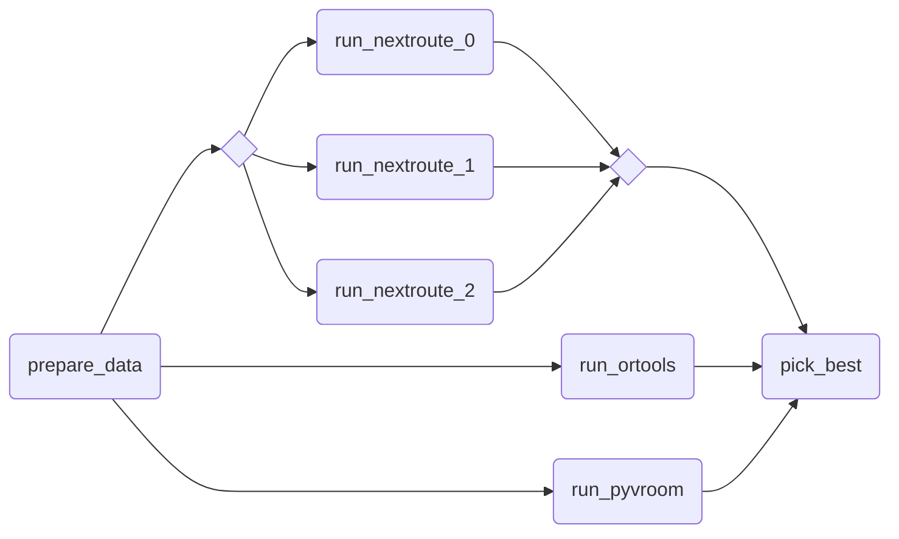

# Nextpipe

<!-- markdownlint-disable MD033 MD013 -->

<p align="center">
  <a href="https://nextmv.io"></a>
</p>
<p align="center">
    <em>Nextmv: The home for all your optimization work</em>
</p>
<p align="center">
<a href="https://github.com/nextmv-io/nextpipe/actions/workflows/test.yml" target="_blank">
    
</a>
<a href="https://github.com/nextmv-io/nextpipe/actions/workflows/lint.yml" target="_blank">
    
</a>
<a href="https://pypi.org/project/nextpipe" target="_blank">
    
</a>
<a href="https://pypi.org/project/nextpipe" target="_blank">
    
</a>
</p>

<!-- markdownlint-enable MD033 MD013 -->

Nextpipe is a Python package that provides a framework for Decision Workflows
modeling and execution. It provides first-class support for Workflows in the
[Nextmv Platform][nextmv].

> [!IMPORTANT]  
> Please note that Nextpipe is provided as _source-available_ software
> (not _open-source_). For further information, please refer to the
> [LICENSE](./LICENSE.md) file.

📖 To learn more about Nextpipe, visit the [docs][docs].

## Installation

The package is hosted on [PyPI][nextpipe-pypi]. Python `>=3.10` is required.

Install via `pip`:

```bash
pip install nextpipe
```

## Preview

Example of a pipeline utilizing multiple routing solvers, and picking the best
result.



[nextpipe-pypi]: https://pypi.org/project/nextpipe/
[nextmv]: https://nextmv.io
[docs]: https://nextpipe.docs.nextmv.io/en/latest/
