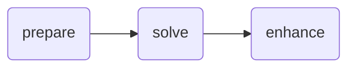

# Basic Chained Workflow Example

!!! tip

    This example uses the [`echo` app](../reference/echo.md), make sure to read
    that reference documentation first.

This is a basic example of a three-step, sequential workflow. It demonstrates
the basic structure of a workflow, which consists of steps being chained
together. Each step can depend on the output of the previous step.

```python
from typing import Any

import nextmv

from nextpipe import FlowSpec, app, needs, step


class Workflow(FlowSpec):
    @step
    def prepare(input: dict[str, Any]) -> dict[str, Any]:
        """Prepares the data."""

        input["prepared"] = True

        return input

    @app(app_id="echo")
    @needs(predecessors=[prepare])
    @step
    def solve() -> dict[str, Any]:
        """Runs the model."""
        pass

    @needs(predecessors=[solve])
    @step
    def enhance(result: dict[str, Any]) -> dict[str, Any]:
        """Enhances the result."""

        output = result["solution"]
        output["enhanced"] = True

        return output


def main():
    """Runs the workflow."""

    # Load input data
    input = nextmv.load()

    # Run workflow
    workflow = Workflow("DecisionWorkflow", input.data)
    workflow.run()

    # Write the result
    result = workflow.get_result(workflow.enhance)
    nextmv.write(result)


if __name__ == "__main__":
    main()
```

Run the example:

```bash
$ echo '{"hello": "world!"}' | python main.py
[nextpipe] No application ID or run ID found, uplink is inactive.
[nextpipe] Flow: Workflow
[nextpipe] nextpipe: v0.2.2.dev0
[nextpipe] nextmv: 0.28.0
[nextpipe] Flow graph steps:
[nextpipe] Step:
[nextpipe]   Definition: Step(prepare)
[nextpipe]   Docstring: Prepares the data.
[nextpipe] Step:
[nextpipe]   Definition: Step(solve, StepNeeds(prepare), StepRun(echo, latest, {}, InputType.JSON, False))
[nextpipe]   Docstring: Runs the model.
[nextpipe] Step:
[nextpipe]   Definition: Step(enhance, StepNeeds(solve))
[nextpipe]   Docstring: Enhances the result.
[nextpipe] Mermaid diagram:
[nextpipe] graph LR
  prepare(prepare)
  prepare --> solve
  solve(solve)
  solve --> enhance
  enhance(enhance)

[nextpipe] Mermaid URL: https://mermaid.ink/svg/Z3JhcGggTFIKICBwcmVwYXJlKHByZXBhcmUpCiAgcHJlcGFyZSAtLT4gc29sdmUKICBzb2x2ZShzb2x2ZSkKICBzb2x2ZSAtLT4gZW5oYW5jZQogIGVuaGFuY2UoZW5oYW5jZSkK?theme=dark
[nextpipe] Running node prepare_0
[nextpipe] Running node solve_0
[nextpipe] Running node enhance_0
{
  "echo": {
    "data": {
      "hello": "world!",
      "prepared": true
    },
    "args": []
  },
  "enhanced": true
}
```

As you can observe from the output, Nextpipe automatically generates a
Mermaid diagram to visualize the flow structure.



The diagram can be viewed in a browser by following the [Mermaid
link][mermaid-link] provided in the output. The diagram shows the flow of data
between the steps.

[mermaid-link]: https://mermaid.ink/svg/Z3JhcGggTFIKICBwcmVwYXJlKHByZXBhcmUpCiAgcHJlcGFyZSAtLT4gc29sdmUKICBzb2x2ZShzb2x2ZSkKICBzb2x2ZSAtLT4gZW5oYW5jZQogIGVuaGFuY2UoZW5oYW5jZSkK?theme=dark
