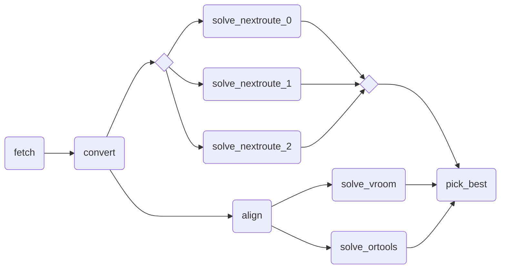

# Complex Workflow Example

!!! tip

    This example requires you to subscribe to the following [Nextmv Marketplace
    apps](https://docs.nextmv.io/docs/using-nextmv/deploy/subscription-apps),
    and name them as follows:

    - _Nextmv Routing_: `routing-nextroute`
    - _OR-Tools Routing_: `routing-ortools`
    - _PyVroom Routing_: `routing-pyvroom`

    

This is an example of a workflow fetching CSV data, converting it to JSON,
ensembling across multiple solvers and repetitions and picking the best result.

What makes it complex: parallel execution paths, data transformations, ensemble
optimization strategy, and automated result selection - all orchestrated
through a declarative workflow structure with minimal code.

```python
import csv
import json
from typing import Any

import nextmv.cloud
import requests

from nextpipe import FlowSpec, app, log, needs, repeat, step


class Workflow(FlowSpec):
    @step
    def fetch(_: dict[str, Any]) -> str:
        """Fetch CSV data from external source."""

        file_url = "https://gist.githubusercontent.com/merschformann/5dc2d06b246f924f8c65e93dd3c646e2/raw/fca52de5b7b9a1396e8d9525f8006488ac3467c9/muenster-stops.csv"
        response = requests.get(file_url)

        return response.text

    @needs(predecessors=[fetch])
    @step
    def convert(input_csv: str) -> dict[str, Any]:
        """Convert CSV data to JSON."""

        reader = csv.reader(input_csv.splitlines())
        next(reader)  # skip header

        return {
            "vehicles": [
                {
                    "id": f"vehicle-{i}",
                    "start_location": {"lon": 7.62558, "lat": 51.96223},
                    "end_location": {"lon": 7.62558, "lat": 51.96223},
                    "start_time": "2024-09-04T11:00:00+00:00",
                    "speed": 10,
                    "capacity": 27,
                }
                for i in range(20)
            ],
            "stops": [
                {
                    "id": row[0],
                    "location": {"lon": float(row[1]), "lat": float(row[2])},
                    "quantity": -1,
                    "unplanned_penalty": 2000000000,
                }
                for row in reader
            ],
        }

    @needs(predecessors=[convert])
    @step
    def align(input: dict[str, Any]) -> dict[str, Any]:
        """Align the input data for the solver."""

        clone = json.loads(json.dumps(input))
        for stop in [s for s in clone["stops"] if "quantity" in s]:
            stop["quantity"] *= -1

        return clone

    @app(
        app_id="routing-nextroute",
        instance_id="latest",
        options={"solve.duration": "30s"},
        full_result=True,
    )
    @repeat(repetitions=3)
    @needs(predecessors=[convert])
    @step
    def solve_nextroute() -> dict[str, Any]:
        """Solve the problem using the Nextroute solver."""
        pass

    @app(app_id="routing-pyvroom", full_result=True)
    @needs(predecessors=[align])
    @step
    def solve_vroom() -> dict[str, Any]:
        """Solve the problem using the Vroom solver."""
        pass

    @app(app_id="routing-ortools", full_result=True)
    @needs(predecessors=[align])
    @step
    def solve_ortools() -> dict[str, Any]:
        """Solve the problem using the OR-Tools solver."""
        pass

    @needs(predecessors=[solve_nextroute, solve_vroom, solve_ortools])
    @step
    def pick_best(
        nextroute_results: list[nextmv.cloud.RunResult],
        vroom_result: nextmv.cloud.RunResult,
        ortools_result: nextmv.cloud.RunResult,
    ):
        """Pick the best solution based on the result value."""

        results = nextroute_results + [vroom_result, ortools_result]
        best_solution_idx = min(
            range(len(results)),
            key=lambda i: results[i].output["statistics"]["result"]["value"],
        )

        for result in results:
            log(f"{result.metadata.application_id}: " + f"{result.output['statistics']['result']['value']}")

        return results[best_solution_idx].output


def main():
    """Runs the workflow."""

    # Run workflow
    flow = Workflow("DecisionFlow", None)
    flow.run()

    # Write the result
    result = flow.get_result(flow.pick_best)
    nextmv.write(result)


if __name__ == "__main__":
    main()
```

Run the example, which receives an empty input and fetches the CSV data from a
URL:

```bash
$ echo '{}' | python main.py
[nextpipe] No application ID or run ID found, uplink is inactive.
[nextpipe] Flow: Workflow
[nextpipe] nextpipe: v0.2.2.dev0
[nextpipe] nextmv: 0.28.0
[nextpipe] Flow graph steps:
[nextpipe] Step:
[nextpipe]   Definition: Step(fetch)
[nextpipe]   Docstring: Fetch CSV data from external source.
[nextpipe] Step:
[nextpipe]   Definition: Step(convert, StepNeeds(fetch))
[nextpipe]   Docstring: Convert CSV data to JSON.
[nextpipe] Step:
[nextpipe]   Definition: Step(align, StepNeeds(convert))
[nextpipe]   Docstring: Align the input data for the solver.
[nextpipe] Step:
[nextpipe]   Definition: Step(solve_nextroute, StepNeeds(convert), StepRepeat(3), StepRun(routing-nextroute, , {'solve.duration': '30s'}, InputType.JSON, True))
[nextpipe]   Docstring: Solve the problem using the Nextroute solver.
[nextpipe] Step:
[nextpipe]   Definition: Step(solve_vroom, StepNeeds(align), StepRun(routing-pyvroom, , {}, InputType.JSON, True))
[nextpipe]   Docstring: Solve the problem using the Vroom solver.
[nextpipe] Step:
[nextpipe]   Definition: Step(solve_ortools, StepNeeds(align), StepRun(routing-ortools, , {}, InputType.JSON, True))
[nextpipe]   Docstring: Solve the problem using the OR-Tools solver.
[nextpipe] Step:
[nextpipe]   Definition: Step(pick_best, StepNeeds(solve_nextroute,solve_vroom,solve_ortools))
[nextpipe]   Docstring: Pick the best solution based on the result value.
[nextpipe] Mermaid diagram:
[nextpipe] graph LR
  fetch(fetch)
  fetch --> convert
  convert(convert)
  convert --> align
  convert --> solve_nextroute
  align(align)
  align --> solve_vroom
  align --> solve_ortools
  solve_nextroute{ }
  solve_nextroute_join{ }
  solve_nextroute_0(solve_nextroute_0)
  solve_nextroute --> solve_nextroute_0
  solve_nextroute_0 --> solve_nextroute_join
  solve_nextroute_1(solve_nextroute_1)
  solve_nextroute --> solve_nextroute_1
  solve_nextroute_1 --> solve_nextroute_join
  solve_nextroute_2(solve_nextroute_2)
  solve_nextroute --> solve_nextroute_2
  solve_nextroute_2 --> solve_nextroute_join
  solve_nextroute_join --> pick_best
  solve_vroom(solve_vroom)
  solve_vroom --> pick_best
  solve_ortools(solve_ortools)
  solve_ortools --> pick_best
  pick_best(pick_best)

[nextpipe] Mermaid URL: https://mermaid.ink/svg/Z3JhcGggTFIKICBmZXRjaChmZXRjaCkKICBmZXRjaCAtLT4gY29udmVydAogIGNvbnZlcnQoY29udmVydCkKICBjb252ZXJ0IC0tPiBhbGlnbgogIGNvbnZlcnQgLS0+IHNvbHZlX25leHRyb3V0ZQogIGFsaWduKGFsaWduKQogIGFsaWduIC0tPiBzb2x2ZV92cm9vbQogIGFsaWduIC0tPiBzb2x2ZV9vcnRvb2xzCiAgc29sdmVfbmV4dHJvdXRleyB9CiAgc29sdmVfbmV4dHJvdXRlX2pvaW57IH0KICBzb2x2ZV9uZXh0cm91dGVfMChzb2x2ZV9uZXh0cm91dGVfMCkKICBzb2x2ZV9uZXh0cm91dGUgLS0+IHNvbHZlX25leHRyb3V0ZV8wCiAgc29sdmVfbmV4dHJvdXRlXzAgLS0+IHNvbHZlX25leHRyb3V0ZV9qb2luCiAgc29sdmVfbmV4dHJvdXRlXzEoc29sdmVfbmV4dHJvdXRlXzEpCiAgc29sdmVfbmV4dHJvdXRlIC0tPiBzb2x2ZV9uZXh0cm91dGVfMQogIHNvbHZlX25leHRyb3V0ZV8xIC0tPiBzb2x2ZV9uZXh0cm91dGVfam9pbgogIHNvbHZlX25leHRyb3V0ZV8yKHNvbHZlX25leHRyb3V0ZV8yKQogIHNvbHZlX25leHRyb3V0ZSAtLT4gc29sdmVfbmV4dHJvdXRlXzIKICBzb2x2ZV9uZXh0cm91dGVfMiAtLT4gc29sdmVfbmV4dHJvdXRlX2pvaW4KICBzb2x2ZV9uZXh0cm91dGVfam9pbiAtLT4gcGlja19iZXN0CiAgc29sdmVfdnJvb20oc29sdmVfdnJvb20pCiAgc29sdmVfdnJvb20gLS0+IHBpY2tfYmVzdAogIHNvbHZlX29ydG9vbHMoc29sdmVfb3J0b29scykKICBzb2x2ZV9vcnRvb2xzIC0tPiBwaWNrX2Jlc3QKICBwaWNrX2Jlc3QocGlja19iZXN0KQo=?theme=dark
[nextpipe] Running node fetch_0
[nextpipe] Running node convert_0
[nextpipe] Running node solve_nextroute_0
[nextpipe] Running node solve_nextroute_1
[nextpipe] Running node solve_nextroute_2
[nextpipe] Running node align_0
[nextpipe] Running node solve_ortools_0
[nextpipe] Running node solve_vroom_0
[nextpipe] Running node pick_best_0
[pick_best_0] routing-nextroute: 11773.762255430222
[pick_best_0] routing-nextroute: 11956.539767503738
[pick_best_0] routing-nextroute: 11919.71020913124
[pick_best_0] routing-pyvroom: 108540.0
[pick_best_0] routing-ortools: 11676.0
{
  "options": {
    "input": "",
    "output": "",
    "duration": 30
  },
  "solution": {
    "vehicles": [
      {
        "id": "vehicle-0",
        "route_travel_distance": 0,
        "route": [
          {
            "stop": {
              "location": {
                "lon": 7.62558,
                "lat": 51.96223
              },
              "id": "vehicle-0_start"
            }
          },
          {
            "stop": {
              "location": {
                "lon": 7.62558,
                "lat": 51.96223
              },
              "id": "vehicle-0_end"
            }
          }
        ]
      },
      {
        "id": "vehicle-1",
        "route_travel_distance": 740,
        "route": [
          {
            "stop": {
              "location": {
                "lon": 7.62558,
                "lat": 51.96223
              },
              "id": "vehicle-1_start"
            }
          },
          {
            "stop": {
              "id": "location-271",
              "location": {
                "lon": 7.6177,
                "lat": 51.9555
              },
              "quantity": 1,
              "unplanned_penalty": 2000000000
            }
          },
          ...
          ... (truncated for brevity)
          ...
          {
            "stop": {
              "location": {
                "lon": 7.62558,
                "lat": 51.96223
              },
              "id": "vehicle-19_end"
            }
          }
        ]
      }
    ],
    "unplanned": []
  },
  "statistics": {
    "run": {
      "duration": 23.826155424118042
    },
    "result": {
      "value": 11676.0,
      "custom": {
        "solution_found": true,
        "activated_vehicles": 20,
        "max_route_duration": 1752,
        "max_stops_in_vehicle": 27,
        "min_stops_in_vehicle": 0
      }
    },
    "schema": "v1"
  },
  "assets": []
}
```

Here is the resulting Mermaid diagram of the workflow:


