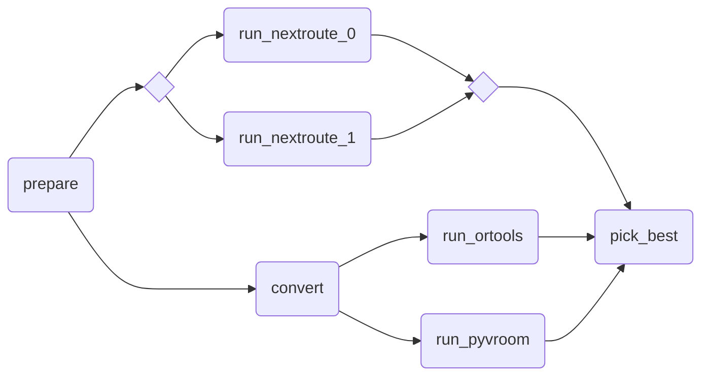

# Complex Workflow Example

!!! tip

    This example requires you to subscribe to the following [Nextmv Marketplace
    apps](https://docs.nextmv.io/docs/using-nextmv/deploy/subscription-apps),
    and name them as follows:

    - _Nextmv Routing_: `routing-nextroute`
    - _OR-Tools Routing_: `routing-ortools`
    - _PyVroom Routing_: `routing-pyvroom`

    

This example combines several concepts to create a more complex workflow that:

* Integrates multiple solvers (Nextroute, OR-Tools, PyVroom) to solve the same routing problem.
* Creates parallel execution paths with different data transformations.
* Uses advanced features including:
  * Repeated execution (`@repeat`)
  * Data transformation (`convert` step)
  * Dependencies between steps (`@needs`)
  * External solver integration (`@app`)
* Compares and selects results from multiple solvers to find the optimal
  solution.

The complexity comes from orchestrating multiple solvers in parallel with
different data preparation requirements and aggregating their results into a
single optimal solution.

```python
import copy
from typing import Any

import nextmv

from nextpipe import FlowSpec, app, log, needs, repeat, step


class Workflow(FlowSpec):
    @step
    def prepare(input: dict[str, Any]) -> dict[str, Any]:
        """Prepares the data."""

        return input

    @needs(predecessors=[prepare])
    @step
    def convert(input: dict[str, Any]) -> dict[str, Any]:
        """Converts the data."""

        clone = copy.deepcopy(input)
        if "defaults" in clone and "stops" in clone["defaults"] and "quantity" in clone["defaults"]["stops"]:
            clone["defaults"]["stops"]["quantity"] *= -1

        for stop in clone["stops"]:
            if "quantity" in stop:
                stop["quantity"] *= -1

        return clone

    @repeat(repetitions=2)
    @app(app_id="routing-nextroute")
    @needs(predecessors=[prepare])
    @step
    def run_nextroute() -> list[dict[str, Any]]:
        """Runs the model."""
        pass

    @app(app_id="routing-ortools")
    @needs(predecessors=[convert])
    @step
    def run_ortools() -> dict[str, Any]:
        """Runs the model."""
        pass

    @app(app_id="routing-pyvroom")
    @needs(predecessors=[convert])
    @step
    def run_pyvroom() -> dict[str, Any]:
        """Runs the model."""
        pass

    @needs(predecessors=[run_nextroute, run_ortools, run_pyvroom])
    @step
    def pick_best(
        results_nextroute: list[dict[str, Any]],
        result_ortools: dict[str, Any],
        result_pyvroom: dict[str, Any],
    ):
        """Aggregates the results."""

        results = results_nextroute + [result_ortools, result_pyvroom]
        best_solution_idx = min(
            range(len(results)),
            key=lambda i: results[i]["statistics"]["result"]["value"],
        )

        values = [result["statistics"]["result"]["value"] for result in results]
        values.sort()
        log(f"Values: {values}")

        # For test stability reasons, we always return the or-tools result
        _ = results.pop(best_solution_idx)

        return result_ortools


def main():
    """Runs the workflow."""

    # Load input data
    input = nextmv.load()

    # Run workflow
    workflow = Workflow("DecisionWorkflow", input.data)
    workflow.run()

    # Write the result
    result = workflow.get_result(workflow.pick_best)
    nextmv.write(result)


if __name__ == "__main__":
    main()
```

To run the example, we are going to use an example JSON file from a GitHub
Gist. We are going to use the `curl` command to download the JSON file and pipe it
to the `main.py` script. The JSON file contains a set of stops and vehicles for
the routing problem.

```bash
$ curl "https://gist.githubusercontent.com/merschformann/a90959b87d1360b604e4a9f6457340ca/raw/661e631376bdf78a07548a3cd136c1fc6e47c639/muenster.json" | python main.py
  % Total    % Received % Xferd  Average Speed   Time    Time     Time  Current
                                 Dload  Upload   Total   Spent    Left  Speed
100 4928k  100 4928k    0     0  19.1M      0 --:--:-- --:--:-- --:--:-- 19.1M
[nextpipe] No application ID or run ID found, uplink is inactive.
[nextpipe] Flow: Workflow
[nextpipe] nextpipe: v0.2.2.dev0
[nextpipe] nextmv: 0.28.0
[nextpipe] Flow graph steps:
[nextpipe] Step:
[nextpipe]   Definition: Step(prepare)
[nextpipe]   Docstring: Prepares the data.
[nextpipe] Step:
[nextpipe]   Definition: Step(convert, StepNeeds(prepare))
[nextpipe]   Docstring: Converts the data.
[nextpipe] Step:
[nextpipe]   Definition: Step(run_nextroute, StepNeeds(prepare), StepRepeat(2), StepRun(routing-nextroute, , {}, InputType.JSON, False))
[nextpipe]   Docstring: Runs the model.
[nextpipe] Step:
[nextpipe]   Definition: Step(run_ortools, StepNeeds(convert), StepRun(routing-ortools, , {}, InputType.JSON, False))
[nextpipe]   Docstring: Runs the model.
[nextpipe] Step:
[nextpipe]   Definition: Step(run_pyvroom, StepNeeds(convert), StepRun(routing-pyvroom, , {}, InputType.JSON, False))
[nextpipe]   Docstring: Runs the model.
[nextpipe] Step:
[nextpipe]   Definition: Step(pick_best, StepNeeds(run_nextroute,run_ortools,run_pyvroom))
[nextpipe]   Docstring: Aggregates the results.
[nextpipe] Mermaid diagram:
[nextpipe] graph LR
  prepare(prepare)
  prepare --> convert
  prepare --> run_nextroute
  convert(convert)
  convert --> run_ortools
  convert --> run_pyvroom
  run_nextroute{ }
  run_nextroute_join{ }
  run_nextroute_0(run_nextroute_0)
  run_nextroute --> run_nextroute_0
  run_nextroute_0 --> run_nextroute_join
  run_nextroute_1(run_nextroute_1)
  run_nextroute --> run_nextroute_1
  run_nextroute_1 --> run_nextroute_join
  run_nextroute_join --> pick_best
  run_ortools(run_ortools)
  run_ortools --> pick_best
  run_pyvroom(run_pyvroom)
  run_pyvroom --> pick_best
  pick_best(pick_best)

[nextpipe] Mermaid URL: https://mermaid.ink/svg/Z3JhcGggTFIKICBwcmVwYXJlKHByZXBhcmUpCiAgcHJlcGFyZSAtLT4gY29udmVydAogIHByZXBhcmUgLS0+IHJ1bl9uZXh0cm91dGUKICBjb252ZXJ0KGNvbnZlcnQpCiAgY29udmVydCAtLT4gcnVuX29ydG9vbHMKICBjb252ZXJ0IC0tPiBydW5fcHl2cm9vbQogIHJ1bl9uZXh0cm91dGV7IH0KICBydW5fbmV4dHJvdXRlX2pvaW57IH0KICBydW5fbmV4dHJvdXRlXzAocnVuX25leHRyb3V0ZV8wKQogIHJ1bl9uZXh0cm91dGUgLS0+IHJ1bl9uZXh0cm91dGVfMAogIHJ1bl9uZXh0cm91dGVfMCAtLT4gcnVuX25leHRyb3V0ZV9qb2luCiAgcnVuX25leHRyb3V0ZV8xKHJ1bl9uZXh0cm91dGVfMSkKICBydW5fbmV4dHJvdXRlIC0tPiBydW5fbmV4dHJvdXRlXzEKICBydW5fbmV4dHJvdXRlXzEgLS0+IHJ1bl9uZXh0cm91dGVfam9pbgogIHJ1bl9uZXh0cm91dGVfam9pbiAtLT4gcGlja19iZXN0CiAgcnVuX29ydG9vbHMocnVuX29ydG9vbHMpCiAgcnVuX29ydG9vbHMgLS0+IHBpY2tfYmVzdAogIHJ1bl9weXZyb29tKHJ1bl9weXZyb29tKQogIHJ1bl9weXZyb29tIC0tPiBwaWNrX2Jlc3QKICBwaWNrX2Jlc3QocGlja19iZXN0KQo=?theme=dark
[nextpipe] Running node prepare_0
[nextpipe] Running node run_nextroute_0
[nextpipe] Running node run_nextroute_1
[nextpipe] Running node convert_0
[nextpipe] Running node run_pyvroom_0
[nextpipe] Running node run_ortools_0
[nextpipe] Running node pick_best_0
[pick_best_0] Values: [31559.0, 32951.17999815941, 32999.0, 33122.33599805832]
{
  "options": {
    "input": "",
    "output": "",
    "duration": 30
  },
  "solution": {
    "vehicles": [
      {
        "id": "vehicle-1",
        "route_travel_distance": 1063,
        "route": [
          {
            "stop": {
              "location": {
                "lon": 7.62558,
                "lat": 51.96223
              },
              "id": "vehicle-1_start"
            }
          },
    ...
    ... (truncated for brevity)
    ...      
    ],
    "unplanned": []
  },
  "statistics": {
    "run": {
      "duration": 29.18671941757202
    },
    "result": {
      "value": 32999.0,
      "custom": {
        "solution_found": true,
        "activated_vehicles": 20,
        "max_route_duration": 5067,
        "max_stops_in_vehicle": 27,
        "min_stops_in_vehicle": 0
      }
    },
    "schema": "v1"
  },
  "assets": []
}
```

Here is the resulting Mermaid diagram of the workflow:


