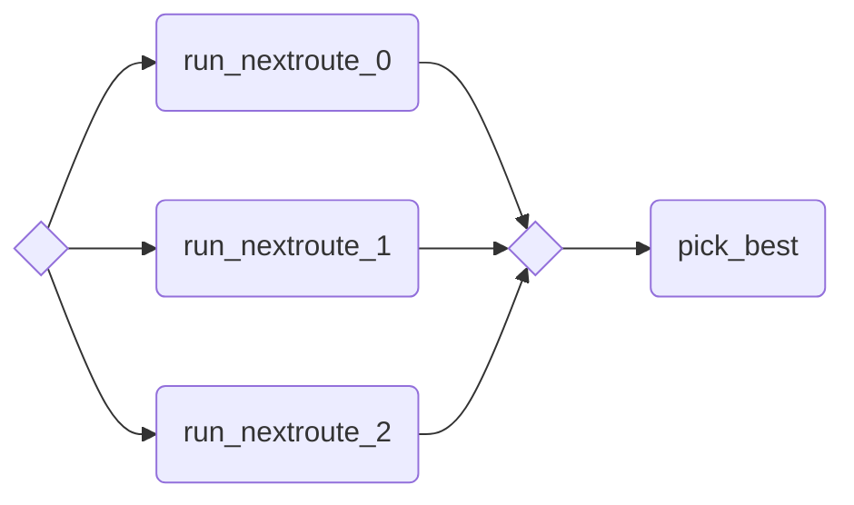

# Ensemble Workflow Example

!!! tip

    This example requires you to subscribe to the following [Nextmv Marketplace
    apps](https://docs.nextmv.io/docs/using-nextmv/deploy/subscription-apps),
    and name them as follows:

    - _Nextmv Routing_: `routing-nextroute`

    

This a basic ensemble workflow example. An ensemble workflow is a
workflow that runs multiple solver instances in parallel and then picks the
best result.

This is useful when you want to run multiple solver instances with different
options or configurations, and then select the best result from the
ensemble.

```python
from typing import Any

import nextmv

from nextpipe import FlowSpec, app, log, needs, repeat, step

# Define the options for the workflow
options = nextmv.Options(
    nextmv.Option("instance", str, "", "App instance to use. If not provided, app-defined is used.", False),
)


class Workflow(FlowSpec):
    @app(
        app_id="routing-nextroute",
        instance_id=options.instance,
        parameters={"model.constraints.enable.cluster": True},
    )
    @repeat(repetitions=3)
    @step
    def run_nextroute() -> dict[str, Any]:
        """Runs the model."""
        pass

    @needs(predecessors=[run_nextroute])
    @step
    def pick_best(results: list[dict[str, Any]]) -> dict[str, Any]:
        """Aggregates the results."""

        log(f"Values: {[result['statistics']['result']['value'] for result in results]}")
        best_solution_idx = min(
            range(len(results)),
            key=lambda i: results[i]["statistics"]["result"]["value"],
        )

        return results[best_solution_idx]


def main():
    """Runs the workflow."""

    # Load input data
    input = nextmv.load()

    # Run workflow
    workflow = Workflow("DecisionWorkflow", input.data)
    workflow.run()

    # Write the result
    result = workflow.get_result(workflow.pick_best)
    nextmv.write(result)


if __name__ == "__main__":
    main()
```

Save the following data as `input.json`, in the same location as the Python
script.

```json
{
  "defaults": {
    "stops": {
      "duration": 120,
      "unplanned_penalty": 200000
    },
    "vehicles": {
      "end_location": {
        "lat": 33.122746,
        "lon": -96.659222
      },
      "end_time": "2021-10-17T11:00:00-06:00",
      "speed": 10,
      "start_location": {
        "lat": 33.122746,
        "lon": -96.659222
      },
      "start_time": "2021-10-17T09:00:00-06:00"
    }
  },
  "stops": [
    {
      "id": "location-1",
      "location": {
        "lat": 33.20580830033956,
        "lon": -96.75038245222623
      },
      "quantity": -27
    },
    {
      "id": "location-2",
      "location": {
        "lat": 33.2259142720506,
        "lon": -96.54613745932127
      },
      "quantity": -30
    },
    {
      "id": "location-3",
      "location": {
        "lat": 33.23528740544529,
        "lon": -96.61059803136642
      },
      "quantity": -36
    },
    {
      "id": "location-4",
      "location": {
        "lat": 33.20379744909628,
        "lon": -96.61356543957307
      },
      "quantity": -19
    },
    {
      "id": "location-5",
      "location": {
        "lat": 33.178801586789376,
        "lon": -96.64137458150537
      },
      "quantity": -31
    },
    {
      "id": "location-6",
      "location": {
        "lat": 33.02896457334468,
        "lon": -96.83157538607735
      },
      "quantity": -15
    },
    {
      "id": "location-7",
      "location": {
        "lat": 33.08670100884261,
        "lon": -96.62951544963792
      },
      "quantity": -31
    },
    {
      "id": "location-8",
      "location": {
        "lat": 33.08133590083287,
        "lon": -96.86007117348946
      },
      "quantity": -52
    },
    {
      "id": "location-9",
      "location": {
        "lat": 33.092841906114394,
        "lon": -96.87346076034575
      },
      "quantity": -48
    },
    {
      "id": "location-10",
      "location": {
        "lat": 33.10492159118987,
        "lon": -96.79586982112724
      },
      "quantity": -40
    }
  ],
  "vehicles": [
    {
      "capacity": 305,
      "id": "vehicle-1"
    },
    {
      "capacity": 205,
      "id": "vehicle-2"
    }
  ]
}
```

Run the example:

```bash
$ cat input.json | python main.py 
[nextpipe] No application ID or run ID found, uplink is inactive.
[nextpipe] Flow: Workflow
[nextpipe] nextpipe: v0.2.2.dev0
[nextpipe] nextmv: 0.28.0
[nextpipe] Flow graph steps:
[nextpipe] Step:
[nextpipe]   Definition: Step(run_nextroute, StepRepeat(3), StepRun(routing-nextroute, latest, {'model.constraints.enable.cluster': 'True'}, InputType.JSON, False))
[nextpipe]   Docstring: Runs the model.
[nextpipe] Step:
[nextpipe]   Definition: Step(pick_best, StepNeeds(run_nextroute))
[nextpipe]   Docstring: Aggregates the results.
[nextpipe] Mermaid diagram:
[nextpipe] graph LR
  run_nextroute{ }
  run_nextroute_join{ }
  run_nextroute_0(run_nextroute_0)
  run_nextroute --> run_nextroute_0
  run_nextroute_0 --> run_nextroute_join
  run_nextroute_1(run_nextroute_1)
  run_nextroute --> run_nextroute_1
  run_nextroute_1 --> run_nextroute_join
  run_nextroute_2(run_nextroute_2)
  run_nextroute --> run_nextroute_2
  run_nextroute_2 --> run_nextroute_join
  run_nextroute_join --> pick_best
  pick_best(pick_best)

[nextpipe] Mermaid URL: https://mermaid.ink/svg/Z3JhcGggTFIKICBydW5fbmV4dHJvdXRleyB9CiAgcnVuX25leHRyb3V0ZV9qb2lueyB9CiAgcnVuX25leHRyb3V0ZV8wKHJ1bl9uZXh0cm91dGVfMCkKICBydW5fbmV4dHJvdXRlIC0tPiBydW5fbmV4dHJvdXRlXzAKICBydW5fbmV4dHJvdXRlXzAgLS0+IHJ1bl9uZXh0cm91dGVfam9pbgogIHJ1bl9uZXh0cm91dGVfMShydW5fbmV4dHJvdXRlXzEpCiAgcnVuX25leHRyb3V0ZSAtLT4gcnVuX25leHRyb3V0ZV8xCiAgcnVuX25leHRyb3V0ZV8xIC0tPiBydW5fbmV4dHJvdXRlX2pvaW4KICBydW5fbmV4dHJvdXRlXzIocnVuX25leHRyb3V0ZV8yKQogIHJ1bl9uZXh0cm91dGUgLS0+IHJ1bl9uZXh0cm91dGVfMgogIHJ1bl9uZXh0cm91dGVfMiAtLT4gcnVuX25leHRyb3V0ZV9qb2luCiAgcnVuX25leHRyb3V0ZV9qb2luIC0tPiBwaWNrX2Jlc3QKICBwaWNrX2Jlc3QocGlja19iZXN0KQo=?theme=dark
[nextpipe] Running node run_nextroute_0
[nextpipe] Running node run_nextroute_1
[nextpipe] Running node run_nextroute_2
[nextpipe] Running node pick_best_0
[pick_best_0] Values: [11325.273721933365, 11325.273721933365, 11325.273721933365]
{
  "version": {
    "nextroute": "v1.11.4",
    "sdk": "v1.8.3-0.20241219091227-002f36a342d6"
  },
  "options": {
    "model": {
      "constraints": {
        "disable": {
          "attributes": false,
          "capacity": false,
          "capacities": null,
          "distance_limit": false,
          "groups": false,
          "maximum_duration": false,
          "maximum_stops": false,
          "maximum_wait_stop": false,
          "maximum_wait_vehicle": false,
          "mixing_items": false,
          "precedence": false,
          "vehicle_start_time": false,
          "vehicle_end_time": false,
          "start_time_windows": false
        },
        "enable": {
          "cluster": true
        }
      },
      "objectives": {
        "capacities": "",
        "min_stops": 1,
        "early_arrival_penalty": 1,
        "late_arrival_penalty": 1,
        "vehicle_activation_penalty": 1,
        "travel_duration": 0,
        "vehicles_duration": 1,
        "unplanned_penalty": 1,
        "cluster": 0,
        "stop_balance": 0
      },
      "properties": {
        "disable": {
          "durations": false,
          "stop_duration_multipliers": false,
          "duration_groups": false,
          "initial_solution": false
        },
        "maximum_time_horizon": 15552000
      },
      "validate": {
        "disable": {
          "start_time": false,
          "resources": false
        },
        "enable": {
          "matrix": false,
          "matrix_asymmetry_tolerance": 20
        }
      }
    },
    "solve": {
      "iterations": -1,
      "duration": 5000000000,
      "plateau": {
        "delay": 0,
        "duration": 0,
        "iterations": 0,
        "relative_threshold": 0,
        "absolute_threshold": -1
      },
      "parallel_runs": -1,
      "start_solutions": -1,
      "run_deterministically": false
    },
    "format": {
      "disable": {
        "progression": false
      }
    },
    "check": {
      "duration": 30000000000,
      "verbosity": "off"
    }
  },
  "solutions": [
    {
      "unplanned": [],
      "vehicles": [
        {
          "id": "vehicle-1",
          "route": [
            {
              "stop": {
                "id": "vehicle-1-start",
                "location": {
                  "lon": -96.659222,
                  "lat": 33.122746
                }
              },
              "travel_duration": 0,
              "cumulative_travel_duration": 0,
              "arrival_time": "2021-10-17T09:00:00-06:00",
              "start_time": "2021-10-17T09:00:00-06:00",
              "end_time": "2021-10-17T09:00:00-06:00"
            },
            {
              "stop": {
                "id": "location-6",
                "location": {
                  "lon": -96.83157538607735,
                  "lat": 33.02896457334468
                }
              },
              "travel_duration": 1914,
              "cumulative_travel_duration": 1914,
              "travel_distance": 19147,
              "cumulative_travel_distance": 19147,
              "arrival_time": "2021-10-17T09:31:54-06:00",
              "start_time": "2021-10-17T09:31:54-06:00",
              "duration": 120,
              "end_time": "2021-10-17T09:33:54-06:00"
            },
            {
              "stop": {
                "id": "location-8",
                "location": {
                  "lon": -96.86007117348946,
                  "lat": 33.08133590083287
                }
              },
              "travel_duration": 640,
              "cumulative_travel_duration": 2554,
              "travel_distance": 6400,
              "cumulative_travel_distance": 25547,
              "arrival_time": "2021-10-17T09:44:34-06:00",
              "start_time": "2021-10-17T09:44:34-06:00",
              "duration": 120,
              "end_time": "2021-10-17T09:46:34-06:00"
            },
            {
              "stop": {
                "id": "location-9",
                "location": {
                  "lon": -96.87346076034575,
                  "lat": 33.092841906114394
                }
              },
              "travel_duration": 178,
              "cumulative_travel_duration": 2733,
              "travel_distance": 1786,
              "cumulative_travel_distance": 27333,
              "arrival_time": "2021-10-17T09:49:33-06:00",
              "start_time": "2021-10-17T09:49:33-06:00",
              "duration": 120,
              "end_time": "2021-10-17T09:51:33-06:00"
            },
            {
              "stop": {
                "id": "location-10",
                "location": {
                  "lon": -96.79586982112724,
                  "lat": 33.10492159118987
                }
              },
              "travel_duration": 735,
              "cumulative_travel_duration": 3468,
              "travel_distance": 7351,
              "cumulative_travel_distance": 34684,
              "arrival_time": "2021-10-17T10:03:48-06:00",
              "start_time": "2021-10-17T10:03:48-06:00",
              "duration": 120,
              "end_time": "2021-10-17T10:05:48-06:00"
            },
            {
              "stop": {
                "id": "location-1",
                "location": {
                  "lon": -96.75038245222623,
                  "lat": 33.20580830033956
                }
              },
              "travel_duration": 1199,
              "cumulative_travel_duration": 4667,
              "travel_distance": 11990,
              "cumulative_travel_distance": 46674,
              "arrival_time": "2021-10-17T10:25:47-06:00",
              "start_time": "2021-10-17T10:25:47-06:00",
              "duration": 120,
              "end_time": "2021-10-17T10:27:47-06:00"
            },
            {
              "stop": {
                "id": "vehicle-1-end",
                "location": {
                  "lon": -96.659222,
                  "lat": 33.122746
                }
              },
              "travel_duration": 1254,
              "cumulative_travel_duration": 5921,
              "travel_distance": 12542,
              "cumulative_travel_distance": 59216,
              "arrival_time": "2021-10-17T10:48:41-06:00",
              "start_time": "2021-10-17T10:48:41-06:00",
              "end_time": "2021-10-17T10:48:41-06:00"
            }
          ],
          "route_travel_duration": 5921,
          "route_travel_distance": 59216,
          "route_stops_duration": 600,
          "route_duration": 6521
        },
        {
          "id": "vehicle-2",
          "route": [
            {
              "stop": {
                "id": "vehicle-2-start",
                "location": {
                  "lon": -96.659222,
                  "lat": 33.122746
                }
              },
              "travel_duration": 0,
              "cumulative_travel_duration": 0,
              "arrival_time": "2021-10-17T09:00:00-06:00",
              "start_time": "2021-10-17T09:00:00-06:00",
              "end_time": "2021-10-17T09:00:00-06:00"
            },
            {
              "stop": {
                "id": "location-7",
                "location": {
                  "lon": -96.62951544963792,
                  "lat": 33.08670100884261
                }
              },
              "travel_duration": 487,
              "cumulative_travel_duration": 487,
              "travel_distance": 4870,
              "cumulative_travel_distance": 4870,
              "arrival_time": "2021-10-17T09:08:07-06:00",
              "start_time": "2021-10-17T09:08:07-06:00",
              "duration": 120,
              "end_time": "2021-10-17T09:10:07-06:00"
            },
            {
              "stop": {
                "id": "location-2",
                "location": {
                  "lon": -96.54613745932127,
                  "lat": 33.2259142720506
                }
              },
              "travel_duration": 1731,
              "cumulative_travel_duration": 2218,
              "travel_distance": 17316,
              "cumulative_travel_distance": 22186,
              "arrival_time": "2021-10-17T09:38:58-06:00",
              "start_time": "2021-10-17T09:38:58-06:00",
              "duration": 120,
              "end_time": "2021-10-17T09:40:58-06:00"
            },
            {
              "stop": {
                "id": "location-3",
                "location": {
                  "lon": -96.61059803136642,
                  "lat": 33.23528740544529
                }
              },
              "travel_duration": 608,
              "cumulative_travel_duration": 2827,
              "travel_distance": 6085,
              "cumulative_travel_distance": 28271,
              "arrival_time": "2021-10-17T09:51:07-06:00",
              "start_time": "2021-10-17T09:51:07-06:00",
              "duration": 120,
              "end_time": "2021-10-17T09:53:07-06:00"
            },
            {
              "stop": {
                "id": "location-4",
                "location": {
                  "lon": -96.61356543957307,
                  "lat": 33.20379744909628
                }
              },
              "travel_duration": 351,
              "cumulative_travel_duration": 3178,
              "travel_distance": 3512,
              "cumulative_travel_distance": 31783,
              "arrival_time": "2021-10-17T09:58:58-06:00",
              "start_time": "2021-10-17T09:58:58-06:00",
              "duration": 120,
              "end_time": "2021-10-17T10:00:58-06:00"
            },
            {
              "stop": {
                "id": "location-5",
                "location": {
                  "lon": -96.64137458150537,
                  "lat": 33.178801586789376
                }
              },
              "travel_duration": 379,
              "cumulative_travel_duration": 3558,
              "travel_distance": 3797,
              "cumulative_travel_distance": 35580,
              "arrival_time": "2021-10-17T10:07:18-06:00",
              "start_time": "2021-10-17T10:07:18-06:00",
              "duration": 120,
              "end_time": "2021-10-17T10:09:18-06:00"
            },
            {
              "stop": {
                "id": "vehicle-2-end",
                "location": {
                  "lon": -96.659222,
                  "lat": 33.122746
                }
              },
              "travel_duration": 645,
              "cumulative_travel_duration": 4203,
              "travel_distance": 6450,
              "cumulative_travel_distance": 42030,
              "arrival_time": "2021-10-17T10:20:03-06:00",
              "start_time": "2021-10-17T10:20:03-06:00",
              "end_time": "2021-10-17T10:20:03-06:00"
            }
          ],
          "route_travel_duration": 4203,
          "route_travel_distance": 42030,
          "route_stops_duration": 600,
          "route_duration": 4803
        }
      ],
      "objective": {
        "name": "1 * vehicles_duration + 1 * unplanned_penalty",
        "objectives": [
          {
            "name": "vehicles_duration",
            "factor": 1,
            "base": 11325.273721933365,
            "value": 11325.273721933365
          },
          {
            "name": "unplanned_penalty",
            "factor": 1,
            "value": 0
          }
        ],
        "value": 11325.273721933365
      }
    }
  ],
  "statistics": {
    "schema": "v1",
    "run": {
      "duration": 5.005287591,
      "iterations": 1888526
    },
    "result": {
      "duration": 0.004247828,
      "value": 11325.273721933365,
      "custom": {
        "activated_vehicles": 2,
        "unplanned_stops": 0,
        "max_travel_duration": 5921,
        "max_duration": 6521,
        "min_travel_duration": 4203,
        "min_duration": 4803,
        "max_stops_in_vehicle": 5,
        "min_stops_in_vehicle": 5
      }
    },
    "series_data": {
      "value": {
        "name": "1 * vehicles_duration + 1 * unplanned_penalty",
        "data_points": [
          {
            "x": 0.002622294,
            "y": 11372.303298711777
          },
          {
            "x": 0.004247828,
            "y": 11325.273721933365
          }
        ]
      },
      "custom": [
        {
          "name": "iterations",
          "data_points": [
            {
              "x": 0.002622294,
              "y": 0
            },
            {
              "x": 0.004247828,
              "y": 280
            }
          ]
        }
      ]
    }
  }
}
```

The following Mermaid diagram visualizes the flow structure of the ensemble
workflow:


