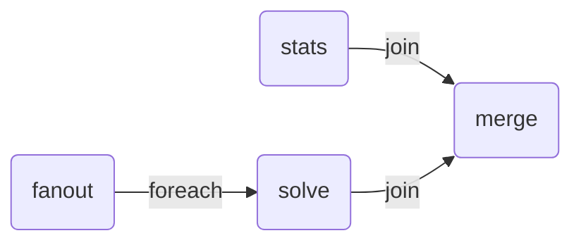

# Fanout Workflow Example

!!! tip

    This example uses the [`echo` app](../reference/echo.md), make sure to read
    that reference documentation first.

This is a more advanced example demonstrating dynamic fanout and joining of
results. This example shows how to create multiple copies of the input data,
configure them with different options, and then run the model in parallel.
Finally, it collects the results and merges them into a single output.

This is useful when you need to parallelize the execution of a model with
different configurations or options.

```python
import copy
import json
from typing import Any

import nextmv

from nextpipe import AppOption, AppRunConfig, FlowSpec, app, foreach, join, needs, step


class Workflow(FlowSpec):
    @foreach()  # Run the successor step for each item in the result list of this step
    @step
    def fanout(data: dict[str, Any]) -> list[AppRunConfig]:
        """
        Creates 3 copies of the input and configures them for 3 different app options.
        """

        inputs = [copy.deepcopy(data) for _ in range(3)]
        run_configs = [
            AppRunConfig(
                input=input,
                options=[AppOption("param", i)],
                name=f"run-{i}",
            )
            for i, input in enumerate(inputs)
        ]

        return run_configs

    @step
    def stats(data: dict[str, Any]) -> dict[str, Any]:
        """
        Calculates some statistics to put on the output as well.
        """

        return {"stats": {"count": len(json.dumps(data))}}

    @app(app_id="echo")
    @needs(predecessors=[fanout])
    @step
    def solve() -> dict[str, Any]:
        """
        Runs the model.
        """
        pass

    @needs(predecessors=[solve, stats])
    @join()  # Collect the results from the previous 'foreach' step and combine them into a list passed as the arg
    @step
    def merge(results: list[list[dict[str, Any]]]) -> dict[str, Any]:
        """Merges the results."""

        # Only return the second result from the merged results
        result, stats = results[1]

        return {
            "solve_result": result,
            "stats": stats,
        }


def main():
    """Runs the workflow."""

    # Load input data
    input = nextmv.load()

    # Run workflow
    workflow = Workflow("DecisionWorkflow", input.data)
    workflow.run()

    # Write the result
    result = workflow.get_result(workflow.merge)
    nextmv.write(result)


if __name__ == "__main__":
    main()
```

Run the example:

```bash
$ echo '{"hello": "world!"}' | python main.py
[nextpipe] No application ID or run ID found, uplink is inactive.
[nextpipe] Flow: Workflow
[nextpipe] nextpipe: v0.2.2.dev0
[nextpipe] nextmv: 0.28.0
[nextpipe] Flow graph steps:
[nextpipe] Step:
[nextpipe]   Definition: Step(fanout)
[nextpipe]   Docstring: 
        Creates 3 copies of the input and configures them for 3 different app parameters.
        
[nextpipe] Step:
[nextpipe]   Definition: Step(stats)
[nextpipe]   Docstring: 
        Calculates some statistics to put on the output as well.
        
[nextpipe] Step:
[nextpipe]   Definition: Step(solve, StepNeeds(fanout), StepRun(echo, latest, {}, InputType.JSON, False))
[nextpipe]   Docstring: 
        Runs the model.
        
[nextpipe] Step:
[nextpipe]   Definition: Step(merge, StepNeeds(solve,stats))
[nextpipe]   Docstring: Merges the results.
[nextpipe] Mermaid diagram:
[nextpipe] graph LR
  fanout{ }
  fanout(fanout)
  fanout -- foreach --> solve
  stats(stats)
  stats -- join --> merge
  solve(solve)
  solve -- join --> merge
  merge(merge)

[nextpipe] Mermaid URL: https://mermaid.ink/svg/Z3JhcGggTFIKICBmYW5vdXR7IH0KICBmYW5vdXQoZmFub3V0KQogIGZhbm91dCAtLSBmb3JlYWNoIC0tPiBzb2x2ZQogIHN0YXRzKHN0YXRzKQogIHN0YXRzIC0tIGpvaW4gLS0+IG1lcmdlCiAgc29sdmUoc29sdmUpCiAgc29sdmUgLS0gam9pbiAtLT4gbWVyZ2UKICBtZXJnZShtZXJnZSkK?theme=dark
[nextpipe] Running node fanout_0
[nextpipe] Running node stats_0
[nextpipe] Running node solve_0
[nextpipe] Running node solve_1
[nextpipe] Running node solve_2
[nextpipe] Running node merge_0
{
  "solve_result": {
    "options": {},
    "solution": {
      "echo": {
        "data": {
          "hello": "world!"
        },
        "args": [
          "-param=1"
        ]
      }
    },
    "statistics": {
      "run": {
        "duration": 0.00014638900756835938
      }
    },
    "assets": []
  },
  "stats": {
    "stats": {
      "count": 19
    }
  }
}
```

From the generated output, you can see that the results are collected into a
list. The `@foreach` decorator allows the `prepare` step to run in parallel for
each item in the list, and the `@join` decorator collects the results from
the `solve` step into a list.

The resulting Mermaid diagram for this flow looks like this:


