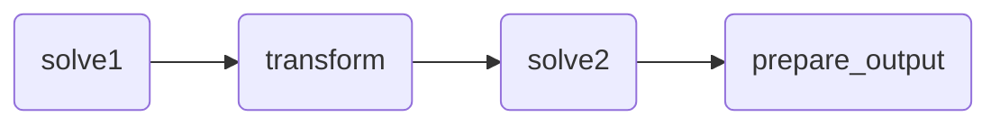

# multi-file Workflow Example

!!! tip

    This example uses the [`echo-multi` app](../reference/echo-multi.md),
    make sure to read that reference documentation first.

This example showcases how to use **multi-file** applications _within_ a
Nextpipe workflow. A multi-file application differs from a JSON-based
application in that it accepts a directory of files as input and produces a
directory of files as output. Note that the workflow itself is also a multi-file
application, however, this is a user choice (i.e., you could also create a
JSON-based workflow that uses multi-file sub-applications).

Find the workflow code below (mind the comments explaining each step):

```python
import os
import shutil

import nextmv
import nextmv.cloud

from nextpipe import FlowSpec, app, log, needs, step

options = nextmv.Options(
    nextmv.Option("input", str, "inputs/", "Path to input file.", False),
    nextmv.Option("output", str, "outputs/", "Path to output file.", False),
)


# >>> Workflow definition
class Flow(FlowSpec):
    # The first step receives the path to the input files directly (see main()) and
    # automatically zips the directory and passes it to the 'echo-multi' sub-app.
    @app(app_id="echo-multi")
    @step
    def solve1():
        """Runs a multi-file model."""
        pass

    # The second step receives the path to the output files from the first step. This path
    # will point to a temporary directory containing the output files from the first step.
    @needs(predecessors=[solve1])
    @step
    def transform(result_path: str):
        """Transforms the result for the next step."""
        # Just list the content of the result directory.
        log(f"Contents of result directory {result_path}:")
        for file_name in os.listdir(result_path):
            full_file_name = os.path.join(result_path, file_name)
            if os.path.isfile(full_file_name):
                log(f"- {file_name}")

        # Add a new file to the result for demonstration purposes.
        new_file_path = os.path.join(result_path, "additional_file.txt")
        with open(new_file_path, "w") as f:
            f.write("This is an additional file added in the transform step.\n")
        log(f"Added new file: {new_file_path}")

        return result_path

    # The third step receives the (modified) directory from the transform step and runs
    # another multi-file app on it.
    @app(
        app_id="echo-multi",
        # We specify the content type explicitly here. This is normally done via the app's
        # manifest, but we can do it explicitly like this too.
        run_configuration=nextmv.RunConfiguration(
            format=nextmv.Format(
                format_input=nextmv.FormatInput(input_type=nextmv.InputFormat.MULTI_FILE),
                format_output=nextmv.FormatOutput(output_type=nextmv.OutputFormat.MULTI_FILE),
            )
        ),
        full_result=True,
    )
    @needs(predecessors=[transform])
    @step
    def solve2(result: nextmv.cloud.RunResult):
        """Runs another multi-file model."""
        pass

    # The final step receives the output from 'solve2' as a full result object (see
    # 'full_result=True' above). In this case, the path to the output files is available
    # via 'result.output'.
    @needs(predecessors=[solve2])
    @step
    def prepare_output(result: nextmv.cloud.RunResult):
        """Transforms the result for the next step."""
        # Extract the path to the output files.
        result_path = result.output
        # Simply copy the files from the given directory to the expected output directory.
        os.makedirs(options.output, exist_ok=True)
        for file_name in os.listdir(result_path):
            full_file_name = os.path.join(result_path, file_name)
            if os.path.isfile(full_file_name):
                shutil.copy(full_file_name, options.output)


def main():
    # Run workflow (simply provide the path to the multi-file input)
    flow = Flow("DecisionFlow", options.input)
    flow.run()
    # The last step of the flow already prepares the output in the requested directory,
    # so no need to do anything here anymore.


if __name__ == "__main__":
    main()
```

Run the example:

```bash
$ python main.py
[nextpipe] No application ID or run ID found, uplink is inactive.
[nextpipe] Flow: Flow
[nextpipe] nextpipe: v0.3.5
[nextpipe] nextmv: 0.33.0
[nextpipe] Flow graph steps:
[nextpipe] Step:
[nextpipe]   Definition: Step(solve1, StepRun(echo-multi, , {}, False))
[nextpipe]   Docstring: Runs a multi-file model.
[nextpipe] Step:
[nextpipe]   Definition: Step(transform, StepNeeds(solve1))
[nextpipe]   Docstring: Transforms the result for the next step.
[nextpipe] Step:
[nextpipe]   Definition: Step(solve2, StepNeeds(transform), StepRun(echo-multi, , {}, True))
[nextpipe]   Docstring: Runs another multi-file model.
[nextpipe] Step:
[nextpipe]   Definition: Step(prepare_output, StepNeeds(solve2))
[nextpipe]   Docstring: Transforms the result for the next step.
[nextpipe] Mermaid diagram:
[nextpipe] graph LR
  solve1(solve1)
  solve1 --> transform
  transform(transform)
  transform --> solve2
  solve2(solve2)
  solve2 --> prepare_output
  prepare_output(prepare_output)

[nextpipe] Mermaid URL: https://mermaid.ink/svg/Z3JhcGggTFIKICBzb2x2ZTEoc29sdmUxKQogIHNvbHZlMSAtLT4gdHJhbnNmb3JtCiAgdHJhbnNmb3JtKHRyYW5zZm9ybSkKICB0cmFuc2Zvcm0gLS0+IHNvbHZlMgogIHNvbHZlMihzb2x2ZTIpCiAgc29sdmUyIC0tPiBwcmVwYXJlX291dHB1dAogIHByZXBhcmVfb3V0cHV0KHByZXBhcmVfb3V0cHV0KQo=?theme=dark
[nextpipe] Running node solve1_0
[nextpipe] Started app step solve1_0 run, find it at https://cloud.nextmv.io/app/echo-multi/run/latest-a-JAvuFgDR?view=details
/home/marius/.asdf/installs/python/3.13.7/lib/python3.13/shutil.py:1281: DeprecationWarning: Python 3.14 will, by default, filter extracted tar archives and reject files or modify their metadata. Use the filter argument to control this behavior.
  tarobj.extractall(extract_dir, filter=filter)
[nextpipe] Running node transform_0
[transform_0] Contents of result directory /tmp/nextpipe_output_igqsibzm:
[transform_0] - input.xlsx
[transform_0] - data.csv
[transform_0] Added new file: /tmp/nextpipe_output_igqsibzm/additional_file.txt
[nextpipe] Running node solve2_0
[nextpipe] Started app step solve2_0 run, find it at https://cloud.nextmv.io/app/echo-multi/run/latest-HIwvuFgDg?view=details
[nextpipe] Running node prepare_output_0
```

Content of the output directory:

```bash
tree outputs/
outputs/
├── additional_file.txt
├── data.csv
└── input.xlsx

1 directory, 3 files
```

The resulting Mermaid diagram for this flow looks like this:


