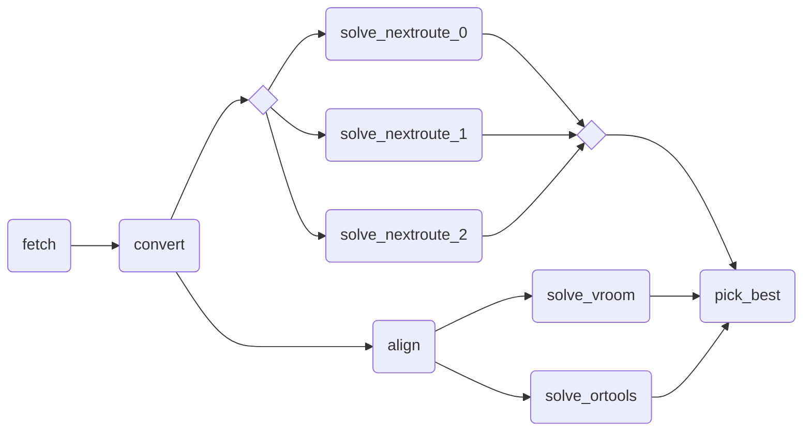

# Nextpipe

<!-- markdownlint-disable MD033 MD013 -->

<p align="center">
  <a href="https://nextmv.io"></a>
</p>
<p align="center">
    <em>Nextmv: The home for all your optimization work</em>
</p>
<p align="center">
<a href="https://github.com/nextmv-io/nextpipe/actions/workflows/test.yml" target="_blank">
    
</a>
<a href="https://github.com/nextmv-io/nextpipe/actions/workflows/lint.yml" target="_blank">
    
</a>
<a href="https://pypi.org/project/nextpipe" target="_blank">
    
</a>
<a href="https://pypi.org/project/nextpipe" target="_blank">
    
</a>
</p>

<!-- markdownlint-enable MD033 MD013 -->

Nextpipe is a Python package that provides a framework for Decision Workflows
modeling and execution. It provides first-class support for Workflows in the
[Nextmv Platform][nextmv].

!!! warning

    Please note that Nextpipe is provided as _source-available_
    software (not _open-source_). For further information, please refer to the
    [LICENSE](https://github.com/nextmv-io/nextpipe/blob/develop/LICENSE.md) file.

## Installation

The package is hosted on [PyPI][nextpipe-pypi]. Python `>=3.10` is required.

Install via `pip`:

```bash
pip install nextpipe
```

## Concepts

Nextpipe allows you to define complex decision workflows with multiple steps,
manage dependencies between these steps, and integrate with external
applications and solvers.

Decision workflows are typically lightweight, meaning that they are focused on
the orchestration of decision models, and not on the models themselves. A bad
practice would be to implement all business logic into the workflow
application.

A key advantage of using Nextmv is that you can delegate the compute-heavy
logic to individual applications, and you can use infrastructure to
parallelize, distribute, and scale the execution of these applications as
needed.

### Workflows - `FlowSpec`

!!! tip "Reference"

    Find the reference for the `FlowSpec` class [here](../reference/flow.md#nextpipe.flow.FlowSpec).

A Workflow in Nextpipe represents a complete pipeline or flow. It's defined
as a Python class that extends `FlowSpec`:

```python
from nextpipe import FlowSpec

class Workflow(FlowSpec):
    # Steps defined here
    pass
```

### Steps - `@step`

!!! tip "Reference"

    Find the reference for the `step` decorator [here](../reference/decorators.md#nextpipe.decorators.step).

Steps are the fundamental building blocks of a pipeline. Each step is a
function decorated with `@step`:

```python
@step
def prepare(input: dict):
    """Prepares the data."""
    # Transform input data
    return transformed_data
```

Steps can process data, make API calls, or perform any computation needed in
your pipeline.

### Dependencies - `@needs`

!!! tip "Reference"

    Find the reference for the `needs` decorator [here](../reference/decorators.md#nextpipe.decorators.needs).

Steps can depend on the results of other steps. Use the `@needs` decorator to
specify dependencies:

```python
@needs(predecessors=[prepare])
@step
def process(data: dict):
    """Process prepared data."""
    return processed_data
```

When a step has predecessors, the return values from those predecessors are
automatically passed as parameters to the step function. The parameters must
match the order of the predecessors listed in the `@needs` decorator. For
example:

```python
@step
def step1(input: dict):
    return {"result1": "value1"}

@step
def step2(input: dict):
    return {"result2": "value2"}

@needs(predecessors=[step1, step2])
@step
def process_both(result_from_step1: dict, result_from_step2: dict):
    # result_from_step1 contains {"result1": "value1"}
    # result_from_step2 contains {"result2": "value2"}
    return combined_result
```

### External Applications - `@app`

!!! tip "Reference"

    Find the reference for the `app` decorator [here](../reference/decorators.md#nextpipe.decorators.app).

Nextpipe can integrate with external Nextmv applications using the `@app`
decorator:

```python
@app(app_id="solver-app")
@needs(predecessors=[prepare])
@step
def solve():
    """Run external solver."""
    pass
```

Note that `@app` steps don't need a function body - the decorator handles
calling the external application.

### Optional Steps - `@optional`

!!! tip "Reference"

    Find the reference for the `optional` decorator [here](../reference/decorators.md#nextpipe.decorators.optional).

The `@optional` decorator allows steps to be conditionally executed based on a
provided condition function:

```python
@optional(condition=lambda step: some_condition)
@step
def conditional_step(data: dict):
    """This step only runs when the condition is True."""
    return processed_data
```

The condition function takes the step as a parameter and should return a boolean
indicating whether the step should be executed.

### Repeated Execution - `@repeat`

!!! tip "Reference"

    Find the reference for the `repeat` decorator [here](../reference/decorators.md#nextpipe.decorators.repeat).

The `@repeat` decorator makes a step execute multiple times:

```python
@repeat(repetitions=3)
@step
def repeated_step(input: dict):
    """This step runs 3 times."""
    return processed_data
```

This is useful when you need to run the same step with different random seeds or
configurations multiple times.

### Parallel Execution - `@foreach`

!!! tip "Reference"

    Find the reference for the `foreach` decorator [here](../reference/decorators.md#nextpipe.decorators.foreach).

The `@foreach` decorator enables dynamic fanout, running a successor step for
each item in a list:

```python
@foreach()
@step
def create_scenarios(data: dict):
    """Create multiple scenarios to solve."""
    return [scenario1, scenario2, scenario3]  # Each will be processed separately
```

### Collecting Results - `@join`

!!! tip "Reference"

    Find the reference for the `join` decorator [here](../reference/decorators.md#nextpipe.decorators.join).

The `@join` decorator collects results from previous steps into a list:

```python
@needs(predecessors=[solve])
@join()
@step
def merge(results: list[dict]):
    """Merge results from multiple executions."""
    return merged_result
```

### Dynamically customizing App Runs

!!! tip "Reference"

    Find the reference for the `AppRunConfig` class [here](../reference/config.md##nextpipe.schema.AppRunConfig).

The `AppRunConfig` class allows you to dynamically customize app runs.
Particularly, when fanning out steps using the `@foreach` decorator, you can
pass a list of `AppRunConfig` objects to specify different configurations for
each run:

```python
from nextpipe.schema import AppRunConfig

@foreach()
@step
def create_scenarios(data: dict):
    """Create multiple scenarios to solve with different configurations."""
    return [
        AppRunConfig(
            name="scenario1",
            input=data,
            options={
                "solve.duration": "5s",
            },
        ),
        AppRunConfig(
            name="scenario2",
            input=data,
            options={
                "solve.duration": "10s",
            },
        ),
    ]

@needs(predecessors=[create_scenarios])
@app(app_id="solver-app")
@step
def solve():
    """Run external solver for each scenario."""
    pass
```

The `AppRunConfig` will be applied to each run of the `solve` step.

## Output & visualization

After running a Nextpipe program, the output is composed of the following
components:

* Nextpipe logs detailing the execution of the workflow, and information
  about the workflow diagram. All of this information is printed to `stderr`.
* The actual output of the workflow, printed to `stdout`.

Nextpipe outputs a [Mermaid diagram][mermaid] of the workflow. The diagram is
shown as both source and as a link to the rendered diagram.

Consider the following output:

```bash
[nextpipe] No application ID or run ID found, uplink is inactive.
[nextpipe] Flow: Workflow
[nextpipe] nextpipe: v0.2.2.dev0
[nextpipe] nextmv: 0.28.0
[nextpipe] Flow graph steps:
[nextpipe] Step:
[nextpipe]   Definition: Step(fetch)
[nextpipe]   Docstring: Fetch CSV data from external source.
[nextpipe] Step:
[nextpipe]   Definition: Step(convert, StepNeeds(fetch))
[nextpipe]   Docstring: Convert CSV data to JSON.
[nextpipe] Step:
[nextpipe]   Definition: Step(align, StepNeeds(convert))
[nextpipe]   Docstring: Align the input data for the solver.
[nextpipe] Step:
[nextpipe]   Definition: Step(solve_nextroute, StepNeeds(convert), StepRepeat(3), StepRun(routing-nextroute, , {'solve.duration': '30s'}, InputType.JSON, True))
[nextpipe]   Docstring: Solve the problem using the Nextroute solver.
[nextpipe] Step:
[nextpipe]   Definition: Step(solve_vroom, StepNeeds(align), StepRun(routing-pyvroom, , {}, InputType.JSON, True))
[nextpipe]   Docstring: Solve the problem using the Vroom solver.
[nextpipe] Step:
[nextpipe]   Definition: Step(solve_ortools, StepNeeds(align), StepRun(routing-ortools, , {}, InputType.JSON, True))
[nextpipe]   Docstring: Solve the problem using the OR-Tools solver.
[nextpipe] Step:
[nextpipe]   Definition: Step(pick_best, StepNeeds(solve_nextroute,solve_vroom,solve_ortools))
[nextpipe]   Docstring: Pick the best solution based on the result value.
[nextpipe] Mermaid diagram:
[nextpipe] graph LR
  fetch(fetch)
  fetch --> convert
  convert(convert)
  convert --> align
  convert --> solve_nextroute
  align(align)
  align --> solve_vroom
  align --> solve_ortools
  solve_nextroute{ }
  solve_nextroute_join{ }
  solve_nextroute_0(solve_nextroute_0)
  solve_nextroute --> solve_nextroute_0
  solve_nextroute_0 --> solve_nextroute_join
  solve_nextroute_1(solve_nextroute_1)
  solve_nextroute --> solve_nextroute_1
  solve_nextroute_1 --> solve_nextroute_join
  solve_nextroute_2(solve_nextroute_2)
  solve_nextroute --> solve_nextroute_2
  solve_nextroute_2 --> solve_nextroute_join
  solve_nextroute_join --> pick_best
  solve_vroom(solve_vroom)
  solve_vroom --> pick_best
  solve_ortools(solve_ortools)
  solve_ortools --> pick_best
  pick_best(pick_best)

[nextpipe] Mermaid URL: https://mermaid.ink/svg/Z3JhcGggTFIKICBmZXRjaChmZXRjaCkKICBmZXRjaCAtLT4gY29udmVydAogIGNvbnZlcnQoY29udmVydCkKICBjb252ZXJ0IC0tPiBhbGlnbgogIGNvbnZlcnQgLS0+IHNvbHZlX25leHRyb3V0ZQogIGFsaWduKGFsaWduKQogIGFsaWduIC0tPiBzb2x2ZV92cm9vbQogIGFsaWduIC0tPiBzb2x2ZV9vcnRvb2xzCiAgc29sdmVfbmV4dHJvdXRleyB9CiAgc29sdmVfbmV4dHJvdXRlX2pvaW57IH0KICBzb2x2ZV9uZXh0cm91dGVfMChzb2x2ZV9uZXh0cm91dGVfMCkKICBzb2x2ZV9uZXh0cm91dGUgLS0+IHNvbHZlX25leHRyb3V0ZV8wCiAgc29sdmVfbmV4dHJvdXRlXzAgLS0+IHNvbHZlX25leHRyb3V0ZV9qb2luCiAgc29sdmVfbmV4dHJvdXRlXzEoc29sdmVfbmV4dHJvdXRlXzEpCiAgc29sdmVfbmV4dHJvdXRlIC0tPiBzb2x2ZV9uZXh0cm91dGVfMQogIHNvbHZlX25leHRyb3V0ZV8xIC0tPiBzb2x2ZV9uZXh0cm91dGVfam9pbgogIHNvbHZlX25leHRyb3V0ZV8yKHNvbHZlX25leHRyb3V0ZV8yKQogIHNvbHZlX25leHRyb3V0ZSAtLT4gc29sdmVfbmV4dHJvdXRlXzIKICBzb2x2ZV9uZXh0cm91dGVfMiAtLT4gc29sdmVfbmV4dHJvdXRlX2pvaW4KICBzb2x2ZV9uZXh0cm91dGVfam9pbiAtLT4gcGlja19iZXN0CiAgc29sdmVfdnJvb20oc29sdmVfdnJvb20pCiAgc29sdmVfdnJvb20gLS0+IHBpY2tfYmVzdAogIHNvbHZlX29ydG9vbHMoc29sdmVfb3J0b29scykKICBzb2x2ZV9vcnRvb2xzIC0tPiBwaWNrX2Jlc3QKICBwaWNrX2Jlc3QocGlja19iZXN0KQo=?theme=dark
[nextpipe] Running node fetch_0
[nextpipe] Running node convert_0
[nextpipe] Running node solve_nextroute_0
[nextpipe] Running node solve_nextroute_1
[nextpipe] Running node solve_nextroute_2
[nextpipe] Running node align_0
[nextpipe] Running node solve_ortools_0
[nextpipe] Running node solve_vroom_0
[nextpipe] Running node pick_best_0
[pick_best_0] routing-nextroute: 11773.762255430222
[pick_best_0] routing-nextroute: 11956.539767503738
[pick_best_0] routing-nextroute: 11919.71020913124
[pick_best_0] routing-pyvroom: 108540.0
[pick_best_0] routing-ortools: 11676.0
{
  "options": {
    "input": "",
    "output": "",
    "duration": 30
  },
  "solution": {
... output truncated ...
```

As you can observe from the output, Nextpipe automatically generates a Mermaid
diagram to visualize the flow structure.



The diagram can be viewed in a browser by following the [Mermaid link][mermaid-link]
provided in the output. The diagram shows the flow of data between the steps.

[nextpipe-pypi]: https://pypi.org/project/nextpipe/
[nextmv]: https://nextmv.io
[mermaid-link]: https://mermaid.ink/svg/Z3JhcGggTFIKICBmZXRjaChmZXRjaCkKICBmZXRjaCAtLT4gY29udmVydAogIGNvbnZlcnQoY29udmVydCkKICBjb252ZXJ0IC0tPiBhbGlnbgogIGNvbnZlcnQgLS0+IHNvbHZlX25leHRyb3V0ZQogIGFsaWduKGFsaWduKQogIGFsaWduIC0tPiBzb2x2ZV92cm9vbQogIGFsaWduIC0tPiBzb2x2ZV9vcnRvb2xzCiAgc29sdmVfbmV4dHJvdXRleyB9CiAgc29sdmVfbmV4dHJvdXRlX2pvaW57IH0KICBzb2x2ZV9uZXh0cm91dGVfMChzb2x2ZV9uZXh0cm91dGVfMCkKICBzb2x2ZV9uZXh0cm91dGUgLS0+IHNvbHZlX25leHRyb3V0ZV8wCiAgc29sdmVfbmV4dHJvdXRlXzAgLS0+IHNvbHZlX25leHRyb3V0ZV9qb2luCiAgc29sdmVfbmV4dHJvdXRlXzEoc29sdmVfbmV4dHJvdXRlXzEpCiAgc29sdmVfbmV4dHJvdXRlIC0tPiBzb2x2ZV9uZXh0cm91dGVfMQogIHNvbHZlX25leHRyb3V0ZV8xIC0tPiBzb2x2ZV9uZXh0cm91dGVfam9pbgogIHNvbHZlX25leHRyb3V0ZV8yKHNvbHZlX25leHRyb3V0ZV8yKQogIHNvbHZlX25leHRyb3V0ZSAtLT4gc29sdmVfbmV4dHJvdXRlXzIKICBzb2x2ZV9uZXh0cm91dGVfMiAtLT4gc29sdmVfbmV4dHJvdXRlX2pvaW4KICBzb2x2ZV9uZXh0cm91dGVfam9pbiAtLT4gcGlja19iZXN0CiAgc29sdmVfdnJvb20oc29sdmVfdnJvb20pCiAgc29sdmVfdnJvb20gLS0+IHBpY2tfYmVzdAogIHNvbHZlX29ydG9vbHMoc29sdmVfb3J0b29scykKICBzb2x2ZV9vcnRvb2xzIC0tPiBwaWNrX2Jlc3QKICBwaWNrX2Jlc3QocGlja19iZXN0KQo=?theme=dark
[mermaid]: https://mermaid.js.org
