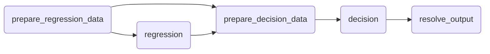

!!! tip

    ⌛️ Approximate time to complete: 25 min.

In this tutorial you will learn how to orchestrate multiple decision models
together with the Nextmv Platform from scratch, using Nextpipe.

!!! note

    💡 From now on, running multiple decision models is going to be known as a
    `decision workflow`.

Complete this tutorial if you:

* Are interested in orchestrating decision workflows with the Nextmv Platform
  and Nextpipe.
* Are fluent using Python 🐍.

To complete this tutorial, we will use an external example, working under the
principle that it is not a Nextmv-created decision workflow. You can, and
should, use your own decision workflow, or follow along with the example
provided:

* [Avocado Price Optimization problem authored by Gurobi][gurobi-example].

At a high level, this tutorial will go through the following steps using the
example:

1. Nextmv-ify the decision workflow.
2. Run it locally.
3. Push the workflow to Nextmv Cloud.
4. Run the workflow remotely.

Let’s dive right in 🤿.

## 1. Prepare the executable code

!!! tip

    If you are working with your own decision workflow and already know that it
    executes, feel free to skip this step.

The decision workflow is composed of one, or more, executables that solve
decision problems. Decision workflows are typically lightweight, meaning that
they are focused on the orchestration of decision models, and not on the models
themselves.

The original example is a Jupyter notebook that can be broken down into two
distinct parts:

1. A statistical model that predicts avocado demand based on price and other
   features.

2. An optimization model that determines the optimal price and supply of
   avocados based on the predicted demand.

For simplicity, we copied the cells of the notebook into a single script. Copy
the desired example code to a script named `main.py`.

```python
import warnings

import gurobipy as gp
import matplotlib.pyplot as plt
import pandas as pd
import seaborn as sns
import statsmodels.formula.api as smf
from gurobipy import GRB
from ipywidgets import interact
from sklearn.metrics import r2_score
from sklearn.model_selection import train_test_split

warnings.filterwarnings("ignore")

avocado = pd.read_csv(
    "https://raw.githubusercontent.com/Gurobi/modeling-examples/master/price_optimization/HABdata_2019_2022.csv"
)  # dataset downloaded directly from HAB
# avocado = pd.read_csv('HABdata_2019_2022.csv') # dataset downloaded directly from HAB
avocado_old = pd.read_csv(
    "https://raw.githubusercontent.com/Gurobi/modeling-examples/master/price_optimization/kaggledata_till2018.csv"
)  # dataset downloaded from Kaggle
# avocado_old = pd.read_csv('kaggledata_till2018.csv') # dataset downloaded from Kaggle
avocado = pd.concat([avocado, avocado_old], ignore_index=True)
avocado

# Add the index for each year from 2015 through 2022
avocado["date"] = pd.to_datetime(avocado["date"])
avocado["year"] = pd.DatetimeIndex(avocado["date"]).year
avocado["year_index"] = avocado["year"] - 2015
avocado = avocado.sort_values(by="date")

# Define the peak season
avocado["month"] = pd.DatetimeIndex(avocado["date"]).month
peak_months = range(2, 8)  # <--------- Set the months for the "peak season"


def peak_season(row):
    return 1 if int(row["month"]) in peak_months else 0


avocado["peak"] = avocado.apply(lambda row: peak_season(row), axis=1)

# Scale the number of avocados to millions
avocado["units_sold"] = avocado["units_sold"] / 1000000

# Select only conventional avocados
avocado = avocado[avocado["type"] == "Conventional"]

avocado = avocado[
    ["date", "units_sold", "price", "region", "year", "month", "year_index", "peak"]
].reset_index(drop=True)

avocado

df_Total_US = avocado[avocado["region"] == "Total_US"]

fig, axes = plt.subplots(nrows=1, ncols=1, figsize=(10, 5))

mean = df_Total_US.groupby("year")["units_sold"].mean()
std = df_Total_US.groupby("year")["units_sold"].std()
axes.errorbar(mean.index, mean, xerr=0.5, yerr=2 * std, linestyle="")
axes.set_ylabel("Units Sold (millions)")
axes.set_xlabel("Year")

fig.tight_layout()

fig, axes = plt.subplots(nrows=1, ncols=1, figsize=(10, 5))

mean = df_Total_US.groupby("month")["units_sold"].mean()
std = df_Total_US.groupby("month")["units_sold"].std()

axes.errorbar(mean.index, mean, xerr=0.5, yerr=2 * std, linestyle="")
axes.set_ylabel("Units Sold (millions)")
axes.set_xlabel("Month")

fig.tight_layout()

plt.xlabel("Month")
axes.set_xticks(range(1, 13))
plt.ylabel("Units sold (millions)")
plt.show()

fig, axes = plt.subplots(nrows=1, ncols=1, figsize=(15, 5))
sns.heatmap(
    df_Total_US[["units_sold", "price", "year", "peak"]].corr(),
    annot=True,
    center=0,
    ax=axes,
)

axes.set_title("Correlations for conventional avocados")
plt.show()

fig, axes = plt.subplots(nrows=1, ncols=1, figsize=(10, 5))

regions = [
    "Great_Lakes",
    "Midsouth",
    "Northeast",
    "Northern_New_England",
    "SouthCentral",
    "Southeast",
    "West",
    "Plains",
]
df = avocado[avocado.region.isin(regions)]

mean = df.groupby("region")["units_sold"].mean()
std = df.groupby("region")["units_sold"].std()

axes.errorbar(range(len(mean)), mean, xerr=0.5, yerr=2 * std, linestyle="")

fig.tight_layout()

plt.xlabel("Region")
plt.xticks(range(len(mean)), pd.DataFrame(mean)["units_sold"].index, rotation=20)
plt.ylabel("Units sold (millions)")
plt.show()


# Split the data for training and testing
train, test = train_test_split(df, train_size=0.8, random_state=1)
df_train = pd.DataFrame(train, columns=df.columns)
df_test = pd.DataFrame(test, columns=df.columns)

# Train the model
formula = "units_sold ~ price + year_index + C(region)+ peak"
mod = smf.ols(formula, data=df_train)
result = mod.fit()
result.summary()

# Get R^2 from test data
y_true = df_test["units_sold"]
y_pred = result.predict(df_test)
print("The R^2 value in the test set is", r2_score(y_true, y_pred))

formula = "units_sold ~ price + year_index + C(region)+ peak"
mod_full = smf.ols(formula, data=df)
result_full = mod_full.fit()

y_true_full = df["units_sold"]
y_pred_full = result_full.predict(df)
print("The R^2 value in the full dataset is", r2_score(y_true_full, y_pred_full))

# Get the weights and store it
coef_dict = result_full.params.to_dict()
coef_dict["C(region)[T.Great_Lakes]"] = 0
print(coef_dict)

m = gp.Model("Avocado_Price_Allocation")

# Sets and parameters
R = regions  # set of all regions

B = 30  # total amount ot avocado supply

peak_or_not = 1  # 1 if it is the peak season; 1 if isn't
year = 2022

c_waste = 0.1  # the cost ($) of wasting an avocado
c_transport = {
    "Great_Lakes": 0.3,
    "Midsouth": 0.1,
    "Northeast": 0.4,
    "Northern_New_England": 0.5,
    "SouthCentral": 0.3,
    "Southeast": 0.2,
    "West": 0.2,
    "Plains": 0.2,
}
# the cost of transporting an avocado

# Get the lower and upper bounds from the dataset for the price and the number of products to be stocked
a_min = {r: 0 for r in R}  # minimum avocado price in each region
a_max = {r: 2 for r in R}  # maximum avocado price in each region
b_min = dict(
    df.groupby("region")["units_sold"].min()
)  # minimum number of avocados allocated to each region
b_max = dict(
    df.groupby("region")["units_sold"].max()
)  # maximum number of avocados allocated to each region

p = m.addVars(R, name="p", lb=a_min, ub=a_max)  # price of avocados in each region
x = m.addVars(R, name="x", lb=b_min, ub=b_max)  # quantity supplied to each region
s = m.addVars(
    R, name="s", lb=0
)  # predicted amount of sales in each region for the given price
w = m.addVars(R, name="w", lb=0)  # excess wasteage in each region

d = {
    r: (
        coef_dict["Intercept"]
        + coef_dict["price"] * p[r]
        + coef_dict["C(region)[T.%s]" % r]
        + coef_dict["year_index"] * (year - 2015)
        + coef_dict["peak"] * peak_or_not
    )
    for r in R
}
for r in R:
    print(d[r])

m.setObjective(sum(p[r] * s[r] - c_waste * w[r] - c_transport[r] * x[r] for r in R))
m.ModelSense = GRB.MAXIMIZE

m.addConstr(sum(x[r] for r in R) == B)
m.update()

m.addConstrs((s[r] <= x[r] for r in R))
m.addConstrs((s[r] <= d[r] for r in R))
m.update()

m.addConstrs((w[r] == x[r] - s[r] for r in R))
m.update()

m.Params.NonConvex = 2
m.optimize()

solution = pd.DataFrame()
solution["Region"] = R
solution["Price"] = [p[r].X for r in R]
solution["Allocated"] = [round(x[r].X, 8) for r in R]
solution["Sold"] = [round(s[r].X, 8) for r in R]
solution["Wasted"] = [round(w[r].X, 8) for r in R]
solution["Pred_demand"] = [
    (
        coef_dict["Intercept"]
        + coef_dict["price"] * p[r].X
        + coef_dict["C(region)[T.%s]" % r]
        + coef_dict["year_index"] * (year - 2015)
        + coef_dict["peak"] * peak_or_not
    )
    for r in R
]

opt_revenue = m.ObjVal
print("\n The optimal net revenue: $%f million" % opt_revenue)
solution

fig, ax = plt.subplots(1, 1)
plot_sol = sns.scatterplot(data=solution, x="Price", y="Sold", hue="Region", s=100)
plot_waste = sns.scatterplot(
    data=solution, x="Price", y="Wasted", marker="x", hue="Region", s=100, legend=False
)

plot_sol.legend(loc="center left", bbox_to_anchor=(1.25, 0.5), ncol=1)
plot_waste.legend(loc="center left", bbox_to_anchor=(1.25, 0.5), ncol=1)
plt.ylim(0, 5)
plt.xlim(1, 2.2)
ax.set_xlabel("Price per avocado ($)")
ax.set_ylabel("Number of avocados sold (millions)")
plt.show()
print(
    "The circles represent sales quantity and the cross markers represent the wasted quantity."
)


peak_or_not = 1  #
year = 2021

# Sets and parameters
R = regions
c_waste = 0.1
c_transport = {
    "Great_Lakes": 0.3,
    "Midsouth": 0.1,
    "Northeast": 0.4,
    "Northern_New_England": 0.5,
    "SouthCentral": 0.3,
    "Southeast": 0.2,
    "West": 0.2,
    "Plains": 0.2,
}

# Get the lower and upper bounds for price (p) and amount to be stocked (x) from the dataset
price_min = dict(df.groupby("region")["price"].min())
price_max = dict(df.groupby("region")["price"].max())
sold_min = dict(df.groupby("region")["units_sold"].min())
sold_max = dict(df.groupby("region")["units_sold"].max())


def solve_MIQP(x):
    B = x

    # Initialize Model
    m = gp.Model("Avocado_Price_Allocation")

    # Variables. Adjust the bounds here
    x = m.addVars(R, name="x", lb=sold_min, ub=sold_max)
    p = m.addVars(R, name="p", lb=0, ub=2)
    s = m.addVars(R, name="s", lb=0)
    w = m.addVars(R, name="w", lb=0)
    _ = m.addVars(R, name="i", vtype=GRB.BINARY)

    # Predictor expression for demand
    d = {
        r: (
            coef_dict["Intercept"]
            + coef_dict["price"] * p[r]
            + coef_dict["C(region)[T.%s]" % r]
            + coef_dict["year_index"] * (year - 2015)
            + coef_dict["peak"] * peak_or_not
        )
        for r in R
    }

    # Set the objective
    m.ModelSense = GRB.MAXIMIZE
    m.setObjective(sum(p[r] * s[r] - c_waste * w[r] - c_transport[r] * x[r] for r in R))

    # Add the constraints
    m.addConstrs((s[r] <= x[r] for r in R))
    m.addConstrs((s[r] <= d[r] for r in R))
    m.addConstrs((x[r] == w[r] + s[r] for r in R))
    m.addConstr(sum(x[r] for r in R) == B)

    # Solve
    m.setParam("OutputFlag", 0)
    m.Params.NonConvex = 2
    m.update()
    m.optimize()
    if m.status == 4:
        print("The problem is infeasible. Try changing the parameter values.")
    else:
        global solution, opt_revenue
        solution = pd.DataFrame()
        solution["Region"] = R
        solution["Price"] = [p[r].X for r in R]
        solution["Allocated"] = [round(x[r].X, 8) for r in R]
        solution["Sold"] = [round(s[r].X, 8) for r in R]
        solution["Wasted"] = [round(w[r].X, 8) for r in R]
        solution["Demand"] = [
            (
                coef_dict["Intercept"]
                + coef_dict["price"] * p[r].X
                + coef_dict["C(region)[T.%s]" % r]
                + coef_dict["year_index"] * (year - 2015)
                + coef_dict["peak"] * peak_or_not
            )
            for r in R
        ]

        opt_revenue = m.ObjVal
        if display_figures:
            print("\n Net revenue: $%f million" % opt_revenue)
            print(
                "\nThe optimal solution is as follows. Price per avocado in dollars. Allocated avocados, wasted avocados, and predicted demand in millions.\n"
            )
            print(solution)

            print(
                "\n Scatter plot of price vs number of avocados sold (millions) for the eight regions:"
            )
            fig, ax = plt.subplots(1, 1)
            plot_sol = sns.scatterplot(
                data=solution, x="Price", y="Sold", hue="Region", s=100
            )
            plot_waste = sns.scatterplot(
                data=solution,
                x="Price",
                y="Wasted",
                marker="x",
                hue="Region",
                s=100,
                legend=False,
            )

            plot_sol.legend(loc="center left", bbox_to_anchor=(1.25, 0.5), ncol=1)
            plot_waste.legend(loc="center left", bbox_to_anchor=(1.25, 0.5), ncol=1)
            plt.ylim(0, 5)
            plt.xlim(1, 2.2)
            ax.set_xlabel("Price per avocado ($)")
            ax.set_ylabel("Number of avocados sold (millions)")
            plt.show()
            print(
                "The circles represent sales quantity and the cross markers represent the wasted quantity."
            )

        return m.ObjVal, solution


display_figures = 1
print("Select a value for the available inventory (B) (in millions):\n")
interact(solve_MIQP, x=(15, 40, 1))


df_subset = df[(df["year"] == year) & (df["peak"] == peak_or_not)]
df_subset["price_minus_transport"] = df_subset["price"] - df_subset["region"].map(
    c_transport
)
dates = sorted(list(set(df_subset.date)))

# Run the optimizer for each week
actual, optimal, display_figures = [], [], 0
for date in dates:
    df_date = df_subset[df_subset["date"] == date]
    weekly_sold = (df_date["units_sold"]).values.sum()
    optimal.append(solve_MIQP(weekly_sold)[0])

    actual_weekly_revenue = (
        df_date["units_sold"] * (df_date["price_minus_transport"])
    ).values.sum()
    actual.append(actual_weekly_revenue)

# Plot the two scatter plots
fig_comparison, ax_comparison = plt.subplots(1, 1)
actual_plot = plt.scatter(dates, actual)
optimal_plot = plt.scatter(dates, optimal)
plt.legend(
    (optimal_plot, actual_plot),
    ("Optimal weekly net revenue", "Actual weekly net revenue"),
    loc="center left",
    bbox_to_anchor=(1.25, 0.5),
    ncol=1,
)
x_ticks_labels = list(dict.fromkeys([date.strftime("%B") for date in dates]))
ax_comparison.set_xticklabels(x_ticks_labels, rotation=20, fontsize=12)
ax_comparison.set_xlabel("Date")
ax_comparison.set_ylabel("Net revenue in $million")

plt.show()

difference = [(i - j) / j for i, j in zip(optimal, actual)]
print(
    "For the average peak season week in %i, the optimal solution yields %f %% more net revenue than the actual supply chain."
    % (year, 100 * sum(difference) / len(difference))
)


def compare_with_actual(x):
    df_date = df_subset[df_subset["date"] == x]
    weekly_sold = (df_date["units_sold"]).values.sum()
    print(weekly_sold)
    opt_revenue, opt_solution = solve_MIQP(weekly_sold)
    df_comparison = df_date.merge(opt_solution, left_on="region", right_on="Region")
    df_comparison = df_comparison[["Region", "price", "Price", "units_sold", "Sold"]]
    df_comparison = df_comparison.rename(
        {
            "price": "Actual price",
            "Price": "Optimal price",
            "units_sold": "Actual sold",
            "Sold": "Optimal sold",
        },
        axis=1,
    )
    print(df_comparison.sort_values(by="Region").reset_index(drop=True))


display_figures = 0
print("Select a value for the available inventory (B) (in millions):\n")
interact(compare_with_actual, x=dates)

gp.disposeDefaultEnv()
```

## 2. Install requirements

!!! tip

    If you are working with your own decision workflow and already have all
    requirements ready for it, feel free to skip this step.

Make sure you have the appropriate requirements installed for your workflow. If
you don’t have one already, create a `requirements.txt` file in the root of
your project with the Python package requirements needed.

```text
gurobipy>=13.0.0
matplotlib>=3.10.7
pandas>=2.3.3
seaborn>=0.13.2
statsmodels>=0.14.5
ipywidgets>=8.1.8
scikit-learn>=1.7.2
```

Install the requirements by running the following command:

```bash
pip install -r requirements.txt
```

## 3. Run the executable code

!!! tip

    If you are working with your own decision workflow and already know that it
    executes, feel free to skip this step.

Make sure your decision model works by running the executable code.

```bash
$ python main.py
The R^2 value in the test set is 0.8982069358257861
The R^2 value in the full dataset is 0.9066729322212482
{'Intercept': 5.439310052165037, 'C(region)[T.Midsouth]': -0.2426931536778842, 'C(region)[T.Northeast]': 1.4330198366432345, 'C(region)[T.Northern_New_England]': -3.0192437906378973, 'C(region)[T.Plains]': -1.8150328723904134, 'C(region)[T.SouthCentral]': 1.7138120739734481, 'C(region)[T.Southeast]': 0.5839901666611709, 'C(region)[T.West]': 2.6017994486412617, 'price': -2.2037701048902405, 'year_index': 0.16076930231844397, 'peak': 0.5485105058308412, 'C(region)[T.Great_Lakes]': 0}
Restricted license - for non-production use only - expires 2027-11-29
7.113205674224986 + -2.2037701048902405 <gurobi.Var *Awaiting Model Update*>
6.870512520547102 + -2.2037701048902405 <gurobi.Var *Awaiting Model Update*>
8.54622551086822 + -2.2037701048902405 <gurobi.Var *Awaiting Model Update*>
4.093961883587088 + -2.2037701048902405 <gurobi.Var *Awaiting Model Update*>
8.827017748198433 + -2.2037701048902405 <gurobi.Var *Awaiting Model Update*>
7.697195840886157 + -2.2037701048902405 <gurobi.Var *Awaiting Model Update*>
9.715005122866247 + -2.2037701048902405 <gurobi.Var *Awaiting Model Update*>
5.298172801834572 + -2.2037701048902405 <gurobi.Var *Awaiting Model Update*>
Set parameter NonConvex to value 2
Gurobi Optimizer version 13.0.0 build v13.0.0rc1 (mac64[arm] - Darwin 24.6.0 24G325)

CPU model: Apple M1 Max
Thread count: 10 physical cores, 10 logical processors, using up to 10 threads

Non-default parameters:
NonConvex  2

Optimize a model with 25 rows, 32 columns and 64 nonzeros (Max)
Model fingerprint: 0x1105370c
Model has 16 linear objective coefficients
Model has 8 quadratic objective terms
Coefficient statistics:
  Matrix range     [1e+00, 2e+00]
  Objective range  [1e-01, 5e-01]
  QObjective range [2e+00, 2e+00]
  Bounds range     [2e-01, 1e+01]
  RHS range        [4e+00, 3e+01]

Continuous model is non-convex -- solving as a MIP

Presolve removed 8 rows and 8 columns
Presolve time: 0.00s
Presolved: 34 rows, 34 columns, 81 nonzeros
Presolved model has 8 bilinear constraint(s)
Variable types: 34 continuous, 0 integer (0 binary)
Found heuristic solution: objective 42.5082914

Root relaxation: objective 5.288486e+01, 36 iterations, 0.00 seconds (0.00 work units)

    Nodes    |    Current Node    |     Objective Bounds      |     Work
 Expl Unexpl |  Obj  Depth IntInf | Incumbent    BestBd   Gap | It/Node Time

     0     0   52.88486    0    8   42.50829   52.88486  24.4%     -    0s
     0     0   47.12254    0    8   42.50829   47.12254  10.9%     -    0s
     0     0   47.11204    0    8   42.50829   47.11204  10.8%     -    0s
     0     0   43.44566    0    8   42.50829   43.44566  2.21%     -    0s
     0     0   43.22891    0    8   42.50829   43.22891  1.70%     -    0s
     0     0   42.82675    0    7   42.50829   42.82675  0.75%     -    0s
     0     0   42.65288    0    6   42.50829   42.65288  0.34%     -    0s
     0     0   42.53457    0    4   42.50829   42.53457  0.06%     -    0s
     0     0   42.51399    0    4   42.50829   42.51399  0.01%     -    0s

Cutting planes:
  RLT: 14

Explored 1 nodes (98 simplex iterations) in 0.01 seconds (0.00 work units)
Thread count was 10 (of 10 available processors)

Solution count 1: 42.5083 

Optimal solution found (tolerance 1.00e-04)
Best objective 4.250829143843e+01, best bound 4.251247911519e+01, gap 0.0099%

 The optimal net revenue: $42.508291 million
The circles represent sales quantity and the cross markers represent the wasted quantity.
Select a value for the available inventory (B) (in millions):

 Net revenue: $41.127592 million

The optimal solution is as follows. Price per avocado in dollars. Allocated avocados, wasted avocados, and predicted demand in millions.

                 Region     Price  Allocated      Sold        Wasted    Demand
0           Great_Lakes  1.680635   3.248703  3.248703  0.000000e+00  3.248703
1              Midsouth  1.525572   3.347733  3.347733  1.000000e-08  3.347733
2             Northeast  2.000000   3.977916  3.977916  0.000000e+00  3.977916
3  Northern_New_England  1.368205   0.917984  0.917984  0.000000e+00  0.917984
4          SouthCentral  2.000000   4.258708  4.258708  0.000000e+00  4.258708
5             Southeast  1.763133   3.650886  3.650886  0.000000e+00  3.650886
6                  West  2.000000   5.146696  5.146696  0.000000e+00  5.146696
7                Plains  1.218834   2.451375  2.451375  0.000000e+00  2.451375

 Scatter plot of price vs number of avocados sold (millions) for the eight regions:
The circles represent sales quantity and the cross markers represent the wasted quantity.
(41.127592131950266,                  Region     Price  Allocated      Sold        Wasted    Demand
0           Great_Lakes  1.680635   3.248703  3.248703  0.000000e+00  3.248703
1              Midsouth  1.525572   3.347733  3.347733  1.000000e-08  3.347733
2             Northeast  2.000000   3.977916  3.977916  0.000000e+00  3.977916
3  Northern_New_England  1.368205   0.917984  0.917984  0.000000e+00  0.917984
4          SouthCentral  2.000000   4.258708  4.258708  0.000000e+00  4.258708
5             Southeast  1.763133   3.650886  3.650886  0.000000e+00  3.650886
6                  West  2.000000   5.146696  5.146696  0.000000e+00  5.146696
7                Plains  1.218834   2.451375  2.451375  0.000000e+00  2.451375)
interactive(children=(IntSlider(value=27, description='x', max=40, min=15), Output()), _dom_classes=('widget-interact',))
For the average peak season week in 2021, the optimal solution yields 35.288636 % more net revenue than the actual supply chain.
Select a value for the available inventory (B) (in millions):

46.198996519999994
                 Region  Actual price  Optimal price  Actual sold  Optimal sold
0           Great_Lakes      0.795779       1.527396     5.534257      3.586407
1              Midsouth      0.887154       1.472333     5.237337      3.465060
2             Northeast      1.037254       1.902525     7.307711      4.192728
3  Northern_New_England      0.879489       1.368205     0.737616      0.917984
4                Plains      0.834592       1.115594     2.819025      2.678890
5          SouthCentral      0.649054       1.916232     7.989053      4.443313
6             Southeast      0.815569       1.659894     7.322009      3.878402
7                  West      0.833758       2.000000     9.251989      5.146696
Freeing default Gurobi environment

```

Note that this code in particular produces interactive plots.

## 4. Nextmv-ify the decision workflow

We are going to turn the executable decision workflow into multiple Nextmv
applications.

!!! abstract "Application"

    So, what is a Nextmv application? A Nextmv application is an entity that
    _contains_ a decision model as executable code. An application can make a run
    by taking an input, executing the decision model, and producing an output. An
    application is defined by its code, and a configuration file named `app.yaml`,
    known as the "app manifest".

    Think of the app as a shell, or workspace, that contains your decision model
    code, and provides the necessary structure to run it.

A run on a Nextmv application follows this convention:

![App diagram][app-diagram]

* The app receives one, or more, inputs (problem data), through `stdin` or files.
* The app run can be configured through options, that are received as CLI arguments.
* The app processes the inputs, and executes the decision model.
* The app produces one, or more, outputs (solutions), and prints to `stdout` or files.
* The app optionally produces statistics (metrics) and assets (can be visual,
  like charts).

We are going to turn the Gurobi example into three distinct Nextmv
applications:

1. A `regression` application that will predict demand based on historical
   data. This application will output the regression coefficients.
2. A `decision` application that will receive the regression coefficients,
   alongside more input data, and will solve the optimization model to decide
   on pricing and avocado allocation.
3. A `workflow` application that will orchestrate the previous two applications,
   running them in sequence to produce a final solution.

Each of the applications will follow Nextmv conventions. The following diagram
shows the general idea of the three applications interacting:

![Workflow diagram][workflow-diagram]

* The `workflow` app receives the initial input data.
* The `workflow` app runs the `regression` app, passing it the historical data.
* The `regression` app produces the regression coefficients as output.
* The `workflow` app then runs the `decision` app, passing it the regression
  coefficients, alongside other input data.
* The `decision` app produces the final solution as output, and is returned by
  the `workflow` app.

!!! tip

    Use workflows for _orchestrating_ decision steps, not for implementing the
    decision logic itself.

As it was mentioned, decision workflows should be lightweight and focused on
orchestrating steps that implement compute-intensive decision logic. In this
case, the `regression` and `decision` steps are separate, independent
applications focused on their respective tasks. The `workflow` application is
only responsible for orchestrating the two steps. A bad practice would be to
implement all business logic into the workflow application.

A key advantage of using Nextmv is that you can delegate the compute-heavy
logic to individual applications, and you can use infrastructure to parallelize,
distribute, and scale the execution of these applications as needed.

### 4.1. The `regression` application

Create a new directory named `regression`, and `cd` into it. Start by adding
the `app.yaml` file, which is known as the [app manifest][app-manifest], to the
root of the directory. This file contains the configuration of the app.

```yaml
type: python
runtime: ghcr.io/nextmv-io/runtime/python:3.11
files:
  - main.py
python:
  pip-requirements: requirements.txt
configuration:
  content:
    format: multi-file
    multi-file:
      input:
        path: inputs
      output:
        solutions: outputs/solutions
        statistics: outputs/statistics/statistics.json
        assets: outputs/assets/assets.json
  options:
    items:
      - name: train_size
        description: Proportion of data to use for training
        required: false
        option_type: float
        default: 0.8
        additional_attributes:
          min: 0.1
          max: 0.9
          step: 0.1
        ui:
          control_type: slider
          display_name: Training Size
      - name: random_state
        description: Random seed for train-test split
        required: false
        option_type: int
        default: 1
        additional_attributes:
          min: 0
          max: 100
          step: 1
        ui:
          control_type: slider
          display_name: Random Seed
```

This tutorial is not meant to discuss the app manifest in-depth, for that you
can go to the [manifest docs][app-manifest]. However, these are the main
attributes shown in the manifest:

* `type`: It is a `python` application.
* `runtime`: This application uses the standard `python:3.11` runtime. _It is a
  bad practice_ to use other specialized runtimes (like `gamspy:latest`), for
  decision workflows should be focused on orchestration, and not on implementing
  decision logic.
* `files`: contains files that make up the executable code of the app. In this
  case only a single `main.py` file is needed. Make sure to include all files
  and dirs that are needed for your decision model.
* `python.pip-requirements`: specifies the file with the Python packages that
  need to be installed for the application.
* `configuration.content`: This application will use `multi-file`, so
  additional configurations are needed. As you complete this tutorial, the
  difference between this format, and `json` will become clearer.
* `configuration.options`: for this example, we are adding options to the
  application, which allow you to configure runs, with parameters such as the
  training size and random seed.

For this example, a dependency for `nextmv` (the [Nextmv Python
SDK][nextmv-py-docs]) is also added. This dependency is _optional_, and SDK
[modeling constructs][nextmv-py-modeling] are _not needed_ to run a Nextmv
Application. However, using the SDK modeling features makes it easier to work
with Nextmv apps, as a lot of convenient functionality is already baked in,
like:

* Reading and interpreting the manifest.
* Easily reading and writing files based on the content format.
* Parsing and using options from the command line, or environment variables.
* Structuring inputs and outputs.

Because we are only working with the regression, we have reduced dependencies.
These are the `requirements.txt` for the `regression` app.

```text
nextmv>=0.36.0
pandas>=2.3.3
statsmodels>=0.14.5
scikit-learn>=1.7.2
```

Now, you can add the `main.py` script with the Nextmv-ified regression.

```python
import nextmv
import pandas as pd
import statsmodels.formula.api as smf
from sklearn.metrics import r2_score
from sklearn.model_selection import train_test_split


def fit(input: nextmv.Input) -> nextmv.Output:
    options = input.options
    avocado = input.data["avocado"]

    # Add the index for each year from 2015 through 2022
    avocado["date"] = pd.to_datetime(avocado["date"])
    avocado["year"] = pd.DatetimeIndex(avocado["date"]).year
    avocado["year_index"] = avocado["year"] - input.data["input"]["initial_year"]
    avocado = avocado.sort_values(by="date")

    # Define the peak season
    avocado["month"] = pd.DatetimeIndex(avocado["date"]).month
    pm = input.data["input"]["peak_months"]
    peak_months = range(pm[0], pm[1])  # <--------- Set the months for the "peak season"

    def peak_season(row):
        return 1 if int(row["month"]) in peak_months else 0

    avocado["peak"] = avocado.apply(lambda row: peak_season(row), axis=1)

    # Scale the number of avocados to millions
    avocado["units_sold"] = avocado["units_sold"] / 1_000_000

    # Select only conventional avocados
    avocado = avocado[avocado["type"] == "Conventional"]

    avocado = avocado[
        ["date", "units_sold", "price", "region", "year", "month", "year_index", "peak"]
    ].reset_index(drop=True)

    regions = input.data["input"]["regions"]
    df = avocado[avocado.region.isin(regions)]

    # Split the data for training and testing
    train, test = train_test_split(
        df, train_size=options.train_size, random_state=options.random_state
    )
    df_train = pd.DataFrame(train, columns=df.columns)
    df_test = pd.DataFrame(test, columns=df.columns)

    # Train the model
    formula = "units_sold ~ price + year_index + C(region)+ peak"
    mod = smf.ols(formula, data=df_train)
    result = mod.fit()

    # Get R^2 from test data
    y_true = df_test["units_sold"]
    y_pred = result.predict(df_test)
    r2_test = r2_score(y_true, y_pred)
    print("The R^2 value in the test set is", r2_test)

    formula = "units_sold ~ price + year_index + C(region)+ peak"
    mod_full = smf.ols(formula, data=df)
    result_full = mod_full.fit()

    y_true_full = df["units_sold"]
    y_pred_full = result_full.predict(df)
    r2_full = r2_score(y_true_full, y_pred_full)
    print("The R^2 value in the full dataset is", r2_full)

    # Get the weights and store it
    coef_dict = result_full.params.to_dict()
    coef_dict["C(region)[T.Great_Lakes]"] = 0

    return nextmv.Output(
        output_format=nextmv.OutputFormat.MULTI_FILE,
        options=options,
        solution_files=[nextmv.json_solution_file("coefficients.json", data=coef_dict)],
        statistics=nextmv.Statistics(
            result=nextmv.ResultStatistics(
                custom={
                    "r2_test": r2_test,
                    "r2_full": r2_full,
                },
            ),
        ),
    )


if __name__ == "__main__":
    manifest = nextmv.Manifest.from_yaml(".")
    options = manifest.extract_options()

    def loader(file_path: str) -> pd.DataFrame:
        return pd.read_csv(file_path)

    input = nextmv.load(
        input_format=nextmv.InputFormat.MULTI_FILE,
        options=options,
        path="inputs",
        data_files=[
            nextmv.json_data_file(name="input", input_data_key="input"),
            nextmv.DataFile(
                name="avocado.csv",
                loader=loader,
                input_data_key="avocado",
            ),
        ],
    )
    output = fit(input)
    nextmv.write(output=output, path="outputs")
```

This is a short summary of the changes introduced for this application:

* Load the app manifest from the `app.yaml` file.
* Extract options (configurations) from the manifest.
* The input data is no longer fetched from the Python file itself. We are
  representing the problem with several files under the `inputs` directory. In
  `inputs/avocado.csv` we are going to write the complete dataset of sold
  avocados. In `inputs/input.json` we are going to write general information
  needed for the model, like the regions, peak months, and the initial year.
  When working with more than one file, the `multi-file` content format is
  ideal. We use the Python SDK to load the input data from the various files.
* Modify the definition of variables to use data from the loaded inputs.
* Store the solution to the problem, and solver metrics (statistics), in an
  output.
* Write the output to several files, under the `outputs` directory, given
  that we are working with the `multi-file` content format.

After you are done Nextmv-ifying, your Nextmv app should have the following
structure, for the example provided.

```bash
.
├── app.yaml
├── main.py
└── requirements.txt
```

### 4.2. The `decision` application

Create a new directory named `decision`, and `cd` into it. Start by adding the
`app.yaml` file ([app manifest][app-manifest]) to the root of the directory.

```yaml
type: python
runtime: ghcr.io/nextmv-io/runtime/python:3.11
files:
  - main.py
python:
  pip-requirements: requirements.txt
configuration:
  content:
    format: multi-file
    multi-file:
      input:
        path: inputs
      output:
        solutions: outputs/solutions
        statistics: outputs/statistics/statistics.json
        assets: outputs/assets/assets.json
```

The attributes shown in the manifest are largely the same as the ones exposed
in the `regression` app. For simplicity, this app does not contain options
(configurations).

For this example, the same [`nextmv`][nextmv-py-docs] dependency is introduced.
Similarly to the `regression` app, we have reduced dependencies. These are the
`requirements.txt` for the `decision` app.

```text
gurobipy>=13.0.0
nextmv>=0.36.0
pandas>=2.3.3
```

Now, you can add the `main.py` script with the Nextmv-ified decision model.

```python
import gurobipy as gp
import nextmv
import pandas as pd
from gurobipy import GRB


def solve(input: nextmv.Input) -> nextmv.Output:
    options = input.options
    avocado = input.data["avocado"]

    # Add the index for each year from 2015 through 2022
    avocado["date"] = pd.to_datetime(avocado["date"])
    avocado["year"] = pd.DatetimeIndex(avocado["date"]).year
    avocado["year_index"] = avocado["year"] - input.data["input"]["initial_year"]
    avocado = avocado.sort_values(by="date")

    # Define the peak season
    avocado["month"] = pd.DatetimeIndex(avocado["date"]).month
    pm = input.data["input"]["peak_months"]
    peak_months = range(pm[0], pm[1])  # <--------- Set the months for the "peak season"

    def peak_season(row):
        return 1 if int(row["month"]) in peak_months else 0

    avocado["peak"] = avocado.apply(lambda row: peak_season(row), axis=1)

    # Scale the number of avocados to millions
    avocado["units_sold"] = avocado["units_sold"] / 1_000_000

    # Select only conventional avocados
    avocado = avocado[avocado["type"] == "Conventional"]

    avocado = avocado[
        ["date", "units_sold", "price", "region", "year", "month", "year_index", "peak"]
    ].reset_index(drop=True)

    regions = input.data["input"]["regions"]
    df = avocado[avocado.region.isin(regions)]

    m = gp.Model("Avocado_Price_Allocation")

    # Sets and parameters
    R = regions  # set of all regions

    B = input.data["input"]["B"]  # total amount ot avocado supply

    # 1 if it is the peak season; 1 if isn't
    peak_or_not = input.data["input"]["peak_or_not"]
    year = input.data["input"]["year"]

    c_waste = input.data["input"]["cost_waste"]  # the cost ($) of wasting an avocado
    c_transport = input.data["input"]["cost_transport"]
    # the cost of transporting an avocado

    # Get the lower and upper bounds from the dataset for the price and the number of products to be stocked
    # minimum avocado price in each region
    a_min = {r: input.data["input"]["a_min"] for r in R}
    # maximum avocado price in each region
    a_max = {r: input.data["input"]["a_max"] for r in R}
    b_min = dict(
        df.groupby("region")["units_sold"].min()
    )  # minimum number of avocados allocated to each region
    b_max = dict(
        df.groupby("region")["units_sold"].max()
    )  # maximum number of avocados allocated to each region

    p = m.addVars(R, name="p", lb=a_min, ub=a_max)  # price of avocados in each region
    x = m.addVars(R, name="x", lb=b_min, ub=b_max)  # quantity supplied to each region
    s = m.addVars(
        R, name="s", lb=0
    )  # predicted amount of sales in each region for the given price
    w = m.addVars(R, name="w", lb=0)  # excess wasteage in each region

    coef_dict = input.data["coefficients"]
    d = {
        r: (
            coef_dict["Intercept"]
            + coef_dict["price"] * p[r]
            + coef_dict["C(region)[T.%s]" % r]
            + coef_dict["year_index"] * (year - 2015)
            + coef_dict["peak"] * peak_or_not
        )
        for r in R
    }
    for r in R:
        print(d[r])

    m.setObjective(sum(p[r] * s[r] - c_waste * w[r] - c_transport[r] * x[r] for r in R))
    m.ModelSense = GRB.MAXIMIZE

    m.addConstr(sum(x[r] for r in R) == B)
    m.update()

    m.addConstrs((s[r] <= x[r] for r in R))
    m.addConstrs((s[r] <= d[r] for r in R))
    m.update()

    m.addConstrs((w[r] == x[r] - s[r] for r in R))
    m.update()

    m.Params.NonConvex = 2
    m.optimize()

    solution = pd.DataFrame()
    solution["Region"] = R
    solution["Price"] = [p[r].X for r in R]
    solution["Allocated"] = [round(x[r].X, 8) for r in R]
    solution["Sold"] = [round(s[r].X, 8) for r in R]
    solution["Wasted"] = [round(w[r].X, 8) for r in R]
    solution["Pred_demand"] = [
        (
            coef_dict["Intercept"]
            + coef_dict["price"] * p[r].X
            + coef_dict["C(region)[T.%s]" % r]
            + coef_dict["year_index"] * (year - 2015)
            + coef_dict["peak"] * peak_or_not
        )
        for r in R
    ]

    opt_revenue = m.ObjVal
    print("\n The optimal net revenue: $%f million" % opt_revenue)
    solution

    return nextmv.Output(
        output_format=nextmv.OutputFormat.MULTI_FILE,
        options=options,
        solution_files=[
            nextmv.json_solution_file(
                name="solution.json",
                data={"solution": solution.to_dict(orient="records")},
            )
        ],
        statistics=nextmv.Statistics(
            result=nextmv.ResultStatistics(
                value=opt_revenue,
                duration=m.Runtime,
                custom={
                    "status": m.Status,
                    "variables": m.NumVars,
                    "constraints": m.NumConstrs,
                },
            ),
        ),
    )


if __name__ == "__main__":
    manifest = nextmv.Manifest.from_yaml(".")
    options = manifest.extract_options()

    def loader(file_path: str) -> pd.DataFrame:
        return pd.read_csv(file_path)

    input = nextmv.load(
        input_format=nextmv.InputFormat.MULTI_FILE,
        options=options,
        path="inputs",
        data_files=[
            nextmv.json_data_file(name="coefficients", input_data_key="coefficients"),
            nextmv.json_data_file(name="input", input_data_key="input"),
            nextmv.DataFile(
                name="avocado.csv",
                loader=loader,
                input_data_key="avocado",
            ),
        ],
    )
    output = solve(input)
    nextmv.write(output=output, path="outputs")
```

This is a short summary of the changes introduced for this application:

* Load the app manifest from the `app.yaml` file.
* Extract options (configurations) from the manifest.
* The input data is represented by several files under the `inputs` directory.
  In `inputs/avocado.csv` we are going to have the same dataset of sold
  avocados. In `inputs/input.json` we are going to write the same general
  information needed for the model, plus information specific to the decision
  problem. Again, when working with more than one file, the `multi-file`
  content format is ideal. We use the Python SDK to load the input data from
  the various files.
* Modify the definition of variables to use data from the loaded inputs.
* Store the solution to the problem, and solver metrics (statistics), in an
  output.
* Write the output to several files, under the `outputs` directory, given
  that we are working with the `multi-file` content format.

After you are done Nextmv-ifying, your Nextmv app should have the following
structure, for the example provided.

```bash
.
├── app.yaml
├── main.py
└── requirements.txt
```

### 4.3. The `workflow` application

Create a new directory named `workflow`, and `cd` into it. Start by adding the
`app.yaml` file ([app manifest][app-manifest]) to the root of the directory.

```yaml
type: python
runtime: ghcr.io/nextmv-io/runtime/python:3.11
files:
  - main.py
python:
  pip-requirements: requirements.txt
configuration:
  content:
    format: json
```

This application is a bit different than the others. It uses the `json` content
format. This means that the application should receive `json` data via `stdin`
and write valid `json` data to `stdout`. For simplicity, this app does not
contain options (configurations).

This application orchestrates the `regression` and `decision` applications. To
achieve this, we will use Nextpipe and [`nextmv`][nextmv-py-docs] for the
convenience in handling I/O operations.

These are the `requirements.txt` for the `workflow` app.

```text
nextpipe>=0.4.1
nextmv>=0.36.0
pandas>=2.3.3
```

Now, you can add the `main.py` script with the decision workflow.

```python
import json
import os
import shutil
from typing import Any

import nextmv
import pandas as pd
from nextmv import cloud
from nextpipe import FlowSpec, app, needs, step


class Workflow(FlowSpec):
    @step
    def prepare_regression_data(input: dict[str, Any]) -> str:
        """Prepares the data for the regression model."""

        # dataset downloaded directly from HAB
        avocado = pd.read_csv(input["avocado_data_path"])
        # dataset downloaded from Kaggle
        avocado_old = pd.read_csv(input["avocado_old_data_path"])

        avocado = pd.concat([avocado, avocado_old], ignore_index=True)

        # Save to inputs.
        inputs_dir = "workflow_inputs"
        os.makedirs(inputs_dir, exist_ok=True)
        avocado.to_csv(os.path.join(inputs_dir, "avocado.csv"), index=False)
        nextmv.write(input, path=os.path.join(inputs_dir, "input.json"))

        return inputs_dir

    @app(app_id="test-avocado-regression")
    @needs(predecessors=[prepare_regression_data])
    @step
    def regression() -> None:
        """Runs the regression model."""
        pass

    @needs(predecessors=[prepare_regression_data, regression])
    @step
    def prepare_decision_data(
        workflow_inputs_path: str,
        regression_results_path: str,
    ) -> str:
        """
        Prepares the data for the decision model, after completing the
        regression model.
        """

        # Copy regression coefficients to decision inputs
        decision_inputs_dir = "decision_inputs"
        os.makedirs(decision_inputs_dir, exist_ok=True)

        coeff_file = "coefficients.json"
        shutil.copy(
            os.path.join(regression_results_path, f"{coeff_file}"),
            os.path.join(decision_inputs_dir, coeff_file),
        )

        avo_file = "avocado.csv"
        shutil.copy(
            os.path.join(workflow_inputs_path, avo_file),
            os.path.join(decision_inputs_dir, avo_file),
        )

        input_file = "input.json"
        shutil.copy(
            os.path.join(workflow_inputs_path, input_file),
            os.path.join(decision_inputs_dir, input_file),
        )

        return decision_inputs_dir

    @app(app_id="test-avocado-decision", full_result=True)
    @needs(predecessors=[prepare_decision_data])
    @step
    def decision() -> None:
        """Runs the decision model."""
        pass

    @needs(predecessors=[decision])
    @step
    def resolve_output(result: cloud.RunResult) -> dict[str, Any]:
        """Writes the final output of the workflow."""

        # Extract the path to the output files.
        result_path = result.output
        # Simply copy the files from the given directory to the expected output
        # directory.
        outputs_dir = "outputs"
        os.makedirs(outputs_dir, exist_ok=True)
        for file_name in os.listdir(result_path):
            full_file_name = os.path.join(result_path, file_name)
            if os.path.isfile(full_file_name):
                shutil.copy(full_file_name, outputs_dir)

        statistics = {"statistics": result.metadata.statistics}

        solution_file = "solution.json"
        with open(os.path.join(outputs_dir, solution_file), "r") as f:
            solution_data = json.load(f)

        consolidated_output = {**solution_data, **statistics}

        return consolidated_output


def main():
    """Runs the workflow."""

    # Load input data
    input = nextmv.load()

    # Run workflow
    client = cloud.Client(api_key=os.getenv("NEXTMV_API_KEY"))
    workflow = Workflow(name="DecisionWorkflow", input=input.data, client=client)
    workflow.run()

    # Write the result
    result = workflow.get_result(workflow.resolve_output)
    nextmv.write(result)


if __name__ == "__main__":
    main()
```

This is a short summary of what the application does:

* Read the input data from `stdin`.
* Set up the decision workflow.
  * In the original example, the data was fetched from 2 URLs. The
    `prepare_regression_data` step downloads the data, merges it, and writes it
    to a `workflow_inputs` directory. The resulting file, named `avocado.csv`,
    is used by the subsequent steps, given that this input file is needed by
    both the `regression` and `decision` apps.
  * The `regression` step runs the `regression` application, using the data
    from the `workflow_inputs` directory.
  * The `prepare_decision_data` step prepares the inputs for the `decision`
    application. The results from the `regression` step (the regression
    coefficients) are copied to a `decision_inputs` directory, alongside the
    other input data.
  * The `decision` step runs the `decision` application, using the data from the
    `decision_inputs` directory.
  * The `resolve_output` step collects the results from the `decision` step, and
    writes them to an `outputs` directory. It consolidates the solution and
    statistics into a single output dictionary.
* Write the output of the decision workflow to `stdout`.

To run the workflow, here is the input data that you need to place in an
`input.json` file.

```json
{
  "regions": [
    "Great_Lakes",
    "Midsouth",
    "Northeast",
    "Northern_New_England",
    "SouthCentral",
    "Southeast",
    "West",
    "Plains"
  ],
  "avocado_data_path": "https://raw.githubusercontent.com/Gurobi/modeling-examples/master/price_optimization/HABdata_2019_2022.csv",
  "avocado_old_data_path": "https://raw.githubusercontent.com/Gurobi/modeling-examples/master/price_optimization/kaggledata_till2018.csv",
  "initial_year": 2015,
  "peak_months": [2, 8],
  "B": 30,
  "peak_or_not": 1,
  "year": 2022,
  "cost_waste": 0.1,
  "cost_transport": {
    "Great_Lakes": 0.3,
    "Midsouth": 0.1,
    "Northeast": 0.4,
    "Northern_New_England": 0.5,
    "SouthCentral": 0.3,
    "Southeast": 0.2,
    "West": 0.2,
    "Plains": 0.2
  },
  "a_min": 0,
  "a_max": 2
}
```

After you are done setting up the `workflow` application, it should have the
following structure.

```bash
.
├── app.yaml
├── input.json
├── main.py
└── requirements.txt
```

Now you are ready to run the decision workflow 🥳.

## 5. Create an account

The full suite of benefits starts with a Nextmv Cloud account.

1. Visit the Nextmv Console to sign up for an account at <https://cloud.nextmv.io>.
2. Verify your account.
    * You’ll receive an email asking to verify your account.
    * Follow the link in that email to sign in.
3. Log in to your account. The Nextmv Console is ready to use!

Once you have logged in to your account, you need to fetch your API key. You
can do so from your settings.

![API keys][api-keys]

When you have your API key, it is convenient to save it as an environment
variable so that you can use it for the rest of this tutorial.

```bash
export NEXTMV_API_KEY="<YOUR-API-KEY>"
```

Or, in Windows PowerShell:

```powershell
$env:NEXTMV_API_KEY = "<YOUR-API-KEY>"
```

## 6. Subscribe to a Nextmv Plan

!!! tip

    If you already have an active Nextmv Plan, you can skip this step.

!!! tip

    If a Nextmv member provides different instructions for activating a Nextmv
    Plan, please follow those instructions instead.

Running a custom application remotely in Nextmv Cloud requires a paid plan.
However, **plans come with a 14-day free trial that can be canceled at any
time.** You can upgrade your account and subscribe to a plan in Nextmv Console
by clicking the `Upgrade` button in the header, or navigating to the
`Settings` → `Plan` section. Upgrading to a plan will allow you to complete the
rest of the tutorial.

![Plans][plans]

In the example shown below, you will be subscribing to an `Innovator` plan. A
pop-up window will appear, and you will need to fill in your payment details.

![Innovator][innovator]

Once your account has been upgraded, you will see an active plan in your
account.

![Active plan][active-plan]

## 7. Install the Nextmv CLI

Run the following script to install Nextmv CLI:

```bash
export NEXTMV_BASE_URL=https://api.cloud.nextmv.io
curl -sS "https://cloud.nextmv.io/install-cli.txt" | bash -
```

Or, in Windows PowerShell:

```powershell
Set-ExecutionPolicy Bypass -Scope Process -Force; iex ((New-Object System.Net.WebClient).DownloadString('https://cloud.nextmv.io/install-cli.ps1'))
```

After downloading and installing, the last step is to configure Nextmv CLI with
your account:

```bash
nextmv configure --api-key $NEXTMV_API_KEY
```

Or, in Windows PowerShell:

```powershell
nextmv configure --api-key $env:NEXTMV_API_KEY
```

To check if the installation was successful, run the following command to show
the help menu:

```bash
nextmv --help
```

## 8. Create your Nextmv Cloud applications - `regression`, `decision`

To run the `workflow`, we need to create the two applications that are run as
steps: `regression`, and `decision`.

Run the following command:

```bash
$ nextmv app create -a test-avocado-regression -n test-avocado-regression

{
  "id": "test-avocado-regression",
  "name": "test-avocado-regression",
  "description": "",
  "type": "custom",
  "default_instance": ""
}
```

This will create a new application in Nextmv Cloud for the `regression` model.
Note that the name and app ID can be different, but for simplicity this
tutorial uses the same name and app ID. This command is saved as `app1.sh` in
the [full tutorial code][full-tutorial-code]. You can also create applications
directly from Nextmv Console.

Now, create the application for the `decision` model by running the following
command:

```bash
$ nextmv app create -a test-avocado-decision -n test-avocado-decision

{
  "id": "test-avocado-decision",
  "name": "test-avocado-decision",
  "description": "",
  "type": "custom",
  "default_instance": ""
}
```

This command is saved as `app2.sh` in the [full tutorial
code][full-tutorial-code].

You can go to the Apps section in the Nextmv Console where you will see your
applications.

![Apps][apps-orchestrate]

## 9. Push your Nextmv applications - `regression`, `decision`

You are going to _push_ your apps to Nextmv Cloud. Once an application has been
pushed, you can run it remotely, perform testing, experimentation, and much
more. Pushing is the equivalent of deploying an application, this is, taking
the executable code and sending it to Nextmv Cloud.

`cd` into the `regression` dir, making sure you are standing in the same
location as the `app.yaml` manifest. Deploy your `regression` app (push it) to
Nextmv Cloud:

```bash
$ nextmv app push -a test-avocado-regression

💽 Starting build for Nextmv application.
🐍 Bundling Python dependencies.
📋 Copied files listed in "app.yaml" manifest.
📦 Packaged application (115.75 MiB, 13004 files).
🌟 Pushing to application: "test-avocado-regression".
💥️ Successfully pushed to application: "test-avocado-regression".
{
  "app_id": "test-avocado-regression",
  "endpoint": "api.cloud.nextmv.io",
  "instance_url": "https://api.cloud.nextmv.io/v1/applications/test-avocado-regression/runs?instance_id=devint"
}
```

This command is saved as `app3.sh` in the [full tutorial
code][full-tutorial-code].

Now `cd` into the `decision` dir, making sure you are standing in the same
location as the `app.yaml` manifest. Deploy your `decision` app:

```bash
$ nextmv app push -a test-avocado-decision

💽 Starting build for Nextmv application.
🐍 Bundling Python dependencies.
📋 Copied files listed in "app.yaml" manifest.
📦 Packaged application (134.57 MiB, 6407 files).
🌟 Pushing to application: "test-avocado-decision".
💥️ Successfully pushed to application: "test-avocado-decision".
{
  "app_id": "test-avocado-decision",
  "endpoint": "api.cloud.nextmv.io",
  "instance_url": "https://api.cloud.nextmv.io/v1/applications/test-avocado-decision/runs?instance_id=devint"
}
```

This command is saved as `app4.sh` in the [full tutorial
code][full-tutorial-code].

You can go to the Apps section in the Nextmv Console where you will see your
applications. You can click on any of the apps to see more details. Once you
are in the overview of the application in the Nextmv Console, it should show
the following:

![Pushed app][pushed-app]

* There is now a pushed executable.
* There is an auto-created `latest` instance, assigned to the executable.

An [instance][instances] is like the endpoint of the application.

## 10. Run the `workflow` application locally

Now that the `regression` and `decision` apps are pushed to Nextmv Cloud, you can run
the `workflow` application locally. `cd` into the `workflow` dir, making sure you
are standing in the same location as the `app.yaml` manifest.

### 10.1. Install requirements

First, install the requirements for the `workflow` application. You can do so
by running the following command:

```bash
pip install -r requirements.txt
```

### 10.2. Run the application

The `workflow` application works with the `json` content format. This means
that it reads `json` via `stdin` and it should write valid `json` to `stdout`.
Run the app by executing the following command:

```bash
$ cat input.json | python main.py
[nextpipe] No application ID or run ID found, uplink is inactive.
[nextpipe] Flow: Workflow
[nextpipe] nextpipe: v0.4.1
[nextpipe] nextmv: 0.36.0
[nextpipe] Flow graph steps:
[nextpipe] Step:
[nextpipe]   Definition: Step(prepare_regression_data)
[nextpipe]   Docstring: Prepares the data for the regression model.
[nextpipe] Step:
[nextpipe]   Definition: Step(regression, StepNeeds(prepare_regression_data), StepRun(test-avocado-regression, , {}, False))
[nextpipe]   Docstring: Runs the regression model.
[nextpipe] Step:
[nextpipe]   Definition: Step(prepare_decision_data, StepNeeds(prepare_regression_data,regression))
[nextpipe]   Docstring:
        Prepares the data for the decision model, after completing the
        regression model.

[nextpipe] Step:
[nextpipe]   Definition: Step(decision, StepNeeds(prepare_decision_data), StepRun(test-avocado-decision, , {}, True))
[nextpipe]   Docstring: Runs the decision model.
[nextpipe] Step:
[nextpipe]   Definition: Step(resolve_output, StepNeeds(decision))
[nextpipe]   Docstring: Writes the final output of the workflow.
[nextpipe] Mermaid diagram:
[nextpipe] graph LR
  prepare_regression_data(prepare_regression_data)
  prepare_regression_data --> regression
  prepare_regression_data --> prepare_decision_data
  regression(regression)
  regression --> prepare_decision_data
  prepare_decision_data(prepare_decision_data)
  prepare_decision_data --> decision
  decision(decision)
  decision --> resolve_output
  resolve_output(resolve_output)

[nextpipe] Mermaid URL: https://mermaid.ink/svg/Z3JhcGggTFIKICBwcmVwYXJlX3JlZ3Jlc3Npb25fZGF0YShwcmVwYXJlX3JlZ3Jlc3Npb25fZGF0YSkKICBwcmVwYXJlX3JlZ3Jlc3Npb25fZGF0YSAtLT4gcmVncmVzc2lvbgogIHByZXBhcmVfcmVncmVzc2lvbl9kYXRhIC0tPiBwcmVwYXJlX2RlY2lzaW9uX2RhdGEKICByZWdyZXNzaW9uKHJlZ3Jlc3Npb24pCiAgcmVncmVzc2lvbiAtLT4gcHJlcGFyZV9kZWNpc2lvbl9kYXRhCiAgcHJlcGFyZV9kZWNpc2lvbl9kYXRhKHByZXBhcmVfZGVjaXNpb25fZGF0YSkKICBwcmVwYXJlX2RlY2lzaW9uX2RhdGEgLS0+IGRlY2lzaW9uCiAgZGVjaXNpb24oZGVjaXNpb24pCiAgZGVjaXNpb24gLS0+IHJlc29sdmVfb3V0cHV0CiAgcmVzb2x2ZV9vdXRwdXQocmVzb2x2ZV9vdXRwdXQpCg==?theme=dark
[nextpipe] Running node prepare_regression_data_0
[nextpipe] Running node regression_0
[nextpipe] Started app step regression_0 run, find it at https://cloud.nextmv.io/app/test-avocado-regression/run/latest-iN1iHmGDg?view=details
[nextpipe] Running node prepare_decision_data_0
[nextpipe] Running node decision_0
[nextpipe] Started app step decision_0 run, find it at https://cloud.nextmv.io/app/test-avocado-decision/run/latest-qiHWNmGDR?view=details
[nextpipe] Running node resolve_output_0
{
  "solution": [
    {
      "Region": "Great_Lakes",
      "Price": 1.6638719855250557,
      "Allocated": 3.44641434,
      "Sold": 3.44641433,
      "Wasted": 0.0,
      "Pred_demand": 3.446414334160541
    },
    {
      "Region": "Midsouth",
      "Price": 1.508808812407425,
      "Allocated": 5.27228958,
      "Sold": 3.54544477,
      "Wasted": 1.72684481,
      "Pred_demand": 3.545444765768695
    },
    {
      "Region": "Northeast",
      "Price": 1.9999999941605637,
      "Allocated": 4.13868532,
      "Sold": 4.13868531,
      "Wasted": 0.0,
      "Pred_demand": 4.138685313956469
    },
    {
      "Region": "Northern_New_England",
      "Price": 1.441156646793907,
      "Allocated": 0.91798395,
      "Sold": 0.91798395,
      "Wasted": 0.0,
      "Pred_demand": 0.9179839489187763
    },
    {
      "Region": "SouthCentral",
      "Price": 1.9999999956876244,
      "Allocated": 4.41947755,
      "Sold": 4.41947755,
      "Wasted": 0.0,
      "Pred_demand": 4.419477547921394
    },
    {
      "Region": "Southeast",
      "Price": 1.746369963576845,
      "Allocated": 3.84859793,
      "Sold": 3.84859792,
      "Wasted": 1e-08,
      "Pred_demand": 3.848597923077273
    },
    {
      "Region": "West",
      "Price": 1.9999999988886719,
      "Allocated": 5.30746493,
      "Sold": 5.30746492,
      "Wasted": 1e-08,
      "Pred_demand": 5.307464915534875
    },
    {
      "Region": "Plains",
      "Price": 1.2020702138615937,
      "Allocated": 2.64908641,
      "Sold": 2.6490864,
      "Wasted": 1e-08,
      "Pred_demand": 2.6490864005473735
    }
  ],
  "statistics": {
    "schema": "v1",
    "result": {
      "duration": 0.009085893630981445,
      "value": 42.508291438428685,
      "custom": {
        "status": 2,
        "variables": 32,
        "constraints": 25
      }
    }
  }
}
```

Notice that in the application logs, a URL to a mermaid diagram is provided.
You can click on it to visualize the workflow executed.



After verifying that the application runs locally, we will push it and run it
remotely.

## 11. Create your Nextmv application - `workflow`

Create the application for the `workflow` by running the following command.
Notice that we are specifying that this is a workflow by using the `--flow`
flag.

```bash
$ nextmv app create -a test-avocado-workflow -n test-avocado-workflow --flow

{
  "id": "test-avocado-workflow",
  "name": "test-avocado-workflow",
  "description": "",
  "type": "pipeline",
  "default_instance": ""
}
```

This command is saved as `app5.sh` in the [full tutorial code][full-tutorial-code].

Refreshing the overview of the applications, you should now observe the
`workflow` app listed alongside the other two applications. Notice that this
app is a different type.

![Apps][apps-orchestrate-full]

## 12. Push your Nextmv application - `workflow`

To finalize deployment, push the `workflow` app to Nextmv Cloud. `cd` into the
`workflow` dir, making sure you are standing in the same location as the
`app.yaml` manifest. Deploy your `workflow` app:

```bash
$ nextmv app push -a test-avocado-workflow

💽 Starting build for Nextmv application.
🐍 Bundling Python dependencies.
📋 Copied files listed in "app.yaml" manifest.
📦 Packaged application (45.19 MiB, 6502 files).
🌟 Pushing to application: "test-avocado-workflow".
💥️ Successfully pushed to application: "test-avocado-workflow".
{
  "app_id": "test-avocado-workflow",
  "endpoint": "api.cloud.nextmv.io",
  "instance_url": "https://api.cloud.nextmv.io/v1/applications/test-avocado-workflow/runs?instance_id=devint"
}
```

This command is saved as `app6.sh` in the [full tutorial code][full-tutorial-code].

## 13. Run the Nextmv application remotely

To run the Nextmv application remotely, you have several options. For this
tutorial, we will be using the Nextmv Console and CLI.

If you pay attention to the `main.py` of the `workflow` app, to run the nested
Nextmv apps you use a `client` that needs the `NEXTMV_API_KEY` environment
variable. Nextmv Cloud does not perform delegation, so each application is run
entirely independent. To run the workflow app remotely, you must set up the
`NEXTMV_API_KEY` environment variable as a secret.

To create a secrets collection, follow these steps:

1. Select the `Secrets` section of your `workflow` application.
2. Press the `+` button to create a new secrets collection.
3. Specify a name for your secrets collection.
4. Assign an ID to your secrets collection.
5. You can optionally provide a description.
6. Add a new `env` secret type. The `Secret location` is the name of the
   environment variable. The `Secret value` is the value of the environment
   variable.
7. Create the secrets collection.

![Secrets collection][secrets-collection-orchestrate]

In the Nextmv Console, in the app overview page:

1. Press the `New run` button.
2. Drop the data files that you want to use. You will get a preview of the
   data. The file you need is the `inputs.json` file from the `workflow`
   application.
3. Configure the run settings. Select the secrets collection you created in the
   previous step.
4. Start the run.

![New run orchestrate][new-run-orchestrate]

You can use the Nextmv Console to browse the information of the run:

* Summary
* Output
* Input
* Metadata
* Logs

Nextmv is built for collaboration, so you can invite team members to your
account and share run URLs.

![Run summary][run-summary]
![Run metadata][run-metadata]

Workflow applications are special because they provide the `Flow` tab, where
you can visualize the actual progress of the workflow and its steps.

![Run workflow][run-workflow]

Alternatively, you can run your Nextmv application using the Nextmv CLI. Here
is an example command you can run from the root of the app.

```bash
$ nextmv app run -a test-avocado-workflow -i input.json

{
  "run_id": "devint-jjk3M1Zvg"
}
```

This command is saved as `app7.sh` in the [full tutorial
code][full-tutorial-code].

🎉🎉🎉 Congratulations, you have finished this tutorial!

## Full tutorial code

You can find the consolidated code examples used in this tutorial in the
[`tutorials` GitHub repository][tutorials-repo]. The
[`orchestrate-multiple-models` dir][orchestrate-multiple-models-github]
contains all the code that was shown in this tutorial.

For the example, you will find two directories:

* `original`: the original example without any modifications.
* `nextmv-ified`: the example converted into the three Nextmv applications.

Go into each directory for instructions about running the decision model.

[app-diagram]: ../images/app-diagram.png
[workflow-diagram]: ../images/workflow-diagram.png
[api-keys]: ../images/api-keys.png
[apps-orchestrate]: ../images/apps-orchestrate.png
[apps-orchestrate-full]: ../images/apps-orchestrate-full.png
[pushed-app]: ../images/pushed-app.png
[new-run-orchestrate]: ../images/new-run-orchestrate.png
[plans]: ../images/plans.png
[innovator]: ../images/innovator.png
[active-plan]: ../images/active-plan.png
[nextmv-py-docs]: https://nextmv-py.docs.nextmv.io/en/latest/nextmv/
[nextmv-py-modeling]: https://nextmv-py.docs.nextmv.io/en/latest/nextmv/modeling/
[gurobi-example]: https://www.gurobi.com/jupyter_models/avocado-price-optimization/
[orchestrate-multiple-models-github]: https://github.com/nextmv-io/tutorials/tree/develop/orchestrate-multiple-models
[tutorials-repo]: https://github.com/nextmv-io/tutorials
[app-manifest]: https://docs.nextmv.io/docs/using-nextmv/deploy/app/manifest
[instances]: https://docs.nextmv.io/docs/using-nextmv/deploy/app/instances
[full-tutorial-code]: #full-tutorial-code
[secrets-collection-orchestrate]: ../images/secrets-collection-orchestrate.png
[run-summary]: ../images/run-summary.png
[run-metadata]: ../images/run-metadata.png
[run-workflow]: ../images/run-workflow.png
