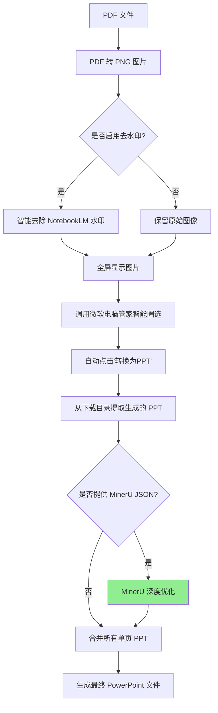

# 工作原理

本文档详细说明 NotebookLM2PPT 的技术实现细节和工作原理，适合技术人员参考。

## 🛠️ 核心工作流程

NotebookLM2PPT 通过模拟人工操作，实现了一套高效的 PDF 到 PPT 转换流程：



## 📁 项目结构

```text
NotebookLM2PPT/
├── main.py                          # 程序主入口
├── requirements.txt                 # 依赖清单
├── notebooklm2ppt/                  # 核心包
│   ├── __init__.py                  # 包初始化文件
│   ├── pdf2png.py                   # PDF 转 PNG 模块
│   ├── ppt_combiner.py              # PPT 合并模块
│   └── utils/                       # 工具模块
│       ├── __init__.py              # 包初始化文件
│       ├── screenshot_automation.py # 截图自动化模块
│       ├── image_viewer.py          # 图像查看器模块
│       ├── image_inpainter.py       # 图像修复模块
│       └── ppt_refiner.py           # MinerU 优化模块
├── examples/                        # 示例 PDF 存放处
└── workspace/                       # 运行时的临时文件与输出结果
```

## 🔧 核心模块详解

### PDF 转 PNG 模块

**文件**: `notebooklm2ppt/pdf2png.py`

- **功能**: 将 PDF 文件转换为高分辨率 PNG 图片
- **实现**: 使用 `pdf2image` 库
- **关键特性**:
  - 支持自定义 DPI 参数（默认 200）
  - 批量处理多页 PDF
  - 自动创建输出目录
- **技术细节**:
  - 利用 PDF 渲染引擎确保文本和图像的准确还原
  - 支持设置不同的 DPI 值以平衡质量和速度
  - 自动处理页面大小和方向

### 图像修复模块

**文件**: `notebooklm2ppt/utils/image_inpainter.py`

- **功能**: 自动识别并去除 NotebookLM 水印
- **实现**: 多种图像修复算法
- **关键特性**:
  - 自动检测水印位置
  - 支持 6 种不同的修复算法
  - 保持图像质量的同时去除水印
- **技术细节**:
  - 识别水印区域的边界像素
  - 从边界向内逐步填充
  - 使用适当的算法计算填充值

### 截图自动化模块

**文件**: `notebooklm2ppt/utils/screenshot_automation.py`

- **功能**: 模拟用户操作，实现自动化转换流程
- **实现**: 使用鼠标和键盘模拟库
- **关键特性**:
  - 模拟键盘快捷键（Ctrl + Shift + A）
  - 自动定位并点击"转换为PPT"按钮
  - 支持按钮位置校准
- **技术细节**:
  - 智能识别按钮位置
  - 记录按钮相对于屏幕底部的垂直偏移量
  - 内置错误处理机制

### 图像查看器模块

**文件**: `notebooklm2ppt/utils/image_viewer.py`

- **功能**: 全屏显示转换后的图片
- **实现**: 使用 Tkinter
- **关键特性**:
  - 全屏显示图片
  - 支持自定义显示比例
  - ESC 键全局支持
- **技术细节**:
  - 自动适应屏幕尺寸
  - 支持不同屏幕分辨率

### PPT 合并模块

**文件**: `notebooklm2ppt/ppt_combiner.py`

- **功能**: 将单页 PPT 合并为完整的演示文稿
- **实现**: 使用 PowerPoint 自动化 API
- **关键特性**:
  - 自动检测下载目录中的临时 PPT 文件
  - 按顺序合并幻灯片
  - 保持原始格式和布局
- **技术细节**:
  - 监控下载目录，实时检测新生成的 PPT 文件
  - 使用 PowerPoint 自动化 API 实现幻灯片合并

### MinerU 优化模块

**文件**: `notebooklm2ppt/utils/ppt_refiner.py`

- **功能**: 利用 MinerU 解析结果对 PPT 进行深度优化
- **实现**: 解析 MinerU JSON 并应用优化算法
- **关键特性**:
  - 智能文本框筛选
  - 字体统一处理
  - 高质量图片替换
  - 智能背景处理
- **技术细节**:
  - 基于 IOU 算法筛选相关文本框
  - 统一字体为"微软雅黑"
  - 从 JSON 中提取高清图片并替换
  - 基于边缘多样性和颜色差异的智能背景处理

## 🔍 核心算法

### IOU（交并比）算法

**应用场景**: MinerU 优化中的文本框筛选

**原理**:
```python
def compute_iou(boxA, boxB):
    # 计算两个矩形的交集面积
    xA = max(boxA[0], boxB[0])
    yA = max(boxA[1], boxB[1])
    xB = min(boxA[2], boxB[2])
    yB = min(boxA[3], boxB[3])

    interWidth = max(0, xB - xA)
    interHeight = max(0, yB - yA)
    interArea = interWidth * interHeight

    boxAArea = (boxA[2] - boxA[0]) * (boxA[3] - boxA[1])
    boxBArea = (boxB[2] - boxB[0]) * (boxB[3] - boxB[1])

    iou = interArea / float(boxAArea + boxBArea - interArea)

    return iou
```

**使用方式**:
- 计算 MinerU 识别的文本框与 PDF 内容块的 IOU
- 保留 IOU 值较高的文本框（相关性强）
- 删除 IOU 值较低的文本框（可能是无关元素）

### 图像修复算法

**应用场景**: 去除 NotebookLM 水印

**算法列表**:
1. **智能平滑**：综合效果最佳，适合大多数场景
2. **边缘均值填充**：取周围像素平均色填充
3. **极速纯色填充**：直接填充单一背景色
4. **逐层内缩修补**：由外向内逐层修补
5. **渐变过渡插值**：计算平滑的曲面过渡
6. **双调和光影修补**：保持光影连续性

### 边缘多样性检测算法

**应用场景**: MinerU 优化中的智能背景处理

**原理**:
- 计算文本块边缘的颜色多样性
- 计算文本块四个角的颜色差异
- 根据计算结果判断是纯色区域还是复杂背景
- 纯色区域填充平均颜色，复杂背景保留原背景

## 🚀 性能优化

### 并行处理

程序支持并行处理多个 PDF 页面，显著提升转换速度：

```python
from concurrent.futures import ThreadPoolExecutor

def process_pages(pages):
    with ThreadPoolExecutor(max_workers=4) as executor:
        results = list(executor.map(process_single_page, pages))
    return results
```

### 缓存机制

为了避免重复计算，程序实现了缓存机制：

- PDF 转 PNG 结果缓存
- 水印检测结果缓存
- MinerU JSON 解析结果缓存
- 图片下载缓存

### 内存管理

对于大型 PDF 文件，程序采用分块处理策略：

- 每次只处理一定数量的页面
- 及时释放不再使用的资源
- 避免内存溢出

### 依赖优化

在 v0.6.0 版本中，程序进行了深度依赖优化：

- **移除 Scikit-learn**：将原有的 DBSCAN 边缘多样性检测替换为高性能的 Numpy 原生实现
- **移除 OpenCV**：全屏图像显示引擎全面迁移至 Tkinter
- **体积效益**：编译后的 .exe 或二进制文件大小大大减小，冷启动速度与内存占用大幅优化

## ⚙️ 关键技术参数

| 参数 | 默认值 | 作用 | 影响 |
|------|--------|------|------|
| **button_offset** | 0 | 智能圈选按钮偏移量 | 决定程序能否准确定位按钮 |
| **dpi** | 200 | PDF 转 PNG 分辨率 | 影响图片质量和转换速度 |
| **display_scale** | 0.8 | 图片显示比例 | 影响圈选效果和转换成功率 |
| **delay** | 2 秒 | 操作延迟 | 影响操作稳定性和转换速度 |
| **timeout** | 60 秒 | 超时时间 | 影响转换稳定性和效率 |

## 📊 性能基准

### 转换速度

| PDF 页数 | 基础转换 | MinerU 优化 |
|---------|---------|------------|
| 10 页   | ~2 分钟 | ~3 分钟 |
| 20 页   | ~4 分钟 | ~6 分钟 |
| 50 页   | ~10 分钟| ~15 分钟|

### 资源占用

| 资源类型 | 基础转换 | MinerU 优化 |
|---------|---------|------------|
| CPU     | 30-50%  | 40-60%    |
| 内存    | 500MB   | 1GB       |
| 磁盘    | 100MB   | 500MB     |

## 🔗 相关文档

- [MinerU 优化](mineru)：详细了解 MinerU 深度优化的技术实现
- [功能介绍](features)：了解工具的核心功能
- [快速开始](quickstart)：快速上手使用指南