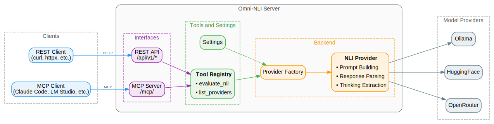

<div align="center">
  <picture>
    
  </picture>
<br>

<h2>Omni-NLI</h2>

[](https://github.com/CogitatorTech/omni-nli/actions/workflows/tests.yml)
[](https://codecov.io/gh/CogitatorTech/omni-nli)
[](https://github.com/CogitatorTech/omni-nli)
[](https://pypi.org/project/omni-nli/)
[](https://CogitatorTech.github.io/omni-nli/)
[](https://github.com/CogitatorTech/omni-nli/blob/main/LICENSE)
<br>
[](https://github.com/CogitatorTech/omni-nli/tree/main/examples)
[](https://github.com/CogitatorTech/omni-nli/pkgs/container/omni-nli-cpu)
[](https://github.com/CogitatorTech/omni-nli/pkgs/container/omni-nli-cuda)

A multi-interface (REST and MCP) server for natural language inference

</div>

---

Omni-NLI is a self-hostable server that provides [natural language inference (NLI)](https://en.wikipedia.org/wiki/Textual_entailment) capabilities via
RESTful and the Model Context Protocol (MCP) interfaces.
It can be used both as a very scalable standalone stateless microservice (via the REST API) and also as an MCP server for AI agents to implement a
verification layer for AI-based applications.



### What is NLI?

Given two pieces of text called premise and hypothesis, NLI (AKA textual entailment) is the task of determining the directional relationship between
them as it is perceived by a human reader.
The relationship is given one of these three labels:

- `"entailment"`: the hypothesis is supported by the premise
- `"contradiction"`: the hypothesis is contradicted by the premise
- `"neutral"`: the hypothesis is neither supported nor contradicted by the premise

> [!IMPORTANT]
> NLI is not the same as logical entailment.
> Its goal is to determine if a reasonable human would consider the hypothesis to follow from the premise.
> This checks for consistency instead of the absolute truth of the hypothesis.

Typical applications of NLI include:

* **Consistency checking**: NLI can be used to check if a given piece of text is consistent with the rest of the text. For example, if a new response
  from a chatbot or AI assistant contradicts something that was said earlier in the conversation.
* **Verifying summarization**: It can be used to check if a summarization contradicts the original text in some way.
* **Document search**: It can be used to check if the documents in the ranked list of results entail the query.
* **Fact-checking and verification**: It can be used to check if a piece of text is supported by some facts. Note that this is not the same as using
  logic.

> [!IMPORTANT]
> The quality of the results depends a lot on the model (the LLM) that is used.
> A good strategy is to first fine-tune the model using a dataset of premise-hypothesis-label triples that are relevant to your application domain.

### Main Features of Omni-NLI

- Helps mitigate LLM hallucinations by verifying if the generated content is supported by facts
- Supports models provided by different backends, including Ollama, HuggingFace (public and private/gated models), and OpenRouter
- Supports REST API (for traditional applications) and MCP (for AI agents) interfaces
- Fully configurable and very scalable, with built-in caching
- Provides confidence scores and (optional) reasoning traces for explainability

See [ROADMAP.md](ROADMAP.md) for the list of implemented and planned features.

> [!IMPORTANT]
> Omni-NLI is in early development, so bugs and breaking changes are expected.
> Please use the [issues page](https://github.com/CogitatorTech/omni-nli/issues) to report bugs or request features.

---

### Quickstart

#### 1. Installation

```sh
pip install omni-nli
```

#### 2. Start the Server

```sh
omni-nli
```

#### 3. Evaluate NLI (with REST API)

```sh
curl -X POST \
  -H "Content-Type: application/json" \
  -d '{
    "premise": "A football player kicks a ball into the goal.",
    "hypothesis": "The football player is asleep on the field."
  }' \
  http://127.0.0.1:8000/api/v1/nli/evaluate
```

Example response:

```json
{
    "label": "contradiction",
    "confidence": 0.99,
    "model": "microsoft/Phi-3.5-mini-instruct",
    "backend": "huggingface"
}
```

#### 4. Evaluate NLI (with MCP Interface)


---

### Documentation

Check out the [Omni-NLI Documentation](https://cogitatortech.github.io/omni-nli/) for more information, including configuration options, API
reference, and examples.

---

### Contributing

Contributions are always welcome!
Please see [CONTRIBUTING.md](CONTRIBUTING.md) for details on how to get started.

### License

Omni-NLI is licensed under the MIT License (see [LICENSE](LICENSE)).

### Acknowledgements

- The logo is from [SVG Repo](https://www.svgrepo.com/svg/480613/puzzle-9) with some modifications.

<!-- Need to add this line for MCP registry publication -->
<!-- mcp-name: io.github.CogitatorTech/omni-nli -->
