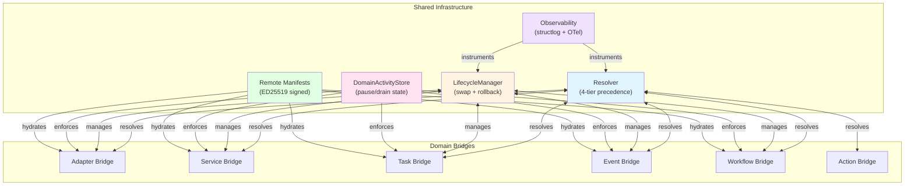

# Oneiric


**Explainable component resolution, lifecycle management, and remote delivery for Python 3.13+ runtimes**

> **Status:** Production Ready (audit v0.2.0, current v0.3.3) — see `docs/implementation/STAGE5_FINAL_AUDIT_REPORT.md` for audit metrics and `coverage.json` for the latest coverage snapshot.

Oneiric extracts the resolver/lifecycle core from ACB and turns it into a stand-alone platform. Register adapters/services/tasks/events/workflows/actions, explain every decision, hot‑swap providers, stream telemetry, replay workflow notifications, and hydrate new capabilities from signed remote manifests.

______________________________________________________________________

## Roadmap & Phase Tracking

- [Strategic Roadmap](docs/STRATEGIC_ROADMAP.md) — living priorities, principles, and recent decisions.
- [Serverless & Parity Execution Plan](docs/implementation/SERVERLESS_AND_PARITY_EXECUTION_PLAN.md) — Cloud Run profile + adapter/action remediation blueprint.
- [Orchestration Parity Plan](docs/implementation/ORCHESTRATION_PARITY_PLAN.md) — event dispatcher, DAG runtime, and supervisor milestones.
- [Implementation Phase Tracker](docs/IMPLEMENTATION_PHASE_TRACKER.md) — numbered delivery phases with owners/status for every outstanding item.

______________________________________________________________________

## Why Oneiric

- **Deterministic resolver:** Explicit selections → stack order → priorities → registration order, with `resolver.explain` + `oneiric.cli --demo explain …` showing every reason and shadowed candidate.
- **Lifecycle orchestration:** `LifecycleManager` wraps activation → health → bind → cleanup plus rollback, swap latency histograms, and structured logging for every domain.
- **Config watchers & supervisor:** `SelectionWatcher` uses watchfiles/polling to auto‑swap components, while the `ServiceSupervisor` enforces pause/drain state recorded in the SQLite `DomainActivityStore`.
- **Remote manifests + packaging:** CDN/file manifests (ED25519 signatures + SHA256) hydrate all domains. Use `oneiric.cli manifest pack` to emit canonical JSON and `docs/examples/FASTBLOCKS_PARITY_FIXTURE.yaml` to rehearse parity in CI.
- **Runtime orchestration:** `RuntimeOrchestrator` wires bridges, watchers, remote sync, workflow checkpoints (`WorkflowCheckpointStore`), scheduler HTTP server hooks, and structured telemetry snapshots.
- **Event/workflow parity:** The event dispatcher handles topics, priorities, retry policies, filters, and exclusive fan-out; workflow bridges run DAGs inline, enqueue jobs, and expose queue metadata for Cloud Tasks/Pub/Sub adapters.
- **Observability + ChatOps:** `oneiric.core.logging` (structlog), `RuntimeTelemetryRecorder` (`.oneiric_cache/runtime_telemetry.json`), runtime health snapshots, `oneiric.cli status/health/activity/remote-status`, and the `NotificationRouter` that forwards `workflow.notify` payloads to Slack/Teams/Webhooks from CLI or orchestrator runs. Monitoring adapters include Logfire, Sentry, OTLP, and Netdata for comprehensive system and application observability.
- **Plugin/secrets tooling:** Entry-point discovery auto-loads adapters/services/tasks/events/workflows (`oneiric.cli plugins`), while `SecretsHook` caches provider results and `oneiric.cli secrets rotate` invalidates cached values.
- **Documentation + runbooks:** `docs/README.md` indexes 40+ living documents (architecture, telemetry, deployment, observability checklists, cut-over validation) so operational workflows match the runtime.

______________________________________________________________________

## Domain Coverage & Built-ins



**Domain Details:**

| Domain | Bridge Features | Built-in Examples |
|--------|-----------------|-------------------|
| **Adapters** | Activity-aware swaps, pause/drain enforcement, health snapshots | Redis caches, Cloud Tasks/Pub/Sub/Kafka/RabbitMQ/NATS/Redis Streams queues, httpx/aiohttp clients, S3/GCS/Azure/local storage, Slack/Teams/Webhook/Twilio/SendGrid/Mailgun/APNS/FCM/Webpush messaging, Auth0 identity, Cloudflare/Route53/GCP DNS, FTP/SFTP/SCP/HTTPS file transfer (download + upload), Infisical/GCP/AWS secrets, Postgres/MySQL/SQLite/DuckDB DBs, MongoDB/Firestore/DynamoDB NoSQL, Neo4j/DuckDB PGQ/ArangoDB graph, Pinecone/Qdrant/pgvector vector, OpenAI/SentenceTransformers/ONNX/Anthropic embeddings + LLM, Logfire/Sentry/OTLP/Netdata monitoring |
| **Services** | Lifecycle-managed business services with supervisor hooks | Example payment/notification services (`docs/examples/LOCAL_CLI_DEMO.md`) |
| **Tasks** | Async runners + queue metadata and retry controls | `task.schedule`, Cloud Tasks schedulers, Pub/Sub dispatch |
| **Events** | Dispatcher with filters, fan-out policies, retry, and observability metrics | `event.dispatch`, webhook fan-out, queue listeners |
| **Workflows** | DAG execution/enqueueing, queue adapter selection, checkpoints, telemetry | Demo workflows + remote DAGs from manifests (`fastblocks.workflows.fulfillment`, etc.) |
| **Actions** | Action bridge plus kits for compression encode/hash, workflow audit/orchestrate/notify/retry, http.fetch, security signature/secure, serialization encode/decode, data transform/sanitize, validation schema, task scheduling, event dispatch, automation triggers, debug console, etc. |
| **Shell** | IPython-based admin shell for interactive debugging | `AdminShell` base class with Rich formatters, magic commands, and helper functions |

All domains share the same resolver semantics, lifecycle orchestration, logging, and activity controls.

______________________________________________________________________

## Runtime & Orchestrator Capabilities

- **Watchers:** `Adapter|Service|Task|Event|WorkflowConfigWatcher` reload selections via watchfiles or polling (serverless mode falls back to polling). Swaps respect activity state (paused/draining).
- **Remote sync:** `RuntimeOrchestrator.sync_remote()` verifies signatures, registers every domain, refreshes dispatchers/DAGs, and records per-domain counts/durations.
- **Supervisor & activity store:** `DomainActivityStore` persists pause/drain notes in SQLite; the supervisor polls it, exposes listener hooks, and ensures paused/draining components stop accepting work.
- **Workflow checkpoints:** `WorkflowCheckpointStore` stores DAG progress per workflow so orchestrations can resume after restarts; `orchestrate` and `workflow run` expose `--workflow-checkpoints`/`--no-workflow-checkpoints`.
- **Scheduler HTTP server:** Optional aiohttp server (`SchedulerHTTPServer`) processes Cloud Tasks callbacks via `WorkflowTaskProcessor`. CLI `--http-port/--no-http` toggles this path for serverless deployments.
- **Telemetry + health:** `RuntimeTelemetryRecorder` tracks event dispatch + workflow execution stats; `RuntimeHealthSnapshot` writes orchestrator PID, watcher/remote state, per-domain registration counts, and activity/lifecycle snapshots to `.oneiric_cache/runtime_health.json`.
- **Notification router:** `NotificationRouter` converts `workflow.notify` payloads into `NotificationMessage` objects and sends them through messaging adapters. CLI `action-invoke workflow.notify --workflow … --send-notification` uses the same route metadata as runtime workflows.
- **Remote status:** `oneiric.cli remote-status` loads cached remote telemetry (`remote_status.json`) with sync timestamps, per-domain counts, and latency budget comparisons (the manifest URL comes from settings, not the cache file).

______________________________________________________________________

## Quick Start

```bash
# Install
uv add oneiric

# Demo runner (adapters/events/workflows wired with defaults)
uv run python main.py

# Inspect demo metadata
uv run python -m oneiric.cli --demo list --domain adapter
uv run python -m oneiric.cli --demo explain status --domain service --key status

# Orchestrator inspectors (no long-running loop)
uv run python -m oneiric.cli orchestrate --print-dag --workflow fastblocks.workflows.fulfillment --inspect-json
uv run python -m oneiric.cli orchestrate --events --inspect-json

# Inspect workflow DAG plan (topology + metadata)
uv run python -m oneiric.cli workflow plan \
  --workflow fastblocks.workflows.fulfillment \
  --json

# Remote sync (file or HTTPS manifest)
uv run python -m oneiric.cli remote-sync --manifest docs/sample_remote_manifest.yaml --watch --refresh-interval 120

# Emit events (fan-out/filters/retry proof)
uv run python -m oneiric.cli event emit \
  --topic fastblocks.order.created \
  --payload '{"order_id":"demo-123","region":"us"}' \
  --json

# Run workflows/DAGs once (without enqueueing)
uv run python -m oneiric.cli workflow run \
  --workflow fastblocks.workflows.fulfillment \
  --context '{"order_id":"demo-123"}' \
  --json

# Use stored checkpoints (or disable them) for workflow runs
uv run python -m oneiric.cli workflow run \
  --workflow fastblocks.workflows.fulfillment \
  --workflow-checkpoints \
  --resume-checkpoint \
  --json

# Inspect DAG plan/topology without executing
uv run python -m oneiric.cli orchestrate \
  --print-dag \
  --workflow fastblocks.workflows.fulfillment \
  --inspect-json

# The inspector output lists node order, dependency edges, queue category/provider fallbacks,
# retry/checkpoint metadata, and notification hints derived from the manifest. Attach this
# JSON to parity issues alongside the CLI `status --json` snapshot before executing workflows.

# Replay workflow.notify payloads through ChatOps adapters
uv run python -m oneiric.cli action-invoke workflow.notify \
  --workflow fastblocks.workflows.fulfillment \
  --payload '{"message":"Deploy ready","channel":"deploys"}' \
  --send-notification --json

# Long-running orchestrator (with remote refresh + scheduler HTTP server)
uv run python -m oneiric.cli orchestrate \
  --manifest docs/sample_remote_manifest.yaml \
  --refresh-interval 120 \
  --http-port 8080
```

### Serverless Profile Quickstart (Cloud Run)

```bash
# Package the manifest that will be baked into the Cloud Run build
uv run python -m oneiric.cli manifest pack \
  --input docs/sample_remote_manifest.yaml \
  --output build/serverless_manifest.json

# Capture supervisor + health proofs before deploying
ONEIRIC_PROFILE=serverless \
  uv run python -m oneiric.cli supervisor-info --json

ONEIRIC_PROFILE=serverless \
  uv run python -m oneiric.cli health --probe --json \
    --manifest build/serverless_manifest.json

# Run the orchestrator locally with serverless defaults
ONEIRIC_PROFILE=serverless \
  uv run python -m oneiric.cli orchestrate \
    --no-remote \
    --health-path /tmp/runtime_health.json
```

| Env Var | Purpose | Notes |
|---------|---------|-------|
| `ONEIRIC_PROFILE=serverless` | Applies watcher/remote/secrets toggles used for Cloud Run | CLI and `main.py` honor this env var automatically |
| `ONEIRIC_CONFIG=/workspace/config/serverless.toml` | Points to per-service serverless settings | Use with Procfile or `gcloud run deploy --set-env-vars` |
| `ONEIRIC_RUNTIME_SUPERVISOR__ENABLED` | Overrides the Service Supervisor flag | Leave unset (`true`) unless debugging |
| `ONEIRIC_ACTIVITY_STORE=/workspace/.oneiric_cache/domain_activity.sqlite` | Pins the activity store location | Optional; default lives under `.oneiric_cache/` |

Include the `supervisor-info` and `health --probe --json` output in release notes so Cloud Run deployers can prove the serverless profile, supervisor, and Secret Manager precedence were enabled. Full build/deploy transcripts live in `docs/deployment/CLOUD_RUN_BUILD.md`.

______________________________________________________________________

## CLI Map

- **Domain introspection:** `oneiric.cli list`, `status`, `explain`, `swap`, and `--shadowed` target adapters/services/tasks/events/workflows/actions with structured JSON output.
- **Runtime controls:** `pause`, `drain`, `activity`, `health --probe`, `supervisor-info`, and `status` manage/inspect pause-drain states, lifecycle metrics, and supervisor toggles; `activity` surfaces SQLite-backed counts for dashboards.
- **Workflows & events:** `workflow plan`, `workflow run`, `workflow enqueue`, `event emit` interact with DAGs, queue adapters, and event dispatcher metadata; CLI accepts JSON context/metadata payloads for parity tests.
- **Remote + manifests:** `remote-sync`, `remote-status`, `manifest pack` (YAML→JSON packaging), and `manifest` inspectors keep manifests + cached telemetry aligned. `docs/examples/FASTBLOCKS_PARITY_FIXTURE.yaml` plus `tests/integration/test_migration_parity.py` enforce parity.
- **Observability:** `orchestrate --print-dag/--events --inspect-json`, `status --json`, `health --json`, `activity --json`, `action-invoke workflow.notify --send-notification`, and `remote-status --json` produce the artifacts referenced in `docs/examples/*_OBSERVABILITY.md`.
- **Secrets & plugins:** `secrets rotate --keys k1,k2` invalidates cache entries, `secrets rotate --all` clears the provider cache, and `plugins` lists entry-point groups + candidate counts/errors for diagnostics.

______________________________________________________________________

## Observability, Telemetry & ChatOps

- **Structured logging:** `oneiric.core.logging` wraps structlog with domain/key/provider context, JSON output, timestamper, optional sinks (stdout, stderr, file, HTTP), and tracer injection. See `docs/OBSERVABILITY_GUIDE.md`.
- **Runtime telemetry:** `.oneiric_cache/runtime_telemetry.json` stores the last event dispatch + workflow execution (matched handlers, attempts, failures, per-node durations, retry counts). CLI inspectors update the same file so you can attach it to parity PRs.
- **Health snapshots:** `.oneiric_cache/runtime_health.json` includes watcher state, orchestrator PID, remote metrics, and pause/drain snapshots for `oneiric.cli health`.
- **Remote telemetry:** `.oneiric_cache/remote_status.json` stores sync telemetry (duration, per-domain registrations, success/failure counters) and powers `remote-status`.
- **Notification evidence:** `NotificationRoute` metadata can be derived from workflow definitions or CLI overrides; CLI transcripts should accompany telemetry + DAG/event payloads as documented in `docs/examples/CRACKERJACK_OBSERVABILITY.md`, `FASTBLOCKS_OBSERVABILITY.md`, and `SESSION_MGMT_MCP_OBSERVABILITY.md`.
- **Parity/cut-over artifacts:** `docs/implementation/CUTOVER_VALIDATION_CHECKLIST.md` enumerates manifest snapshots, DAG/event JSON, telemetry archives, and ChatOps transcripts required before flipping Crackerjack/Fastblocks/Session-Mgmt to Oneiric.

______________________________________________________________________

## Remote Manifests & Packaging

- **Schema:** `docs/REMOTE_MANIFEST_SCHEMA.md` defines v2 entries (capabilities, retry policies, DAG specs, platform constraints, documentation links).
- **Security:** `oneiric.remote.security` enforces ED25519 signatures and SHA256 digests; manifest metadata includes ownership, secrets posture, and dependency hints.
- **Packaging:** `oneiric.cli manifest pack --input docs/sample_remote_manifest.yaml --output build/manifest.json` produces canonical JSON for Cloud Run / serverless deploys.
- **Telemetry:** Remote sync writes `remote_status.json` (duration, latency budget, per-domain registrations). Pair `remote-status --json` with telemetry pipelines.
- **Fixtures/tests:** `docs/examples/FASTBLOCKS_PARITY_FIXTURE.yaml` feeds both docs and `tests/integration/test_migration_parity.py`; update the fixture + parity guides together to keep CI evidence in sync.

______________________________________________________________________

## Documentation Map

- `docs/README.md` — documentation index + navigation.
- `docs/ONEIRIC_VS_ACB.md` — migration + comparison guide.
- `docs/UNCOMPLETED_TASKS.md` — future enhancements (no critical blockers).
- `docs/implementation/STAGE5_FINAL_AUDIT_REPORT.md` — production readiness audit (95/100).
- `docs/implementation/CUTOVER_VALIDATION_CHECKLIST.md` — artifact requirements for repo cut-overs.
- `docs/examples/FASTBLOCKS_PARITY_FIXTURE.yaml` + `docs/examples/*_OBSERVABILITY.md` — parity fixtures + CLI/telemetry steps.
- Reference specs: `docs/NEW_ARCH_SPEC.md`, `docs/RESOLUTION_LAYER_SPEC.md`, `docs/REMOTE_MANIFEST_SCHEMA.md`, `docs/SIGNATURE_VERIFICATION.md`, `docs/OBSERVABILITY_GUIDE.md`.
- Operations: `docs/deployment/` (Cloud Run + systemd), `docs/monitoring/` (Prometheus/Grafana/Loki/alerts), `docs/runbooks/` (incidents, maintenance, troubleshooting).

______________________________________________________________________

## Testing & Quality

```bash
# Full suite
uv run pytest

# Coverage
uv run pytest --cov=oneiric --cov-report=term

# Parity fixture / orchestrator integration
uv run pytest tests/integration/test_migration_parity.py -vv

# Runtime orchestrator coverage
uv run pytest tests/runtime -vv

# Repo quality gates (lint+tests+version bump)
python -m crackerjack -a patch
```

- Stage 5 audit (v0.2.0) reported 526 tests, 83 % coverage, and no P0/P1 issues; see `coverage.json` for the current coverage snapshot.
- Runtime telemetry + notification router + supervisor paths are covered by `tests/runtime/test_telemetry.py`, `test_notifications.py`, `test_supervisor.py`, and CLI/integration suites.
- `python -m crackerjack` mirrors the multi-repo gate used in Crackerjack/ACB/FastBlocks.

______________________________________________________________________

## Contributing

1. Review architecture & migration references (`docs/ONEIRIC_VS_ACB.md`, `docs/README.md`).
1. Run `python -m crackerjack -a patch` (lint/tests/format/version bump) before opening a PR.
1. Add or update tests for new runtime features, adapters, actions, or CLI flows.
1. Update documentation/runbooks (especially observability guides + cut-over checklist) so reviewers can reproduce artifacts.

______________________________________________________________________

## License & Support

- **License:** BSD-3-Clause (see `LICENSE`).
- **Issues:** https://github.com/lesleslie/oneiric/issues
- **Docs:** Start with `docs/README.md` and the Stage 5 audit for readiness evidence.

Oneiric builds on patterns from ACB, Crackerjack, and FastBlocks—thanks to everyone contributing adapters, action kits, runtime supervisors, telemetry, and observability tooling.
