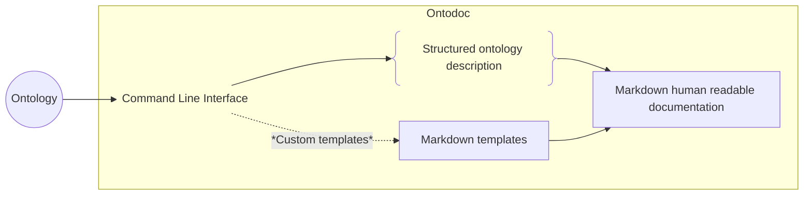

<p align="center">

</p>

# ontodoc

[](https://github.com/StephaneBranly/ontodoc/releases) [](https://pypistats.org/packages/ontodoc) [](https://github.com/StephaneBranly/ontodoc/blob/v0.0.1/LICENCE.txt)

A python module to generate markdown documentation for ontologies.

Based on `rdflib` and `jinja2`.

## Getting Started 🚀

### Installation

```shell
pip install ontodoc
```

### Command line usage

```shell
python -m ontodoc
```

By default, the file named `ontology.ttl` will be used to generate your documentation in the `build` destination folder.

You can easily change settings as you need.
Available arguments :

| Argument name                         | Default        | Description                                           | Implemented |
| ------------------------------------- | -------------- | ----------------------------------------------------- | ----------- |
| `-i, --input INPUT`                   | `ontology.ttl` | _Input ontology file_                                 | ✅          |
| `-o, --output OUTPUT`                 | `build/`       | _Output directory for the generated documentation_    | ✅          |
| `-t, --templates TEMPLATES`           | `templates/`   | _Custom templates folder_                             | ✅          |
| `-f, --footer, --no-footer`           | `true`         | _Add footer for each page_                            | ✅          |
| `-c, --concatenate, --no-concatenate` | `false`        | _Concatenate documentation into an unique file_       | ✅          |
| `-s, --schema, --no-schema`           | `true`         | _Display schemas_                                     | ✅          |
| `-m, --model MODEL`                   | `markdown`     | _Model type for the documentation. markdown, gh_wiki_ | ❌          |

### Python generation

You can also generate your documentation and access parameters from python as follow :

```python
import ontodoc
ontodoc.Documentation(input_graph='example/foaf.ttl').generate()
```

### Automatically generate your documentation

You can explore `github actions` to automatically generate and publish your documentation. If you need some inspiration to do it, check [our ontodoc github action](https://github.com/StephaneBranly/ontodoc/blob/main/.github/workflows/build_doc.yaml).

## Example 👀

Look at the [example for _foaf_](https://github.com/StephaneBranly/ontodoc/blob/main/example/build/homepage.md) to see what type of documentation you can easily build in 2 lines!

If you want to change the markdown templates, take a look at the structure of the [default ones](https://github.com/StephaneBranly/ontodoc/tree/main/ontodoc/templates).

## How does it work ? 🔧



Recognized properties available [here](https://github.com/StephaneBranly/ontodoc/blob/main/ontodoc/ontology_properties.py).

## Contributing </>

Feel free to contribute to this open source project!

We need help to implement new features, fix bugs listed in [issues](https://github.com/StephaneBranly/ontodoc/issues).

If you have any idea, create your own issue.

## License 🔓

[Apache License 2.0](https://github.com/StephaneBranly/ontodoc/blob/main/LICENCE.txt)

## They already have integrated Ontodoc ♥️

_Comming soon..._
