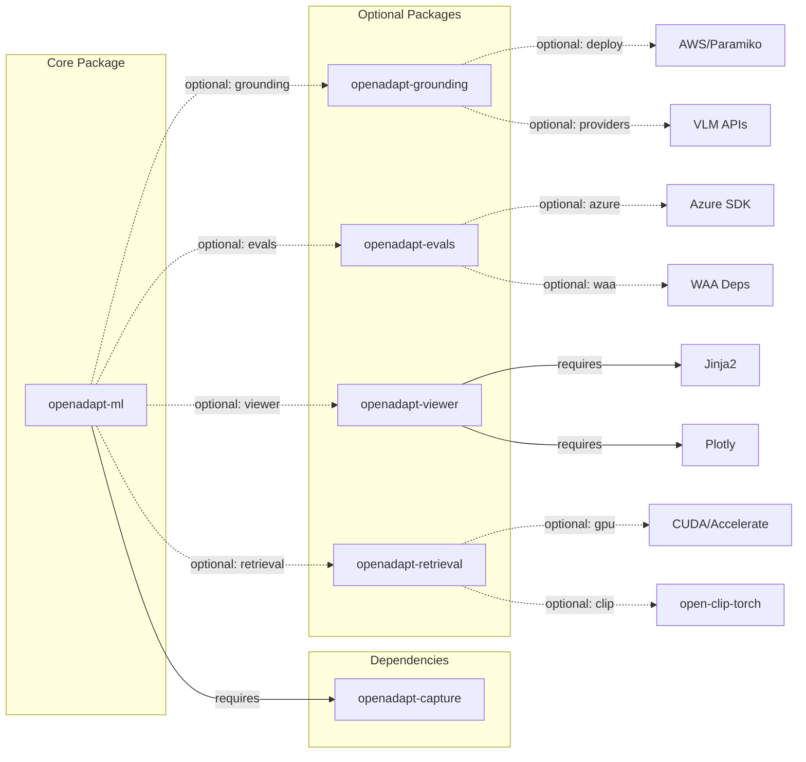
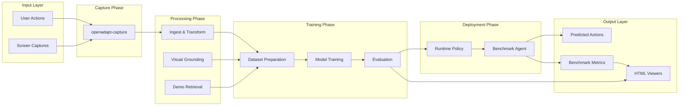

# OpenAdapt Package Architecture

This document provides visual diagrams showing how all OpenAdapt packages fit together.

## Quick Reference: ASCII Diagram

```
+-----------------------------------------------------------------------------------+
|                            OPENADAPT ECOSYSTEM                                     |
+-----------------------------------------------------------------------------------+

    +-------------------+
    |  openadapt-capture |  <-- User recordings (screenshots, actions, metadata)
    +-------------------+
            |
            | Captures (JSON + Screenshots)
            v
+-----------------------------------------------------------------------------------+
|                              openadapt-ml (Core Engine)                           |
|                                                                                   |
|  +---------------+  +---------------+  +---------------+  +---------------+       |
|  |    schema     |  |    ingest     |  |   training    |  |   runtime     |       |
|  | Episode, Step |  | CaptureLoader |  | Trainer, TRL  |  | Policy, Agent |       |
|  | Action, Obs   |  | Synthetic Gen |  | Checkpoints   |  | Safety Gate   |       |
|  +---------------+  +---------------+  +---------------+  +---------------+       |
|         ^                   |                 |                  |                |
|         |                   v                 v                  v                |
|  +---------------+  +---------------+  +---------------+  +---------------+       |
|  |   datasets    |  |    models     |  |  experiments  |  |   retrieval   |       |
|  | NextAction DS |  | Qwen VL, API  |  | Demo Prompt   |  | Embeddings    |       |
|  | Batch Loading |  | Base Adapter  |  | WAA Demo      |  | Vector Index  |       |
|  +---------------+  +---------------+  +---------------+  +---------------+       |
|                                                                                   |
|  +-------------------------------------+  +-----------------------------------+   |
|  |              cloud                   |  |           benchmarks              |   |
|  | Azure Inference | Lambda Labs | SSH  |  | WAA | Agent | Runner | Viewer    |   |
|  +-------------------------------------+  +-----------------------------------+   |
+-----------------------------------------------------------------------------------+
            |                   |                   |                   |
            |                   |                   |                   |
            v                   v                   v                   v
+-------------------+  +-------------------+  +-------------------+  +-------------+
| openadapt-grounding|  | openadapt-evals  |  | openadapt-viewer  |  | openadapt-  |
|                   |  |                   |  |                   |  | retrieval   |
| - OmniParser      |  | - BenchmarkAdapter|  | - HTMLBuilder     |  |             |
| - UI-TARS         |  | - WAA Adapter     |  | - BenchmarkRun    |  | - Qwen3VL   |
| - VLM Providers   |  | - Azure Adapter   |  | - TaskExecution   |  |   Embedder  |
| - Element Locator |  | - Metrics         |  | - ExecutionStep   |  | - CLIP      |
| - Registry        |  | - Live Tracker    |  |                   |  |   Embedder  |
| - Collectors      |  |                   |  |                   |  | - Vector    |
+-------------------+  +-------------------+  +-------------------+  |   Index     |
        |                      |                      |              | - Reranker  |
        v                      v                      v              +-------------+
+-----------------------------------------------------------------------------------+
|                           EXTERNAL SERVICES & APIs                                |
+-----------------------------------------------------------------------------------+
|                                                                                   |
|  Cloud Providers:        VLM APIs:              Benchmarks:                       |
|  - Azure ML             - Anthropic (Claude)    - Windows Agent Arena (WAA)       |
|  - Lambda Labs (GPU)    - OpenAI (GPT-4/5)     - WebArena                         |
|  - AWS (OmniParser)     - Google (Gemini)      - OSWorld                          |
|                                                                                   |
|  Grounding Models:       Storage:                                                 |
|  - OmniParser           - Azure Blob Storage                                      |
|  - UI-TARS (vLLM)       - Azure Queue Storage                                     |
|                         - FAISS Vector Index                                      |
+-----------------------------------------------------------------------------------+
```

## Detailed Mermaid Diagram

```mermaid
flowchart TB
    subgraph External["External Services"]
        Azure["Azure ML / Blob / Queue"]
        Lambda["Lambda Labs GPU"]
        AWS["AWS EC2 (OmniParser)"]
        Anthropic["Anthropic Claude API"]
        OpenAI["OpenAI GPT API"]
        Google["Google Gemini API"]
        WAA["Windows Agent Arena"]
    end

    subgraph Capture["openadapt-capture"]
        CaptureRecorder["Capture Recorder"]
        Screenshots["Screenshots"]
        ActionLog["Action Log"]
    end

    subgraph ML["openadapt-ml (Core Engine)"]
        subgraph Schema["schema"]
            Episode["Episode"]
            Step["Step"]
            Action["Action"]
            Observation["Observation"]
        end

        subgraph Ingest["ingest"]
            CaptureLoader["CaptureLoader"]
            SyntheticGen["Synthetic Generator"]
        end

        subgraph Training["training"]
            Trainer["Trainer"]
            TRLTrainer["TRL Trainer"]
            StubProvider["Stub Provider"]
            SharedUI["Shared UI Components"]
        end

        subgraph Runtime["runtime"]
            Policy["Policy"]
            SafetyGate["Safety Gate"]
        end

        subgraph Models["models"]
            QwenVL["Qwen VL Adapter"]
            APIAdapter["API Adapter"]
            BaseAdapter["Base Adapter"]
        end

        subgraph CloudMod["cloud"]
            AzureInf["Azure Inference"]
            LambdaClient["Lambda Labs Client"]
            SSHTunnel["SSH Tunnel Manager"]
            LocalServe["Local Server"]
        end

        subgraph Benchmarks["benchmarks"]
            BenchAdapter["Benchmark Adapter"]
            BenchAgent["Benchmark Agent"]
            BenchRunner["Evaluation Runner"]
            WAAAdapter["WAA Adapter"]
            DataCollection["Data Collection"]
            BenchViewer["Benchmark Viewer"]
            AzureOrch["Azure Orchestrator"]
        end

        subgraph Retrieval["retrieval"]
            DemoRetriever["Demo Retriever"]
            Embeddings["Embeddings"]
            VectorIndex["Vector Index"]
        end
    end

    subgraph Grounding["openadapt-grounding"]
        Locator["Element Locator"]
        Registry["Registry Builder"]
        OmniParser["OmniParser Client"]
        UITars["UI-TARS Client"]
        VLMProviders["VLM Providers"]
        Collectors["Frame Collectors"]
        GroundingEval["Eval Framework"]
    end

    subgraph Evals["openadapt-evals"]
        EvalAdapter["Benchmark Adapter"]
        EvalWAA["WAA Adapter"]
        EvalRunner["Evaluation Runner"]
        EvalMetrics["Metrics"]
        EvalViewer["Viewer Generator"]
        EvalTracker["Live Tracker"]
    end

    subgraph Viewer["openadapt-viewer"]
        HTMLBuilder["HTML Builder"]
        BenchmarkRun["Benchmark Run Types"]
        TaskExecution["Task Execution"]
        ViewerGen["Benchmark Generator"]
    end

    subgraph RetrievalPkg["openadapt-retrieval"]
        QwenEmbed["Qwen3VL Embedder"]
        CLIPEmbed["CLIP Embedder"]
        MultiRetriever["Multimodal Retriever"]
        Storage["Embedding Storage"]
        Reranker["Cross-Encoder Reranker"]
    end

    %% Data Flow: Capture to Training
    CaptureRecorder --> Screenshots
    CaptureRecorder --> ActionLog
    Screenshots --> CaptureLoader
    ActionLog --> CaptureLoader
    CaptureLoader --> Episode
    Episode --> Step
    Step --> Action
    Step --> Observation

    %% Training Flow
    Episode --> Trainer
    Trainer --> QwenVL
    Trainer --> TRLTrainer
    TRLTrainer --> Policy
    Trainer --> LocalServe

    %% Cloud Training
    Trainer --> LambdaClient
    LambdaClient --> Lambda
    Trainer --> AzureInf
    AzureInf --> Azure

    %% Benchmark Flow
    WAAAdapter --> WAA
    BenchAgent --> Policy
    BenchRunner --> BenchAgent
    BenchRunner --> WAAAdapter
    BenchRunner --> DataCollection
    DataCollection --> BenchViewer
    AzureOrch --> Azure

    %% Grounding Package
    Locator --> OmniParser
    Locator --> UITars
    OmniParser --> AWS
    UITars --> AWS
    VLMProviders --> Anthropic
    VLMProviders --> OpenAI
    VLMProviders --> Google

    %% Evals Package
    EvalAdapter --> EvalRunner
    EvalWAA --> WAA
    EvalRunner --> EvalMetrics
    EvalRunner --> EvalViewer
    EvalRunner --> EvalTracker

    %% Viewer Package
    BenchmarkRun --> HTMLBuilder
    TaskExecution --> HTMLBuilder
    HTMLBuilder --> ViewerGen

    %% Retrieval Package
    QwenEmbed --> MultiRetriever
    CLIPEmbed --> MultiRetriever
    MultiRetriever --> Storage
    MultiRetriever --> Reranker

    %% Cross-package Dependencies
    ML -.->|"depends on"| Capture
    Benchmarks -.->|"uses"| Grounding
    Training -.->|"uses"| Retrieval
    BenchViewer -.->|"uses"| Viewer

    %% API Adapter connections
    APIAdapter --> Anthropic
    APIAdapter --> OpenAI
    APIAdapter --> Google

    classDef external fill:#f9f,stroke:#333,stroke-width:2px
    classDef core fill:#bbf,stroke:#333,stroke-width:2px
    classDef pkg fill:#bfb,stroke:#333,stroke-width:2px

    class Azure,Lambda,AWS,Anthropic,OpenAI,Google,WAA external
    class ML core
    class Grounding,Evals,Viewer,RetrievalPkg,Capture pkg
```



## Package Dependencies



## Data Flow Diagram



## Component Details

### openadapt-ml (Core Engine)

The central package that orchestrates ML training and evaluation.

| Module | Purpose | Key Classes |
|--------|---------|-------------|
| `schema` | Data structures for episodes, steps, actions | `Episode`, `Step`, `Action`, `Observation` |
| `ingest` | Load captures and synthetic data | `CaptureLoader`, `SyntheticGenerator` |
| `training` | Model training pipeline | `Trainer`, `TRLTrainer`, `StubProvider` |
| `runtime` | Production inference | `Policy`, `SafetyGate` |
| `models` | VLM adapters | `QwenVLAdapter`, `APIAdapter` |
| `cloud` | Cloud GPU training | `LambdaLabsClient`, `AzureInferenceQueue` |
| `benchmarks` | Evaluation framework | `WAAAdapter`, `BenchmarkRunner` |
| `retrieval` | Demo retrieval (internal) | `DemoRetriever`, `VectorIndex` |

### openadapt-grounding

Visual grounding for UI element localization.

| Module | Purpose | Key Classes |
|--------|---------|-------------|
| `parsers` | Screen parsing backends | `OmniParserClient`, `UITarsClient` |
| `providers` | VLM API wrappers | `AnthropicProvider`, `OpenAIProvider`, `GoogleProvider` |
| `locator` | Element location | `ElementLocator`, `Registry` |
| `eval` | Grounding evaluation | `GroundingEvaluator`, `SyntheticDataset` |
| `deploy` | Cloud deployment | `Deploy`, `UITarsDeploy` |

### openadapt-evals

Benchmark evaluation infrastructure.

| Module | Purpose | Key Classes |
|--------|---------|-------------|
| `benchmarks` | Benchmark adapters | `BenchmarkAdapter`, `WAAAdapter`, `WAALiveAdapter` |
| `agent` | Agent interfaces | `BenchmarkAgent`, `ScriptedAgent`, `RandomAgent` |
| `runner` | Evaluation runner | `evaluate_agent_on_benchmark`, `compute_metrics` |
| `viewer` | Result visualization | `generate_benchmark_viewer` |
| `metrics` | Metric computation | `compute_domain_metrics` |

### openadapt-viewer

Standalone HTML viewer generation.

| Module | Purpose | Key Classes |
|--------|---------|-------------|
| `core` | Base building blocks | `HTMLBuilder`, `DataLoader` |
| `viewers/benchmark` | Benchmark viewers | `BenchmarkGenerator` |
| `types` | Data types | `BenchmarkRun`, `TaskExecution`, `ExecutionStep` |

### openadapt-retrieval

Multimodal demo retrieval using VLM embeddings.

| Module | Purpose | Key Classes |
|--------|---------|-------------|
| `embeddings` | Embedding generation | `Qwen3VLEmbedder`, `CLIPEmbedder` |
| `retriever` | Similarity search | `MultimodalDemoRetriever`, `VectorIndex` |
| `storage` | Persistence | `EmbeddingStorage` |
| `reranker` | Result reranking | `CrossEncoderReranker` |

## External Dependencies

### Cloud Providers

| Provider | Usage | Package |
|----------|-------|---------|
| Azure ML | Distributed benchmark execution | `openadapt-ml`, `openadapt-evals` |
| Azure Blob Storage | Checkpoint storage, inference queue | `openadapt-ml` |
| Lambda Labs | GPU training instances | `openadapt-ml` |
| AWS EC2 | OmniParser / UI-TARS hosting | `openadapt-grounding` |

### VLM APIs

| API | Usage | Package |
|-----|-------|---------|
| Anthropic (Claude) | Grounding, action prediction | `openadapt-grounding`, `openadapt-ml` |
| OpenAI (GPT-4/5) | Grounding, action prediction | `openadapt-grounding`, `openadapt-ml` |
| Google (Gemini) | Grounding, action prediction | `openadapt-grounding`, `openadapt-ml` |

### Benchmarks

| Benchmark | Status | Package |
|-----------|--------|---------|
| Windows Agent Arena (WAA) | Implemented | `openadapt-ml`, `openadapt-evals` |
| WebArena | Planned | `openadapt-evals` |
| OSWorld | Planned | `openadapt-evals` |

## Installation

```bash
# Core ML engine
pip install openadapt-ml

# With optional dependencies
pip install "openadapt-ml[api,azure,training]"

# Grounding package
pip install "openadapt-grounding[providers,deploy]"

# Evaluation package
pip install "openadapt-evals[waa,azure]"

# Viewer package
pip install openadapt-viewer

# Retrieval package
pip install "openadapt-retrieval[gpu,clip]"
```

## Quick Start

```python
# Load a capture and train
from openadapt_ml.ingest import CaptureLoader
from openadapt_ml.training import Trainer

loader = CaptureLoader("/path/to/capture")
episode = loader.load_episode()

trainer = Trainer(model_name="Qwen/Qwen2.5-VL-3B")
trainer.train(episode)

# Run evaluation on benchmarks
from openadapt_evals import WAAMockAdapter, SmartMockAgent, evaluate_agent_on_benchmark

adapter = WAAMockAdapter(num_tasks=10)
agent = SmartMockAgent()
results = evaluate_agent_on_benchmark(agent, adapter)

# Use grounding for element localization
from openadapt_grounding import OmniParserClient, ElementLocator

parser = OmniParserClient(endpoint="http://localhost:8000")
locator = ElementLocator(parser=parser)
result = locator.locate("Click the Submit button", screenshot)

# Retrieve similar demos
from openadapt_retrieval import MultimodalDemoRetriever

retriever = MultimodalDemoRetriever()
retriever.add_demo("login-task", "Log into the application", screenshot)
retriever.build_index()
similar = retriever.retrieve("Sign in to my account", current_screen)
```
