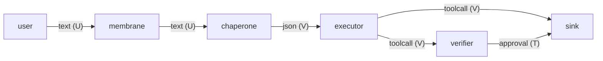

# Example 17: Typed Wiring (Integrity + Capabilities)

```mermaid
flowchart LR
  user[user] -->|"text (U)"| membrane[membrane]
  membrane -->|"text (U)"| chaperone[chaperone]
  chaperone -->|"json (V)"| executor[executor]
  executor -->|"toolcall (V)"| sink[sink]
  executor -->|"toolcall (V)"| verifier[verifier]
  verifier -->|"approval (T)"| sink
```
